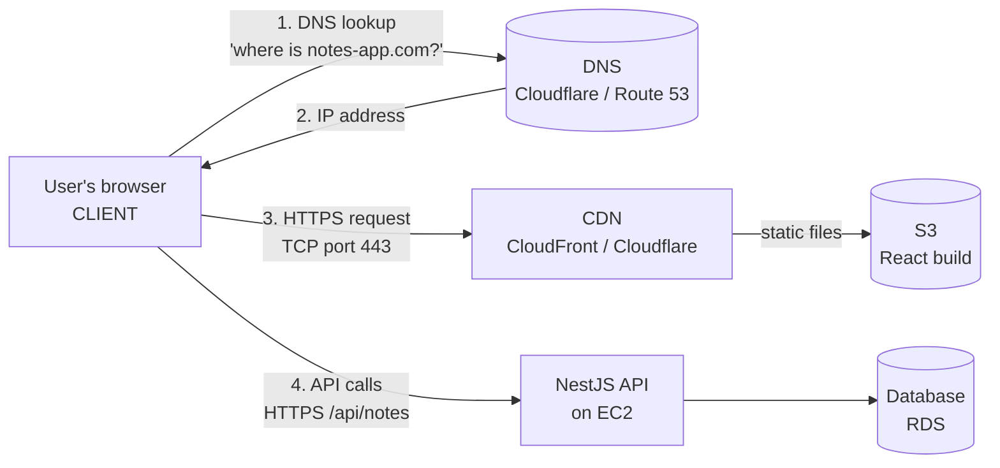
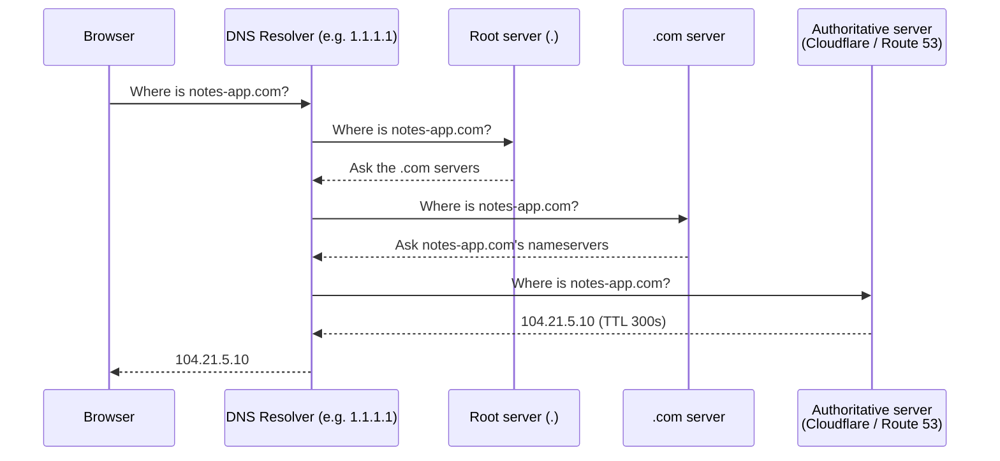

# Stage 1 – Lesson 1: How the Web Works

**Time:** ~45 minutes (20 min reading, 20 min hands-on, 5 min quiz)
**Prerequisites:** A Linux terminal. That's it.
**AWS cost:** $0. This lesson uses no cloud services.

---

## 1. Why this lesson matters

### What problem does this solve?

Every DevOps tool you'll learn later (S3, CloudFront, Cloudflare, EC2, Load Balancers, WAF, Route 53, Kubernetes) exists to solve one part of a single journey: **a user types a URL, and a web page appears.**

If you don't understand that journey, DevOps feels like a pile of random services. If you do understand it, every service becomes "oh, that's the tool for *this step*."

### Real-world analogy: sending a letter

| Web concept | Letter analogy |
|---|---|
| **Domain name** (`notes-app.com`) | A company's name ("Acme Corp") |
| **DNS** | A phone book that turns the name into an address |
| **IP address** (`93.184.216.34`) | The street address of the building |
| **Port** (`443`) | The apartment/room number inside the building |
| **TCP** | Registered mail: delivery is confirmed, lost pages are resent, pages arrive in order |
| **HTTP** | The language and format the letter is written in |
| **HTTPS / TLS** | A locked envelope only the recipient can open, plus an ID check that the recipient is real |
| **Server** | The office worker who reads your letter and writes a reply |

### Where it fits in a real web architecture

This is the **map** for the whole roadmap. Here's what our portfolio project (a notes/task app with React + NestJS) will eventually look like, and where each concept from today appears:



Today we only care about steps 1–4 conceptually. Every box on the right will get its own stage later.

---

## 2. Key terms (defined once, used everywhere)

- **Client** – the program that *asks* for something. Usually a browser, but also `curl`, a mobile app, or your React app calling your NestJS API.
- **Server** – the program that *answers*. Your NestJS API is a server. So is Nginx serving files.
- **Request / Response** – the client sends a request; the server sends back a response. Every web interaction is this pair.
- **IP address** – a numeric address for a machine on a network. IPv4 looks like `142.250.66.78`; IPv6 looks like `2404:6800:4005:80a::200e`.
- **Domain name** – a human-friendly name (`gitlab.com`) that points to one or more IP addresses.
- **DNS (Domain Name System)** – the global system that translates domain names into IP addresses.
- **Port** – a number (0–65535) that identifies *which program* on a machine should receive the traffic. One server can run many programs; the port picks one.
- **Protocol** – an agreed set of rules for communicating. HTTP, TCP, IP, and DNS are all protocols.
- **TCP/IP** – the pair of protocols that move data across the internet. IP handles *addressing* (getting to the right machine); TCP handles *reliable delivery* (all pieces arrive, in order).
- **HTTP (HyperText Transfer Protocol)** – the protocol browsers and servers use to exchange web content.
- **HTTPS** – HTTP wrapped in encryption (TLS).
- **TLS (Transport Layer Security)** – the encryption layer. You'll still hear the old name **SSL**; people say "SSL certificate" even though it's TLS today.
- **Certificate** – a digital ID card proving a server really owns a domain, signed by a trusted **Certificate Authority (CA)** like Let's Encrypt or Amazon.

---

## 3. How it works: the full journey of one request

You type `https://notes-app.com/login` and press Enter. Here's what happens.

### Step 0: The browser reads the URL

```
https://notes-app.com:443/login?redirect=home
└─┬─┘   └─────┬─────┘└┬┘└─┬──┘└──────┬──────┘
scheme      host    port path     query string
```

- **scheme** – which protocol to use (`https` → HTTP over TLS)
- **host** – the domain name to look up
- **port** – usually hidden: `443` for HTTPS, `80` for HTTP
- **path** – which resource on the server
- **query string** – extra parameters for the server

### Step 1: DNS lookup — "What's the IP of notes-app.com?"

The browser can't connect to a *name*; it needs an *IP*. It asks, in order:

1. Its own cache ("did I look this up recently?")
2. The operating system's cache
3. A **DNS resolver** (usually your ISP's, or a public one like Cloudflare `1.1.1.1` or Google `8.8.8.8`)

If the resolver doesn't know, it walks the DNS hierarchy:



- **Authoritative nameserver** – the server that holds the *official* records for a domain. When you use Cloudflare DNS (Stage 5) or Route 53 (Stage 13), *they* become your authoritative nameserver.
- **TTL (Time To Live)** – how many seconds a DNS answer may be cached. Short TTL = changes spread fast; long TTL = fewer lookups but slow changes.
- **DNS record types** you'll see constantly:

| Record | Meaning | Example |
|---|---|---|
| `A` | name → IPv4 address | `notes-app.com → 104.21.5.10` |
| `AAAA` | name → IPv6 address | `notes-app.com → 2606:4700::…` |
| `CNAME` | name → another name (alias) | `www.notes-app.com → notes-app.com` |
| `MX` | where email for the domain goes | `mail.google.com` |
| `TXT` | free text, often for verification | `"google-site-verification=…"` |
| `NS` | which servers are authoritative | `ns1.cloudflare.com` |

> 🇻🇳 **Giải thích:** DNS giống như danh bạ điện thoại của Internet. Máy tính chỉ hiểu địa chỉ IP (dạng số), còn con người nhớ tên miền (như `google.com`). DNS dịch tên miền thành IP. Kết quả được lưu tạm (cache) trong khoảng thời gian gọi là TTL, nên khi bạn đổi DNS, có thể mất vài phút đến vài giờ mới cập nhật khắp nơi.

### Step 2: TCP connection — "Can we talk?"

Now the browser knows the IP. It opens a **TCP connection** to `104.21.5.10` on port `443` using the **three-way handshake**:

```
Client  ── SYN ──────────▶  Server     "I want to connect"
Client  ◀── SYN-ACK ─────   Server     "OK, I'm ready"
Client  ── ACK ──────────▶  Server     "Great, let's go"
```

TCP guarantees that data arrives complete and in order. If a packet (a small chunk of data) is lost, TCP resends it.

**IP vs TCP in one line:** IP is the postal system that gets packets to the right building; TCP is the tracking system that makes sure every page of the letter arrives and is put back in order.

> 🇻🇳 **Giải thích:** TCP/IP là hai giao thức làm việc cùng nhau. **IP** lo việc "địa chỉ" — đưa gói dữ liệu đến đúng máy. **TCP** lo việc "giao hàng đáng tin cậy" — đảm bảo mọi gói đều đến nơi, đúng thứ tự, gói nào mất thì gửi lại. "Three-way handshake" là 3 bước bắt tay để hai bên xác nhận sẵn sàng nói chuyện.

**Common ports to memorize:**

| Port | Used by |
|---|---|
| 22 | SSH (remote login to Linux servers — Stage 6) |
| 53 | DNS |
| 80 | HTTP |
| 443 | HTTPS |
| 3000 | Common dev port for NestJS / Node / React dev servers |
| 5432 | PostgreSQL |
| 3306 | MySQL |

### Step 3: TLS handshake — "Prove who you are, and let's encrypt"

Because the scheme is `https`, before any HTTP is sent:

1. The server sends its **certificate** ("I am notes-app.com, signed by Let's Encrypt").
2. The browser checks: Is it signed by a CA I trust? Is it for this domain? Is it expired?
3. Both sides agree on a secret **session key** and encrypt everything from now on.

If step 2 fails, you get the scary "Your connection is not private" page.

> 🇻🇳 **Giải thích:** HTTPS = HTTP + mã hoá TLS. TLS làm hai việc: (1) **xác thực** — server đưa ra "chứng chỉ" (certificate) để chứng minh nó đúng là `notes-app.com`, không phải kẻ giả mạo; (2) **mã hoá** — dữ liệu được khoá lại, người ở giữa (ví dụ Wi-Fi quán cà phê) không đọc được mật khẩu của bạn.

### Step 4: HTTP request — "Here's what I want"

Now the browser sends plain-text HTTP (inside the encrypted tunnel):

```http
GET /login?redirect=home HTTP/1.1
Host: notes-app.com
User-Agent: Mozilla/5.0 (X11; Linux x86_64) ...
Accept: text/html
Cookie: session=abc123
```

Line by line:
- `GET /login?redirect=home HTTP/1.1` – **method**, **path**, **protocol version**
- `Host:` – which website (one server can host many domains)
- `User-Agent:` – what kind of client is asking
- `Accept:` – what content types the client wants
- `Cookie:` – small data the server asked the browser to remember (e.g. login session)

**HTTP methods** (your NestJS controllers use these as `@Get()`, `@Post()`, etc.):

| Method | Meaning | Notes app example |
|---|---|---|
| `GET` | read | `GET /api/notes` → list notes |
| `POST` | create | `POST /api/notes` → create a note |
| `PUT` / `PATCH` | replace / partially update | `PATCH /api/notes/42` → edit title |
| `DELETE` | delete | `DELETE /api/notes/42` |

### Step 5: HTTP response — "Here's your answer"

```http
HTTP/1.1 200 OK
Content-Type: text/html; charset=utf-8
Content-Length: 1843
Cache-Control: max-age=3600

<!DOCTYPE html><html>...
```

- `200 OK` – the **status code**
- `Content-Type` – what the body is (HTML, JSON, image…)
- `Cache-Control` – how long browsers and **CDNs** may cache this (hugely important in Stage 4 and 5!)
- Blank line, then the **body**

**Status codes** — you'll read these in logs every day:

| Range | Meaning | Common ones |
|---|---|---|
| 2xx | Success | `200 OK`, `201 Created`, `204 No Content` |
| 3xx | Redirect | `301 Moved Permanently`, `302 Found`, `304 Not Modified` |
| 4xx | **Client** made a mistake | `400 Bad Request`, `401 Unauthorized` (not logged in), `403 Forbidden` (logged in but not allowed), `404 Not Found`, `429 Too Many Requests` |
| 5xx | **Server** failed | `500 Internal Server Error` (your code crashed), `502 Bad Gateway`, `503 Service Unavailable`, `504 Gateway Timeout` |

**DevOps gold:** `502` and `504` usually mean *a proxy/load balancer is fine, but the app behind it isn't responding*. When you put Nginx in front of NestJS (Stage 6), a `502` often means "NestJS isn't running or is on the wrong port."

### Step 6: The browser renders and repeats

The HTML references CSS, JS (your React bundle), and images. The browser fires **more requests** for each — often dozens. Then your React app starts and calls your NestJS API with `fetch('/api/notes')`, which is the same journey again.

This is why CDNs exist: serving those dozens of static files from a server close to the user makes the site much faster.

---

## 4. Hands-on: see it with your own eyes

All commands are **read-only and safe**. Nothing here changes your system except installing tools.

### 4.1 Install the tools

```bash
# Debian / Ubuntu / Mint
sudo apt update && sudo apt install -y dnsutils curl traceroute

# Fedora / RHEL
sudo dnf install -y bind-utils curl traceroute

# Arch
sudo pacman -S bind curl traceroute
```

- `sudo` – run as administrator (needed to install software)
- `dnsutils` / `bind-utils` / `bind` – package that provides `dig`
- `curl` – a command-line HTTP client
- `traceroute` – shows the network path to a host

### 4.2 DNS lookup with `dig`

```bash
dig gitlab.com
```

Look for the `ANSWER SECTION`:

```
;; ANSWER SECTION:
gitlab.com.     300    IN    A    172.65.251.78
```

- `gitlab.com.` – the name (the trailing dot means "the root")
- `300` – TTL in seconds
- `IN` – Internet class (always IN, ignore it)
- `A` – record type (IPv4)
- `172.65.251.78` – the answer

More variations:

```bash
dig +short gitlab.com            # just the IP
dig +short AAAA gitlab.com       # IPv6 address
dig +short NS gitlab.com         # who is authoritative for gitlab.com
dig +short MX gitlab.com         # where gitlab.com's email goes
dig @1.1.1.1 gitlab.com +short   # ask Cloudflare's resolver specifically
dig +trace example.com           # walk root → .com → authoritative, like the diagram
```

### 4.3 Watch a full HTTPS conversation with `curl -v`

```bash
curl -v https://example.com -o /dev/null
```

- `-v` – verbose: show everything happening under the hood
- `-o /dev/null` – throw away the HTML body so the output is readable

Match the output to the steps in Section 3:

```
* Trying 93.184.215.14:443...                 ← Step 1 done (DNS), starting Step 2 (TCP)
* Connected to example.com ... port 443       ← Step 2 done (TCP handshake)
* SSL connection using TLSv1.3 ...            ← Step 3 (TLS)
* Server certificate:
*  subject: CN=www.example.org ...            ← the certificate
*  expire date: ...
> GET / HTTP/2                                ← Step 4: request (lines starting with >)
> Host: example.com
> User-Agent: curl/8.x
< HTTP/2 200                                  ← Step 5: response (lines starting with <)
< content-type: text/html
< cache-control: max-age=...
```

`>` = what you sent, `<` = what the server replied.

(Exact IPs and headers will differ — that's normal.)

### 4.4 Just the headers

```bash
curl -I https://gitlab.com
```

- `-I` – send a `HEAD` request: like `GET`, but only return headers

Try spotting clues about the infrastructure: headers like `server: cloudflare` or `cf-ray` mean the site is behind Cloudflare; `x-amz-cf-id` or `via: ... cloudfront` means CloudFront.

### 4.5 See a redirect and an error

```bash
curl -I http://gitlab.com                          # notice 301 → https
curl -I https://gitlab.com/this-page-does-not-exist  # notice 404
```

### 4.6 The network path

```bash
traceroute -n 1.1.1.1
```

- `-n` – show IPs only (faster, no reverse-DNS lookups)

Each line is a **hop** — a router your packets pass through. Some hops show `* * *`, meaning that router doesn't reply to traceroute; that's normal.

### 4.7 What's listening on *your* machine?

```bash
ss -tulpn
```

- `ss` – "socket statistics"; shows network connections
- `-t` TCP, `-u` UDP, `-l` listening only, `-p` show program, `-n` numeric ports

If you later run `npm run start:dev` in a NestJS project, you'd see something listening on `:3000`. This command is one of the first things DevOps engineers run when "the app isn't reachable."

---

## 5. How teams use this

### In real companies

- **Incidents almost always start here.** "Site is down" → first questions: Does DNS resolve? Does TCP connect? Is the TLS certificate valid? What status code comes back? This is literally the troubleshooting order.
- **DNS changes are treated carefully.** Teams lower the TTL a day *before* a migration so the switch spreads quickly, then raise it again after.
- **Certificates expire.** Expired certs are a classic, embarrassing outage. Teams automate renewal (Let's Encrypt, AWS Certificate Manager, Cloudflare) and set alerts.
- **Status codes drive monitoring.** Dashboards track the rate of `5xx` errors; alerts fire when it spikes (Stage 14).

### Jargon you'll hear

| Term | Meaning |
|---|---|
| "DNS propagation" | Waiting for old cached DNS answers to expire (TTL) worldwide |
| "It's always DNS" | Running joke: mysterious outages are often DNS problems |
| "Cert expired" / "cert rotation" | TLS certificate ran out / replacing certificates |
| "TLS termination" | The point where HTTPS is decrypted (often at the CDN or load balancer, not your app) |
| "Upstream" / "origin" | The server behind a proxy/CDN (e.g. your S3 bucket or NestJS API) |
| "Seeing 5xx's" | The server side is failing |
| "Apex / root domain" | `notes-app.com` without `www` |
| "Hop" | One router along the network path |
| "Latency" | Time delay for a request (measured in ms) |

### Good questions to ask your DevOps team

1. "Who is our authoritative DNS provider, and what TTL do we use for our main records?"
2. "Where is TLS terminated for our app — at the CDN, the load balancer, or the app itself?"
3. "How do we renew certificates, and do we get alerted before they expire?"
4. "When we see 502s or 504s, what's the usual cause in our setup?"

### AWS vs Cloudflare preview

Today's concepts map directly to services you'll learn:

| Concept | AWS | Cloudflare |
|---|---|---|
| DNS | Route 53 (Stage 13) | Cloudflare DNS (Stage 5) |
| TLS certificates | AWS Certificate Manager (ACM) | Universal SSL (automatic, free) |
| CDN / caching | CloudFront (Stage 4) | Cloudflare CDN (Stage 5) |

No need to choose now — we'll compare them properly in Stages 4, 5, and 13.

---

## 6. Summary

- Loading a web page = **DNS lookup → TCP connection → TLS handshake → HTTP request → HTTP response**, repeated for every file and API call.
- **DNS** turns names into IPs; answers are cached for the **TTL**.
- **IP** routes packets to the right machine; **TCP** delivers them reliably; the **port** picks the program.
- **HTTPS** = HTTP + TLS: it proves the server's identity (certificate) and encrypts traffic.
- **Status codes** tell you who's at fault: 4xx = client, 5xx = server. `502/504` usually means the app behind a proxy isn't answering.
- `dig`, `curl -v`, `curl -I`, `traceroute`, and `ss` let you inspect every step.

---

## 7. Exercises

### Exercise 1: Detective work (15 min)

Pick 3 websites you use (e.g. `gitlab.com`, `shopee.vn`, `vnexpress.net`). For each, find and write down:

1. Its IPv4 address (`dig +short`)
2. Its authoritative nameservers (`dig +short NS`) — do you recognize the provider?
3. The HTTP status code for `http://` (not https) — does it redirect?
4. Any headers that hint at the CDN/infrastructure (`curl -I`)

Put your findings in a small table.

### Exercise 2: Label the journey (10 min)

Run:

```bash
curl -v https://gitlab.com -o /dev/null 2>&1 | head -40
```

(`2>&1` merges curl's verbose output into the normal output so `head` can shorten it; `head -40` shows the first 40 lines.)

Copy the output and label each section with the step number from Section 3 (DNS/TCP, TLS, request, response). Paste it to me if you'd like me to check it.

---

## 8. Quiz

Reply in chat with your answers (e.g. "1: …, 2: …, 3: …").

**Q1.** You change your domain's `A` record to point to a new server. Some users see the new site immediately, others still see the old one for an hour. What's the most likely reason?

**Q2.** Your React app calls `GET /api/notes` and receives `403`. Another time it receives `502`. For each, is the problem more likely on the client side or the server side, and what's a likely cause?

**Q3.** Put these in the correct order for loading `https://notes-app.com`:
(a) TLS handshake, (b) HTTP request, (c) DNS lookup, (d) TCP handshake, (e) HTTP response

<details>
<summary>👀 Answers (open only after you've replied!)</summary>

**A1.** DNS caching. The old record was cached by resolvers and browsers for its **TTL** (e.g. 3600s = 1 hour). Users whose resolvers hadn't cached it, or whose cache expired, got the new IP. Fix for next time: lower the TTL before making the change.

**A2.**
- `403 Forbidden` → a 4xx, so the *request* is the problem: the user is identified but not allowed (wrong role, missing permission, or e.g. a WAF blocking the request).
- `502 Bad Gateway` → a 5xx, server side: a proxy (Nginx, load balancer, CDN) got no valid response from the app behind it — often NestJS is crashed, not started, or running on a different port than the proxy expects.

**A3.** (c) DNS → (d) TCP → (a) TLS → (b) HTTP request → (e) HTTP response

</details>

---

## 9. Update your progress.md

```markdown
Last updated: <today's date>
Current stage: 1 – Foundations
Current lesson: Lesson 2 – Linux CLI basics

## Completed lessons
| <today's date> | S1 L1 – How the web works | _/3 | Learned dig, curl -v, curl -I, traceroute, ss |

## Weak topics (need review)
- (add any quiz question you got wrong)

## Questions to ask my DevOps team
- Who is our authoritative DNS provider, and what TTL do we use?
- Where is TLS terminated for our app?
```

No AWS resources were created, so the "AWS resources currently running" table stays at "(none yet)". 🎉

**Next lesson:** Stage 1 – Lesson 2: Linux CLI essentials (files, permissions, processes, and the commands you'll use on every EC2 server).
