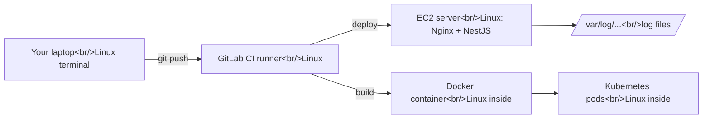

# Stage 1 – Lesson 2: Linux CLI Essentials

**Time:** ~50 minutes (20 min reading, 25 min hands-on, 5 min quiz)
**Prerequisites:** Lesson 1, a Linux terminal
**AWS cost:** $0. Everything runs on your own machine.

---

## 1. Why this lesson matters

### What problem does this solve?

Servers don't have a desktop, a mouse, or a file explorer. When you deploy your NestJS API to EC2 (Stage 6), you'll connect to a remote Linux machine and have **only a terminal**. The same is true inside Docker containers, GitLab CI runners, and Kubernetes pods.

The command line is how you:

- move and edit files (configs, `.env` files, Nginx settings)
- read logs when something breaks
- check whether your app is running, and restart or stop it
- control who is allowed to read or run which files

### Real-world analogy: a building manager with a walkie-talkie

Imagine managing a large office building, but you can't walk around. You only have a walkie-talkie and a precise vocabulary:

| Building task | Linux equivalent |
|---|---|
| "Where am I standing?" | `pwd` |
| "What's in this room?" | `ls` |
| "Walk to room 3B" | `cd` |
| "Which rooms are locked, and who has keys?" | permissions (`ls -l`, `chmod`, `chown`) |
| "Who's working right now, and on what?" | processes (`ps`, `top`) |
| "Tell that worker to stop" | `kill` |
| "Read the security logbook" | `less`, `tail -f` |
| "Search every logbook for the word 'fire'" | `grep` |

### Where it fits in a real web architecture

Linux is underneath almost every box in our portfolio project:



S3, CloudFront, and Cloudflare hide the Linux layer from you. EC2, Docker, CI runners, and Kubernetes do not. That's why this lesson comes before all of them.

---

## 2. Key terms

- **Shell** – the program that reads what you type and runs it. The most common is **bash**; you might also have **zsh**. Your commands look the same in both for this lesson.
- **Terminal** – the window that shows the shell.
- **CLI (Command-Line Interface)** – using programs by typing commands instead of clicking.
- **Command** – a program you run, e.g. `ls`. Most follow the shape `command -options arguments`.
- **Option / flag** – modifies a command's behavior, e.g. `-l` in `ls -l`.
- **Argument** – what the command acts on, e.g. `notes.txt` in `cat notes.txt`.
- **Path** – the location of a file. **Absolute** paths start at `/` (`/var/log/nginx/error.log`). **Relative** paths start from where you are (`logs/app.log`).
- **Home directory** – your personal folder, written as `~` (e.g. `/home/minh`).
- **Root** – two meanings: the top of the filesystem (`/`), and the all-powerful admin user (`root`). Context tells you which.
- **sudo** – "superuser do": run one command as root.
- **Process** – a running program. Each has a **PID** (process ID).
- **Environment variable** – a named value available to programs, e.g. `PORT=3000`.
- **stdin / stdout / stderr** – a program's three standard streams: input, normal output, and error output.

---

## 3. The Linux filesystem: a map

Everything in Linux is a file inside one tree that starts at `/`. There are no `C:\` or `D:\` drives.

```
/
├── home/        # users' personal folders (~ lives here)
│   └── minh/
├── etc/         # system configuration (Nginx config lives in /etc/nginx/)
├── var/
│   └── log/     # log files (/var/log/nginx/access.log)
├── usr/         # installed programs and libraries
├── tmp/         # temporary files, may be wiped on reboot
├── opt/         # optional/third-party software (sometimes apps are deployed here)
└── root/        # the root user's home (not the same as /)
```

You'll visit `/etc` (configs) and `/var/log` (logs) constantly on EC2. Memorize those two.

---

## 4. Hands-on: the core commands

Create a safe playground first so nothing you do affects real files:

```bash
mkdir -p ~/devops-lab/lesson-02
cd ~/devops-lab/lesson-02
```

- `mkdir` – make directory
- `-p` – create parent folders too, and don't complain if they already exist
- `cd` – change directory

### 4.1 Navigation

```bash
pwd              # print working directory: where am I?
ls               # list files here
ls -l            # long format: permissions, owner, size, date
ls -la           # also show hidden files (names starting with ".", like .env)
cd ..            # go up one level
cd -             # go back to the previous directory
cd ~             # go home (plain "cd" does the same)
```

Tip: press **Tab** to auto-complete file names, and **↑** to repeat earlier commands. This saves you hours.

### 4.2 Creating, copying, moving

Let's build a fake NestJS project structure:

```bash
cd ~/devops-lab/lesson-02
mkdir -p notes-api/src notes-api/logs
touch notes-api/src/main.ts notes-api/.env notes-api/package.json
ls -la notes-api
```

- `touch` – create an empty file (or update the timestamp of an existing one)

```bash
cp notes-api/.env notes-api/.env.example    # copy a file
mv notes-api/.env.example notes-api/env.sample   # move = rename
cp -r notes-api notes-api-backup            # -r = recursive: copy a whole folder
```

### 4.3 Deleting — ⚠️ read this carefully

```bash
rm notes-api/env.sample        # delete one file
rm -r notes-api-backup         # delete a folder and everything in it
```

> ⚠️ **WARNING: Linux has no Recycle Bin.** `rm` deletes immediately and permanently.
>
> - `rm -rf` = recursive + **force** (no questions asked). Combined with a wrong path, it can wipe your system or a production server.
> - Never run `rm -rf` with `sudo` unless you've read the path three times.
> - Be extra careful with variables: `rm -rf $FOLDER/` becomes `rm -rf /` if `$FOLDER` is empty.
> - Safer habit while learning: use `rm -ri` (`-i` asks before each deletion), and run `ls <path>` first to see what you're about to delete.

🇻🇳 Giải thích: Linux không có thùng rác. Lệnh `rm` xoá vĩnh viễn ngay lập tức. `rm -rf` xoá cả thư mục mà không hỏi lại — gõ sai đường dẫn là có thể mất toàn bộ dữ liệu, kể cả trên server production. Luôn `ls` đường dẫn trước khi xoá.

### 4.4 Reading files and logs

Let's create a fake log file to practice on:

```bash
cd ~/devops-lab/lesson-02/notes-api
for i in $(seq 1 200); do
  if (( i % 25 == 0 )); then
    echo "2026-09-25T10:$((i % 60)):00 ERROR [NotesService] Database connection timeout" >> logs/app.log
  else
    echo "2026-09-25T10:$((i % 60)):00 INFO  [NotesController] GET /api/notes 200" >> logs/app.log
  fi
done
```

Line by line:

- `for i in $(seq 1 200); do ... done` – repeat 200 times; `seq 1 200` produces the numbers 1–200
- `if (( i % 25 == 0 ))` – every 25th line (`%` = remainder), write an ERROR line
- `echo "..."` – print text
- `>> logs/app.log` – **append** the text to the file (explained in 4.6)

Now read it:

```bash
cat logs/app.log          # print the whole file (fine for short files)
head -n 5 logs/app.log    # first 5 lines
tail -n 5 logs/app.log    # last 5 lines (newest entries in a log)
less logs/app.log         # scroll through: arrows/space to move, /ERROR to search, q to quit
wc -l logs/app.log        # count lines
```

The most-used command on a live server:

```bash
tail -f logs/app.log
```

- `-f` – **follow**: keep the file open and print new lines as they are written. Press **Ctrl+C** to stop.

Try it: open a **second terminal** and run:

```bash
echo "2026-09-25T11:00:00 ERROR [AuthService] JWT expired" >> ~/devops-lab/lesson-02/notes-api/logs/app.log
```

Watch the line appear in the first terminal. This is exactly how you watch a NestJS app's logs during a deployment.

### 4.5 Searching

```bash
grep ERROR logs/app.log                 # lines containing "ERROR"
grep -c ERROR logs/app.log              # count them
grep -i error logs/app.log              # -i = case-insensitive
grep -n ERROR logs/app.log              # -n = show line numbers
grep -r "NotesService" .                # -r = search every file under this folder
find . -name "*.ts"                     # find files by name pattern
find . -name "*.log" -size +1k          # .log files larger than 1 KB
```

`grep` searches **inside** files; `find` searches for **files themselves**.

### 4.6 Pipes and redirection — combining commands

This is the Linux superpower: small commands chained together.

| Symbol | Meaning | Example |
|---|---|---|
| `>` | send output to a file, **overwriting** it | `echo "PORT=3000" > .env` |
| `>>` | send output to a file, **appending** | `echo "NODE_ENV=dev" >> .env` |
| `\|` | **pipe**: send one command's output into the next command | `grep ERROR app.log \| wc -l` |
| `2>` | send **errors** (stderr) to a file | `npm run build 2> build-errors.txt` |
| `2>&1` | merge errors into normal output (you saw this in Lesson 1) | `curl -v URL 2>&1 \| head` |

> ⚠️ `>` silently replaces the whole file. `echo "x" > .env` wipes every line that was in `.env`. When in doubt, use `>>`.

Real examples:

```bash
# Which services produce errors, and how often?
grep ERROR logs/app.log | awk '{print $3}' | sort | uniq -c | sort -rn
```

- `awk '{print $3}'` – print the 3rd space-separated column (the `[ServiceName]`)
- `sort` – sort lines alphabetically (needed before `uniq`)
- `uniq -c` – collapse duplicate lines and count them
- `sort -rn` – sort numerically (`-n`), highest first (`-r` = reverse)

```bash
# Show the last 3 errors only
grep ERROR logs/app.log | tail -n 3
```

🇻🇳 Giải thích: Dấu `|` (pipe) giống một băng chuyền: kết quả của lệnh bên trái được đưa thẳng vào lệnh bên phải. Nhờ vậy bạn ghép nhiều lệnh nhỏ thành một công cụ mạnh, ví dụ lọc log → cắt cột → đếm → sắp xếp. `>` ghi đè file, `>>` ghi thêm vào cuối file.

---

## 5. Users and permissions

### 5.1 Why permissions exist

A server runs many things: Nginx, your NestJS app, a database, maybe several users. Permissions make sure, for example, that the web server can **read** your React build but cannot **change** your `.env` file full of secrets.

### 5.2 Reading permissions

```bash
cd ~/devops-lab/lesson-02/notes-api
ls -l
```

Example output:

```
-rw-r--r-- 1 minh minh    0 Sep 25 10:00 package.json
drwxr-xr-x 2 minh minh 4096 Sep 25 10:00 src
```

Decoding `-rw-r--r--`:

```
-    rw-    r--    r--
│    │      │      └── others (everyone else): read
│    │      └───────── group: read
│    └──────────────── owner (user): read + write
└───────────────────── type: - = file, d = directory, l = link
```

Then: `minh` (owner) `minh` (group).

| Letter | On a file | On a directory |
|---|---|---|
| `r` read | view contents | list files inside |
| `w` write | change contents | create/delete files inside |
| `x` execute | run it as a program | enter it with `cd` |

### 5.3 Numeric permissions (you'll see these everywhere)

Each letter has a value: **r = 4, w = 2, x = 1**. Add them per group.

| Number | Letters | Common use |
|---|---|---|
| `755` | `rwxr-xr-x` | folders, scripts: owner full, others read/enter |
| `644` | `rw-r--r--` | normal files: owner edits, others read |
| `600` | `rw-------` | secrets like `.env`: only the owner |
| `400` | `r--------` | SSH private keys (AWS requires this for your EC2 `.pem` key in Stage 6) |

```bash
chmod 600 .env          # only I can read/write my secrets
ls -l .env              # confirm: -rw-------
```

Make a script executable:

```bash
cat > deploy.sh << 'EOF'
#!/bin/bash
echo "Deploying notes-api..."
echo "Current user: $(whoami)"
EOF

./deploy.sh             # fails: Permission denied
chmod +x deploy.sh      # add execute permission
./deploy.sh             # works
```

- `cat > file << 'EOF' ... EOF` – a **heredoc**: write multiple lines into a file until the line `EOF`
- `#!/bin/bash` – the **shebang**: tells Linux which program runs this script
- `./deploy.sh` – run the file in the current folder (`./` = "here")
- `$(whoami)` – run `whoami` and insert its output

> ⚠️ **Never fix a permission error with `chmod 777`.** It lets *anyone* on the machine read, change, and run the file. It "works", but it's a security hole, and DevOps engineers will (rightly) flag it immediately in a code review.

### 5.4 Owners and sudo

```bash
whoami                  # your username
id                      # your user ID and the groups you belong to
ls -l /etc/shadow       # a system file owned by root
cat /etc/shadow         # Permission denied: only root can read it
```

- `sudo <command>` runs one command as root. You'll use it for installing software and editing `/etc` files.
- `chown user:group file` changes a file's owner. On EC2, you'll do things like `sudo chown -R www-data:www-data /var/www/notes-app` so Nginx can read your files.

Principle: **use the least power needed.** Don't run your NestJS app as root; don't use `sudo` out of habit. This is the same idea as IAM least privilege (Stage 15).

🇻🇳 Giải thích: Mỗi file có 3 nhóm quyền: chủ sở hữu (owner), nhóm (group), và người khác (others). Mỗi nhóm có thể đọc (r=4), ghi (w=2), chạy (x=1). Ví dụ `600` nghĩa là chỉ chủ file được đọc/ghi — dùng cho file bí mật như `.env`. Đừng bao giờ dùng `chmod 777` để "sửa nhanh" lỗi quyền, vì như vậy ai cũng sửa được file.

---

## 6. Processes: what's running?

### 6.1 Start a fake "server"

We'll use Python's built-in web server as a stand-in for NestJS (most Linux systems have `python3`):

```bash
cd ~/devops-lab/lesson-02
python3 -m http.server 3000 &
```

- `python3 -m http.server 3000` – serve the current folder over HTTP on port 3000
- `&` – run it in the **background** so you get your terminal back

Check it like Lesson 1 taught you:

```bash
curl -I http://localhost:3000     # expect: HTTP/1.0 200 OK
ss -tlpn | grep 3000              # see which process listens on port 3000
```

### 6.2 Find and inspect processes

```bash
ps aux | grep http.server         # find our process and its PID
pgrep -a python3                  # shorter: PIDs of matching processes
top                               # live view of CPU/memory; press q to quit
```

In `ps aux` output, the important columns are **USER**, **PID**, **%CPU**, **%MEM**, and **COMMAND**.

(Optional: `htop` is a friendlier `top`. Install with `sudo apt install htop` on Ubuntu/Debian.)

### 6.3 Stop processes: signals

You stop a process by sending it a **signal** — a small message from the operating system.

```bash
kill <PID>          # sends SIGTERM (15): "please shut down cleanly"
kill -9 <PID>       # sends SIGKILL (9): "die now", no cleanup
```

| Signal | Number | Meaning | When |
|---|---|---|---|
| `SIGTERM` | 15 | polite stop request | always try this first |
| `SIGINT` | 2 | interrupt (what **Ctrl+C** sends) | stopping something in your terminal |
| `SIGKILL` | 9 | forced kill, can't be ignored | only if SIGTERM doesn't work |

Why it matters: NestJS can react to `SIGTERM` by finishing current requests and closing database connections (`app.enableShutdownHooks()`). `kill -9` skips all of that, which can leave half-finished work. Docker and Kubernetes send `SIGTERM` first, wait, then `SIGKILL` — you'll see this again in Stage 16.

Now stop our server:

```bash
kill $(pgrep -f http.server)
curl -I http://localhost:3000     # expect: Connection refused
```

"Connection refused" = nothing is listening on that port. Remember it: it's one of the most common errors you'll debug.

🇻🇳 Giải thích: "Signal" là tín hiệu hệ điều hành gửi tới một chương trình đang chạy. `SIGTERM` là lời nhờ lịch sự "hãy tắt đi" — ứng dụng có thời gian dọn dẹp (đóng kết nối database, xử lý nốt request). `SIGKILL` (`kill -9`) là tắt cưỡng bức ngay lập tức, không dọn dẹp gì. Luôn thử `SIGTERM` trước.

---

## 7. Environment variables

Your NestJS app shouldn't hard-code things like the port or the database password. It reads them from **environment variables**.

```bash
echo $HOME                 # a built-in variable
echo $PATH                 # folders the shell searches for commands
env | head                 # list all variables

PORT=4000                  # a shell variable, only visible in this shell
export PORT=4000           # exported: visible to programs you start from this shell
echo $PORT
unset PORT                 # remove it
```

In NestJS, `process.env.PORT` reads exactly this value. The `.env` file is just a convenient way to set many variables at once (loaded by `@nestjs/config`).

`$PATH` explained: when you type `node`, the shell looks through each folder in `$PATH` until it finds a program called `node`. "command not found" usually means the program isn't installed or isn't in `$PATH`.

```bash
which node                 # where is node? (empty if not installed)
which python3
```

> 🔐 **Secrets rule (from now until forever):** `.env` files with real passwords or API keys must **never** be committed to GitLab. Add `.env` to `.gitignore`, keep permissions at `600`, and commit a `.env.example` with fake values instead. In Stage 7 you'll store real secrets in **GitLab CI/CD variables**, and on AWS you'll use **IAM roles** so no access keys are needed at all.

🇻🇳 Giải thích: Biến môi trường (environment variable) là các giá trị cấu hình mà chương trình đọc lúc chạy, ví dụ `PORT` hay `DATABASE_URL`. Nhờ vậy cùng một code NestJS có thể chạy ở máy dev và production với cấu hình khác nhau. File `.env` chứa bí mật tuyệt đối không được commit lên GitLab.

---

## 8. Installing software (quick look)

On Ubuntu/Debian (and Ubuntu-based EC2 instances):

```bash
sudo apt update              # refresh the list of available packages
sudo apt install -y tree     # install "tree"; -y = auto-confirm
tree ~/devops-lab            # show folders as a tree
```

On Amazon Linux (the default AWS EC2 image), the package manager is `dnf` instead: `sudo dnf install -y tree`. Same idea, different command. For Node.js you'll use **nvm** or the official NodeSource packages; we'll set that up properly in Stage 6.

---

## 9. How teams use this

### In real companies

- **"SSH in and check the logs"** is the first step of many incidents on EC2-based systems: `tail -f`, `grep ERROR`, `less`.
- **Centralized logging reduces this over time.** Mature teams send logs to CloudWatch, Grafana Loki, or similar (Stage 14), so fewer people need to log into servers. But you still need these commands for containers, CI runners, and emergencies.
- **Production access is restricted.** Many companies don't give developers SSH to production at all, or only through audited tools like AWS Systems Manager Session Manager. Knowing the commands still lets you read what DevOps shares with you and suggest the right checks.
- **Permissions show up in code review.** `chmod 777`, running apps as root, or secrets with `644` permissions are red flags.
- **Scripts become pipelines.** The shell commands you type by hand today become lines in `.gitlab-ci.yml` in Stage 7.

### Jargon you'll hear

| Term | Meaning |
|---|---|
| "SSH into the box" | Connect to a server's terminal remotely (box = server) |
| "Tail the logs" | Watch logs live with `tail -f` |
| "Grep for it" | Search logs/files for a string |
| "The process got OOM-killed" | Linux killed it because the machine ran **O**ut **O**f **M**emory |
| "Zombie / orphan process" | A process that finished or lost its parent but wasn't cleaned up |
| "Graceful shutdown" | App handles SIGTERM, finishes work, then exits |
| "Runs as root" | The app has full admin power (usually bad) |
| "Disk is full" | Often huge log files in `/var/log`; check with `df -h` and `du -sh` |
| "Bastion / jump host" | A single secure server you SSH through to reach private servers |

### Good questions to ask your DevOps team

1. "Do developers get SSH access to servers, or do we use Session Manager or something else?"
2. "Where do application logs end up, and how long are they kept?"
3. "Which user does our Node app run as on the servers?"
4. "Does our app handle SIGTERM for graceful shutdown during deployments?"

### AWS vs Cloudflare note

This lesson isn't tied to a single service, but it tells you **which services need Linux skills**:

| Needs Linux skills | Mostly hides Linux |
|---|---|
| EC2, Docker, ECS, EKS, GitLab runners | S3, CloudFront, Lambda, Cloudflare (DNS, CDN, Workers) |

That's part of the trade-off you'll weigh later: managed/serverless services mean less Linux work, but less control.

---

## 10. Summary

- Linux has one filesystem tree starting at `/`. Configs live in `/etc`, logs in `/var/log`, your files in `~`.
- Navigate with `pwd`, `ls -la`, `cd`; manage files with `mkdir -p`, `touch`, `cp -r`, `mv`, `rm`.
- **`rm` is permanent.** Check the path before deleting; avoid `rm -rf` with `sudo`.
- Read logs with `less`, `head`, `tail`, and above all `tail -f`; search with `grep` and `find`.
- Combine commands with pipes `|`; redirect with `>` (overwrite) and `>>` (append).
- Permissions: owner/group/others × read(4)/write(2)/execute(1). `644` files, `755` folders, `600` secrets, `400` SSH keys. Never `777`.
- Processes: `ps aux`, `top`, `ss -tlpn`; stop with `kill` (SIGTERM) before `kill -9` (SIGKILL).
- Config comes from environment variables; `.env` secrets never go into GitLab.

---

## 11. Exercises

### Exercise 1: Log detective (15 min)

Using `~/devops-lab/lesson-02/notes-api/logs/app.log`, write **one command each** to:

1. Count how many `INFO` lines there are.
2. Show only the 2 most recent `ERROR` lines.
3. Show the line numbers of every `ERROR`.
4. Add a new line `... WARN [UploadService] File too large` to the log **without** deleting existing lines, then prove it's there using `tail`.

Write your commands down and paste them to me if you'd like feedback.

### Exercise 2: Run, find, stop (10 min)

1. Start `python3 -m http.server 3001 &` inside `~/devops-lab/lesson-02`.
2. Prove it's running in **three** different ways (hint: `curl`, `ss`, `ps`).
3. Find its PID and stop it gracefully.
4. Prove it's stopped. What exact error does `curl` give you?
5. Bonus: create `notes-api/.env` containing `PORT=3000` and `DB_PASSWORD=changeme`, set the correct permissions for a secrets file, and show the `ls -l` output.

### Local cleanup (optional)

When you're done with this lesson's files:

```bash
ls ~/devops-lab/lesson-02        # look first: confirm this is the right folder
rm -ri ~/devops-lab/lesson-02    # -i asks before each deletion; type y to confirm
```

⚠️ Double-check the path. Keep the folder if you'd like to reuse it in Lesson 3. Also make sure no background servers are still running: `pgrep -a python3`.

No AWS resources were used, so there's no AWS cleanup checklist for this lesson.

---

## 12. Quiz

Reply in chat with your answers (e.g. "1: …, 2: …, 3: …").

**Q1.** You deploy your NestJS API to a server and run `curl http://localhost:3000`. You get `Connection refused`. Which **two** commands from this lesson would you run first, and what would each tell you?

**Q2.** A teammate's script does `echo "DB_PASSWORD=secret123" > .env`, and then the app loses its `PORT` and `JWT_SECRET` settings. What went wrong, and what permission should `.env` have afterward?

**Q3.** During a deployment, the old NestJS process must be stopped. Why should the deploy script use `kill <PID>` rather than `kill -9 <PID>`? What could go wrong with `-9`?

&lt;details&gt;
&lt;summary&gt;👀 Answers (open only after you've replied!)&lt;/summary&gt;

**A1.** "Connection refused" means nothing is listening on that port.
- `ps aux | grep node` (or `pgrep -a node`) → is the app process running at all? If not, it crashed or never started; check its logs.
- `ss -tlpn | grep 3000` (or just `ss -tlpn`) → is anything listening on port 3000? If the app runs but listens on a different port (e.g. `PORT` env var set to `8080`), you've found the mismatch.

Reading the app logs (`tail -n 50` on the log file) is a great third step.

**A2.** `>` **overwrites** the whole file, so every existing line (`PORT`, `JWT_SECRET`) was erased and replaced with one line. They should have used `>>` to append. Afterward, `.env` should be `600` (`chmod 600 .env`): readable and writable only by the owner, because it holds secrets. (And it must be listed in `.gitignore`.)

**A3.** `kill` sends **SIGTERM**, which lets NestJS shut down gracefully: finish in-flight requests, close database connections, stop background jobs cleanly. `kill -9` sends **SIGKILL**, which ends the process instantly with no cleanup: users mid-request get errors, database transactions or file uploads can be left half-done, and connections may not be released. Use `-9` only if the process ignores SIGTERM.

&lt;/details&gt;

---

## 13. Update your progress.md

```markdown
Last updated: <today's date>
Current stage: 1 – Foundations
Current lesson: Lesson 3 – Networking basics

## Completed lessons
| <date> | S1 L1 – How the web works | _/3 | dig, curl -v, curl -I, traceroute, ss |
| <date> | S1 L2 – Linux CLI essentials | _/3 | files, tail -f, grep, pipes, chmod, ps/kill, env vars |

## Weak topics (need review)
- (add any quiz question you got wrong)

## Questions to ask my DevOps team
- Do developers get SSH access, or do we use Session Manager?
- Where do application logs go, and how long are they kept?
- Does our app handle SIGTERM for graceful shutdown?

## Personal notes
- rm is permanent. Look before deleting.
- 644 files, 755 folders, 600 secrets, 400 SSH keys. Never 777.
```

No AWS resources were created, so "AWS resources currently running" stays at "(none yet)".

**Next lesson:** Stage 1 – Lesson 3: Networking basics (IP ranges and CIDR, public vs private networks, ports and firewalls, SSH). This prepares you directly for AWS VPCs and Security Groups.
