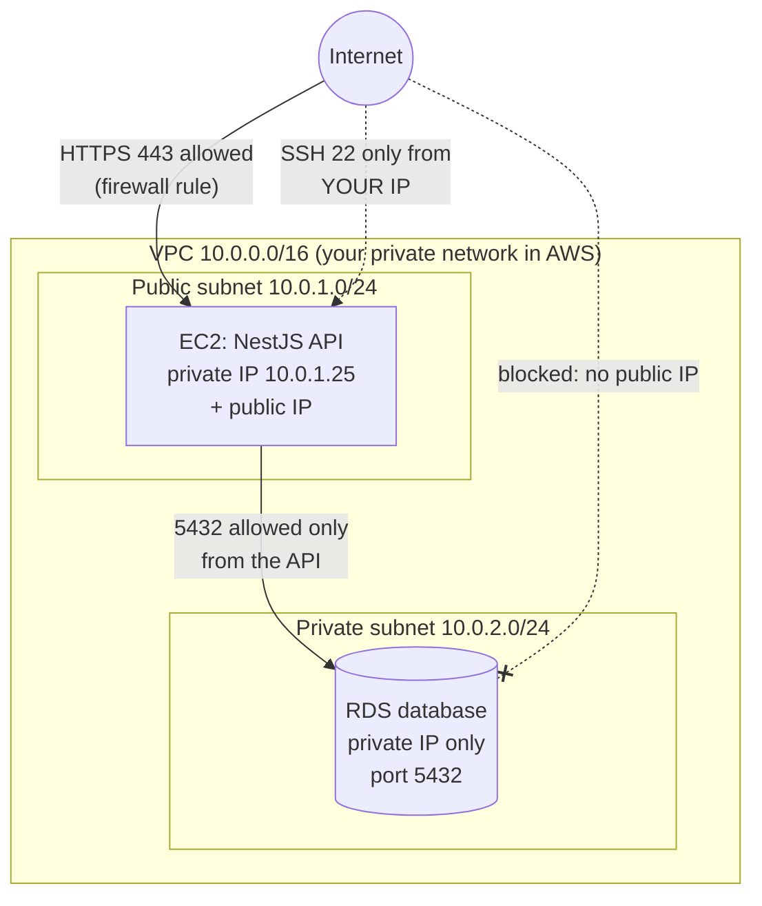
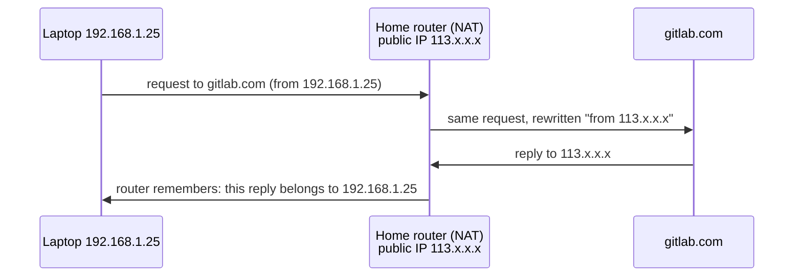

# Stage 1 – Lesson 3: Networking Basics

**Time:** ~55 minutes (20 min reading, 30 min hands-on, 5 min quiz)
**Prerequisites:** Lesson 1 (DNS, TCP, ports), Lesson 2 (terminal, `ps`, `kill`, permissions)
**AWS cost:** $0. Everything runs on your own machine and your free GitLab account.

**Today you'll learn:** IP ranges and CIDR, public vs private networks, NAT, `127.0.0.1` vs `0.0.0.0`, ports and firewalls, "connection refused" vs "timeout", and SSH keys.

---

## 1. Why this lesson matters

### What problem does this solve?

In Lesson 1 you learned that every machine has an IP address and every program listens on a port. But in the real world, **most machines should not be reachable by everyone.** Your database should only talk to your API. Your API server should only accept SSH from you. Your laptop at home shouldn't be reachable from the internet at all.

Networking basics answer three questions DevOps engineers ask all day:

1. **Who can reach this machine?** (public vs private networks, firewalls)
2. **Which programs on it can be reached?** (ports, which address a program listens on)
3. **How do I log in to it securely?** (SSH keys)

When you create your first EC2 server (Stage 6), AWS will ask you about a **VPC**, **subnets**, **CIDR blocks**, **Security Groups**, and a **key pair**. Every one of those is a concept from this lesson with an AWS name on it.

### Real-world analogy: a gated apartment complex

| Networking concept | Apartment complex analogy |
|---|---|
| **Public IP** | The complex's street address. Anyone in the city can send mail there. |
| **Private IP** | Apartment numbers inside the complex (A-101, B-204). Meaningless outside the gate. |
| **Private network / subnet** | One building in the complex |
| **CIDR block** (`10.0.0.0/16`) | "All apartments numbered A-000 to A-999": a way to describe a range |
| **NAT / router** | The front desk: residents can send letters out, replies come back to them, but strangers can't walk in |
| **Port** | A specific door in an apartment (front door, kitchen door) |
| **Firewall** | The security guard with a list: "Only let delivery people through door 443" |
| **SSH key pair** | A lock (public key, installed on the door) and the only key that opens it (private key, kept in your pocket) |

### Where it fits in a real web architecture

Here's a preview of how our notes app will sit inside AWS in later stages. Don't memorize it; just notice that today's concepts label almost every line.



You'll build this for real in Stages 6, 10, and 12.

---

## 2. Key terms

- **Network interface** – a "network card" on a machine, real or virtual (e.g. `wlan0` for Wi-Fi, `eth0` for cable, `lo` for loopback). Each has its own IP address.
- **Subnet** – a smaller slice of a network, described by a CIDR range.
- **CIDR** (Classless Inter-Domain Routing) – notation like `10.0.0.0/16` that describes a *range* of IP addresses.
- **Public IP** – an address reachable from anywhere on the internet.
- **Private IP** – an address from reserved ranges that only works inside a private network.
- **NAT** (Network Address Translation) – lets many private machines share one public IP for outgoing traffic.
- **Default gateway** – the router your machine sends traffic to when the destination isn't on your local network.
- **Loopback** (`127.0.0.1`, name `localhost`) – an address that always means "this same machine".
- **Bind / listen** – when a program opens a port and waits for connections on a specific IP address.
- **Firewall** – software (or a cloud service) that allows or blocks traffic by IP, port, and protocol.
- **Inbound (ingress) / outbound (egress)** – traffic coming *into* a machine vs going *out* of it.
- **Stateful firewall** – remembers connections, so if you allow a request in, the reply is automatically allowed out.
- **SSH** (Secure Shell) – an encrypted protocol for logging in to a remote machine's terminal (TCP port 22).
- **Key pair** – a matching **public key** (safe to share) and **private key** (secret, never share).

---

## 3. IP addresses and CIDR

### 3.1 What an IPv4 address really is

An IPv4 address like `192.168.1.25` is four numbers (**octets**), each 0–255. Under the hood it's 32 bits (32 ones and zeros):

```
192      .168      .1        .25
11000000 .10101000 .00000001 .00011001
```

You don't need to do binary in your head. You only need one idea: **an address has a "network part" and a "host part"**, like "Building A" + "Apartment 25".

### 3.2 CIDR notation: describing a range

`10.0.0.0/16` means: "the first **16 bits** are fixed (the network part); the remaining bits can be anything (the hosts)."

Number of addresses = **2^(32 − prefix)**

| CIDR | Fixed part | Addresses | Range | Typical use |
|---|---|---|---|---|
| `10.0.0.0/8` | `10` | 16,777,216 | 10.0.0.0 – 10.255.255.255 | Huge company network |
| `10.0.0.0/16` | `10.0` | 65,536 | 10.0.0.0 – 10.0.255.255 | A whole **AWS VPC** |
| `10.0.1.0/24` | `10.0.1` | 256 | 10.0.1.0 – 10.0.1.255 | One **subnet**, or your home Wi-Fi |
| `10.0.1.0/28` | – | 16 | 10.0.1.0 – 10.0.1.15 | Tiny subnet |
| `203.0.113.7/32` | all 32 bits | 1 | just 203.0.113.7 | **"Only this one IP"** (e.g. your IP in a firewall rule) |
| `0.0.0.0/0` | nothing | all ~4.3 billion | everything | **"The entire internet"** |

Shortcut for the common cases: `/16` = first two numbers fixed, `/24` = first three fixed, `/32` = one exact address, `/0` = everyone.

**Smaller prefix number = bigger range.** `/16` is bigger than `/24`. This confuses everyone at first.

> 🇻🇳 **Giải thích:** CIDR là cách viết gọn một **dải địa chỉ IP**. Số sau dấu `/` cho biết bao nhiêu bit đầu tiên bị "khoá cứng". `/24` nghĩa là 3 số đầu cố định, số cuối thay đổi từ 0–255 → 256 địa chỉ. `/32` là đúng **một** IP. `/0` là **toàn bộ internet**. Số sau `/` càng **nhỏ** thì dải càng **lớn**. Trong AWS, bạn sẽ thấy `/16` cho cả VPC và `/24` cho từng subnet.

**Two phrases you'll hear constantly:**
- "Allow `0.0.0.0/0` on 443" → anyone on the internet can reach HTTPS. Normal for a public website.
- "Allow `0.0.0.0/0` on 22" → anyone can *try* to SSH in. **A red flag.** SSH should be limited to specific IPs (`x.x.x.x/32`) or not open at all.

**AWS preview:** AWS reserves 5 addresses in every subnet, so a `/24` subnet gives you 251 usable IPs, not 256.

---

## 4. Public vs private IPs, and NAT

### 4.1 Reserved private ranges (memorize these three)

These ranges (defined in a standard called **RFC 1918**) are never used on the public internet. Anyone can use them inside their own network:

| Private range | CIDR | Where you'll see it |
|---|---|---|
| 10.0.0.0 – 10.255.255.255 | `10.0.0.0/8` | AWS VPCs you design, company networks |
| 172.16.0.0 – 172.31.255.255 | `172.16.0.0/12` | AWS **default VPC** (`172.31.0.0/16`), Docker networks (`172.17.0.0/16`) |
| 192.168.0.0 – 192.168.255.255 | `192.168.0.0/16` | Home Wi-Fi routers |

Special addresses:

| Address | Meaning |
|---|---|
| `127.0.0.1` (`localhost`) | This machine, via the loopback interface. Never leaves the machine. |
| `0.0.0.0` | When a server *listens* on it: "all my network interfaces". In a firewall rule as `0.0.0.0/0`: "anyone". |
| `169.254.169.254` | Inside AWS: the **instance metadata service** (an EC2 server asks it "who am I?"). You'll meet it in Stage 15. |
| `203.0.113.0/24` | Reserved for documentation examples. Safe to use in tutorials (like this one). |

### 4.2 How your laptop reaches the internet: NAT

Your laptop probably has a private IP like `192.168.1.25`. The internet can't send anything to that address. So how does `curl gitlab.com` work?



The router **translates** addresses (that's NAT). Outgoing connections work; unsolicited incoming connections have nowhere to go. That's why nobody on the internet can reach the React dev server running on your laptop, and that's a good thing.

> 🇻🇳 **Giải thích:** IP **private** (như `192.168.x.x`, `10.x.x.x`) chỉ dùng được bên trong mạng nội bộ, giống số phòng trong một toà chung cư. IP **public** là địa chỉ ngoài đường, ai cũng gửi tới được. **NAT** là "lễ tân" ở router: máy trong nhà gửi ra ngoài được, phản hồi quay về đúng máy, nhưng người lạ bên ngoài không tự đi vào được. Nhờ vậy laptop của bạn an toàn khi ở sau router.

**⚠️ Cost trap preview:** In AWS, private servers that need to reach the internet (e.g. to download npm packages) use a **NAT Gateway**. It is **not free tier** and costs roughly $30+/month just for existing, plus data charges. We'll design labs to avoid it or delete it the same session. AWS also charges for every **public IPv4 address** (about $0.005/hour ≈ $3.60/month each), and an **Elastic IP** that isn't attached to a running server still costs money. Prices change; always check the AWS pricing page.

---

## 5. Listening addresses: `127.0.0.1` vs `0.0.0.0`

This is one of the most common real-world bugs, so it gets its own section.

When a program listens on a port, it also chooses **which address** to listen on:

| Listens on | Who can connect | Example |
|---|---|---|
| `127.0.0.1:3000` | Only programs on the **same machine** | Vite dev server by default |
| `0.0.0.0:3000` (or `[::]:3000`, `*:3000`) | Anyone who can reach the machine on **any** of its IPs (still subject to firewalls) | NestJS `app.listen(3000)` by default, Nginx, production servers |
| `192.168.1.25:3000` | Only via that specific interface | Rare |

In your NestJS `main.ts`:

```typescript
// Listens on all interfaces (Node's default when no host is given)
await app.listen(process.env.PORT ?? 3000);

// Listens ONLY on loopback: works with curl on the server itself,
// but NOT from Nginx in another container, NOT from other machines
await app.listen(3000, '127.0.0.1');
```

For a React app with Vite, the dev server only listens on localhost unless you add `--host`:

```bash
npm run dev -- --host   # now reachable from your phone on the same Wi-Fi
```

**Why DevOps cares:** In Docker (Lesson 5), an app listening on `127.0.0.1` *inside* the container can't be reached from outside the container, even with ports mapped. "It works inside the container but not from my browser" is very often this bug.

**Security flip side:** On a server, a database or admin tool listening on `0.0.0.0` may be exposed to the world if the firewall is misconfigured. Listening on `127.0.0.1` is a good safety layer for things only local programs need.

> 🇻🇳 **Giải thích:** `127.0.0.1` nghĩa là "chỉ chính máy này mới gọi được". `0.0.0.0` nghĩa là "nghe trên mọi card mạng", tức là máy khác cũng gọi được (nếu firewall cho phép). Lỗi rất hay gặp: app chạy trong Docker hoặc trên server nhưng chỉ nghe ở `127.0.0.1`, nên từ bên ngoài không truy cập được.

---

## 6. Ports and firewalls

### 6.1 Seeing what's listening

You met `ss` in Lesson 1. Now read it carefully:

```bash
sudo ss -tlnp
```

- `-t` – TCP only
- `-l` – only **listening** sockets (servers waiting for connections)
- `-n` – show numbers (`:443`), not names (`:https`)
- `-p` – show which **process** owns each port (`sudo` lets you see all processes)

Example output:

```
State   Recv-Q Send-Q  Local Address:Port   Peer Address:Port  Process
LISTEN  0      511         127.0.0.1:5173        0.0.0.0:*      users:(("node",pid=4121,fd=23))
LISTEN  0      511                 *:3000              *:*      users:(("node",pid=4380,fd=21))
LISTEN  0      128           0.0.0.0:22          0.0.0.0:*      users:(("sshd",pid=812,fd=3))
```

Read each line as: "**Process** is listening on **address:port**."
- Vite (`5173`) is local only.
- NestJS (`3000`) is on all interfaces (`*`).
- `sshd` (the SSH server) is on all interfaces, port 22.

### 6.2 What a firewall does

A firewall is a list of rules checked for every incoming (and optionally outgoing) connection:

```
Rule 1: ALLOW  TCP 443  from 0.0.0.0/0          (anyone may use HTTPS)
Rule 2: ALLOW  TCP 22   from 203.0.113.7/32     (only my IP may SSH)
Default: DENY everything else inbound
```

Firewalls you'll meet:

| Where | Tool | Stage |
|---|---|---|
| Your Linux laptop/server | `ufw` (Ubuntu/Debian), `firewalld` (Fedora/RHEL), underneath: `nftables`/`iptables` | now, 6 |
| AWS, per server | **Security Group** (stateful, allow-rules only) | 6 |
| AWS, per subnet | **Network ACL** (stateless, allow and deny rules) | 10 |
| AWS / Cloudflare, per HTTP request | **WAF** (inspects the HTTP content, not just IP/port) | 11 |

Check your laptop's firewall (read-only, safe):

```bash
sudo ufw status verbose          # Ubuntu/Debian/Mint
sudo firewall-cmd --list-all     # Fedora/RHEL
```

Don't worry if it says `inactive` on a home laptop behind a router; the router's NAT already blocks unsolicited inbound traffic.

> ⚠️ **Warning: firewall lockout.** On a *remote* server, if you enable a firewall (`sudo ufw enable`) before allowing SSH (`sudo ufw allow 22/tcp`), you will cut off your own connection and may not get back in. Always allow SSH first. In AWS, we'll use Security Groups instead, which are managed from the Console, so you can't lock yourself out this way.

### 6.3 The two errors that tell you where the problem is

When a connection fails, the error message is a clue:

| Error | What happened | Usual meaning |
|---|---|---|
| **Connection refused** | The machine answered: "nothing is listening on that port" | You reached the machine. The app is down, on a different port, or listening on `127.0.0.1` only. |
| **Connection timed out** | No answer at all; packets vanished | A **firewall/Security Group is silently dropping** traffic, the IP is wrong, or the machine is off/unreachable. |

This single distinction will save you hours in Stage 6. "Timeout? Check the Security Group. Refused? Check the app."

> 🇻🇳 **Giải thích:** **"Connection refused"** = đã tới được máy, nhưng không có chương trình nào đang nghe ở port đó (app chết, sai port, hoặc chỉ nghe `127.0.0.1`). **"Timed out"** = không nhận được phản hồi gì, thường do **firewall / Security Group chặn**, hoặc sai IP. Nhớ câu: *Timeout → kiểm tra firewall. Refused → kiểm tra app.*

---

## 7. SSH: logging in to remote servers

### 7.1 How SSH key authentication works

Passwords can be guessed. SSH keys can't (realistically). You create a **key pair**:

- **Public key** (`id_ed25519.pub`) – the lock. You put it on the server (or GitLab). Safe to share.
- **Private key** (`id_ed25519`) – the only key that opens it. Stays on your laptop. **Never** share it, email it, commit it, or paste it in chat.

When you connect, the server challenges you with a puzzle that only the private key can solve. The private key itself never travels over the network.

> 🇻🇳 **Giải thích:** SSH key gồm 2 phần: **public key** giống như ổ khoá, bạn gắn lên server hoặc GitLab, ai thấy cũng không sao. **Private key** là chìa khoá duy nhất, chỉ nằm trên máy bạn, **tuyệt đối không gửi cho ai**, không commit lên GitLab. Khi đăng nhập, server kiểm tra bạn có đúng chìa hay không mà chìa khoá không cần gửi qua mạng.

The server side also proves its identity: the first time you connect, SSH shows a **host key fingerprint** and asks you to confirm. After that it's saved in `~/.ssh/known_hosts`. If it ever changes unexpectedly, SSH warns you loudly; that can mean someone is impersonating the server (or the server was rebuilt).

### 7.2 Create your key

```bash
ssh-keygen -t ed25519 -C "your-email@example.com"
```

- `ssh-keygen` – the key-generation tool
- `-t ed25519` – key type. Ed25519 is modern, short, and secure (the older type is `rsa`)
- `-C "..."` – a comment/label so you can recognize the key later

It asks:
1. **File location** → press Enter for the default `~/.ssh/id_ed25519`. (If it says the file already exists, stop and **don't overwrite**; you'd lose access wherever the old key is used. Just use the existing key.)
2. **Passphrase** → recommended. It encrypts the private key on disk, so a stolen laptop doesn't mean stolen servers.

Check the files and permissions (remember Lesson 2):

```bash
ls -la ~/.ssh
```

You should see:

```
drwx------  .ssh               (700: only you)
-rw-------  id_ed25519         (600: private key, only you)
-rw-r--r--  id_ed25519.pub     (644: public key, anyone may read)
```

If the private key's permissions are too open, SSH refuses to use it (`UNPROTECTED PRIVATE KEY FILE!`). Fix with:

```bash
chmod 700 ~/.ssh
chmod 600 ~/.ssh/id_ed25519
```

So you don't type the passphrase every time, load the key into the **ssh-agent** (a background helper that holds unlocked keys in memory):

```bash
eval "$(ssh-agent -s)"     # start the agent (many Linux desktops already run one)
ssh-add ~/.ssh/id_ed25519  # unlock the key once for this session
```

### 7.3 Use it with GitLab (real, free, and needed for Lesson 4)

1. Print the **public** key and copy it:
   ```bash
   cat ~/.ssh/id_ed25519.pub
   ```
   It starts with `ssh-ed25519 AAAA...` and ends with your comment. (Double-check it ends in `.pub`!)
2. In GitLab: click your avatar → **Edit profile** → **SSH Keys** → **Add new key**. Paste, give it a title like "home-laptop", and set an expiration date if you like.
3. Test the connection:
   ```bash
   ssh -T git@gitlab.com
   ```
   - `-T` – don't open an interactive terminal (GitLab doesn't give you a shell; it just confirms who you are)
   - `git@gitlab.com` – user `git` on host `gitlab.com`

   First time, you'll see a fingerprint prompt. Compare it with the fingerprints listed on GitLab's documentation ("SSH host keys fingerprints"), then type `yes`. Success looks like:
   ```
   Welcome to GitLab, @your-username!
   ```

### 7.4 The SSH config file (you'll love this in Stage 6)

Instead of typing long commands, save connection details in `~/.ssh/config`:

```
Host gitlab.com
    User git
    IdentityFile ~/.ssh/id_ed25519

# Example for later (Stage 6), using a documentation IP:
Host notes-api
    HostName 203.0.113.10
    User ubuntu
    IdentityFile ~/.ssh/notes-api-key.pem
```

- `Host` – a nickname you choose
- `HostName` – the real IP or domain
- `User` – the Linux username on the server (Ubuntu EC2 images use `ubuntu`, Amazon Linux uses `ec2-user`)
- `IdentityFile` – which private key to use

Then `ssh notes-api` does the whole thing. Set permissions: `chmod 600 ~/.ssh/config`.

---

## 8. Hands-on lab (all local, $0)

Install the tools:

```bash
# Debian / Ubuntu / Mint
sudo apt update && sudo apt install -y iproute2 netcat-openbsd ipcalc nodejs

# Fedora / RHEL
sudo dnf install -y iproute nmap-ncat ipcalc nodejs

# Arch
sudo pacman -S iproute2 openbsd-netcat ipcalc nodejs
```

(`nodejs` is probably already installed since you use NestJS; skip it if so.)

### 8.1 Find your own network map

```bash
ip -brief addr
```

- `ip` – the modern networking tool (replaces the old `ifconfig`)
- `-brief addr` – one line per interface with its addresses

Example:

```
lo        UNKNOWN  127.0.0.1/8 ::1/128
wlp2s0    UP       192.168.1.25/24 fe80::.../64
docker0   DOWN     172.17.0.1/16
```

Read it: loopback is `127.0.0.1`; Wi-Fi has private IP `192.168.1.25` in the `192.168.1.0/24` network; Docker (if installed) created its own `172.17.0.0/16` network.

```bash
ip route
```

Look for the line starting with `default`:

```
default via 192.168.1.1 dev wlp2s0
```

`192.168.1.1` is your **default gateway** (your home router).

Now your **public** IP, as the internet sees you (AWS runs this simple service):

```bash
curl https://checkip.amazonaws.com
```

Compare: your laptop has a private IP; the internet sees the router's public IP. That's NAT in action.

### 8.2 Play with CIDR

```bash
ipcalc 10.0.0.0/16
ipcalc 10.0.1.0/24
ipcalc 192.168.1.25/24
```

Look at `Network`, `HostMin`, `HostMax`, `Broadcast`, and `Hosts/Net`. (On Fedora, `ipcalc` output looks different; use `ipcalc -a 10.0.1.0/24` for all info.)

### 8.3 The `127.0.0.1` vs `0.0.0.0` experiment

Start a tiny Node server that listens on **loopback only**:

```bash
node -e "require('http').createServer((req,res)=>res.end('hello from notes-api\n')).listen(3000,'127.0.0.1')" &
```

- `node -e "..."` – run a snippet of JavaScript directly
- `.listen(3000,'127.0.0.1')` – port 3000, loopback only
- `&` – run in the background so you keep your terminal (Lesson 2)

Test it:

```bash
curl http://127.0.0.1:3000               # works
curl http://192.168.1.25:3000            # use YOUR private IP from 8.1 → "Connection refused"
sudo ss -tlnp | grep 3000                # shows 127.0.0.1:3000
```

Stop it and restart on all interfaces:

```bash
kill %1                                  # stop background job #1
node -e "require('http').createServer((req,res)=>res.end('hello from notes-api\n')).listen(3000,'0.0.0.0')" &
curl http://192.168.1.25:3000            # now works
sudo ss -tlnp | grep 3000                # shows 0.0.0.0:3000
```

**Bonus:** On your phone (same Wi-Fi), open `http://192.168.1.25:3000` (your IP). It should work now, but it wouldn't have with `127.0.0.1`. If it hangs and then fails, your laptop firewall is probably blocking port 3000: that's a **timeout**, exactly as Section 6.3 describes.

Stop the server when done:

```bash
kill %1
```

### 8.4 Refused vs timeout, on purpose

```bash
nc -zv -w 3 127.0.0.1 3999
nc -zv -w 3 10.255.255.1 80
nc -zv -w 3 gitlab.com 443
```

- `nc` (netcat) – a "Swiss army knife" for raw TCP connections
- `-z` – just check if the port is open; don't send data
- `-v` – verbose, print the result
- `-w 3` – give up after 3 seconds

Expected:
1. `127.0.0.1 3999` → **refused** (machine reachable, nothing listening)
2. `10.255.255.1 80` → **timed out** (nothing answers; like a firewall silently dropping)
3. `gitlab.com 443` → **succeeded**

Remember `nc -zv host port`. It's the first thing DevOps engineers run when "the API can't connect to the database".

### 8.5 SSH key + GitLab

Do Sections 7.2 and 7.3 now if you haven't: create the key, add the public key to GitLab, and confirm `ssh -T git@gitlab.com` greets you by username.

### 🧹 Local cleanup checklist

No AWS resources were used. Just tidy up your laptop:

- [ ] Stop any test Node servers: `jobs` to list them, `kill %1` (etc.) to stop them
- [ ] Confirm port 3000 is free: `ss -tlnp | grep 3000` shows nothing
- [ ] Keep your SSH key (`~/.ssh/id_ed25519`); you'll use it in Lesson 4. Do **not** delete it.

---

## 9. How teams use this

### In real companies

- **CIDR planning:** Before creating AWS networks, infra teams plan non-overlapping ranges (e.g. dev `10.10.0.0/16`, staging `10.20.0.0/16`, prod `10.30.0.0/16`). Overlapping ranges make it painful to connect networks later (VPC peering, VPNs).
- **Private by default:** Databases, caches, and internal services get private IPs only. Only load balancers or CDNs face the internet.
- **SSH is restricted or replaced:** Many companies don't open port 22 at all. They use **AWS Systems Manager Session Manager** (browser/CLI terminal with no open ports and every session logged), or a **bastion host** (a single hardened jump server).
- **Security reviews** flag rules like "22 from 0.0.0.0/0" or "5432 from 0.0.0.0/0" immediately.
- **Troubleshooting starts with** "Can you reach it? `nc -zv`. Timeout or refused?"

### Jargon you'll hear

| Term | Meaning |
|---|---|
| "What's the CIDR for that VPC?" | Which IP range does the network use |
| Ingress / egress | Inbound / outbound traffic |
| "Allowlist my IP" (older: "whitelist") | Add a rule allowing your IP (`x.x.x.x/32`) |
| "Open the port" | Add a firewall/Security Group rule allowing it |
| Bastion / jump host | A single server you SSH into to reach private servers |
| "It's not routable" | There's no network path to that IP (e.g. private IP from the internet) |
| "It's bound to localhost" | The app listens on `127.0.0.1` only |
| East-west / north-south traffic | Service-to-service inside the network / traffic in from and out to the internet |
| Overlapping CIDRs | Two networks using the same range, which breaks connecting them |

### Questions you could ask your DevOps team

1. "What CIDR ranges do our VPCs use, and how do we avoid overlaps between environments?"
2. "How do developers get shell access to servers: SSH with keys, a bastion, or Session Manager?"
3. "Which services have public IPs, and which are private only?"
4. "If my service can't reach the database, what's the first thing you check?"

---

## 10. AWS vs Cloudflare: where these concepts live

| Concept | AWS | Cloudflare |
|---|---|---|
| Private network + CIDR | **VPC** and **subnets** (Stage 6+) | No direct equivalent; Cloudflare sits in front of your servers rather than hosting a network for them |
| Per-server firewall | **Security Groups** (stateful) | Not applicable to your servers directly |
| Per-subnet firewall | **Network ACLs** (stateless) | – |
| Reaching private servers | **NAT Gateway** (outbound), **Session Manager** / **EC2 Instance Connect** (admin access) | **Cloudflare Tunnel**: your server makes an *outbound* connection to Cloudflare, so you need **zero open inbound ports** |
| Secure SSH access | Session Manager, bastion hosts | **Cloudflare Access** in front of SSH (login with identity provider) |
| HTTP-level filtering | AWS WAF (Stage 11) | Cloudflare WAF (Stage 5, 11) |

**When to choose which (for now):** Your servers will live in AWS, so you'll always need VPC/Security Group basics. Cloudflare Tunnel is a nice alternative when you want to expose a small server without opening any ports, and we'll compare it properly in Stage 5.

---

## 11. Summary

- **CIDR** describes IP ranges: `/32` = one IP, `/24` = 256, `/16` = 65,536, `/0` = everyone. Smaller number, bigger range.
- **Private ranges** (`10/8`, `172.16/12`, `192.168/16`) work only inside a network; **public IPs** are reachable from the internet. **NAT** lets private machines go out without being reachable in.
- A program listening on **`127.0.0.1`** is reachable only from the same machine; on **`0.0.0.0`** it's reachable from anywhere a firewall allows.
- **Firewalls** allow/deny traffic by IP, port, and protocol. In AWS these become **Security Groups** and **NACLs**.
- **Refused** = reached the machine, nothing listening. **Timeout** = something is dropping traffic (often a firewall). Test with `nc -zv host port`.
- **SSH keys**: public key goes on the server/GitLab, private key never leaves your laptop, permissions `600`.
- Tools learned: `ip -brief addr`, `ip route`, `ss -tlnp`, `ipcalc`, `nc -zv`, `ssh-keygen`, `ssh-add`, `ssh -T`, `~/.ssh/config`.

---

## 12. Exercises

### Exercise 1: Draw your home network (15 min)

Using Section 8.1 and 8.2, write down:

1. Your laptop's private IP and its CIDR (e.g. `192.168.1.25/24`)
2. How many addresses are in that network (`ipcalc`)
3. Your default gateway
4. Your public IP
5. Any other networks on your machine (e.g. Docker's `172.17.0.0/16`)

Then draw it (on paper or as a Mermaid diagram) in the style of Section 4.2: laptop → router → internet. Paste it to me if you want feedback.

### Exercise 2: Break it and diagnose it (15 min)

1. Start the Node server from 8.3 on `127.0.0.1:3000`.
2. From your own terminal, try `nc -zv <your-private-ip> 3000` and `curl http://<your-private-ip>:3000`. Write down the exact error.
3. Without looking back at this lesson, explain in one sentence *why* it fails and *how* you'd prove it with `ss`.
4. Fix it, confirm it works, then stop the server.

---

## 13. Quiz

Reply in chat with your answers (e.g. "1: …, 2: …, 3: …").

**Q1.** Your NestJS API runs on a server. `curl localhost:3000` on the server works.
(a) From your laptop, `curl http://<server-ip>:3000` gives **"Connection refused"**. The server has no firewall. What's the most likely cause?
(b) After fixing that, a teammate adds a firewall, and now you get **"Connection timed out"**. What's the most likely cause?

**Q2.**
(a) How many addresses are in `10.0.0.0/16`? In `10.0.1.0/24`?
(b) Is `10.0.1.50` inside `10.0.0.0/16`?
(c) Is `192.168.1.10` a public or private address?

**Q3.** A teammate says: "To save time, I'll add a firewall rule allowing port 22 from `0.0.0.0/0`, and you can just send me your private key on Slack so I can log in as you." Name two problems with this and what should be done instead.

<details>
<summary>👀 Answers (open only after you've replied!)</summary>

**A1.**
(a) The API is listening on **`127.0.0.1`** only (e.g. `app.listen(3000, '127.0.0.1')`). "Refused" means the machine answered but nothing was listening on the address you used. Prove it with `sudo ss -tlnp | grep 3000`. Fix: listen on all interfaces (`app.listen(3000)` or `'0.0.0.0'`). (Another possible cause: the app is on a different port.)
(b) The firewall is **dropping** traffic to port 3000. A timeout means no reply at all, which is the classic sign of a firewall or (in AWS) a Security Group without a matching allow rule. Fix: allow port 3000 from the right source, or better, put Nginx in front on port 443 and keep 3000 closed to the outside (Stage 6).

**A2.**
(a) `/16` = 2^16 = **65,536** addresses. `/24` = 2^8 = **256** addresses (251 usable in an AWS subnet).
(b) **Yes.** `/16` fixes only `10.0`, so everything from `10.0.0.0` to `10.0.255.255` is inside it.
(c) **Private.** It's in `192.168.0.0/16`, the typical home-router range.

**A3.**
- **Problem 1:** `0.0.0.0/0` on port 22 lets the whole internet attempt logins. Bots scan for open SSH within minutes. Instead: allow only specific IPs (`your-ip/32`), or avoid open SSH entirely with Session Manager or a bastion.
- **Problem 2:** A private key must **never** be shared. Once it's in Slack, it's in logs, backups, and search, and you can't tell who used it. Instead: the teammate generates **their own** key pair and adds **their public key** to the server (or gets their own access). Each person has their own key so access can be tracked and revoked individually.

</details>

---

## 14. Update your progress.md

```markdown
Last updated: <today's date>
Current stage: 1 – Foundations
Current lesson: Lesson 4 – Git & GitLab basics

## Completed lessons
| <date> | S1 L1 – How the web works | _/3 | dig, curl -v, curl -I, traceroute, ss |
| <date> | S1 L2 – Linux CLI essentials | _/3 | files, tail -f, grep, pipes, chmod, ps/kill, env vars |
| <date> | S1 L3 – Networking basics | _/3 | CIDR, private vs public, NAT, 127.0.0.1 vs 0.0.0.0, refused vs timeout, nc, SSH keys + GitLab |

## Weak topics (need review)
- (add any quiz question you got wrong)

## Questions to ask my DevOps team
- What CIDR ranges do our VPCs use, and how do we avoid overlaps?
- How do developers get shell access: SSH, bastion, or Session Manager?
- Which services have public IPs, and which are private only?

## Personal notes
- Smaller CIDR number = bigger range. /32 = one IP, /0 = everyone.
- Timeout → check firewall / Security Group. Refused → check the app (port, 127.0.0.1).
- Private key never leaves my laptop. Only share the .pub file.
- Cost traps ahead: NAT Gateway, public IPv4 addresses, unattached Elastic IPs.
```

No AWS resources were created, so "AWS resources currently running" stays at "(none yet)". 🎉

**Next lesson:** Stage 1 – Lesson 4: Git & GitLab basics (repositories, commits, branches, merge requests, `.gitignore` for secrets, and pushing the notes app over the SSH key you just set up). After that, Lesson 5: Docker basics.
