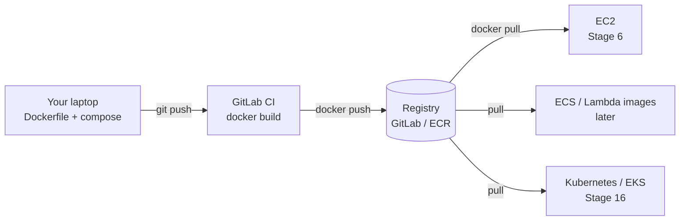
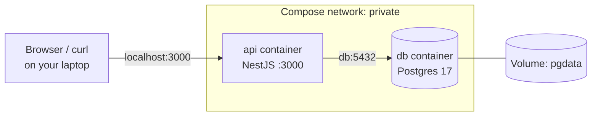

# Stage 1 – Lesson 5: Docker Basics

**Time:** ~60 minutes (20 min reading, 35 min hands-on, 5 min quiz)
**Prerequisites:** Lesson 2 (processes, signals, env vars), Lesson 3 (ports, `127.0.0.1` vs `0.0.0.0`), Lesson 4 (GitLab pipelines, CI/CD variables)
**AWS cost:** $0. Everything runs on your laptop. The optional registry push uses your free GitLab.com storage.

**Today you'll learn:** what containers are, images vs containers, writing a production-quality Dockerfile for NestJS, port mapping, env vars and secrets, debugging a container, Docker Compose with Postgres, and pushing an image to the GitLab Container Registry.

---

## 1. Why this lesson matters

### What problem does this solve?

You've heard it: **"But it works on my machine!"**

Your NestJS API needs a specific Node.js version, specific `node_modules`, environment variables, and maybe a Postgres database. Your laptop has all of that set up. The EC2 server doesn't. Your teammate's Mac has Node 20 instead of 24. The GitLab CI runner has something else again.

Docker solves this by packaging **your app + its runtime + its dependencies** into one portable unit (an **image**) that runs the same way everywhere: your laptop, a CI runner, EC2, ECS, or Kubernetes.

### Real-world analogy: shipping containers

Before standard shipping containers, every port loaded cargo differently: barrels, sacks, crates. Slow and error-prone. Then the world agreed on one standard steel box. Now any ship, crane, or truck can move any container without caring what's inside.

| Shipping world | Docker world |
|---|---|
| The standard container design | The **image** format (OCI standard) |
| A packing list / blueprint | The **Dockerfile** |
| A packed container sitting on a ship | A running **container** |
| The port's container yard | A **registry** (Docker Hub, GitLab Registry, AWS ECR) |
| Cranes, ships, trucks | Docker Engine, ECS, Kubernetes |

The crane doesn't care if the box holds shoes or TVs. Kubernetes doesn't care if the container runs NestJS or Python.

### Where it fits in a real web architecture

Docker shows up across most of the rest of the roadmap:



Build once, run the **same image** everywhere. That's the core idea.

---

## 2. Key terms

- **Container** – an isolated, running process on a Linux machine. It has its own filesystem, network, and process list, but shares the host's kernel.
- **Kernel** – the core of the operating system that talks to the hardware (CPU, memory, network).
- **Image** – a read-only template (a packaged filesystem + startup command) used to create containers. Think "class" vs "object": image = class, container = object.
- **Dockerfile** – a text file with step-by-step instructions to build an image.
- **Layer** – each instruction in a Dockerfile creates a layer. Layers are cached and reused, which makes rebuilds fast.
- **Registry** – a server that stores images (Docker Hub, GitLab Container Registry, AWS ECR).
- **Tag** – a label for an image version, e.g. `notes-api:1.0.0`. The part after `:` is the tag.
- **Port mapping** (`-p 8080:3000`) – forwarding a port on the host to a port inside the container.
- **Volume** – storage that lives outside the container, so data survives when the container is deleted.
- **Docker Compose** – a tool to define and run several containers together (API + database) from one YAML file.
- **Multi-stage build** – a Dockerfile with several `FROM` stages. You build in one stage and copy only the result into a small final image.

### Containers vs Virtual Machines

| | Virtual Machine (e.g. EC2) | Container |
|---|---|---|
| Includes | Full OS with its own kernel | Just your app + libraries; shares host kernel |
| Size | GBs | MBs (a NestJS image ≈ 150–250 MB) |
| Start time | Tens of seconds to minutes | Usually under a second |
| Isolation | Strong (hardware-level) | Good, but weaker (shared kernel) |
| Analogy | A separate house | An apartment in a shared building |

In the real world you usually use **both**: containers running *on* VMs (Docker on EC2, ECS on EC2, EKS worker nodes).

> 🇻🇳 Giải thích: **VM** giống một căn nhà riêng, có hệ điều hành (kernel) riêng nên nặng và khởi động chậm. **Container** giống một căn hộ trong chung cư: dùng chung "móng nhà" (kernel của máy host) nhưng mỗi căn hộ có không gian riêng (filesystem, network, process). Vì vậy container nhẹ và khởi động gần như tức thì.

> 🇻🇳 Giải thích: **Image** là "bản thiết kế đóng gói sẵn" (chỉ đọc). **Container** là một "bản chạy thật" được tạo từ image. Từ một image bạn có thể chạy nhiều container, giống như từ một class bạn tạo nhiều object.

---

## 3. Install Docker

Install **Docker Engine** from Docker's official instructions for your distro: search "Install Docker Engine" on docs.docker.com and pick your distro (Ubuntu, Debian, Fedora, etc.). The distro's own package (e.g. `docker.io` on Ubuntu) also works but is often older.

Verify:

```bash
docker --version
docker compose version
sudo docker run hello-world
```

- `docker compose` (with a space) is Compose v2, built into Docker. The old `docker-compose` (with a hyphen) is deprecated.
- `hello-world` downloads a tiny image and prints a success message.

### Running Docker without `sudo`

```bash
sudo usermod -aG docker $USER   # add yourself to the "docker" group
# then log out and log back in (or run: newgrp docker)
docker run hello-world          # should now work without sudo
```

- `usermod -aG docker $USER` – **a**ppend your user to the **G**roup `docker`.

⚠️ **Security note:** membership in the `docker` group is effectively **root access** on that machine, because anyone in it can start a container that mounts the whole host filesystem. Fine on your personal laptop. On shared servers, teams restrict it or use **rootless Docker** or **Podman** (a Docker-compatible tool that runs without a root daemon).

---

## 4. Your first containers (10 min)

### 4.1 Run something

```bash
docker run --rm -it node:24-alpine node -e "console.log('Hello from', process.version)"
```

- `docker run` – create and start a container from an image
- `--rm` – delete the container automatically when it exits (keeps things tidy)
- `-it` – interactive + terminal (so you see output and can type)
- `node:24-alpine` – image `node`, tag `24-alpine` (Node 24 on **Alpine Linux**, a tiny Linux distro ~5 MB)
- `node -e "..."` – the command to run inside the container

Notice: you didn't install Node 24 on your laptop. It came inside the image.

> ℹ️ Node.js versions change over time. Check nodejs.org for the current LTS (Long Term Support) version and use that tag.

### 4.2 Run a web server in the background

```bash
docker run -d --name web -p 8080:80 nginx:alpine
curl -I http://localhost:8080
```

- `-d` – **detached**: run in the background
- `--name web` – give it a name so you don't need the random ID
- `-p 8080:80` – **host port 8080 → container port 80**. Format is always `HOST:CONTAINER`.

You should see `HTTP/1.1 200 OK` and `Server: nginx`.

> 🇻🇳 Giải thích: **Port mapping** `-p 8080:80` nghĩa là: request đến cổng 8080 trên laptop sẽ được chuyển vào cổng 80 bên trong container. Bên trái là máy host, bên phải là container. Container có mạng riêng, nên nếu không map port thì từ ngoài không truy cập được.

### 4.3 The everyday commands

```bash
docker ps                 # running containers
docker ps -a              # all containers, including stopped ones
docker logs web           # container's stdout/stderr (like tail on a log file)
docker logs -f web        # follow logs live (like tail -f from Lesson 2)
docker exec -it web sh    # open a shell INSIDE the running container
docker stop web           # graceful stop: sends SIGTERM, then SIGKILL after 10s
docker rm web             # delete the stopped container
docker images             # list images on your machine
```

Inside `docker exec -it web sh`, try `ls /usr/share/nginx/html`, `ps`, then `exit`. Alpine uses `sh`, not `bash`.

Remember Lesson 2's `kill` vs `kill -9`? `docker stop` = SIGTERM (graceful), `docker kill` = SIGKILL (immediate). Same rule: prefer `stop`.

Clean up: `docker stop web && docker rm web`

---

## 5. A production-quality Dockerfile for NestJS (15 min)

Use your NestJS project from Lesson 4. If you don't have one:

```bash
npx @nestjs/cli new notes-api --package-manager npm
cd notes-api
```

### 5.1 Make the app container-friendly

Open `src/main.ts`:

```ts
import { NestFactory } from '@nestjs/core';
import { AppModule } from './app.module';

async function bootstrap() {
  const app = await NestFactory.create(AppModule);
  app.enableShutdownHooks();                     // run cleanup on SIGTERM (docker stop)
  await app.listen(process.env.PORT ?? 3000);    // port comes from an env var
}
bootstrap();
```

- `enableShutdownHooks()` – lets NestJS close DB connections etc. when it receives SIGTERM.
- `process.env.PORT ?? 3000` – configurable via environment variables (Lesson 2), default 3000.
- By default `app.listen(port)` listens on **all interfaces** (like `0.0.0.0`). That matters: if an app inside a container listens only on `127.0.0.1`, port mapping **won't reach it** and you get "connection reset / empty reply". Same lesson as Lesson 3, now inside a container.

### 5.2 `.dockerignore`

Create `.dockerignore` in the project root:

```
node_modules
dist
.git
.env
.env.*
*.log
coverage
Dockerfile
docker-compose.yml
```

Why: `docker build` sends the whole folder (the **build context**) to Docker. Without this file you'd send hundreds of MB of `node_modules`, and worse, **copy your `.env` secrets into the image**. Anyone who pulls the image could read them.

### 5.3 The Dockerfile

Create `Dockerfile` (no extension):

```dockerfile
# ---------- Stage 1: build ----------
FROM node:24-alpine AS build
WORKDIR /app

COPY package*.json ./
RUN npm ci

COPY . .
RUN npm run build
RUN npm prune --omit=dev

# ---------- Stage 2: runtime ----------
FROM node:24-alpine AS runtime
ENV NODE_ENV=production
WORKDIR /app

COPY --from=build --chown=node:node /app/package*.json ./
COPY --from=build --chown=node:node /app/node_modules ./node_modules
COPY --from=build --chown=node:node /app/dist ./dist

USER node
EXPOSE 3000
CMD ["node", "dist/main.js"]
```

Line by line:

| Line | What it does |
|---|---|
| `FROM node:24-alpine AS build` | Start from the Node 24 Alpine image; name this stage `build` |
| `WORKDIR /app` | Create and `cd` into `/app` inside the image |
| `COPY package*.json ./` | Copy **only** `package.json` and `package-lock.json` first |
| `RUN npm ci` | Install exact versions from the lockfile (`ci` = clean install; stricter and more reproducible than `npm install`) |
| `COPY . .` | Now copy the rest of the source code |
| `RUN npm run build` | Compile TypeScript → `dist/` |
| `RUN npm prune --omit=dev` | Remove devDependencies (TypeScript, Jest, Nest CLI) that production doesn't need |
| `FROM node:24-alpine AS runtime` | Start a **fresh, clean** image. Nothing from stage 1 comes along unless copied |
| `ENV NODE_ENV=production` | Tell Node libraries to run in production mode |
| `COPY --from=build --chown=node:node ...` | Copy only the finished pieces from the `build` stage, owned by user `node` |
| `USER node` | Run as the non-root `node` user (built into the Node image). If the app is hacked, the attacker isn't root |
| `EXPOSE 3000` | Documentation: "this app listens on 3000". It does **not** open or publish the port |
| `CMD ["node", "dist/main.js"]` | The command the container runs on start |

### Three details DevOps engineers care about

**1. Layer caching (why package.json is copied first).** Docker caches each layer. If a layer's inputs didn't change, Docker reuses it. Your source code changes constantly, but `package.json` rarely does. By copying it first, `npm ci` (the slow step) is cached and only re-runs when dependencies change. Rebuilds go from minutes to seconds.

> 🇻🇳 Giải thích: Mỗi dòng trong Dockerfile tạo ra một **layer** và Docker lưu cache lại. Nếu input của layer không đổi thì Docker dùng lại cache. Vì code thay đổi thường xuyên còn `package.json` ít khi đổi, ta copy `package.json` trước và chạy `npm ci`, để bước cài đặt chậm này được cache. Nếu copy toàn bộ code trước, mỗi lần sửa một dòng code là phải cài lại toàn bộ `node_modules`.

**2. Multi-stage = small and safe.** The final image has no TypeScript source, no compilers, no dev tools. Smaller image → faster deploys, lower registry storage, fewer vulnerabilities for scanners to flag (remember GitLab's Secure tab from Lesson 4).

**3. Exec form `CMD ["node", ...]`, not `npm run start:prod`.** With the JSON array form, `node` runs as the main process (PID 1) and receives SIGTERM from `docker stop` directly. `npm` doesn't reliably forward signals, so your graceful shutdown may never run and Docker ends up using SIGKILL after 10 seconds.

### 5.4 Build and run

```bash
docker build -t notes-api:0.1.0 .
```

- `-t notes-api:0.1.0` – name and tag the image
- `.` – the build context (current folder)

```bash
docker images notes-api            # check the size
docker run -d --name api -p 3000:3000 notes-api:0.1.0
curl http://localhost:3000         # should print: Hello World!
docker logs api                    # see NestJS startup logs
```

Now change the port using an env var, without rebuilding:

```bash
docker rm -f api
docker run -d --name api -p 8081:4000 -e PORT=4000 notes-api:0.1.0
curl http://localhost:8081
```

- `-e PORT=4000` – set an environment variable inside the container
- `-p 8081:4000` – host 8081 → container 4000 (the app now listens on 4000 inside)
- `docker rm -f` – force-remove (stops it first). ⚠️ This is abrupt: fine for local testing, not for a production container.

**Key idea:** the **same image** runs in dev, staging, and prod. Only the **environment variables** change. This is the "config in the environment" principle from the Twelve-Factor App (a well-known set of rules for cloud apps).

### 5.5 Secrets: never bake them into the image

❌ Never do this:

```dockerfile
ENV DB_PASSWORD=supersecret      # visible to anyone who has the image
COPY .env .                      # same problem
```

Anyone can run `docker history` or `docker inspect` on an image, or unpack its layers, and read these.

✅ Pass secrets **at runtime**:

```bash
docker run --env-file .env notes-api:0.1.0
```

In real deployments, the platform injects them: GitLab CI/CD variables (Lesson 4), AWS Secrets Manager / SSM Parameter Store (later stages), or Kubernetes Secrets (Stage 16).

---

## 6. Docker Compose: API + Postgres (10 min)

Running containers one by one with long `docker run` commands gets painful. **Docker Compose** describes your whole local stack in one file.

Create `.env` (already ignored by `.gitignore` and `.dockerignore`, right? Check!):

```bash
cat > .env <<'EOF'
PORT=3000
DB_PASSWORD=local-dev-only-password
EOF
chmod 600 .env
```

Create `docker-compose.yml`:

```yaml
services:
  api:
    build: .
    ports:
      - "3000:3000"
    env_file: .env
    environment:
      DB_HOST: db
      DB_PORT: 5432
      DB_USER: notes
      DB_NAME: notes
    depends_on:
      db:
        condition: service_healthy
    restart: unless-stopped

  db:
    image: postgres:17-alpine
    environment:
      POSTGRES_USER: notes
      POSTGRES_PASSWORD: ${DB_PASSWORD}
      POSTGRES_DB: notes
    volumes:
      - pgdata:/var/lib/postgresql/data
    healthcheck:
      test: ["CMD-SHELL", "pg_isready -U notes -d notes"]
      interval: 5s
      timeout: 3s
      retries: 5

volumes:
  pgdata:
```

Line by line:

- `services:` – each entry becomes a container. Names (`api`, `db`) become **DNS names** on a private network Compose creates.
- `build: .` – build the image from the Dockerfile in this folder.
- `env_file: .env` – load variables from `.env` into the container.
- `DB_HOST: db` – the API reaches Postgres at hostname **`db`**, not `localhost`. Inside a container, `localhost` means *that container itself*.
- `depends_on ... condition: service_healthy` – start the API only after Postgres passes its health check.
- `restart: unless-stopped` – if the app crashes, Docker restarts it (a simple version of what PM2 does in Stage 6).
- `image: postgres:17-alpine` – pin a major version. Never use `latest` for databases; a surprise major upgrade can break your data directory.
- `${DB_PASSWORD}` – Compose substitutes this from the `.env` file in the same folder.
- `volumes: - pgdata:/var/lib/postgresql/data` – store DB files in a named **volume**, so data survives container deletion.
- `healthcheck` – `pg_isready` checks whether Postgres accepts connections.
- Notice `db` has **no `ports:`**. It's reachable by the API on the internal network, but not from outside. That's "private by default" from Lesson 3.

> 🇻🇳 Giải thích: **Volume** là nơi lưu dữ liệu nằm ngoài container. Container có thể bị xóa và tạo lại bất cứ lúc nào (nó "dùng xong là bỏ"), nên dữ liệu quan trọng như database phải để trong volume, nếu không xóa container là mất dữ liệu.

Run it:

```bash
docker compose up -d --build      # build and start everything in the background
docker compose ps                 # status of each service (db should be "healthy")
docker compose logs -f api        # follow API logs (Ctrl+C to stop following)
curl http://localhost:3000
```

Prove that `db` is a DNS name inside the network:

```bash
docker compose exec api node -e "require('dns').lookup('db', (e, a) => console.log('db resolves to', a))"
```

You'll see a private IP like `172.18.0.2` (from Docker's private range, Lesson 3).

Open a Postgres shell:

```bash
docker compose exec db psql -U notes -d notes -c "SELECT version();"
```

Stop:

```bash
docker compose down        # stops and removes containers + network; KEEPS the volume
```

⚠️ `docker compose down -v` also deletes **volumes = your database data**. Only use it when you truly want a fresh, empty database.

### ⚠️ Real-world trap: Docker and your firewall

On Linux, published ports (`-p 3000:3000`) are opened by Docker by editing iptables directly. This can **bypass host firewalls like `ufw`**. So on a server, `ports: - "5432:5432"` can expose your database to the internet even though `ufw` says port 5432 is blocked.

Safer habits:
- Don't publish database ports at all (like our compose file).
- If you need local access, bind to loopback only: `"127.0.0.1:5432:5432"`.
- On AWS, rely on **Security Groups** (Stage 6), which sit outside the machine and aren't affected.

### Updated local architecture



---

## 7. What about the React frontend?

In Stages 3–5, your React build will be hosted on **S3 + CloudFront / Cloudflare**, no container needed: it's just static files. But containerizing React is common for Kubernetes setups (Stage 16) and for preview environments. The pattern is multi-stage again: **build with Node, serve with Nginx**.

```dockerfile
FROM node:24-alpine AS build
WORKDIR /app
COPY package*.json ./
RUN npm ci
COPY . .
RUN npm run build                       # Vite outputs to dist/

FROM nginx:alpine
COPY nginx.conf /etc/nginx/conf.d/default.conf
COPY --from=build /app/dist /usr/share/nginx/html
EXPOSE 80
```

`nginx.conf` (needed so React Router routes like `/notes/42` don't 404 on refresh):

```nginx
server {
    listen 80;
    root /usr/share/nginx/html;
    location / {
        try_files $uri $uri/ /index.html;
    }
}
```

- `try_files $uri $uri/ /index.html` – "serve the file if it exists, otherwise serve `index.html` and let React Router handle the URL." You'll see this same idea again as a CloudFront error-page rule in Stage 4.

⚠️ React env vars (`VITE_API_URL`) are baked in **at build time** and are visible to anyone in the browser. Never put secrets in frontend env vars.

The final image contains **no Node.js at all**, just Nginx and static files (~50 MB).

---

## 8. Push your image to the GitLab Container Registry (optional, 5 min)

In Lesson 4 you saw the **Deploy → Container registry** tab. Let's use it.

1. In GitLab: avatar → **Edit profile** → **Access tokens** → create a **Personal access token** with scopes `read_registry` and `write_registry`. Set an expiry date. Copy it once.
2. Log in without putting the token in your shell history:

```bash
read -s GITLAB_TOKEN          # paste the token, press Enter (nothing is shown)
echo "$GITLAB_TOKEN" | docker login registry.gitlab.com -u <your-gitlab-username> --password-stdin
unset GITLAB_TOKEN
```

- `read -s` – read input silently into a variable
- `--password-stdin` – pass the password through a pipe instead of a command-line flag (flags show up in `ps` and history)

3. Tag and push (use your real project path):

```bash
docker tag notes-api:0.1.0 registry.gitlab.com/<username>/<project>/notes-api:0.1.0
docker push registry.gitlab.com/<username>/<project>/notes-api:0.1.0
```

Refresh the Container registry page in GitLab and you'll see your image.

Notes:
- `docker login` stores credentials in `~/.docker/config.json` (only base64-encoded, not encrypted). On shared machines, set up a **credential helper** or run `docker logout registry.gitlab.com` when done.
- Registry storage counts toward your GitLab namespace storage quota. Delete old tags you don't need (Deploy → Container registry → delete).

### Preview: the CI version (full details in Stage 7)

In CI you never use a personal token. GitLab gives each job short-lived, built-in variables:

```yaml
build-image:
  stage: build
  image: docker:27
  services:
    - docker:27-dind
  script:
    - echo "$CI_REGISTRY_PASSWORD" | docker login -u "$CI_REGISTRY_USER" --password-stdin "$CI_REGISTRY"
    - docker build -t "$CI_REGISTRY_IMAGE/notes-api:$CI_COMMIT_SHORT_SHA" .
    - docker push "$CI_REGISTRY_IMAGE/notes-api:$CI_COMMIT_SHORT_SHA"
```

- `docker:27-dind` – "Docker-in-Docker": a Docker daemon service the job can build against
- `$CI_REGISTRY_*` – predefined variables GitLab injects automatically, no secrets for you to manage
- `$CI_COMMIT_SHORT_SHA` – tag the image with the Git commit, so every image traces back to exact code

Don't worry about running this yet. We'll build the real pipeline in Stage 7.

---

## 9. How teams use this

### In real companies

- **Dockerfiles live in the app repo**, reviewed in merge requests like any other code. DevOps often provides a standard base image or template.
- **Images are tagged with the Git commit SHA** (and sometimes a semantic version like `1.4.2`). `latest` is avoided in production because you can't tell which code it contains, and it can change under you.
- **CI builds, scans, and pushes** images to a registry (GitLab Registry, AWS ECR). Deploys **pull** a specific tag. Rollback = redeploy the previous tag.
- **Image scanning** (GitLab Container Scanning, Trivy, ECR scanning) flags vulnerable packages. Small multi-stage images get far fewer alerts.
- **Locally**, developers use Docker Compose to run the app + Postgres + Redis without installing them.
- **In production**, raw `docker run` is rare. Containers are run by an **orchestrator** (ECS, Kubernetes) that restarts, scales, and replaces them.
- **Base image updates** (Node security patches) are a regular chore, often automated with tools like Renovate.

### Jargon you'll hear

| Term | Meaning |
|---|---|
| "Containerize the app" | Write a Dockerfile so the app runs as a container |
| "Bump the base image" | Update the `FROM` image version (e.g. security patch) |
| "Bake it into the image" | Put something inside at build time (vs inject at runtime) |
| "Immutable image" / "build once, deploy many" | Same image goes dev → staging → prod; only config changes |
| "Pin the tag" / "pin by digest" | Use an exact version, or the exact `sha256:` hash, instead of `latest` |
| "Distroless" / "slim" / "alpine" | Minimal base images with fewer packages |
| "The container is crash-looping" | It starts, crashes, restarts, crashes again |
| "OOMKilled" | The container used more memory than its limit and was killed (Out Of Memory) |
| "Exit code 137" | Killed by SIGKILL (often OOM or `docker kill`). Exit code 143 = SIGTERM |
| "DinD" | Docker-in-Docker, used to build images inside CI |
| "Sidecar" | A helper container running next to the main one (later, Kubernetes) |

### Questions you could ask your DevOps team

1. "Do we have a standard base image or Dockerfile template for Node services?"
2. "How do we tag images, and how do we roll back to a previous one?"
3. "Where do containers get their secrets at runtime: CI variables, Secrets Manager, or Kubernetes Secrets?"
4. "Do we scan images for vulnerabilities, and what severity blocks a deploy?"
5. "What memory limits do our containers have, and how do we notice OOMKills?"

### AWS vs Cloudflare vs others

| Need | AWS | Cloudflare | Others |
|---|---|---|---|
| Store images (registry) | **ECR** (Elastic Container Registry) | No general-purpose public registry product | GitLab Registry, Docker Hub, GitHub Container Registry |
| Run containers (managed) | **ECS** on Fargate or EC2, App Runner | **Cloudflare Containers** (newer; runs containers alongside Workers) | Google Cloud Run, Fly.io, Render |
| Run on your own VM | **EC2** + Docker (Stage 6) | n/a | Any VPS |
| Kubernetes | **EKS** (Stage 16) | n/a | GKE, AKS, k3s |
| Functions from an image | **Lambda** container images | Workers (not Docker-based) | Cloud Run |

**When to choose which (for now):** use the **GitLab Registry** while learning, since it's already next to your code and CI. Big AWS shops usually move to **ECR** because it integrates with IAM roles, ECS, and EKS with no extra credentials. Cloudflare's container offering is newer and built around its Workers platform; check its current status and pricing on developers.cloudflare.com before relying on it.

⚠️ Cost preview: ECR charges for storage beyond any free allowance, plus data transfer. ECS on Fargate charges per vCPU and GB of memory per second while tasks run. EKS has an hourly control-plane fee. We'll plan labs around these. Prices and free tiers change, so always verify on the AWS pricing page.

---

## 10. Summary

- A **container** is an isolated process sharing the host kernel; an **image** is the read-only template it starts from.
- A **Dockerfile** builds an image layer by layer. Copy `package*.json` and run `npm ci` **before** copying source to benefit from layer caching.
- Use **multi-stage builds**, a **non-root user**, `.dockerignore`, and exec-form `CMD ["node", "dist/main.js"]` so SIGTERM reaches your app.
- `-p HOST:CONTAINER` maps ports. The app must listen on all interfaces, not `127.0.0.1`, inside the container.
- **Same image everywhere; config via env vars.** Secrets are injected at runtime, never baked in.
- **Compose** runs multi-container stacks. Services find each other by **service name** (`db`), not `localhost`. Data lives in **volumes**.
- Docker-published ports can bypass `ufw`. Don't publish database ports.
- Tag images with versions or commit SHAs; avoid `latest` in production.

---

## 11. Exercises

### Exercise 1: Shrink and harden (15 min)

1. Build a deliberately "naive" image to compare, using a file named `Dockerfile.naive`:
   ```dockerfile
   FROM node:24
   WORKDIR /app
   COPY . .
   RUN npm install
   RUN npm run build
   CMD ["npm", "run", "start:prod"]
   ```
   Build it: `docker build -f Dockerfile.naive -t notes-api:naive .`
2. Compare sizes with `docker images notes-api`. Write down both numbers.
3. Run each and check which user the app runs as:
   `docker run --rm notes-api:naive whoami` vs `docker run --rm notes-api:0.1.0 whoami`
4. Change one line in `src/app.service.ts` and rebuild **both**. Which rebuild re-ran `npm install`/`npm ci`? Why?
5. Bonus: time `docker stop` on each running container (`time docker stop <name>`). Which one takes ~10 seconds, and why?

Paste your numbers and explanations to me for feedback.

### Exercise 2: Break it, then debug it (10 min)

Each scenario has a bug. Run it, observe the symptom, find the cause using only `docker ps -a`, `docker logs`, `docker exec`, and `curl`.

1. Run `docker run -d --name bug1 -p 3000:3000 -e PORT=5000 notes-api:0.1.0`, then `curl localhost:3000`. What happens and why?
2. In `docker-compose.yml`, temporarily change `DB_HOST: db` to `DB_HOST: localhost`. From inside the `api` container, what does `localhost` point to? (Hint: use the `dns.lookup` command from Section 6 with `localhost`.)
3. Run `docker run -d --name bug3 notes-api:0.1.0` (no `-p`). Is it running? Can you reach it from your laptop? How can you still reach it from *inside* the container? (Hint: `docker exec bug3 wget -qO- http://localhost:3000`.)

Clean up after: `docker rm -f bug1 bug3` and revert the compose change.

---

## 12. 🧹 Local cleanup checklist

No AWS resources were used. Just tidy your laptop, because images and volumes quietly eat disk space.

- [ ] Stop the compose stack: `docker compose down` (keeps your DB volume)
- [ ] Remove test containers: `docker ps -a` then `docker rm <name>` for any leftovers (`web`, `api`, `bug1`, `bug3`)
- [ ] Remove the naive image: `docker rmi notes-api:naive`
- [ ] See what's using disk: `docker system df`
- [ ] Optional: remove dangling (untagged) images: `docker image prune`
- [ ] If you pushed to GitLab: `docker logout registry.gitlab.com`, and delete test tags in GitLab if you don't need them
- [ ] Keep the `Dockerfile`, `.dockerignore`, and `docker-compose.yml`, and commit them (but check `git status` to make sure `.env` is **not** staged)

⚠️ **Dangerous commands, read before using:**
- `docker compose down -v` deletes the `pgdata` volume = all local DB data.
- `docker system prune -a --volumes` deletes **all** stopped containers, **all** unused images, and **all** unused volumes, including databases from other projects. Don't run it unless you're sure.

---

## 13. Quiz

Reply in chat with your answers (e.g. "1: …, 2: …, 3: …").

**Q1.** A teammate's Dockerfile looks like this, and every tiny code change makes the build take 4 minutes:

```dockerfile
FROM node:24-alpine
WORKDIR /app
COPY . .
RUN npm ci
RUN npm run build
CMD ["npm", "run", "start:prod"]
```

Name **three** improvements, and explain what each one fixes.

**Q2.** Your NestJS container runs fine with Compose on your laptop, but the API logs show `connect ECONNREFUSED 127.0.0.1:5432` when trying to reach Postgres. The `db` container is healthy. What's wrong, and how do you fix it?

**Q3.** Your team wants to deploy the same `notes-api` image to staging and production, but they use different database passwords. A junior developer suggests building two images: `notes-api:staging` with the staging password in an `ENV` line and `notes-api:prod` with the production one. Explain two problems with this approach and what to do instead.

<details>
<summary>👀 Answers (open only after you've replied!)</summary>

**A1.** Any three of these:
- **Copy `package*.json` first and run `npm ci` before `COPY . .`** → dependency install is cached and only re-runs when dependencies change. This fixes the 4-minute rebuilds.
- **Use a multi-stage build** → final image excludes TypeScript source, devDependencies, and build tools, so it's smaller, faster to push/pull, and has fewer vulnerabilities.
- **`npm prune --omit=dev`** (or install prod-only deps in the final stage) → removes dev tools from production.
- **`USER node`** → the app doesn't run as root, limiting damage if it's compromised.
- **`CMD ["node", "dist/main.js"]` instead of `npm run start:prod`** → `node` receives SIGTERM directly, so graceful shutdown works and `docker stop` doesn't wait 10 seconds and then SIGKILL.
- **Add `.dockerignore`** → avoids sending `node_modules`, `.git`, and `.env` into the build (faster, and no leaked secrets).

**A2.** Inside a container, `localhost` / `127.0.0.1` means **the container itself**, not your laptop and not the `db` container. The API is looking for Postgres inside its own container, where nothing listens on 5432 (hence "refused", Lesson 3). Fix: set the DB host to the Compose **service name**, `DB_HOST=db`, and make sure the app reads it from the environment.

**A3.**
- **Problem 1: secrets baked into images.** Anyone who can pull the image (teammates, CI logs, a leaked registry) can read the password with `docker inspect` or `docker history`. Rotating the password requires a rebuild.
- **Problem 2: two different images break "build once, deploy many."** What you tested in staging isn't exactly what runs in production, so a bug can appear only in prod. It also doubles build time and storage.
- **Instead:** build **one** image (tagged e.g. with the commit SHA), and inject `DB_PASSWORD` **at runtime** per environment: GitLab CI/CD variables scoped to environments (Lesson 4), AWS Secrets Manager / SSM Parameter Store, or Kubernetes Secrets.

</details>

---

## 14. Update your progress.md

```markdown
Last updated: <today's date>
Current stage: 1 – Foundations
Current lesson: Stage 1 complete → next: Stage 2 – AWS safety setup

## Roadmap checklist
- [x] 1. Foundations: how the web works, Linux CLI, networking, GitLab, Docker basics

## Completed lessons
| <date> | S1 L5 – Docker basics | _/3 | images vs containers, multi-stage NestJS Dockerfile, layer cache, -p HOST:CONTAINER, env vars at runtime, Compose + Postgres, volumes, GitLab Registry |

## Weak topics (need review)
- (add any quiz question you got wrong)

## Questions to ask my DevOps team
- Do we have a standard base image / Dockerfile template for Node services?
- How do we tag images, and how do we roll back?
- Where do containers get secrets at runtime?

## Personal notes
- -p is always HOST:CONTAINER.
- Inside a container, localhost = the container itself. Use service names (db).
- Never bake secrets into images. One image, config via env vars.
- CMD ["node", "dist/main.js"] so SIGTERM works. Exit 137 = SIGKILL/OOM, 143 = SIGTERM.
- docker compose down -v deletes DB data!
- Docker-published ports can bypass ufw.
```

Also:
- **AWS resources currently running:** still "(none yet)". 🎉
- If you pushed an image, add a note under **Personal notes**: "GitLab Registry: notes-api:0.1.0 (delete if unused)".
- Fill in the missing quiz scores (`_/3`) for earlier lessons once I've graded them.

**Next up: Stage 2 – AWS safety setup.** You'll create your AWS account safely: lock down the root user, enable MFA, create an IAM user for daily work, and set a billing alarm so your $20 budget is protected **before** you create anything that costs money. This is the most important lesson for avoiding a surprise bill.
