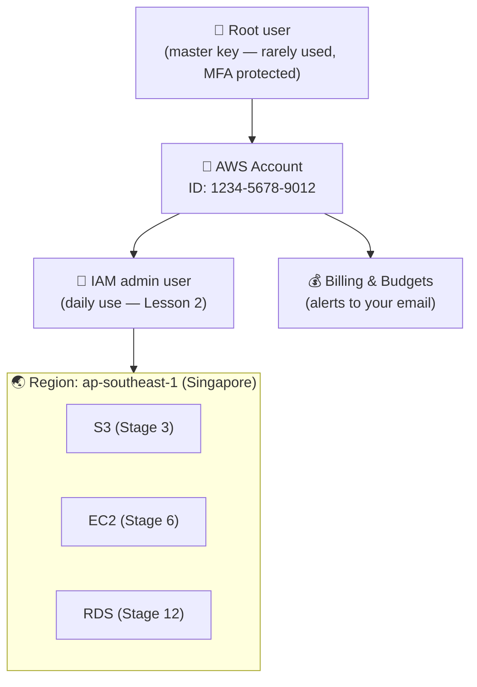

# Stage 2 · Lesson 1 — Create Your AWS Account & Lock Down the Root User

⏱️ Time: ~45–60 minutes
🎯 Goal: Have a brand-new AWS account that is secured (MFA on root), configured correctly, and protected by spending alerts — **before** you create a single resource.
💰 Cost of this lesson: **$0** (everything here is free)

> **Note on order:** Your `progress.md` shows Stage 1 (Foundations) not started yet. That's OK — this lesson doesn't need networking or Linux knowledge. Every term is defined as we go. Just remember to come back to Stage 1 before Stage 3 (S3), because hosting a website will need HTTP and DNS basics.

---

## 1. What problem does this solve?

When you create an AWS account, you get one super-powerful login called the **root user**. It can do *anything*: create servers, delete everything, change payment details, even close the account. If someone steals it, they can:

- Launch hundreds of servers to mine crypto → you get a bill for thousands of dollars
- Delete all your data
- Lock you out of your own account

Also, AWS is **pay-as-you-go**: there's no spending cap by default. A forgotten server, or a lab you didn't clean up, silently keeps charging you.

This lesson solves both problems:

| Problem | Solution in this lesson |
|---|---|
| Root login stolen | Strong password + **MFA** on root |
| Root used every day (risky) | Plan to use root only rarely ("break-glass") — daily user comes in Lesson 2 |
| Surprise bills | Pick the right **account plan** + create **AWS Budgets** alerts |
| Missing important emails | Set **alternate contacts** |

### 🏢 Real-world analogy

Think of your AWS account as **an office building you just bought**.

- The **root user** is the **master key** that opens every door, the safe, and can even sell the building. You don't carry it around every day — you lock it in a safe.
- **MFA** is a **second lock** on that master key: even if someone copies the key, they also need your fingerprint.
- **IAM users** (next lesson) are **staff key cards** that only open the doors each person needs.
- **AWS Budgets** is a **smoke detector for money**: it doesn't stop the fire, but it screams early so you can act.

### 🗺️ Where it fits in a real web architecture

Everything you will build — S3 buckets, CloudFront, EC2 servers, databases — lives *inside* an AWS account. The account is the foundation; security mistakes here affect everything above it.



---

## 2. New terms (read once, refer back later)

| Term | Meaning |
|---|---|
| **AWS account** | A container for all your AWS resources and your bill. Identified by a 12-digit **Account ID**. |
| **Root user** | The identity created with the account (your email + password). Has unlimited power. Cannot be restricted. |
| **IAM** (Identity and Access Management) | The AWS service that controls *who* can do *what* in your account. |
| **IAM user** | A separate login inside your account with only the permissions you give it. |
| **MFA** (Multi-Factor Authentication) | Logging in with something you **know** (password) + something you **have** (phone app, passkey, security key). |
| **TOTP** (Time-based One-Time Password) | The 6-digit code that changes every 30 seconds in apps like Google Authenticator, Authy, or 1Password. |
| **Passkey** | A modern login credential stored on your device or password manager, unlocked by fingerprint/face/PIN. Phishing-resistant. |
| **Region** | A geographic location where AWS has data centers, e.g. `ap-southeast-1` = Singapore. Most resources live in one region. |
| **Availability Zone (AZ)** | One or more separate data centers inside a region (e.g. `ap-southeast-1a`). Covered properly in Stage 6/10. |
| **Console** | The AWS website where you click to manage things: https://console.aws.amazon.com |
| **AWS credits** | Prepaid "money" from AWS that pays for usage. Your bill shows usage, then credits subtract from it. |
| **AWS Budgets** | A free tool that emails you when your cost reaches (or is forecast to reach) a number you choose. |
| **Access keys** | A pair of secret strings (`AKIA...` + secret) that let programs/CLI call AWS. **Never create these for root.** |

🇻🇳 **Giải thích:** *Root user* là tài khoản "chủ nhà" có toàn quyền, không thể giới hạn quyền của nó. *IAM user* là tài khoản "nhân viên" do bạn tạo ra, chỉ có những quyền bạn cấp. Nguyên tắc: khóa root lại (bật MFA, gần như không dùng), làm việc hằng ngày bằng IAM user.

---

## 3. 💰 Cost & safety check (read before the lab)

| Item | Free? | Cost if left running | Cleanup |
|---|---|---|---|
| Creating an AWS account | ✅ Free | $0 | Nothing to delete |
| MFA on root | ✅ Free | $0 | Keep it forever |
| Alternate contacts / billing settings | ✅ Free | $0 | Keep |
| AWS Budgets (alerts only, no "actions") | ✅ Free | $0 | Keep — they protect you |

AWS Budgets: monitoring and email notifications are free. Only *action-enabled* budgets (budgets that automatically change permissions/stop resources) cost money after the first two (about $0.10/day each). We won't use actions today.

⚠️ **Prices and free-tier rules change.** Always verify at https://aws.amazon.com/free/ and https://aws.amazon.com/pricing/ — AWS pages override anything in this lesson.

### 🔁 The 2025+ Free Tier: Free plan vs Paid plan (important!)

For accounts created on or after **15 July 2025**, AWS no longer gives "12 months free". Instead, during signup you choose:

| | **Free plan** | **Paid plan** |
|---|---|---|
| Credits | $100 at signup + up to $100 more for completing onboarding activities | Same credits |
| Charges beyond credits | **None** — you can't be charged | Normal pay-as-you-go billing |
| Duration | Ends after **6 months** or when credits run out (whichever first) | Continues forever |
| Services | Some expensive services are blocked | All services |
| When it ends | Account closes; you have a grace period (about 90 days) to upgrade and keep your data | Billing continues |

**My recommendation for you: choose the Free plan.**

- Right now, the biggest risk for a beginner is a surprise bill. The Free plan makes that nearly impossible.
- Later (probably around Stage 8–12, or when a lab needs a service the Free plan blocks, or as you approach month 6), you'll **upgrade to the Paid plan** with one click. From that moment, **your budgets become your only safety net** — that's why we set them up today.
- 📅 Write your account creation date in `progress.md` and set a phone reminder for **month 5** to decide on upgrading. If the account closes and the grace period passes, your resources and data are gone.

🇻🇳 **Giải thích:** *Free plan* = bạn không bao giờ bị trừ tiền thật, nhưng tài khoản sẽ tự đóng sau 6 tháng hoặc khi hết credits. *Paid plan* = dùng được mọi dịch vụ, nhưng khi hết credits thì AWS sẽ trừ tiền thẻ của bạn. Bắt đầu bằng Free plan để an toàn, sau này nâng cấp khi cần.

### 🚨 COST TRAPS — memorize these now

Even though we're not creating any of these today, you will meet them later. These are the classic "why is my bill $300?" stories:

| Trap | Why it's dangerous |
|---|---|
| **NAT Gateway** | Charges per hour *and* per GB, even when idle. Easily $30+/month. |
| **EKS control plane** | Charges per hour per cluster (~$70+/month) just for existing. |
| **Load Balancers (ALB/NLB) left running** | Hourly charge even with zero traffic. |
| **Elastic IPs / public IPv4 addresses** | Public IPv4 addresses are billed hourly; an unattached Elastic IP is pure waste. |
| **Aurora** | Much more expensive than basic RDS; easy to blow a $20 budget. |
| **Shield Advanced** | ~$3,000/month with a 1-year commitment. **Never click "subscribe" in a lab.** |
| **Large data transfer out** | Data leaving AWS to the internet is billed per GB. |
| **Resources in the "wrong" region** | You forget a server in another region because the console only shows one region at a time. |

---

## 4. Hands-on lab

### Part A — Prepare (5 min)

1. **Email:** Use an email you fully control and that has its own 2FA enabled. Tip with Gmail: `yourname+aws@gmail.com` works and lets you filter AWS emails. Whoever controls this email can reset your root password.
2. **Password manager:** Bitwarden (free), 1Password, or your browser's manager. Generate a long random root password (20+ characters).
3. **MFA method** — pick one (or better, two):
   - **Passkey** (recommended): stored in your password manager or phone, unlocked with fingerprint/face.
   - **Authenticator app** (TOTP): Google Authenticator, Microsoft Authenticator, Authy, or the TOTP feature of your password manager.
4. **Payment card:** A Visa/Mastercard (debit or credit) with **online international payments enabled**. Many Vietnamese bank cards have this off by default — enable it in your banking app. AWS may place a small temporary verification charge (around $1) that is reversed.
5. **Phone:** For SMS/voice verification. Use your Vietnam number with country code +84.

### Part B — Create the account (10–15 min)

1. Go to https://aws.amazon.com/ → **Create an AWS Account**.
2. Enter your **root email** and an **account name** (e.g. `minh-devops-learning`). This name is just a label.
3. Verify the email with the code AWS sends.
4. Set the **root password** (from your password manager).
5. **Choose account plan → Free plan** (see section 3).
6. Contact info: choose **Personal**, fill in your address.
7. Payment: enter your card.
8. Identity verification: SMS or voice call code.
9. **Support plan: choose "Basic support – Free".** ⚠️ Don't choose Developer/Business — those are monthly paid plans.
10. Wait for the confirmation email (can take a few minutes, occasionally longer).

📝 Write down your **12-digit Account ID** (top-right menu in the console). It's not a secret, but don't post it publicly either.

### Part C — Secure the root user with MFA (10 min) 🔐

AWS now requires MFA on root users, and may force you to set it up on first sign-in. Either way, do it now:

1. Sign in at https://console.aws.amazon.com → **Root user** → enter root email + password.
2. Top-right, click your **account name** → **Security credentials**.
3. Under **Multi-factor authentication (MFA)** → **Assign MFA device**.
4. **Device name:** something descriptive, e.g. `root-passkey-bitwarden` or `root-totp-phone`.
5. Choose the type:
   - **Passkey or security key** → follow the browser/password-manager prompts.
   - **Authenticator app** → click **Show QR code** → scan it with your app → enter **two consecutive codes** (wait for the code to change once between them) → **Add MFA**.
6. **Recommended:** repeat steps 3–5 to add a **second MFA device** (e.g. passkey + phone app). AWS allows up to 8. If you lose your only device, account recovery is slow and painful.
7. Still on the Security credentials page, scroll to **Access keys**. It should say you have **no access keys**. ✅
   ⚠️ **Never create access keys for root.** Root keys = unlimited power that can leak through a terminal history, a `.env` file, or a GitLab commit.
8. **Test:** Sign out → sign back in as root → you should be asked for MFA. ✅

🇻🇳 **Giải thích:** MFA giống như ngân hàng gửi mã OTP: dù kẻ xấu biết mật khẩu, họ vẫn cần thiết bị của bạn để đăng nhập. Hãy đăng ký 2 thiết bị MFA để không bị khóa tài khoản nếu mất điện thoại.

### Part D — Account settings (5 min)

Top-right menu → **Account**:

1. **Alternate contacts** → Edit → fill in **Billing**, **Operations**, and **Security** contacts. For a personal account, use your own email for all three. AWS uses these for important notices (e.g. security issues, abuse reports).
2. **IAM user and role access to Billing information** → Edit → **Activate IAM Access** → Update.
   Why? In Lesson 2 you'll create an IAM admin user for daily work. Without this switch, even an admin IAM user **can't see the bill** — and you want to check costs without logging in as root.

### Part E — Create two Budgets (10–15 min) 🔔

Go to **Billing and Cost Management** (search "Billing" in the top search bar) → **Budgets** → **Create budget**.

**⚠️ Key concept first — credits can hide your spending.**
By default, budgets look at your **net** cost = usage − credits. While credits pay for everything, your net cost is $0, so a default budget stays silent while your credits quietly burn. We'll tell budgets to **ignore credits** so they see real usage.

🇻🇳 **Giải thích:** Khi có credits, hóa đơn "thực trả" luôn là $0, nên budget mặc định sẽ không cảnh báo — trong khi credits của bạn vẫn đang bị tiêu. Vì vậy ta bỏ chọn "Credits" để budget theo dõi chi phí sử dụng thật.

**Budget 1 — Zero-spend budget ("tell me if anything costs money")**

1. **Use a template (simplified)** → **Zero spend budget**.
2. Budget name: `zero-spend-alert`
3. Email recipients: your email.
4. **Create budget**.
5. Open the budget → **Edit** → look for **Advanced options / charge types** → **uncheck Credits** (and Refunds) → Save. If your console doesn't show this option for template budgets, that's fine — Budget 2 covers it.

**Budget 2 — Monthly $20 budget (your real limit)**

1. **Create budget** → **Customize (advanced)** → **Cost budget** → Next.
2. Name: `monthly-20-usd`
3. Period: **Monthly**, **Recurring budget**, Budgeting method: **Fixed**, Amount: **20**.
4. Scope: **All AWS services**. Open **Advanced options** → **uncheck Credits** and **Refunds**.
5. Alerts — add three thresholds:

   | Threshold | Trigger | Meaning |
   |---|---|---|
   | 50% ($10) | **Actual** | "You've used half your budget" |
   | 80% ($16) | **Actual** | "Slow down, check resources" |
   | 100% ($20) | **Forecasted** | "At this rate you'll exceed $20 this month" |

6. Email: your email for each. **Skip "Actions"** (that's the paid, advanced feature).
7. **Create budget**.

🎁 Bonus: Creating a budget is one of the onboarding activities that earns extra credits. Check the **Explore AWS** / credits widget on the console home page to see which activities remain.

**⚠️ Two big misconceptions about budgets:**

1. **A budget is NOT a spending cap.** It sends emails; it doesn't stop resources. (On the Paid plan, only *you* stop the spending.)
2. **Alerts are delayed.** Billing data updates a few times per day, so an alert can arrive hours after the cost started. A NAT Gateway won't be caught in 5 minutes.

### Part F — Explore the Billing console (5 min)

Inside **Billing and Cost Management**, find and note down in `progress.md`:

- **Credits** page: how much credit you have and when it expires.
- **Free plan** status: days remaining on the Free plan.
- **Bills** page: should show $0.00.
- **Region selector** (top-right of the console): set it to **Asia Pacific (Singapore) ap-southeast-1**. It's the closest mature region to Ho Chi Minh City (lower latency for your users and you). We'll use it for most labs. Note: prices differ a little by region; `us-east-1` (N. Virginia) is often slightly cheaper, and some global features (like billing metrics for CloudWatch alarms in Lesson 3) live there.

---

## 5. Why no AWS CLI today?

The course rule is "Console → CLI → Terraform". But the CLI needs **access keys or a login session**, and we must **never** create access keys for root. In **Lesson 2** you'll create a daily-use admin identity, then install and configure the AWS CLI safely. Today is console-only on purpose.

---

## 6. AWS vs Cloudflare: account security

Cloudflare (Stage 5) has the same ideas with different names:

| Concept | AWS | Cloudflare |
|---|---|---|
| Main login | Root user | Account owner (Super Administrator) |
| Second factor | MFA (passkey, TOTP, hardware key) | 2FA (TOTP, security key) |
| "God mode" API secret to avoid | Root access keys | **Global API Key** — avoid it |
| Safer, limited API secret | IAM roles / scoped credentials | **API Tokens** with limited permissions |
| Team members | IAM Identity Center / IAM users | Account Members with roles |
| Spending risk | High — pay-as-you-go, no cap by default | Lower — Free plan needs no card; paid products are mostly fixed monthly prices, though usage-based products (e.g. Workers, R2) exist |

**When it matters:** Both accounts deserve MFA on day one. AWS needs *much* more cost vigilance because almost everything is billed per hour or per GB. When we set up Cloudflare in Stage 5, you'll repeat the "enable 2FA + never use the global key" pattern.

---

## 7. 🏭 How teams use this

In real companies, nobody logs in as root for daily work. A typical setup:

- **AWS Organizations:** the company has *many* AWS accounts (e.g. `dev`, `staging`, `prod`, `security`, `logging`) grouped under one organization with one consolidated bill. Separating accounts limits the **blast radius** (how much damage one mistake can cause).
- **Landing zone / Control Tower:** a pre-built, secure multi-account setup with guardrails.
- **SSO via IAM Identity Center:** engineers log in with their company identity (Google Workspace, Microsoft Entra ID, Okta) and get temporary access to specific accounts with specific roles.
- **Root = break-glass only:** root credentials are stored in a vault, MFA devices are held by specific people, and using root triggers an alert. Some companies remove root credentials from member accounts entirely.
- **FinOps:** a practice (and sometimes a team) focused on cloud cost. Budgets per account/team, **Cost Anomaly Detection** (free AWS tool that spots unusual spending), and **cost allocation tags** (labels like `project=notes-app`) to know who spent what.

### 🗣️ Jargon you'll hear

| Term | Meaning |
|---|---|
| **Break-glass account/procedure** | Emergency-only access (like breaking glass to pull a fire alarm). |
| **Blast radius** | How much is affected if something goes wrong. |
| **Landing zone** | A standard, secure starting setup for AWS accounts. |
| **Guardrails / SCPs** | Organization-wide rules that block dangerous actions (Service Control Policies). |
| **Account vending** | Automatically creating new pre-configured AWS accounts for teams. |
| **FinOps** | Financial operations — managing cloud spend. |
| **Least privilege** | Give only the minimum permissions needed (deep dive in Stage 15). |
| **Payer / management account** | The top account in an Organization that pays the bill. |

### ❓ Questions you could ask your DevOps team

1. "How are our AWS accounts split — per environment, per team, or per product?"
2. "Do we use IAM Identity Center/SSO, and which permission sets would I get?"
3. "Who holds the root credentials, and what's our break-glass procedure?"
4. "Do we have budgets or cost anomaly alerts per account? Who receives them?"
5. "Which region(s) do we deploy to, and why those?"

---

## 8. 📌 Summary

- The **root user** has unlimited power — protect it with a strong password + **MFA (ideally 2 devices)**, and never create root access keys.
- New accounts choose a **Free plan** (no charges, closes after 6 months or when credits run out) or a **Paid plan** (all services, real billing). Start on Free; upgrade consciously later.
- **Budgets** are free alarms, not spending caps; exclude **credits** so they see real usage; alerts are delayed by hours.
- Set **alternate contacts** and **enable IAM access to billing** so you can check costs without root.
- Know the cost traps: NAT Gateway, EKS, idle Load Balancers, public IPs/Elastic IPs, Aurora, Shield Advanced, data transfer, forgotten regions.

---

## 9. 🛠️ Exercises

**Exercise 1 — Verify your security baseline**
Check each item and mark it done:

- [ ] Sign out and sign back in as root → MFA is required
- [ ] Two MFA devices registered (or a plan to add the second one this week)
- [ ] Security credentials page shows **no root access keys**
- [ ] Alternate contacts filled in
- [ ] IAM access to Billing activated
- [ ] Two budgets exist: `zero-spend-alert` and `monthly-20-usd`, both ignoring credits
- [ ] Region set to `ap-southeast-1`

**Exercise 2 — Write your break-glass note**
In your password manager (NOT in a text file, NOT in GitLab), create a secure note named "AWS root — break glass" containing: root email, where the password is stored, which MFA devices are registered, Account ID, and account creation date. Then answer in your own words: *"If my phone is stolen tomorrow, how do I still get into my AWS account?"*

---

## 10. 📝 Quiz (reply to me with your answers)

**Q1.** Give two reasons you shouldn't use the root user for daily work, and name one task that *only* root can do.

**Q2.** You set a $20 monthly budget but left **Credits included**. You run labs that use $15 of resources, all paid by credits. Will you get an alert? Why does this matter, especially on the Free plan?

**Q3.** It's month 5 on the Free plan. Your NestJS portfolio API and its database are running in your account. What happens if you do nothing, and what should you do — and what changes about your safety after you do it?

<details>
<summary>👉 Click only after you've answered</summary>

**A1.** Reasons: (1) root has unlimited, un-restrictable power, so a stolen session or mistake can destroy everything; (2) daily use increases exposure (more logins, more chances of phishing, leaked sessions). Also, companies need to know *who* did what — shared root use hides that. Root-only tasks include: closing the account, changing the root email/password, changing the support plan, changing the account plan, restoring access if IAM permissions are broken.

**A2.** No. By default budgets track **net cost** (usage − credits) = $0, so no threshold is crossed. This matters because credits are limited and the Free plan ends when they run out — you could burn through them silently, and after upgrading to Paid you'd keep the same habit of not noticing usage. Excluding credits makes the budget see the real $15.

**A3.** At 6 months the Free plan ends and the account closes; there's a grace period (about 90 days) to upgrade before resources/data are lost. You should upgrade to the Paid plan before month 6 (after cleaning up anything you don't need). After upgrading, AWS **will charge your card** beyond credits, so your budgets and your cleanup discipline become your only protection — check budgets are working and review running resources every session.

</details>

---

## 11. 🧹 Cleanup checklist

Nothing in this lesson costs money, so there's nothing to delete. Instead:

- [ ] Confirm **Bills** shows $0.00
- [ ] Do **not** delete your budgets — they are your safety net
- [ ] **Sign out of the root user** when you finish (from now on, root is break-glass only; after Lesson 2 you'll work as your admin user)
- [ ] Confirm you received the AWS Budgets / notification emails (check spam; add an email filter for `aws.amazon.com` so you never miss them)

---

## 12. ✏️ Update your `progress.md`

Make these exact changes:

```markdown
Last updated: <today's date>
Current stage: 2 – AWS safety setup
Current lesson: Lesson 2 – Daily admin identity + AWS CLI

## Completed lessons
| <date> | S2L1 – AWS account & root security | _/3 | Free plan chosen, MFA on root, 2 budgets |

## AWS resources currently running
| Budget | zero-spend-alert | Global | <date> | $0 | Keep |
| Budget | monthly-20-usd | Global | <date> | $0 | Keep |

Monthly AWS spend so far: $0 / $20 budget
Billing alarm set: [ ] yes   ← leave unchecked; the CloudWatch billing alarm is Lesson 3 (Budgets ≠ CloudWatch alarm)

## Personal notes
- AWS account created: <date> → Free plan ends ~<date + 6 months>. Reminder set for month 5.
- Account ID: stored in password manager
- Default region: ap-southeast-1 (Singapore)
- Credits: $___ , expire ___

## Questions to ask my DevOps team
- Who holds root credentials and what's our break-glass procedure?
- Do we use IAM Identity Center/SSO?

## Personal notes / TODO
- Come back to Stage 1 (Foundations) before Stage 3 (S3)
```

Leave the Stage 2 roadmap checkbox **unchecked** until Lessons 2 and 3 are done.

---

## ⏭️ Next lesson preview

**Stage 2 · Lesson 2 — Your daily admin identity & AWS CLI:** IAM user vs IAM Identity Center, creating an admin identity with MFA, why access keys are dangerous, and installing/configuring the AWS CLI on your Linux machine safely.

**Stage 2 · Lesson 3 — CloudWatch billing alarm & cost tracking:** a CloudWatch billing alarm (in `us-east-1`), Cost Explorer, Free Tier usage, and cost allocation tags.
