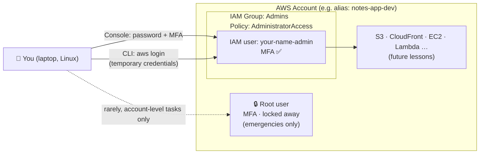

# Stage 2 · Lesson 2 — Stop Using Root: Admin IAM User, MFA, and the AWS CLI

⏱️ Time: ~45–60 minutes
🎯 Goal: Create a safe everyday identity for yourself in AWS, protect it with MFA, and use the AWS CLI **without** creating long-lived access keys.

---

## 0. Where we are

**Stage 2 plan (AWS safety setup):**

| Lesson | Topic |
|---|---|
| 2.1 | Create the AWS account, secure the root user, enable root MFA |
| **2.2 (this lesson)** | **Admin IAM user + MFA + AWS CLI with short-lived credentials** |
| 2.3 | Billing alarm (CloudWatch) + AWS Budgets |

**Before you start, you should have:**

- An AWS account with **MFA enabled on the root user** (Lesson 2.1)
- No access keys on the root user (check: root → Security credentials → Access keys should be empty)
- A password manager (Bitwarden, 1Password, KeePassXC…) and an authenticator app (Google Authenticator, Authy, 2FAS, or a password manager with TOTP)

> ⚠️ If you skipped Lesson 2.1, do that first. Securing root is step one; everything here builds on it.

### 💰 Cost & safety box

| Item | Free tier? | Cost if left running | Cleanup |
|---|---|---|---|
| IAM users, groups, policies | IAM itself has no charge | $0 | Delete test users/groups you don't need (see checklist) |
| MFA (virtual authenticator app) | Free | $0 | — |
| AWS CLI + `aws login` | Free tool | $0 | `aws logout` when done |

Nothing in this lesson costs money. The **risk** here isn't cost — it's security. A leaked admin credential can let an attacker spin up thousands of dollars of resources (crypto-mining on EC2 is the classic attack). That's why we do this carefully.

> 🔔 Prices and free-tier rules change. Always verify on the official AWS pricing pages.

---

## 1. What problem does this solve?

Right now, the only way into your AWS account is the **root user** — the email + password you signed up with. Root can do **everything**, including closing the account and changing payment details. It **cannot be restricted** by permissions.

If you use root every day:

- Every login is a chance for it to be phished or leaked.
- One mistake has unlimited "blast radius" (how much damage one failure can cause).
- There's no way to give *less* power for daily work.

**Solution:** Lock root away. Create a separate **IAM user** for yourself, give it admin permissions through a **group**, protect it with **MFA**, and use *that* for everything — Console and CLI.

---

## 2. Real-world analogy 🏢

Think of your AWS account as an **office building you own**.

- **Root user** = the **master key + the property deed**. It opens every door and lets you sell the building. You keep it in a safe and almost never take it out.
- **IAM user** = a **staff keycard**. It has a name on it, it can be limited to certain doors, and it can be cancelled at any time without affecting the building.
- **IAM group** = a **department** (e.g., "Admins"). Give door access to the department, then add people to it — instead of programming each card one by one.
- **Policy** = the **access rules** programmed into the keycard system ("Admins can open every door except the safe").
- **MFA** = the keycard **plus a PIN pad**. Stealing the card alone isn't enough.
- **Long-lived access key** = a **copy of your keycard that never expires**. If you lose it, anyone who finds it can walk in forever.
- **Temporary credentials** (`aws login`) = a **visitor badge that expires in a few hours**. Even if lost, it soon becomes useless.

🇻🇳 Giải thích: Root user giống như chìa khóa tổng và giấy chủ quyền của tòa nhà — cất trong két, gần như không bao giờ dùng. IAM user là thẻ ra vào của nhân viên — có tên, giới hạn được quyền, có thể hủy bất cứ lúc nào. Hằng ngày bạn chỉ dùng "thẻ nhân viên" (IAM user), không dùng "chìa khóa tổng" (root).

---

## 3. Where this fits in a real web architecture

This lesson doesn't change your app architecture yet (we haven't deployed anything). It sets up **who can access the AWS account that will host your app**:



Later (Stage 7) GitLab CI/CD will also need access — it will get its **own** identity (an IAM role), never your personal credentials.

---

## 4. New terms (read once, refer back later)

| Term | Meaning |
|---|---|
| **IAM** (Identity and Access Management) | The AWS service that controls **who** can do **what** on **which** resources. |
| **Principal** | Anything that can make a request to AWS: a user, a role, a service. |
| **Root user** | The account owner identity (sign-up email). Unlimited power. Cannot be restricted. |
| **IAM user** | A named identity inside your account with its own password and/or keys. |
| **IAM group** | A collection of IAM users. Policies attached to the group apply to all members. |
| **Policy** | A JSON document listing allowed/denied actions. Example action: `s3:CreateBucket`. |
| **AWS managed policy** | A ready-made policy maintained by AWS, e.g. `AdministratorAccess`, `ReadOnlyAccess`. |
| **IAM role** | An identity with permissions but **no password/keys of its own** — you (or a service) "assume" it to get temporary credentials. Deep dive in Stage 15. |
| **MFA** (Multi-Factor Authentication) | A second proof of identity (a 6-digit code from an app, or a passkey/security key). |
| **Account ID** | Your 12-digit AWS account number, e.g. `123456789012`. Not secret, but don't post it publicly. |
| **Account alias** | A friendly name replacing the account ID in your sign-in URL. |
| **ARN** (Amazon Resource Name) | A unique ID for anything in AWS, e.g. `arn:aws:iam::123456789012:user/minh-admin`. |
| **Access key** | A long-lived key pair (Access Key ID + Secret) for programmatic access. **We avoid these.** |
| **Temporary credentials** | Short-lived credentials that expire automatically. Issued by **STS** (Security Token Service). |
| **AWS CLI** | Command Line Interface — control AWS from your terminal with commands like `aws s3 ls`. |
| **Profile** | A named set of CLI settings (region, credentials method) stored in `~/.aws/config`. |
| **Region** | A geographic AWS location, e.g. `ap-southeast-1` (Singapore). Most resources live in one region. |

🇻🇳 Giải thích: **Policy** là "bảng quy tắc" viết bằng JSON, nói rõ được làm gì và không được làm gì. Bạn không gắn policy cho từng người mà gắn cho **group**, rồi thêm người vào group — giống phân quyền theo phòng ban.

---

## 5. Part A — Console: create your admin identity (≈20 min)

> The AWS Console changes its button labels from time to time. If something looks slightly different, look for the closest option with the same meaning.

### Step A1 — (Root) Allow IAM users to see Billing

By default, **even an admin IAM user cannot see billing pages**. Only root can unlock this. We need it for Lesson 2.3 (billing alarm).

1. Sign in as **root** (with MFA).
2. Top-right: click your account name → **Account**.
3. Scroll to **IAM user and role access to Billing information** → **Edit**.
4. Tick **Activate IAM Access** → **Update**.

This is one of the few tasks **only root can do**. Remember that — it's in the quiz.

### Step A2 — (Root) Create the Admins group and your IAM user

> Ideally you'd create the first admin user while signed in as root, then never use root again. That's what we do here.

1. Open the **IAM** console (search "IAM" in the top search bar). IAM is **global** — no region needed.
2. Left menu → **User groups** → **Create group**
   - Group name: `Admins`
   - Attach permissions policies: search and tick **`AdministratorAccess`**
   - **Create group**
3. Left menu → **Users** → **Create user**
   - User name: e.g. `minh-admin` (use your own name)
   - ✅ Tick **Provide user access to the AWS Management Console**
   - If asked *"Are you providing console access to a person?"* → choose **I want to create an IAM user** (Identity Center is explained in "How teams use this"; we'll use it later)
   - Console password: **Custom password** → generate a strong one in your password manager
   - You may untick *"Users must create a new password at next sign-in"* (it's you)
   - **Next**
4. Set permissions → **Add user to group** → tick **Admins** → **Next** → **Create user**
5. On the success page, **copy the Console sign-in URL** into your password manager next to the password.

**Why a group instead of attaching the policy directly to the user?**
If you later add a second admin (or a teammate), you just add them to `Admins`. One place to manage permissions = fewer mistakes.

### Step A3 — Create an account alias (nicer sign-in URL)

1. IAM → **Dashboard** → **AWS Account** panel → **Account Alias** → **Create**
2. Enter something like `minh-notes-app` (must be globally unique, lowercase, no secrets in it)
3. Your IAM sign-in URL becomes:

```
https://minh-notes-app.signin.aws.amazon.com/console
```

Save this URL in your password manager. **Sign out of root now.** 👋

### Step A4 — Sign in as your IAM user and enable MFA

1. Open the alias sign-in URL from A3 (or the one from A2).
2. Sign in with `minh-admin` + password.
   - Top-right should now show `minh-admin @ minh-notes-app` (not your root email).
3. Top-right → your user name → **Security credentials**
4. **Multi-factor authentication (MFA)** → **Assign MFA device**
   - Device name: e.g. `minh-phone`
   - Type: **Authenticator app** (or **Passkey / security key** if you have one)
   - Scan the QR code with your authenticator app
   - Enter **two consecutive codes** (wait for the code to change before entering the second)
   - **Add MFA**
5. Sign out and sign back in — you should now be asked for an MFA code. ✅

🇻🇳 Giải thích: MFA nghĩa là đăng nhập cần **hai thứ**: thứ bạn *biết* (mật khẩu) và thứ bạn *có* (điện thoại tạo mã 6 số). Kẻ gian lấy được mật khẩu vẫn không vào được nếu không có điện thoại của bạn.

### Step A5 — (Optional, 2 min) Set a password policy

IAM → **Account settings** → **Password policy** → **Edit** → choose custom rules (e.g. minimum length 14). This applies to all IAM users you create later.

---

## 6. Part B — Install the AWS CLI v2 on Linux (≈10 min)

### Step B1 — Check what you have

```bash
which aws
aws --version
```

- `which aws` — prints where the `aws` program is installed, or nothing if it isn't installed.
- `aws --version` — prints the version. We need **AWS CLI v2, version 2.32.0 or newer** for `aws login`.

> ⚠️ Don't install with `sudo apt install awscli` — distro packages are often the old v1 or an outdated v2. Use AWS's official installer below.

### Step B2 — Install (or update) with the official installer

First check your CPU architecture:

```bash
uname -m
```

- `x86_64` → use the `x86_64` URL below
- `aarch64` → replace `x86_64` with `aarch64` in the URL

```bash
cd /tmp
curl "https://awscli.amazonaws.com/awscli-exe-linux-x86_64.zip" -o "awscliv2.zip"
unzip -q awscliv2.zip
sudo ./aws/install --update
aws --version
```

Line by line:

| Command | What it does |
|---|---|
| `cd /tmp` | Move to a temporary folder so we don't clutter your home directory. |
| `curl "<url>" -o "awscliv2.zip"` | Download the installer. `-o` = save output to this file name. |
| `unzip -q awscliv2.zip` | Extract the zip into a folder named `aws/`. `-q` = quiet (less output). If `unzip` is missing: `sudo apt install unzip` (Debian/Ubuntu). |
| `sudo ./aws/install --update` | Run the installer as administrator. `--update` lets it overwrite an existing install, so the same command works for new installs and upgrades. |
| `aws --version` | Confirm. Expect something like `aws-cli/2.3x.x Python/3.x Linux/...` |

If you still see an old version, a different `aws` may come first in your `PATH`. Run `which -a aws` to see all of them.

---

## 7. Part C — Log the CLI in **without access keys** (≈10 min)

### Why not `aws configure` with access keys?

Many older tutorials say: "Create an access key, run `aws configure`, paste the key." That stores a **permanent** secret in `~/.aws/credentials`. If your laptop is stolen, a malicious npm package reads that file, or you accidentally commit it to GitLab, an attacker has admin access **until you notice and delete the key**.

Modern AWS CLI has a better option: **`aws login`**. It uses your normal Console sign-in (password + MFA) in the browser and gives the CLI **temporary credentials** that refresh automatically while your session is valid.

| Method | Credential type | Good for |
|---|---|---|
| `aws configure` + access key | Long-lived 🔴 | Legacy setups. Avoid for humans. |
| `aws login` | Short-lived ✅ | Root/IAM-user accounts like yours (this lesson) |
| `aws sso login` | Short-lived ✅ | Companies using IAM Identity Center (most teams) |
| IAM role (OIDC from GitLab) | Short-lived ✅ | CI/CD pipelines (Stage 7) |

🇻🇳 Giải thích: Access key giống chìa khóa sao chép không bao giờ hết hạn — mất là nguy hiểm lâu dài. `aws login` cho bạn "thẻ tạm" tự hết hạn, đăng nhập qua trình duyệt có MFA, nên an toàn hơn nhiều. Quy tắc: **người dùng không tạo access key**.

### Step C1 — Choose a default region

We'll use **Singapore, `ap-southeast-1`** — the closest major AWS region to Vietnam (low latency). Some later lessons (billing metrics, CloudFront certificates) require `us-east-1`; we'll specify that explicitly when needed.

```bash
aws configure set region ap-southeast-1 --profile admin
aws configure set output json --profile admin
```

- `aws configure set <key> <value>` — writes one setting into `~/.aws/config` **without** asking for any keys.
- `--profile admin` — saves it under a profile named `admin` (you can have many profiles, e.g. `admin`, `work`, `readonly`).
- `output json` — CLI responses will be printed as JSON.

### Step C2 — Log in

1. Make sure you're signed in to the Console **as `minh-admin`** in your browser (not root).
2. Run:

```bash
aws login --profile admin
```

3. Your browser opens. Choose your **`minh-admin`** session (or sign in with password + MFA).
4. Back in the terminal you should see a message that the profile was updated.

> 💡 No browser on this machine (e.g. you're SSH'd into a server)? Use `aws login --remote --profile admin` and follow the instructions to finish sign-in on another device.

### Step C3 — Prove who you are

```bash
aws sts get-caller-identity --profile admin
```

`sts get-caller-identity` asks AWS "who am I?" It's the **#1 debugging command** in AWS — run it whenever something says AccessDenied. Expected output (your values will differ):

```json
{
    "UserId": "AIDAEXAMPLEEXAMPLE",
    "Account": "123456789012",
    "Arn": "arn:aws:iam::123456789012:user/minh-admin"
}
```

| Field | Meaning |
|---|---|
| `Account` | Your 12-digit account ID |
| `Arn` | Which identity the CLI is using. It should contain **`minh-admin`**. If it says **`root`**, you picked the root browser session → run `aws logout --profile admin`, sign out of root in the browser, and repeat C2. |

### Step C4 — Stop typing `--profile admin` every time

```bash
export AWS_PROFILE=admin
aws sts get-caller-identity
```

- `export AWS_PROFILE=admin` — sets an environment variable for **this terminal session** only. The CLI uses it as the default profile.
- To make it permanent, add that line to `~/.bashrc` (or `~/.zshrc`), then `source ~/.bashrc`.

### Step C5 — Look around (read-only commands, safe)

```bash
aws iam list-users
aws iam list-groups-for-user --user-name minh-admin
aws iam list-attached-group-policies --group-name Admins
aws iam list-mfa-devices --user-name minh-admin
aws iam list-access-keys --user-name minh-admin
```

| Command | What you should see |
|---|---|
| `list-users` | Your IAM user(s) |
| `list-groups-for-user` | `Admins` |
| `list-attached-group-policies` | `AdministratorAccess` |
| `list-mfa-devices` | One device (your phone) |
| `list-access-keys` | **Empty list `[]`** ← this is what we want |

### Step C6 — Look at what was saved

```bash
cat ~/.aws/config
```

You'll see something like:

```ini
[profile admin]
region = ap-southeast-1
output = json
login_session = arn:aws:iam::123456789012:user/minh-admin
```

Notice: **no secret key in this file.** The temporary credentials are cached separately (under `~/.aws/login/cache`) and refresh automatically.

### Step C7 — Log out when done

```bash
aws logout --profile admin
```

Deletes the cached temporary credentials for that profile. The profile itself stays in `~/.aws/config`, so next time just run `aws login --profile admin` again.

---

## 8. Troubleshooting guide

| Symptom | Likely cause | How to check / fix |
|---|---|---|
| `aws: error: argument command: Invalid choice ... 'login'` | CLI too old (< 2.32.0) or it's v1 | `aws --version`, `which -a aws`; reinstall with Part B |
| `Unable to locate credentials` | Not logged in, or wrong profile | `echo $AWS_PROFILE`; run `aws login --profile admin` |
| `ExpiredToken` / session expired | Console session ended | `aws login --profile admin` again |
| `AccessDenied` on Billing pages (Console) | Step A1 not done | Sign in as root → Account → Activate IAM Access |
| Can't sign in as IAM user at the root sign-in page | Root and IAM users use different sign-in flows | Use your alias URL `https://<alias>.signin.aws.amazon.com/console` |
| Arn shows `root` | Logged in CLI with the root browser session | `aws logout`, sign out of root, redo C2 |

**How to troubleshoot on your own:** for any AWS error, ask three questions in order:
1. **Who am I?** → `aws sts get-caller-identity`
2. **Where am I?** → which region (`aws configure get region`), which account
3. **What exactly was denied?** → read the full error; it names the action (e.g. `s3:CreateBucket`) and the resource.

---

## 9. AWS vs Cloudflare — the same idea on the other side

Cloudflare (Stage 5) has the same security concepts with different names:

| Concept | AWS | Cloudflare |
|---|---|---|
| Account owner | Root user | The account's Super Administrator |
| People with limited access | IAM users / Identity Center users | **Members** with roles (e.g. Administrator, DNS, Analytics) |
| MFA | IAM MFA | Two-factor authentication (2FA) on your Cloudflare login |
| Program/CI access | IAM roles, temporary credentials | **API Tokens** scoped to specific zones and permissions |
| Dangerous all-powerful key | Root access keys | **Global API Key** — avoid, use scoped API Tokens instead |

**When to choose which?** This isn't an either/or choice — if you use both platforms, you secure **both**. The rule is identical: owner account locked down with MFA, daily work with a limited identity, automation with scoped short-lived credentials.

---

## 10. How teams use this 🏢

**In real companies:**

- Engineers usually **do not have IAM users at all**. They log in through **SSO** (Single Sign-On) — the company's Google Workspace, Microsoft Entra ID, or Okta — connected to **AWS IAM Identity Center**. On the CLI they run `aws sso login`.
- Companies use **multiple AWS accounts** (e.g. `dev`, `staging`, `prod`, `security`) managed by **AWS Organizations**. You might have admin in `dev` but read-only in `prod`.
- Root credentials are a **break-glass** account: stored in a vault, MFA on a hardware key held by 1–2 people, every root login triggers an alert.
- Static access keys for humans are often **forbidden by policy**, and security tools scan GitLab repos for leaked keys.
- CI/CD (GitLab) gets an **IAM role** via OIDC — no stored secrets (Stage 7).

**Why we use an IAM user (not Identity Center) right now:** you have one personal account, and an IAM user is the simplest way to learn the building blocks (users, groups, policies, MFA). We'll set up Identity Center in Stage 15, when you'll appreciate what it automates.

**Jargon you'll hear:**

| Term | Meaning |
|---|---|
| **Least privilege** | Give only the permissions needed, nothing more. |
| **Blast radius** | How much damage one mistake or leaked credential can do. |
| **Break-glass account** | Emergency-only access (like root), used when normal access fails. |
| **SSO / federation** | Logging in to AWS with your company identity instead of AWS passwords. |
| **Permission set** | Identity Center's reusable bundle of permissions assigned to people per account. |
| **Assume a role** | Temporarily switch into an IAM role to get its permissions. |
| **Long-lived vs short-lived creds** | Permanent keys vs auto-expiring credentials. Teams want short-lived. |
| **Key rotation** | Regularly replacing credentials so old leaked ones stop working. |

**Questions you could ask your DevOps team:**

1. "How do engineers get AWS access here — Identity Center with SSO? Which permission set would I get?"
2. "Do we have separate AWS accounts for dev, staging, and prod? What access do developers have in prod?"
3. "Are IAM users or long-lived access keys allowed at all? How do you detect leaked keys?"
4. "How does our GitLab CI authenticate to AWS — OIDC roles or CI variables?"

---

## 11. Summary

- **Root** = master key. Secure it with MFA, enable IAM access to billing, then lock it away.
- Create an **`Admins` group** with `AdministratorAccess`, and an **IAM user** in that group for daily work.
- Protect the IAM user with **MFA** and sign in through your **account alias URL**.
- Install **AWS CLI v2 (≥ 2.32.0)** with the official installer.
- Use **`aws login`** for **temporary** credentials — **no access keys** for humans.
- **`aws sts get-caller-identity`** answers "who am I?" — your first debugging step.

---

## 12. Hands-on exercises

### Exercise 1 — Security self-audit (10 min)

Using **only CLI commands** (logged in as `admin`), prove each of these. Write the command and output summary in your notes:

1. You're using `minh-admin`, not root.
2. `minh-admin` is in the `Admins` group.
3. `minh-admin` has an MFA device.
4. `minh-admin` has **zero** access keys.

Bonus: in the Console (as `minh-admin`), open **IAM → Dashboard** and check the **Security recommendations** panel. Everything should be green.

### Exercise 2 — Feel least privilege in action (15 min, free)

1. As `minh-admin` in the Console: create a group `ReadOnlyTest` with the AWS managed policy **`ReadOnlyAccess`**.
2. Create an IAM user `test-readonly` with console access, in that group.
3. Open a **private/incognito window**, sign in as `test-readonly` via your alias URL.
4. Go to **S3** → try **Create bucket** (any name, region `ap-southeast-1`). You should get an **Access Denied** error. Read the error message — which **action** was denied?
5. Now try to *view* the IAM users list. Does it work? Why?
6. **Clean up** (see checklist): delete `test-readonly`, then delete `ReadOnlyTest`.

> ⚠️ Deleting an IAM user is permanent and immediately removes their access. Double-check the name before confirming — **never delete `minh-admin`**, or you'll have to use root to recover.

---

## 13. Quiz (reply in chat with your answers)

**Q1.** Why should you avoid using the root user for daily work? Name **two** tasks that only the root user can do.

**Q2.** Your IAM user `minh-admin` has `AdministratorAccess`, but when you open the Billing dashboard you get "Access denied". What's the most likely cause, and how do you fix it?

**Q3.** A teammate says: "Just create an access key for your admin user and put it in the `.env` file of our NestJS repo on GitLab so the pipeline can deploy." List **two** problems with this, and say what you'd use instead **(a)** on your laptop and **(b)** in GitLab CI.

<details>
<summary>👉 Answers (open only after you reply)</summary>

**A1.** Root has unlimited power and **cannot be restricted** by any policy, so a leak or mistake has maximum blast radius. Root-only tasks include: changing account settings (account name, root email/password), **activating IAM access to Billing**, changing the AWS Support plan, closing the account, and restoring access if all IAM admins are locked out. *(Any two are fine.)*

**A2.** IAM access to Billing hasn't been activated. By default, even admin IAM users can't see billing. Fix: sign in as **root** → **Account** → **IAM user and role access to Billing information** → **Activate IAM Access**.

**A3.** Problems: (1) the key is **long-lived** — anyone who can read the repo (or any fork/clone/backup, now or in the future) has admin access until the key is deleted; (2) it's your **personal admin** identity — far too much power for a deploy job, and actions can't be told apart from yours; (3) secrets stay in **Git history** even after you delete the file. Instead: **(a)** laptop → `aws login` (temporary credentials via Console + MFA); **(b)** GitLab CI → a dedicated **IAM role** assumed via **OIDC** with only deploy permissions (or, at minimum, masked/protected GitLab CI/CD variables — covered in Stage 7).

</details>

---

## 🧹 Cleanup checklist

- [ ] Exercise 2 user `test-readonly` **deleted**
- [ ] Exercise 2 group `ReadOnlyTest` **deleted**
- [ ] `aws iam list-users` shows only `minh-admin`
- [ ] `aws iam list-access-keys --user-name minh-admin` returns `[]`
- [ ] Root user has **no access keys** (check once as root, then sign out)
- [ ] Signed out of root in every browser
- [ ] `aws logout --profile admin` when you finish the session
- [ ] No passwords, account IDs, or sign-in URLs pasted into notes that you might commit to GitLab

---

## 📝 Update your progress.md

> Note: your progress.md still shows **Stage 1 / Lesson 1** with no lessons completed. If you've finished Stage 1 and Lesson 2.1, update those first.

```markdown
Last updated: <today's date>
Current stage: 2 – AWS safety setup
Current lesson: Lesson 2.3 – Billing alarm + AWS Budgets
```

Add to **Completed lessons**:

```markdown
| <date> | 2.2 Admin IAM user, MFA, AWS CLI (aws login) | _/3 | Region: ap-southeast-1, CLI profile: admin |
```

**AWS resources currently running** — IAM users/groups cost $0, but track them anyway:

```markdown
| IAM user + group | minh-admin / Admins | Global | <date> | $0 | Keep |
```

Change `Billing alarm set: [ ] yes` → leave unchecked (next lesson).

Add to **Personal notes**:

```markdown
- Account alias: <alias> (sign-in URL saved in password manager)
- IAM billing access activated: yes
- CLI: AWS CLI v2 ≥ 2.32, login via `aws login --profile admin`, no access keys
```

Add to **Questions to ask my DevOps team**: pick 1–2 from section 10.

Add to **Weak topics** anything from the quiz you weren't sure about.

---

➡️ **Next: Stage 2 · Lesson 3 — Billing alarm (CloudWatch) + AWS Budgets.** Do this before creating *any* paid resource.
