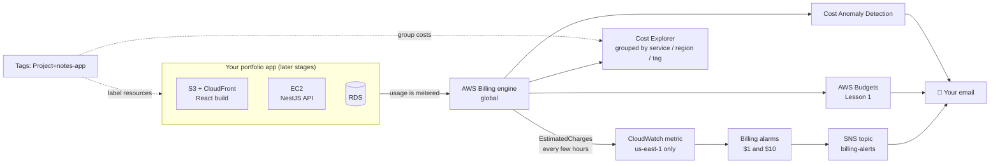

# Stage 2 · Lesson 3 — CloudWatch Billing Alarm & Cost Tracking

⏱️ Time: ~50–60 minutes
🎯 Goal: Finish your AWS safety net. You'll add a **CloudWatch billing alarm** (with SNS email), learn to read your spending in **Cost Explorer**, set up a **tagging convention** for the portfolio project, and build a repeatable **"cost check" routine** so nothing is ever forgotten.
💰 Cost of this lesson: **$0** (a few Cost Explorer API calls cost ~$0.01 each, paid by your credits)
📋 Prerequisites:
- Stage 2 · Lesson 1 done: root has MFA, two budgets exist (`zero-spend-alert`, `monthly-20-usd`), **IAM access to Billing activated**
- Stage 2 · Lesson 2 done: you sign in with your **daily admin identity** (not root) and the **AWS CLI** works with your profile

> ⚠️ Do this whole lesson as your **admin identity**, never as root. If `aws sts get-caller-identity` shows `:root` in the ARN, stop and finish Lesson 2 first.

---

## 1. What problem does this solve?

In Lesson 1 you created **AWS Budgets**. They're great, but a good safety system has more than one layer, and you still can't answer these questions:

- "If real money ever leaves my card, will I know quickly, through a **second, independent** alert system?"
- "My bill says $3.40. **Which service, which region, which day** caused it?"
- "Which costs belong to my **notes-app** project and which are leftovers from an old lab?"
- "Is anything running **right now** in a region I forgot about?"

This lesson answers each one:

| Question | Tool |
|---|---|
| "Tell me if real charges cross $X" (independent of Budgets) | **CloudWatch billing alarm** + **SNS** email |
| "Am I close to a Free Tier limit?" | **Free Tier usage alerts** + Free Tier page |
| "What exactly did I spend on?" | **Cost Explorer** |
| "Which project caused this cost?" | **Cost allocation tags** |
| "Is my spending suddenly weird?" | **Cost Anomaly Detection** |
| "What's running in *any* region?" | **Tag Editor** (all-regions search) |

### 🏠 Real-world analogy: home safety

| Home | AWS |
|---|---|
| Monthly electricity budget you set yourself | **AWS Budgets** (Lesson 1) |
| A smoke alarm wired to the building's own sensors, separate from your budget app | **CloudWatch billing alarm** |
| The itemized electricity bill: kitchen, AC, water heater, by day | **Cost Explorer** |
| Labels on each power socket: "Office", "Guest room", "Aquarium" | **Cost allocation tags** |
| The power company texting "Your usage today is 3× normal" | **Cost Anomaly Detection** |
| Walking through every room before leaving for vacation | **Tag Editor all-regions search** |

### 🗺️ Where it fits in a real web architecture

Cost monitoring sits **beside** your application, at the account level. It watches everything you'll build in later stages.



---

## 2. New terms

| Term | Meaning |
|---|---|
| **CloudWatch** | AWS's monitoring service. Collects **metrics** (numbers over time) and **logs**, and triggers **alarms**. Deep dive in Stage 14. |
| **Metric** | A number measured over time, e.g. CPU %, request count, or estimated charges in USD. |
| **Namespace** | A folder for metrics. Billing metrics live in `AWS/Billing`. |
| **Dimension** | A label that narrows a metric, e.g. `Currency=USD` or `ServiceName=AmazonEC2`. |
| **`EstimatedCharges`** | The billing metric: your **month-to-date** estimated bill in USD. Grows during the month, **resets** at the start of each month. |
| **Alarm** | A rule: "if metric X is ≥ Y for Z periods, change state and do something". |
| **Alarm states** | `OK` (fine), `ALARM` (threshold crossed), `INSUFFICIENT_DATA` (not enough data yet, which is normal at first). |
| **Period** | The time window the alarm looks at each time it checks, e.g. 6 hours. |
| **SNS** (Simple Notification Service) | A messaging service. Something **publishes** a message to a **topic**; every **subscriber** (email, SMS, Lambda, HTTP endpoint) receives a copy. |
| **Topic / Subscription** | A topic is a named "channel". A subscription connects one receiver (e.g. your email) to it. Email subscriptions must be **confirmed** by clicking a link. |
| **ARN** (Amazon Resource Name) | A unique ID for any AWS resource, e.g. `arn:aws:sns:us-east-1:123456789012:billing-alerts`. |
| **Cost Explorer** | A free console tool to chart and filter your costs by service, region, day, tag, and more. |
| **Unblended cost** | The actual rate you were charged for each usage line. Use this by default. |
| **Tag** | A `Key=Value` label on a resource, e.g. `Project=notes-app`. |
| **Cost allocation tag** | A tag you have **activated** in Billing so it appears in Cost Explorer. Tags are *not* used for cost reports until activated. |
| **Cost Anomaly Detection** | A free machine-learning feature that learns your normal spending and alerts on unusual spikes. |
| **Gross vs net cost** | Gross = usage cost before credits. Net = what's left after credits are subtracted. |

🇻🇳 **Giải thích:** *SNS* giống như một "nhóm chat thông báo": CloudWatch alarm gửi tin nhắn vào *topic*, và mọi người đã đăng ký (*subscriber*), ví dụ email của bạn, đều nhận được. Email đăng ký phải bấm link xác nhận thì mới nhận được tin. *Metric* là một con số thay đổi theo thời gian, còn *alarm* là luật "nếu con số vượt ngưỡng thì báo động".

---

## 3. ⚠️ The most important concept: credits make the billing alarm look "dead"

The CloudWatch metric `EstimatedCharges` shows your bill **after credits are subtracted** (net cost). AWS's own support forum confirms that this metric always includes credits, and **unlike Budgets, you can't change that**.

You're on the **Free plan** with up to $200 in credits. So:

| Situation | `EstimatedCharges` | Budgets (credits excluded, Lesson 1) |
|---|---|---|
| Free plan, labs used $8 of credits | **$0.00** → alarm stays `OK` | **$8** → 50% alert at $10 soon |
| Paid plan, credits used up, $12 real charges | **$12** → alarm fires 🔔 | **$12** → alert fires 🔔 |

So what's the point of the billing alarm?

1. **It watches "real money leaving your card."** Today that's $0, and that's correct. On the day you upgrade to the Paid plan (around month 5), this alarm becomes a second, independent alarm system next to Budgets. Setting it up now means you won't forget later.
2. **Defense in depth.** Two independent systems are safer than one. If you accidentally edit or delete a budget, the alarm still works.
3. **Teams use it everywhere.** "Do we have a billing alarm?" is a standard question in every AWS security checklist (and it's in your roadmap for a reason).

🇻🇳 **Giải thích:** Con số `EstimatedCharges` mà CloudWatch theo dõi là **số tiền sau khi đã trừ credits**. Vì bạn đang dùng credits, con số này sẽ gần như luôn là $0. Điều này **không có nghĩa là alarm bị hỏng**. Alarm này dùng để báo khi **tiền thật** bị trừ vào thẻ, tức là sau khi bạn nâng cấp lên Paid plan hoặc hết credits. Còn để theo dõi việc tiêu credits hôm nay, bạn dùng **Budgets** (đã bỏ chọn Credits ở Lesson 1).

> ✅ **Rule of thumb:**
> **Budgets (credits excluded)** = "How much am I *using*?"
> **CloudWatch billing alarm** = "How much am I *really paying*?"

### Two more facts that surprise beginners

- **Billing metrics only exist in `us-east-1` (N. Virginia).** They cover your whole account worldwide, but you must switch the console to `us-east-1` to see them and to create the alarm there. Your app will live in Singapore; your billing alarm lives in Virginia. That's normal.
- **Billing data is slow.** AWS publishes `EstimatedCharges` several times a day (roughly every 6 hours). Budgets and Cost Explorer update about once a day. **None of these tools catch a mistake within minutes.** The only real-time protection is your own cleanup discipline.

🇻🇳 **Giải thích:** Dữ liệu billing chỉ nằm ở region `us-east-1`, dù tài nguyên của bạn ở Singapore. Ngoài ra, dữ liệu này được cập nhật **chậm** (vài giờ đến một ngày), nên alarm không thể cứu bạn ngay lập tức. Thói quen dọn dẹp sau mỗi bài lab vẫn là cách bảo vệ tốt nhất.

---

## 4. Your 4-layer cost safety net

After this lesson, you'll have all four layers:

| Layer | Tool | Watches | Speed | Status |
|---|---|---|---|---|
| 1 | **Your habits**: cleanup checklist + progress.md | What you created | Instant | ✅ Since Lesson 1 |
| 2 | **AWS Budgets** (credits excluded) | Usage, including what credits pay for | ~Daily | ✅ Lesson 1 |
| 3 | **CloudWatch billing alarm** | Real charges after credits | Every few hours | 🆕 Today |
| 4 | **Cost Anomaly Detection** + Free Tier alerts | Unusual spikes, free-tier limits | ~Daily | 🆕 Today |

---

## 5. 💰 Cost & safety check (read before the lab)

| Item | Free? | Cost if left running | Cleanup |
|---|---|---|---|
| Enable CloudWatch billing alerts | ✅ Free | $0 | Can't be turned off afterward (harmless, nothing to pay) |
| Free Tier usage alerts | ✅ Free | $0 | Keep |
| SNS topic + email subscription | ✅ Free tier: 1,000 email notifications/month | $0 for alert volume | **Keep** |
| 2 CloudWatch alarms | ✅ Free tier covers 10 standard alarms | $0 (about $0.10/alarm/month above the free 10) | **Keep** |
| Cost Explorer (console) | ✅ Free | $0 | Nothing to delete |
| Cost Explorer **API** (`aws ce ...`) | ❌ ~$0.01 per request | Only when you run the command | Nothing to delete; don't put it in a loop |
| Cost allocation tags | ✅ Free | $0 | Keep |
| Cost Anomaly Detection | ✅ Free | $0 | Keep |
| Tag Editor search | ✅ Free | $0 | Nothing to delete |

⚠️ **Prices and free-tier rules change.** Verify at https://aws.amazon.com/cloudwatch/pricing/, https://aws.amazon.com/sns/pricing/, and https://aws.amazon.com/aws-cost-management/aws-cost-explorer/pricing/. AWS pages override anything in this lesson.

🧯 Nothing in this lab can delete data or break anything. The only "destructive" commands are in the optional cleanup section and are clearly marked.

---

## 6. Hands-on lab

### Part A — Turn on billing data and Free Tier alerts (5 min)

1. Sign in as your **admin identity**.
2. Search **Billing and Cost Management** → left menu **Billing preferences**.
3. Find **Alert preferences** → **Edit**.
4. Check:
   - ✅ **Receive AWS Free Tier alerts** → emails you when a service passes **85%** of its free-tier limit. Add your email if asked.
   - ✅ **Receive CloudWatch billing alerts** → starts sending `EstimatedCharges` to CloudWatch.
5. **Save preferences**.

⏳ Wait about **15 minutes** before the billing metric appears in CloudWatch. Do Part D (Cost Explorer) in the meantime if you like.

> ℹ️ Once enabled, billing data collection can't be switched off. That's fine: it costs nothing, and you can still delete any alarms.

### Part B — Console: create your first billing alarm + SNS topic (10 min)

1. **Switch region** (top-right) to **US East (N. Virginia) `us-east-1`**. ⚠️ This is the step everyone forgets.
2. Open **CloudWatch** → left menu **Alarms** → **All alarms** → **Create alarm**.
3. **Select metric** → **Billing** → **Total Estimated Charge** → check **EstimatedCharges (USD)** → **Select metric**.
   - Don't see **Billing**? Either you're not in `us-east-1`, or the 15 minutes from Part A haven't passed.
4. **Metric settings:**
   - Statistic: **Maximum** (the metric is a running total, so the max in the window is the latest value)
   - Period: **6 hours**
5. **Conditions:**
   - Threshold type: **Static**
   - Whenever EstimatedCharges is: **Greater/Equal** than **1** (USD)
   - Meaning: *"Any real money at all is being charged this month."*
6. **Next → Notification:**
   - Alarm state trigger: **In alarm**
   - **Create new topic** → topic name: `billing-alerts` → email: your email
   - **Create topic**
7. **Next → Name:** `billing-real-money-1usd`
   Description: `Real charges (after credits) reached 1 USD this month. Check Cost Explorer.`
8. **Next → Create alarm**.
9. **📧 Check your email** → open "AWS Notification - Subscription Confirmation" → **Confirm subscription**. Without this click, alerts are silently dropped.

What you should see: the alarm in state **`INSUFFICIENT_DATA`** at first, later **`OK`**. Both are normal.

🇻🇳 **Giải thích:** Trạng thái `INSUFFICIENT_DATA` nghĩa là "chưa có đủ dữ liệu để đánh giá", không phải lỗi. Billing metric chỉ được cập nhật vài lần mỗi ngày nên alarm mới tạo thường ở trạng thái này một lúc, sau đó chuyển sang `OK`.

### Part C — CLI: inspect, add a second alarm, run a fire drill (15 min)

Open your Linux terminal.

**C1. Check who you are**

```bash
export AWS_PROFILE=<your-profile-from-lesson-2>
aws sts get-caller-identity
```

- `export AWS_PROFILE=...`: tells every following `aws` command in this terminal which credentials profile to use, so you don't type `--profile` each time
- `aws sts get-caller-identity`: asks AWS "who am I?". The `Arn` must show your admin identity, **not** `:root`.

**C2. Find your topic and confirm the subscription**

```bash
TOPIC_ARN=$(aws sns list-topics \
  --region us-east-1 \
  --query "Topics[?ends_with(TopicArn, ':billing-alerts')].TopicArn" \
  --output text)

echo "$TOPIC_ARN"

aws sns list-subscriptions-by-topic \
  --topic-arn "$TOPIC_ARN" \
  --region us-east-1 \
  --output table
```

- `TOPIC_ARN=$( ... )`: runs the command inside `$( )` and saves its output in a shell variable (Stage 1, Lesson 2)
- `--region us-east-1`: SNS topics are regional; yours is in `us-east-1` because the alarm is there
- `--query "Topics[?ends_with(...)]..."`: a **JMESPath** filter (a small query language built into the CLI) that keeps only the topic whose ARN ends with `:billing-alerts`
- `--output text`: prints the raw value without JSON quotes, so it's clean inside a variable
- `list-subscriptions-by-topic`: shows who receives messages. If `SubscriptionArn` says **`PendingConfirmation`**, go click the email link.

**C3. Create a second alarm at $10 with the CLI**

```bash
aws cloudwatch put-metric-alarm \
  --region us-east-1 \
  --alarm-name billing-real-money-10usd \
  --alarm-description "Real charges (after credits) reached 10 USD this month. Act now." \
  --namespace AWS/Billing \
  --metric-name EstimatedCharges \
  --dimensions Name=Currency,Value=USD \
  --statistic Maximum \
  --period 21600 \
  --evaluation-periods 1 \
  --threshold 10 \
  --comparison-operator GreaterThanOrEqualToThreshold \
  --treat-missing-data notBreaching \
  --alarm-actions "$TOPIC_ARN" \
  --tags Key=Project,Value=account-safety Key=ManagedBy,Value=cli
```

Line by line:

| Option | Meaning |
|---|---|
| `put-metric-alarm` | Create (or overwrite, if the name exists) an alarm |
| `--alarm-name` | Unique name. Make it descriptive: future-you reads it in an email |
| `--namespace AWS/Billing` + `--metric-name EstimatedCharges` | Which metric to watch |
| `--dimensions Name=Currency,Value=USD` | The total bill in USD (not a per-service breakdown) |
| `--statistic Maximum` | Use the highest value in each window (running total) |
| `--period 21600` | Window size in seconds: 21,600 s = 6 hours |
| `--evaluation-periods 1` | Fire after just 1 bad window, with no waiting |
| `--threshold 10` + `--comparison-operator GreaterThanOrEqualToThreshold` | Fire when the value is ≥ $10 |
| `--treat-missing-data notBreaching` | If a data point is missing, treat it as "fine" instead of flipping states |
| `--alarm-actions "$TOPIC_ARN"` | When it goes into `ALARM`, publish to your SNS topic → email |
| `--tags ...` | Labels on the alarm (you'll use these in Part E) |

No output means success. Verify:

```bash
aws cloudwatch describe-alarms \
  --region us-east-1 \
  --alarm-name-prefix billing- \
  --query "MetricAlarms[].{Name:AlarmName,State:StateValue,Threshold:Threshold}" \
  --output table
```

- `--alarm-name-prefix billing-`: only alarms whose names start with `billing-`
- `--query "MetricAlarms[].{...}"`: pick just three fields for a tidy table

**C4. 🔥 Fire drill: prove the email actually arrives**

An alarm you've never tested is an alarm you can't trust. Force it into `ALARM` for a moment:

```bash
aws cloudwatch set-alarm-state \
  --region us-east-1 \
  --alarm-name billing-real-money-10usd \
  --state-value ALARM \
  --state-reason "Fire drill: testing email delivery"
```

- `set-alarm-state`: temporarily overrides the state. It **doesn't** change your real bill or the metric. At the next evaluation (up to 6 hours later with this period), the alarm goes back to its real state.

✅ Within a minute or two you should get an email titled like `ALARM: "billing-real-money-10usd" in US East (N. Virginia)`. No email? Check spam, then re-check C2 (`PendingConfirmation`?).

🇻🇳 **Giải thích:** Đây là "diễn tập báo cháy". Lệnh `set-alarm-state` chỉ giả lập trạng thái ALARM để kiểm tra đường đi của thông báo (CloudWatch → SNS → email). Nó không thay đổi hóa đơn của bạn. Trong các công ty, việc test alarm định kỳ là bắt buộc, vì một alarm chưa từng được test thì không đáng tin.

### Part D — Cost Explorer: read your bill like a DevOps engineer (10 min)

**D1. Console tour**

1. **Billing and Cost Management** → **Cost Explorer** (first time? It may take up to 24 hours to show data for a new account).
2. Set these options on the right panel and watch the chart change:

| Setting | Try this | What you learn |
|---|---|---|
| **Date range** | Month to date | This month's spending |
| **Granularity** | **Daily** | *Which day* something started costing money |
| **Group by** | **Service** | Which service is the cost |
| **Group by** | **Region** | Catches forgotten regions |
| **Group by** | **Usage type** | The exact meter, e.g. `APS1-NatGateway-Hours` or `APS1-PublicIPv4:InUseAddress` |
| **Filters → Charge type** | **Exclude Credit and Refund** | Real usage, the same view as your budgets |

3. Click **Save to report library** → name it `real-usage-by-service-daily`. Next time it's one click.

💡 **Usage type** is the detective's tool. Many bill items have cryptic names: the prefix is the region (`APS1` = Singapore, `USE1` = N. Virginia), and the rest is the meter. When your DevOps team says "our NAT data processing is up", this is where they saw it.

**D2. One CLI query** (costs ~$0.01, paid by credits)

```bash
aws ce get-cost-and-usage \
  --region us-east-1 \
  --time-period Start=$(date +%Y-%m-01),End=$(date -d tomorrow +%Y-%m-%d) \
  --granularity MONTHLY \
  --metrics UnblendedCost \
  --group-by Type=DIMENSION,Key=SERVICE \
  --filter '{"Not":{"Dimensions":{"Key":"RECORD_TYPE","Values":["Credit","Refund"]}}}' \
  --query "ResultsByTime[].Groups[].[Keys[0],Metrics.UnblendedCost.Amount]" \
  --output table
```

- `aws ce`: Cost Explorer API (always called with `us-east-1`)
- `--time-period Start=...,End=...`: `$(date +%Y-%m-01)` = first day of this month; `$(date -d tomorrow ...)` = tomorrow, because **End is exclusive** (not included)
- `--granularity MONTHLY`: one total per month (use `DAILY` for day by day)
- `--metrics UnblendedCost`: the normal "what was I charged" number
- `--group-by ... Key=SERVICE`: split the total by service
- `--filter '{"Not": ... "Credit","Refund"}'`: remove credit and refund lines, so you see **real usage**
- `--query ...`: print just service name + amount

An empty table means $0 of usage this month. 🎉

⚠️ Don't put `aws ce` in a script that runs every minute. At $0.01 per call, 1,440 calls/day ≈ $14/day.

### Part E — Tagging convention + cost allocation tags (10 min)

From Stage 3 onward, **every resource you create gets these tags**:

| Key | Example value | Why |
|---|---|---|
| `Project` | `notes-app` | Cost per project in Cost Explorer |
| `Environment` | `dev` / `prod` | Separate lab/test costs from "real" ones |
| `Owner` | `<your-name>` | In a team: who to ask before deleting |
| `ManagedBy` | `console` / `cli` / `terraform` / `gitlab-ci` | Know *how* to safely change or delete it |
| `DeleteAfter` | `2026-10-15` | Your cleanup date. Matches the "Delete by" column in progress.md |

Rules teams follow: **same spelling and capitalization everywhere** (`Project` ≠ `project`), no secrets in tags (tags are visible to anyone with read access), and keep values lowercase with dashes.

**E1. Tag the SNS topic and the console-made alarm** (so the tag keys exist in your account)

```bash
aws sns tag-resource \
  --region us-east-1 \
  --resource-arn "$TOPIC_ARN" \
  --tags Key=Project,Value=account-safety Key=ManagedBy,Value=console

ALARM1_ARN=$(aws cloudwatch describe-alarms \
  --region us-east-1 \
  --alarm-names billing-real-money-1usd \
  --query "MetricAlarms[0].AlarmArn" --output text)

aws cloudwatch tag-resource \
  --region us-east-1 \
  --resource-arn "$ALARM1_ARN" \
  --tags Key=Project,Value=account-safety Key=ManagedBy,Value=console
```

- `tag-resource`: adds tags to an existing resource, identified by its ARN. Many AWS services have a `tag-resource` command, but the option names differ between services. If a command errors, run `aws <service> tag-resource help` to see the right options.
- `--query "MetricAlarms[0].AlarmArn"`: takes the first (only) alarm in the result and prints its ARN

**E2. Activate the tag for cost reports**

1. **Billing and Cost Management** → **Cost allocation tags**.
2. Tab **User-defined cost allocation tags** → find `Project` (and later `Environment`).
   - Not there yet? New tag keys can take **up to 24 hours** to appear. Come back tomorrow; add it to your progress.md TODO.
3. Select → **Activate**.
4. Also check the **AWS-generated cost allocation tags** tab: activate **`aws:createdBy`** if offered. It records *which identity* created a resource. Very useful for "who launched this?!"

Once active, Cost Explorer can **Group by → Tag → Project**.

> ℹ️ Activation affects cost data **from that point on**. If you forget, AWS can **backfill** activation for up to 12 months (Cost allocation tags → **Backfill tags**), but only if the resources actually had the tag at the time. Moral: **tag at creation**, activate early.

🇻🇳 **Giải thích:** *Tag* là nhãn dán lên tài nguyên, ví dụ `Project=notes-app`. Nhưng AWS **không tự động** dùng tag để chia hóa đơn. Bạn phải vào trang *Cost allocation tags* và bấm *Activate* thì Cost Explorer mới nhóm chi phí theo tag được. Tag key mới có thể mất đến 24 giờ mới xuất hiện trong danh sách.

### Part F — Cost Anomaly Detection (3 min)

1. **Billing and Cost Management** → **Cost Anomaly Detection**.
2. Many new accounts already have a default **AWS services** monitor. If you have none: **Create monitor** → type **AWS services** → name `all-services`.
3. **Alert subscription:** frequency **Daily summaries** (or **Individual alerts**, which deliver via SNS), threshold e.g. **$1** impact, recipient your email.

It needs some history to learn "normal", so it won't do much in your first weeks. Like the billing alarm, it becomes valuable as your project grows.

### Part G — "What's running anywhere?" (5 min)

The console shows **one region at a time**. This is how resources get forgotten.

**G1. Tag Editor: search every region at once**

1. Search **Resource Groups & Tag Editor** → **Tag Editor**.
2. Regions: **All regions**. Resource types: **All supported resource types**.
3. **Search resources**.

You'll see your SNS topic and alarms in `us-east-1`. You'll **also** see default resources in every region: **default VPCs, subnets, security groups, route tables, DHCP options, internet gateways**. AWS creates these automatically. They're **free**.

⚠️ **Don't delete default VPCs** now. Some later labs (EC2 in Stage 6) are easier with them, and deleting them can break console wizards. We'll discuss them properly in Stage 6.

**G2. Your Free plan status from the CLI** (free API)

```bash
aws freetier get-account-plan-state --region us-east-1
```

Returns your plan type (`FREE`/`PAID`), status, **remaining credits**, and **plan expiration date**. Copy these into progress.md.

---

## 7. Your "cost check" routine (do this before every session)

This is what you'll do when you type **"cost check"** to me, and what you'll do yourself in 3 minutes before each lab:

1. 📧 Any AWS emails since last time? (Budgets, alarms, Free Tier alerts, anomalies)
2. 📊 Cost Explorer → saved report `real-usage-by-service-daily`: any new service or region?
3. 🌏 Tag Editor → All regions: anything not in progress.md's "running" table? (ignore default VPC resources)
4. 🏷️ Any resource with a `DeleteAfter` date in the past? Delete it.
5. 💳 `aws freetier get-account-plan-state`: credits left / days left
6. 📝 Update progress.md

🇻🇳 **Giải thích:** Đây là "checklist trước khi bay" của bạn. Trước mỗi buổi học, dành 3 phút kiểm tra email cảnh báo, Cost Explorer, Tag Editor (tất cả region), và số credits còn lại. Thói quen nhỏ này giúp bạn không bao giờ quên tài nguyên đang chạy và tốn tiền.

---

## 8. Console → CLI → Terraform

You've done the console and the CLI. Later, when you reach Terraform (intermediate level), this whole lesson becomes ~30 lines of code that you can recreate in any new AWS account in seconds: one `aws_sns_topic`, one `aws_sns_topic_subscription`, and one `aws_cloudwatch_metric_alarm` per threshold. Many companies bootstrap every new account with exactly this.

---

## 9. AWS vs Cloudflare: cost visibility

| Need | AWS | Cloudflare |
|---|---|---|
| Pricing model | Pay-as-you-go, almost everything metered per hour / GB / request | Mostly fixed plans (Free, Pro, Business). Some products are usage-based (e.g. Workers, R2, Images) |
| Spending alerts | Budgets, CloudWatch billing alarm, Anomaly Detection | **Notifications** → usage-based billing alerts for metered products |
| Itemized breakdown | Cost Explorer (very detailed: service, region, usage type, tag) | **Billing** page: subscriptions + usage per product (simpler) |
| Per-project cost split | Cost allocation tags | No tag system; separate by account/zone instead |
| Risk of surprise bill | **High** (NAT, idle LBs, data transfer, forgotten regions) | **Low** on Free plan (no card needed); moderate for usage-based products |

**When to choose which:** You don't choose between them here. If you use both, you monitor both. For a small personal site, Cloudflare's predictable pricing is a real advantage; that's one reason many indie developers put Cloudflare in front of AWS. You'll compare more concretely in Stage 5.

---

## 10. 🏭 How teams use this

**In real companies:**

- **FinOps** practices: costs are reviewed weekly. Engineers get dashboards showing *their* service's cost, built from tags.
- **Tagging policy is enforced, not suggested.** Teams use **AWS Organizations Tag Policies**, **SCPs** that deny creating resources without a `Project` tag, and CI checks on Terraform code. "Untagged spend" is a tracked number that should go down.
- **Showback / chargeback:** each team sees (showback) or is billed internally for (chargeback) its AWS costs, using cost allocation tags or separate accounts.
- **Alerts go to Slack/Teams, not just email.** SNS topics forward to chat using **Amazon Q Developer in chat applications** (formerly AWS Chatbot) or a small Lambda. Anomaly alerts often create a ticket.
- **CUR / Data Exports:** big companies export the full **Cost and Usage Report** to S3 and query it with Athena or a FinOps tool (CloudHealth, Vantage, Kubecost for Kubernetes).
- **Alarms are tested.** Fire drills (like Part C4) are part of on-call hygiene.

### 🗣️ Jargon you'll hear

| Term | Meaning |
|---|---|
| **FinOps** | Financial operations: engineering + finance managing cloud cost together |
| **Showback / chargeback** | Showing / internally billing each team for its cloud usage |
| **Untagged spend** | Costs no one can attribute, a red flag |
| **Unit economics** | Cost per user / per request / per order, e.g. "$0.002 per API call" |
| **Rightsizing** | Shrinking oversized servers/databases to save money |
| **Savings Plans / Reserved Instances** | Committing to 1–3 years of usage for a big discount |
| **CUR** | Cost and Usage Report, the most detailed billing data AWS offers |
| **Cost anomaly** | Spend that deviates from the learned normal pattern |
| **Blast radius (cost)** | How much money one mistake can burn before someone notices |
| **"Who's paying for this?"** | Literally the question tags answer |

### ❓ Questions you could ask your DevOps team

1. "What's our tagging standard, and is it enforced in Terraform or by SCP/Tag Policies?"
2. "Where do billing and anomaly alerts go: email, Slack, on-call? Who acts on them?"
3. "Can I see the monthly cost of the service I work on? Is there a dashboard?"
4. "What were our biggest cost surprises, and what did we change afterward?"
5. "Do we use Savings Plans or Reserved Instances? Should my service's usage pattern affect that?"

---

## 11. 📌 Summary

- **CloudWatch billing alarm** watches `EstimatedCharges`, which lives **only in `us-east-1`**, updates every few hours, and **includes credits** (net cost). On the Free plan it stays at $0. It's your "real money" alarm for after you upgrade.
- **Budgets with credits excluded** remain your main "usage" alarm today.
- Alarms notify through **SNS**. **Confirm the email subscription**, and **fire-drill** with `set-alarm-state`.
- **Cost Explorer**: group by Service / Region / **Usage type**, granularity Daily, exclude credits. The API costs ~$0.01 per call.
- **Tag everything** (`Project`, `Environment`, `Owner`, `ManagedBy`, `DeleteAfter`) and **activate** cost allocation tags; they take up to 24 h to appear.
- **Tag Editor (All regions)** finds forgotten resources; default VPC resources are free and should stay.
- No billing tool is real-time. **Your cleanup habit is layer 1.**

---

## 12. 🛠️ Exercises

**Exercise 1 — Safety net audit (10 min)**
Write down (or paste to me) the answer to each:

- [ ] Billing preferences: CloudWatch billing alerts ✅ and Free Tier alerts ✅
- [ ] Two alarms exist in `us-east-1` (`describe-alarms` table output)
- [ ] SNS subscription is **confirmed** (not `PendingConfirmation`)
- [ ] Fire drill email received (time it took: ___ min)
- [ ] Cost Explorer report `real-usage-by-service-daily` saved
- [ ] `Project` tag activated (or a TODO for tomorrow if it hasn't appeared yet)
- [ ] Credits remaining: $___ · Free plan expires: ___

**Exercise 2 — Build `cost-check.sh` (15 min, uses your Stage 1 Linux skills)**
Create `~/devops/cost-check.sh` that prints:

1. Who you are (`aws sts get-caller-identity`)
2. Free plan state (`aws freetier get-account-plan-state`)
3. Your billing alarms and their states (`describe-alarms` with `--query`)
4. *(Optional, ~$0.01)* Month-to-date real usage by service (`aws ce get-cost-and-usage` from Part D2)

Hints: start with `#!/usr/bin/env bash` and `set -euo pipefail`, make it executable with `chmod +x`, and use `echo "=== Alarms ==="` headers. **Never put access keys or secrets in this script.** It should rely on your `AWS_PROFILE`. Paste it to me for review if you want.

---

## 13. 📝 Quiz (reply to me with your answers)

**Q1.** You run labs for two weeks on the Free plan. Your `monthly-20-usd` budget emails you at 50% ($10), but your CloudWatch alarm `billing-real-money-1usd` stays `OK`. Is something broken? Explain what each tool is measuring.

**Q2.** Your friend sets up a billing alarm with the console in `ap-southeast-1` (Singapore), because that's where their app runs. They can't find the **Billing** metric at all. What's wrong? And even after they fix it, they never receive an email when the alarm fires. Name the most likely cause.

**Q3.** On 1 Nov you launch an EC2 instance tagged `project=notes-app`. On 5 Nov you activate the cost allocation tag `Project`. On 6 Nov, Cost Explorer grouped by tag `Project` shows the EC2 cost as "No tag key: Project". Give **two** reasons.

<details>
<summary>👉 Click only after you've answered</summary>

**A1.** Nothing is broken. The **budget** has credits **excluded**, so it measures gross usage ($10 of resources, paid by credits). The **CloudWatch metric `EstimatedCharges` includes credits**, so it shows the net amount you actually pay: $0. On the Free plan you can't be charged beyond credits, so the alarm should stay `OK`. It becomes meaningful after upgrading to the Paid plan or when credits run out.

**A2.** Billing metrics are only published in **`us-east-1`**, so the alarm (and the SNS topic it uses) must be created there; switch the console region. The missing email is most likely because the **SNS email subscription was never confirmed** (still `PendingConfirmation`), or the email went to spam. Fire-drill with `set-alarm-state` to test.

**A3.** (1) **Case mismatch:** the resource is tagged `project` (lowercase) but `Project` was activated. Tag keys are case-sensitive, so they're different tags. (2) **Timing:** activation isn't retroactive and takes up to ~24 h to show in Cost Explorer; costs from before activation don't carry the tag unless you request a **backfill**. Bonus: the tag key itself may not have appeared in the activation list yet if it was brand new. Fix: standardize on `Project`, retag the instance, activate, and backfill if needed.

</details>

---

## 14. 🧹 Cleanup checklist

Today's resources are your **safety net**, so the normal action is to **keep them**:

- [ ] **Keep** SNS topic `billing-alerts` (us-east-1)
- [ ] **Keep** alarms `billing-real-money-1usd` and `billing-real-money-10usd` (us-east-1, within the 10 free alarms)
- [ ] **Keep** budgets from Lesson 1 and the anomaly monitor
- [ ] Confirm the fire-drill alarm returned to `OK` / `INSUFFICIENT_DATA` later today (`describe-alarms`)
- [ ] Switch the console region back to **`ap-southeast-1`** for the next stage
- [ ] Sign out if you're on a shared computer

**Only if you ever need to remove them (not today):**

> ⚠️ **DANGER:** these commands delete your billing alerts. After running them, real charges will no longer email you. Only do this if you're rebuilding them (e.g. with Terraform).

```bash
# Deletes both alarms (no undo)
aws cloudwatch delete-alarms --region us-east-1 \
  --alarm-names billing-real-money-1usd billing-real-money-10usd

# Deletes the topic AND all its subscriptions (no undo)
aws sns delete-topic --region us-east-1 --topic-arn "$TOPIC_ARN"
```

---

## 15. ✏️ Update your `progress.md`

Your project's progress.md still shows **Stage 1, Lesson 1** with nothing checked. Update it with everything from Stage 1 and Stage 2, then **re-upload it to the project** (project files are read-only copies, so I only see the version you upload).

```markdown
Last updated: <today's date>
Current stage: 3 – S3
Current lesson: Lesson 1 – Host the React build on S3

## Roadmap checklist
- [x] 1. Foundations: how the web works, Linux CLI, networking, GitLab, Docker basics
- [x] 2. AWS safety setup: root security, MFA, IAM user, billing alarm

## Completed lessons
| Date | Lesson | Quiz score | Notes |
|------|--------|------------|-------|
| <date> | S1 L1 – How the web works | _/3 | dig, curl -v, curl -I, traceroute, ss |
| <date> | S1 L2 – Linux CLI essentials | _/3 | files, grep, pipes, chmod, signals, env vars |
| <date> | S1 L3 – Networking basics | _/3 | CIDR, NAT, 127.0.0.1 vs 0.0.0.0, refused vs timeout, SSH keys |
| <date> | S1 L4 – GitLab for DevOps | _/3 | pipelines, artifacts vs cache, protected/masked vars, OIDC idea |
| <date> | S1 L5 – Docker basics | _/3 | multi-stage NestJS Dockerfile, Compose + Postgres |
| <date> | S2 L1 – AWS account & root security | _/3 | Free plan, MFA on root, 2 budgets (credits excluded) |
| <date> | S2 L2 – Daily admin identity + AWS CLI | _/3 | admin identity with MFA, CLI profile, no root keys |
| <date> | S2 L3 – Billing alarm & cost tracking | _/3 | EstimatedCharges = net of credits, us-east-1, SNS, Cost Explorer, tags |

## AWS resources currently running
| Resource | Name / ID | Region | Created | Est. cost/month | Delete by |
|----------|-----------|--------|---------|-----------------|-----------|
| Budget | zero-spend-alert | Global | <date> | $0 | Keep |
| Budget | monthly-20-usd | Global | <date> | $0 | Keep |
| SNS topic | billing-alerts | us-east-1 | <date> | $0 | Keep |
| CloudWatch alarm | billing-real-money-1usd | us-east-1 | <date> | $0 (free 10) | Keep |
| CloudWatch alarm | billing-real-money-10usd | us-east-1 | <date> | $0 (free 10) | Keep |
| Anomaly monitor | all-services (or default) | Global | <date> | $0 | Keep |

Monthly AWS spend so far: $0 / $20 budget (credits used: $___)
Billing alarm set: [x] yes

## Weak topics (need review)
- Global vs regional services (billing metrics + CloudFront certs → us-east-1)
- DNS record types: no CNAME at the apex, Alias vs CNAME flattening
- (add any quiz question from this lesson you got wrong)

## Questions to ask my DevOps team
- What's our tagging standard, and is it enforced?
- Where do billing/anomaly alerts go, and who acts on them?
- Can I see the monthly cost of the service I work on?

## Personal notes
- AWS account created: <date> → Free plan ends <date>. Reminder set for month 5.
- Credits remaining: $___ (from `aws freetier get-account-plan-state`)
- Default region: ap-southeast-1. Billing alarms + SNS topic live in us-east-1.
- Budgets (credits excluded) = usage. Billing alarm (EstimatedCharges) = real money after credits.
- Tags on everything: Project, Environment, Owner, ManagedBy, DeleteAfter.
- Cost Explorer API = ~$0.01/call. Don't loop it.
- Don't delete default VPCs.
- TODO: activate `Project` cost allocation tag if it wasn't visible yet (check <date + 1>).
```

Fill in the real quiz scores (`_/3`) for any lessons I've graded.

---

## ⏭️ Next: Stage 3 — S3: host your React build

Your safety net is complete, so it's time to build. You'll create an S3 bucket in `ap-southeast-1`, upload the production build of the notes-app React frontend, understand bucket policies and **Block Public Access**, and see why serving straight from S3 is only a first step before CloudFront (Stage 4). Every resource will get your new tags, including `DeleteAfter`.
