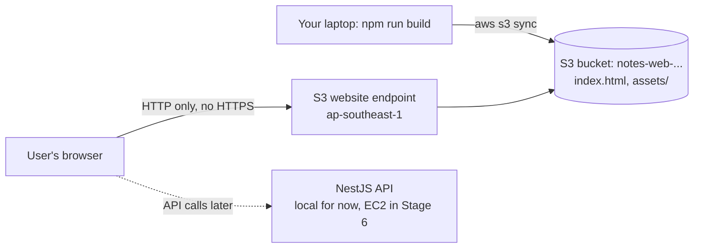
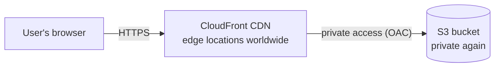
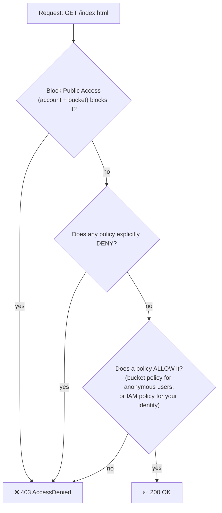

# Stage 3 · Lesson 1 — Host Your React Build on Amazon S3

⏱️ Time: ~55 minutes
🎯 Goal: Put the notes-app React frontend on the internet using **Amazon S3 static website hosting**, understand exactly *why* it works (and why it first fails), learn a real-world deploy command with correct cache headers, and see the limits that lead us to CloudFront in Stage 4.
💰 Cost of this lesson: **less than $0.01** (paid from your Free plan credits). Details in section 6.

📋 Prerequisites:
- Stage 2 done: root has MFA, you sign in with your **admin identity**, budgets + billing alarm exist
- AWS CLI works: `aws login --profile admin` succeeds
- Node.js installed (you used Node 24 in Stage 1 · Lesson 5)
- Stage 1 · Lesson 1 (HTTP, DNS, status codes) — you'll use `curl -I` a lot today

> ⚠️ Do everything as your **admin identity**, never as root. Region for this lesson: **`ap-southeast-1` (Singapore)**.

---

## 0. Where we are

**Stage 3 plan (S3):**

| Lesson | Topic |
|---|---|
| **3.1 (this lesson)** | **Host the React build on S3 (static website hosting, bucket policies, Block Public Access, deploy with `aws s3 sync`)** |
| 3.2 | S3 for app data: a private uploads bucket, versioning, lifecycle rules, CORS, and pre-signed URLs from NestJS |

Then **Stage 4** puts **CloudFront** (CDN + HTTPS) in front of the bucket from this lesson.

---

## 1. What problem does this solve?

When you run `npm run build` on a React (Vite) app, you get a `dist/` folder: one `index.html`, some `.js` and `.css` files, and images. That's it. No Node.js process needs to run in production — the browser does all the work.

So you need *somewhere* that:

- stores those files reliably (they must never be lost),
- answers "give me `/assets/index-a1b2c3.js`" over HTTP for anyone on the internet,
- doesn't require you to patch, restart, or babysit a server,
- costs almost nothing when traffic is low.

You *could* rent a server (EC2) and run Nginx. But that means an OS to update, a disk that can fail, and a monthly bill even with zero visitors. **Amazon S3** solves this: you upload files, and AWS stores and serves them.

### 🏬 Real-world analogy: a giant self-storage warehouse

| Warehouse | S3 |
|---|---|
| The warehouse company (huge, reliable, many buildings) | **Amazon S3** |
| Your rented storage unit, with a name painted on the door | **Bucket** |
| A box inside the unit | **Object** (a file + its metadata) |
| The label on the box: `assets/index-a1b2.js` | **Key** (the object's full name) |
| The unit's door is locked by default | **Block Public Access** (on by default) |
| A sign on the door: "Anyone may look at boxes, nobody may take or change them" | **Bucket policy** allowing public `GetObject` |
| Turning the unit into a little shop with a front window and a receptionist who says "you probably want `index.html`" | **Static website hosting** |

### 🗺️ Where it fits in a real web architecture

Almost every company that runs a React/Vue app on AWS stores its built frontend in S3. Today we serve **directly** from S3. In Stage 4 we put CloudFront in front, which is how it's done in production.

**After this lesson:**



**After Stage 4 (preview):**



---

## 2. Key terms

- **Object storage** — storage where you put and get whole files by name (key) over HTTP. There are no real folders, no "edit line 5 of a file" — you replace the whole object. Different from a **file system** (like your Linux disk) or **block storage** (a virtual hard disk, e.g. EBS in Stage 6).
- **Bucket** — a container for objects. Lives in one **region**. Its name must follow naming rules (lowercase, 3–63 characters, letters/numbers/hyphens).
- **Object** — a file plus **metadata** (extra info like `Content-Type` and `Cache-Control`).
- **Key** — the object's full name, e.g. `assets/index-a1b2c3.js`.
- **Prefix** — the "folder-like" start of a key, e.g. `assets/`. The S3 console *shows* prefixes as folders, but they're just part of the name.
- **ARN (Amazon Resource Name)** — a unique ID for any AWS resource. For S3: `arn:aws:s3:::my-bucket` (the bucket) and `arn:aws:s3:::my-bucket/*` (every object in it).
- **Bucket policy** — a JSON document attached to a bucket that says who can do what to it. (A **resource-based policy**, because it's attached to the resource rather than to a user.)
- **Block Public Access (BPA)** — four safety switches that override any setting that would make data public. On by default for every new bucket. Exists at **bucket level** and **account level**.
- **Object Ownership / ACLs** — **ACLs (Access Control Lists)** are an old, per-object way to grant access. Since 2023, new buckets have ACLs **disabled** ("Bucket owner enforced"). Leave it that way and use policies.
- **Static website hosting** — an S3 feature that serves a bucket as a simple website, with an **index document** (what to return for `/`) and an **error document** (what to return when a key doesn't exist).
- **Website endpoint vs REST endpoint** — two different addresses for the same bucket (explained in section 4).
- **MIME type / `Content-Type`** — an HTTP header telling the browser what a file is (`text/html`, `text/javascript`, `image/png`). Wrong type = browser refuses to run your JS.
- **`Cache-Control`** — an HTTP header telling browsers and CDNs how long they may reuse a file without asking again.
- **SPA (Single-Page Application)** — an app like your React app where one `index.html` loads, and the JavaScript router (React Router) changes the URL without asking the server for new pages.

---

## 3. How S3 decides "allow or deny"

For every request, S3 asks several questions. **All** must allow it. Any explicit "deny" wins.



Key consequences:

- **Anonymous** visitors (anyone on the internet) have no IAM policy. The *only* way they get in is a **bucket policy** that allows `"Principal": "*"`. And BPA must not block it.
- **You** (admin identity) get in because of your **IAM policy** (`AdministratorAccess`), even though the bucket is private.

> 🇻🇳 **Giải thích:** Có hai lớp khóa. **Block Public Access** là "công tắc an toàn tổng": nếu bật, mọi cấu hình làm bucket thành public đều bị chặn, kể cả khi bạn viết bucket policy cho phép. **Bucket policy** là "tấm biển trên cửa" ghi rõ ai được làm gì. Muốn website public thì phải (1) tắt đúng các công tắc BPA liên quan đến policy, và (2) thêm bucket policy cho phép mọi người **chỉ đọc** (`s3:GetObject`). Thiếu một trong hai là bị lỗi 403.

---

## 4. Website endpoint vs REST endpoint

Every bucket has a **REST endpoint**. If you turn on static website hosting, it also gets a **website endpoint**.

| | REST endpoint | Website endpoint |
|---|---|---|
| Address | `https://BUCKET.s3.ap-southeast-1.amazonaws.com/index.html` | `http://BUCKET.s3-website-ap-southeast-1.amazonaws.com` |
| HTTPS | ✅ Yes | ❌ **HTTP only** |
| `/` returns `index.html` | ❌ No (returns a list or AccessDenied) | ✅ Yes (index document) |
| Custom error page | ❌ No (returns XML errors) | ✅ Yes (error document) |
| Redirect rules | ❌ | ✅ |
| Used with CloudFront in production | ✅ (with OAC, bucket stays private) | Sometimes, but needs a public bucket |

> 🇻🇳 **Giải thích:** Cùng một bucket nhưng có hai "cửa". **REST endpoint** là cửa dành cho chương trình (API), có HTTPS nhưng không biết "trang chủ" là gì. **Website endpoint** là cửa dành cho trình duyệt, biết tự trả về `index.html` và trang lỗi, nhưng **chỉ có HTTP, không có HTTPS**. Đó là lý do ở Stage 4 ta sẽ đặt CloudFront phía trước.

---

## 5. Bucket names: which namespace?

Classic S3 bucket names are **globally unique** across *all* AWS customers. `notes-web` is surely taken; `notes-web-minh-7f3a2c` probably isn't.

Since March 2026, the console also offers an **account regional namespace**: names that end with your account ID and region plus `-an`, reserved for your account only. It's a good feature for large companies (it prevents "bucket squatting", where someone else grabs a name your code expects).

**For this lesson, choose the classic global namespace.** Most tutorials, Terraform modules, and company setups you'll meet still use it, and in Stage 5 the classic Cloudflare + S3 website pattern needs the bucket name to match a hostname.

Naming tips:
- lowercase letters, numbers, hyphens only
- avoid dots (`.`) for now: they cause HTTPS certificate problems on the REST endpoint
- never put secrets or personal info in a name (bucket names appear in URLs and DNS)

---

## 6. 💰 Cost & safety box

| Item | Free? | Est. cost if left running | Cleanup |
|---|---|---|---|
| S3 bucket (empty) | No charge for the bucket itself | $0 | — |
| S3 Standard storage (~1 MB React build) | Paid from credits on the new Free plan* | ~$0.025 per GB-month in Singapore → **≈ $0.00003/month** | Delete objects/bucket (section 13) |
| Requests (uploads, page loads) | Paid from credits | ~$0.005 per 1,000 uploads, ~$0.0004 per 1,000 reads → **< $0.01** for this lab | — |
| Data transfer out to internet | First **100 GB/month** free across AWS | $0 for this lab | — |
| Static website hosting feature | No extra charge | $0 | Disable in cleanup |

\* Accounts created **before 15 July 2025** use the legacy Free Tier, which included 5 GB of S3 Standard for 12 months. Newer accounts (yours, from Stage 2) are on the **credit-based Free plan**, so small S3 usage simply draws from your credits.

⚠️ **Cost & security trap: a public bucket left open.** Every successful download by anyone on the internet is a request you pay for, plus data transfer above the free allowance. If your site goes viral, or a bot hammers it, the bill grows ("**denial of wallet**"). More importantly, a public bucket is a classic **data leak**: people accidentally upload `.env` files, backups, or database dumps to the "website" bucket. Rule for this course: **a bucket is public only while you're actively testing**, and we lock it back down at the end of the lesson.

🔔 Prices change. Verify on https://aws.amazon.com/s3/pricing/ (choose Asia Pacific (Singapore)) and https://aws.amazon.com/free/.

🧯 **Dangerous commands** in this lesson are marked with ⚠️. The two to respect: `aws s3 sync --delete` (deletes remote files) and `aws s3 rb --force` (deletes the bucket and everything in it).

---

## 7. Hands-on lab

### Part A — Build the React app (5 min)

If you already have the notes-app frontend, `cd` into it and skip to step 3. Otherwise create a minimal one:

```bash
cd ~/projects                       # or wherever you keep code
npm create vite@latest notes-web -- --template react-ts
cd notes-web
npm install
```

- `npm create vite@latest notes-web` — runs the Vite project generator and creates a folder `notes-web`.
- `-- --template react-ts` — the first `--` tells npm "the rest is for Vite"; `react-ts` = React + TypeScript.
- `npm install` — downloads dependencies into `node_modules/`.

Make it yours so you can recognise *your* deploy. Edit `src/App.tsx` and replace the `<h1>` text with:

```tsx
<h1>Notes App — v1 on S3</h1>
```

3. Build:

```bash
npm run build
ls -R dist | head -20
du -sh dist
```

- `npm run build` — Vite compiles and minifies everything into `dist/`.
- `ls -R dist` — lists `dist/` recursively. You'll see `index.html`, `vite.svg`, and `assets/index-<hash>.js` / `.css`.
- `du -sh dist` — total size (usually well under 1 MB).

Notice the **hash** in `index-<hash>.js`. Vite changes it whenever the file content changes. This matters for caching (Part D).

### Part B — Console: create the bucket and upload (10 min)

1. Sign in as your **admin identity** → region (top-right) **Asia Pacific (Singapore) `ap-southeast-1`**.
2. Search **S3** → **Create bucket**.
3. Settings:
   - **Bucket type:** General purpose
   - **Bucket namespace:** Global namespace (if the option is shown)
   - **Bucket name:** `notes-web-<yourname>-<4-6 random chars>`, e.g. `notes-web-minh-7f3a2c`
   - **Object Ownership:** ACLs disabled (recommended) — leave it
   - **Block Public Access settings for this bucket:** leave **all four checked** for now
   - **Bucket Versioning:** Disable (we cover it in Lesson 3.2)
   - **Tags** — use your Stage 2 convention:

     | Key | Value |
     |---|---|
     | Project | notes-app |
     | Environment | lab |
     | Owner | `<yourname>` |
     | ManagedBy | console |
     | DeleteAfter | `<date one week from today>` |

   - **Default encryption:** SSE-S3 (the default — S3 encrypts every object at rest automatically, free)
4. **Create bucket**.
5. Open the bucket → **Upload**.
   - ⚠️ Upload the **contents** of `dist/`, not the `dist` folder itself. Use **Add files** for `index.html` and `vite.svg`, and **Add folder** for `assets`.
   - Check the list: you should see `index.html` and `assets/...`, **not** `dist/index.html`.
6. **Upload** → **Close**.

**Try it:** click `index.html` → copy the **Object URL** (it looks like `https://notes-web-....s3.ap-southeast-1.amazonaws.com/index.html`) → open it in a private browser window.

**What you should see:** an XML page with `<Code>AccessDenied</Code>`. 🎉 That's correct! The bucket is private. You can see the file in the console because of your IAM permissions; an anonymous browser can't.

### Part C — Turn on website hosting and make it public (10 min)

**C1. Enable static website hosting**

1. Bucket → **Properties** tab → scroll to the bottom → **Static website hosting** → **Edit**.
2. **Enable**, Hosting type: **Host a static website**.
3. **Index document:** `index.html`
4. **Error document:** `index.html` (why? see section 8)
5. **Save changes**. Scroll down again and copy the **Bucket website endpoint**: `http://notes-web-....s3-website-ap-southeast-1.amazonaws.com`

Open it. **What you should see:** `403 Forbidden` · `Code: AccessDenied`. Hosting is on, but nothing allows anonymous reads yet.

**C2. Check account-level Block Public Access**

S3 left menu → **Block Public Access settings for this account**. If all four are **On**, any public bucket policy will be rejected, no matter what you do at bucket level. Write down the current state; you'll restore it in cleanup. If they're On, turn **off only the two "bucket policies" settings** (the 3rd and 4th), leaving the two ACL settings on.

**C3. Relax bucket-level Block Public Access — only what's needed**

Bucket → **Permissions** → **Block public access (bucket settings)** → **Edit**:

| Setting | Set to | Why |
|---|---|---|
| Block public access to buckets and objects granted through *new* ACLs | ✅ keep on | We don't use ACLs |
| … through *any* ACLs | ✅ keep on | We don't use ACLs |
| … through *new* public bucket or access point policies | ⬜ off | Needed to save our public policy |
| … through *any* public bucket or access point policies | ⬜ off | Needed for the policy to take effect |

**Save** → type `confirm`.

> 💡 This is **least privilege** applied to safety switches: turn off only what you need, not "Block *all* public access".

**C4. Add the bucket policy**

**Permissions** → **Bucket policy** → **Edit** → paste, replacing `YOUR-BUCKET-NAME`:

```json
{
  "Version": "2012-10-17",
  "Statement": [
    {
      "Sid": "PublicReadForWebsite",
      "Effect": "Allow",
      "Principal": "*",
      "Action": "s3:GetObject",
      "Resource": "arn:aws:s3:::YOUR-BUCKET-NAME/*"
    }
  ]
}
```

Line by line:
- `"Version": "2012-10-17"` — the version of the **policy language**. Always this exact string. It's not a date you update.
- `"Statement"` — a list of rules. We have one.
- `"Sid"` — "statement ID", a human-readable label. Optional.
- `"Effect": "Allow"` — this rule grants access (the other option is `"Deny"`).
- `"Principal": "*"` — **who**: everyone, including anonymous internet users.
- `"Action": "s3:GetObject"` — **what**: only *read* one object. Not list, not upload, not delete.
- `"Resource": "arn:aws:s3:::YOUR-BUCKET-NAME/*"` — **on which**: every object in the bucket. The `/*` is essential: `GetObject` applies to objects, not to the bucket.

**Save changes.** The bucket now shows a red **Publicly accessible** badge. That's expected — and it's why we lock it down at the end.

Reload the website endpoint. **What you should see:** your app with "Notes App — v1 on S3". 🎉 Your React app is on the internet.

### Part D — CLI: inspect, test, and redeploy like a pro (15 min)

Open your Linux terminal.

**D1. Set up your shell**

```bash
aws login --profile admin
export AWS_PROFILE=admin
export AWS_REGION=ap-southeast-1
aws sts get-caller-identity
BUCKET="notes-web-minh-7f3a2c"        # ← your real bucket name
WEBSITE="http://$BUCKET.s3-website-ap-southeast-1.amazonaws.com"
```

- `export AWS_PROFILE=admin` — every following `aws` command uses your admin profile, so you don't type `--profile admin` each time (only in this terminal).
- `export AWS_REGION=ap-southeast-1` — default region for this terminal.
- `aws sts get-caller-identity` — "who am I?". The `Arn` must **not** end in `:root`.
- `BUCKET=...`, `WEBSITE=...` — shell variables to avoid typos.

**D2. Look around**

```bash
aws s3 ls                                   # all your buckets
aws s3 ls "s3://$BUCKET" --recursive --human-readable
aws s3api get-bucket-policy --bucket "$BUCKET" --query Policy --output text
aws s3api get-public-access-block --bucket "$BUCKET"
aws s3api get-bucket-website --bucket "$BUCKET"
```

- `aws s3 ...` — **high-level** commands (feel like `ls`/`cp`). Great for files.
- `aws s3api ...` — **low-level** commands, one per S3 API operation. Great for settings.
- `--recursive --human-readable` — list every object, with sizes like `1.2 KiB`.
- `--query Policy --output text` — print just the policy JSON, not the wrapper.

**D3. Test with `curl` (your Stage 1 skills)**

```bash
curl -I "$WEBSITE/"
curl -I "$WEBSITE/notes/42"
curl -I "https://$BUCKET.s3.ap-southeast-1.amazonaws.com/index.html"
curl -I --max-time 5 "https://$BUCKET.s3-website-ap-southeast-1.amazonaws.com/"
```

| Command | Expected | Lesson |
|---|---|---|
| `$WEBSITE/` | `200 OK`, `Content-Type: text/html` | Index document works |
| `$WEBSITE/notes/42` | **`404 Not Found`** but the body is your `index.html` | The SPA trick (section 8) |
| REST endpoint over HTTPS | `200 OK` (because the policy is public) | Same bucket, different door |
| Website endpoint over **HTTPS** | Fails / times out | Website endpoint = HTTP only |

`-I` = show only response headers. `--max-time 5` = give up after 5 seconds.

**D4. Check metadata (Content-Type)**

```bash
JS_FILE=$(aws s3 ls "s3://$BUCKET/assets/" | awk '{print $4}' | grep '\.js$')
aws s3api head-object --bucket "$BUCKET" --key "assets/$JS_FILE"
```

- `awk '{print $4}'` — take the 4th column (file name) from `aws s3 ls` output.
- `grep '\.js$'` — keep only names ending in `.js`.
- `head-object` — returns metadata without downloading the file. Look for `"ContentType": "text/javascript"` (or `application/javascript`). The console and CLI guess it from the file extension.

**D5. Ship v2 with proper cache headers**

Change `src/App.tsx` to `<h1>Notes App — v2 via CLI</h1>`, then:

```bash
npm run build

# 1) Hashed assets: safe to cache "forever"
aws s3 sync dist/assets "s3://$BUCKET/assets" \
  --delete \
  --cache-control "public,max-age=31536000,immutable"

# 2) Everything else (index.html, vite.svg): always revalidate
aws s3 sync dist/ "s3://$BUCKET" \
  --delete \
  --exclude "assets/*" \
  --cache-control "no-cache"
```

Line by line:
- `aws s3 sync SRC DEST` — upload only files that are new or changed (compares size and modified time).
- ⚠️ `--delete` — **delete files in the bucket that no longer exist locally** (e.g. the old `index-<oldhash>.js`). Powerful and dangerous: if `SRC` is the wrong or empty folder, it wipes the bucket. Always double-check the source path. Add `--dryrun` first when unsure.
- `--cache-control "public,max-age=31536000,immutable"` — browsers/CDNs may keep this file for 1 year (31,536,000 seconds) and never re-check. Safe because the filename hash changes when content changes.
- `--exclude "assets/*"` — skip `assets/` in the second command (already handled). Excluded files are also protected from `--delete`.
- `--cache-control "no-cache"` — the browser may store `index.html` but must ask S3 "has it changed?" every time. So users get new releases immediately.
- **Order matters:** assets first, `index.html` last. Otherwise, for a few seconds, the new `index.html` could point to JS files that aren't uploaded yet → blank page.

Verify:

```bash
curl -s "$WEBSITE/" | grep -o 'index-[A-Za-z0-9_-]*\.js'     # new hash
curl -sI "$WEBSITE/" | grep -i cache-control                  # no-cache
curl -sI "$WEBSITE/assets/$(curl -s "$WEBSITE/" | grep -o 'index-[A-Za-z0-9_-]*\.js')" | grep -i cache-control
```

Reload the browser: **"v2 via CLI"**. 🎉 That two-command `sync` is very close to what your GitLab pipeline will run in Stage 7.

> 🇻🇳 **Giải thích:** File JS/CSS của Vite có **hash** trong tên (vd `index-a1b2c3.js`). Khi code đổi, tên file đổi theo, nên có thể cho trình duyệt cache **1 năm** mà không sợ dùng bản cũ. Còn `index.html` thì tên không đổi, nên phải để `no-cache` để trình duyệt luôn hỏi lại server. Nếu cache `index.html` lâu, người dùng sẽ kẹt ở phiên bản cũ dù bạn đã deploy bản mới.

> 🪤 **Gotcha:** `sync` decides what to upload by size and time, *not* by metadata. If you only change `--cache-control` on unchanged files, `sync` skips them. To force re-upload with new headers, use `aws s3 cp dist/ "s3://$BUCKET" --recursive ...` instead.

### Part E — Lock it back down (5 min)

You've proven it works. Now make the bucket private again so it's ready for CloudFront in Stage 4. These commands don't delete your files.

```bash
aws s3api delete-bucket-policy --bucket "$BUCKET"

aws s3api put-public-access-block --bucket "$BUCKET" \
  --public-access-block-configuration \
  BlockPublicAcls=true,IgnorePublicAcls=true,BlockPublicPolicy=true,RestrictPublicBuckets=true

aws s3api delete-bucket-website --bucket "$BUCKET"

curl -I "$WEBSITE/"        # should fail now (no website endpoint)
aws s3 ls "s3://$BUCKET" --recursive    # files are still there
```

- `delete-bucket-policy` — removes the public-read policy.
- `put-public-access-block` — turns all four BPA switches back on.
- `delete-bucket-website` — turns off static website hosting (CloudFront will use the REST endpoint).

If you changed **account-level** BPA in C2, set it back in the console now (S3 → Block Public Access settings for this account → Edit → all four On).

---

## 8. The SPA routing problem (why error document = `index.html`)

Your React app may have routes like `/notes/42`, handled by React Router **in the browser**. But if a user refreshes on `/notes/42`, the browser asks S3 for the key `notes/42`. That object doesn't exist.

- With error document = `error.html` → user sees an error page. App broken on refresh.
- With error document = `index.html` → S3 returns `index.html`, React loads, React Router reads the URL and shows note 42. ✅ Works for the user.

**But** S3 still sends status **404**. Users don't notice, but:
- search engines may treat your pages as "not found",
- monitoring tools and logs fill with fake 404s.

This is the S3 version of the Nginx `try_files $uri $uri/ /index.html;` you saw in Stage 1 · Lesson 5 — except Nginx returns 200. In Stage 4, a **CloudFront custom error response** fixes it by turning that 404 into 200 with `index.html`.

> 🇻🇳 **Giải thích:** React Router xử lý URL **trong trình duyệt**, nhưng khi người dùng F5 ở `/notes/42`, trình duyệt lại hỏi S3 file `notes/42`, mà file đó không tồn tại. Đặt error document là `index.html` giúp app vẫn chạy, nhưng mã trạng thái vẫn là 404, không đẹp cho SEO và monitoring. CloudFront ở Stage 4 sẽ sửa thành 200.

---

## 9. Why S3 website hosting alone isn't production-ready

| Limitation | Why it matters | Fixed in |
|---|---|---|
| **HTTP only** | Browsers show "Not secure"; no HTTP/2; some browser features require HTTPS | Stage 4 (CloudFront) / Stage 5 (Cloudflare) |
| No custom domain with HTTPS | `notes.example.com` needs a certificate S3 can't serve | Stage 4 / 5 |
| Bucket must be **public** | Data-leak risk, compliance findings | Stage 4 (OAC keeps bucket private) |
| One region only | Users in Europe wait for Singapore | Stage 4 (CDN edge locations) |
| SPA routes return 404 | SEO, monitoring noise | Stage 4 (custom error responses) |
| No WAF / rate limiting | Bots can hammer you (denial of wallet) | Stage 11 |

---

## 10. ☁️ AWS vs Cloudflare: where do static sites live?

| | **S3 (website endpoint)** | **S3 + CloudFront** (Stage 4) | **Cloudflare R2** | **Cloudflare Pages / Workers static assets** |
|---|---|---|---|---|
| What it is | Object storage with a basic web server | Storage + global CDN | S3-compatible object storage | Full static-site hosting platform |
| HTTPS + custom domain | ❌ | ✅ | ✅ (via Cloudflare) | ✅ built in |
| Global CDN | ❌ | ✅ | ✅ | ✅ |
| Data transfer (egress) fees | Yes, after free allowance | Yes, after free allowance | **No egress fees** | Generous free plan |
| Git-based deploys / preview URLs | ❌ (you script it) | ❌ (you script it) | ❌ | ✅ |
| Fits deep AWS integration (IAM, CloudWatch, WAF) | ✅ | ✅ | ❌ | ❌ |

**When to choose which:**
- **S3 website endpoint alone** → learning, internal demos, short-lived tests. Not production.
- **S3 + CloudFront** → company is "all-in on AWS", needs IAM, CloudWatch, AWS WAF, one bill. Very common in enterprises.
- **Cloudflare Pages / Workers** → small teams, side projects, fastest path to HTTPS + CDN + previews, low cost.
- **Cloudflare R2** → lots of downloads (images, videos, files) where AWS egress fees would hurt.

We'll compare hands-on in Stage 5. Check current free limits on Cloudflare's pricing pages.

---

## 11. 👥 How teams use this

**In real companies:**
- The frontend pipeline builds the app and runs something like `aws s3 sync` into a bucket per environment: `notes-web-dev`, `notes-web-staging`, `notes-web-prod` (often in **separate AWS accounts**).
- Production buckets are **private**, served only through CloudFront with **OAC**. A public bucket usually triggers an alert from **AWS Security Hub**, **AWS Config**, or a cloud security tool. You may hear "that bucket got flagged".
- S3 is everywhere beyond websites: build **artifacts**, **logs**, database **backups**, **Terraform state** (Stage 15+), user uploads (Lesson 3.2).
- Buckets are created by **Terraform** or **CloudFormation**, not by clicking. Console is for looking.

**Jargon you'll hear:**
- **"Origin"** — where a CDN fetches content from (the bucket is CloudFront's origin).
- **"Static hosting" / "SPA hosting"**
- **"Cache busting"** — changing filenames (hashes) so caches fetch new versions.
- **"Immutable assets"** — hashed files cached forever.
- **"Invalidate the cache"** — tell a CDN to forget files (Stage 4).
- **"BPA is on at the org level"** — Block Public Access enforced for every account in the company.
- **"Bucket squatting"** — someone registers a bucket name your code or docs expect.
- **"Denial of wallet"** — attack that makes you pay instead of taking you offline.
- **"Least privilege"** — grant only the permissions needed (we did it with BPA settings).

**Questions you could ask your DevOps team:**
1. "Where is our frontend hosted, and is the bucket private behind CloudFront (OAC)?"
2. "What `Cache-Control` headers do we set on `index.html` vs assets?"
3. "How do we roll back a bad frontend deploy — redeploy an old build, or S3 versioning?"
4. "Is Block Public Access enforced at the account or organization level?"
5. "Are our buckets created by Terraform? Where's the module?"

---

## 12. 🧪 Exercises

### Exercise 1 — Do it all with the CLI, then delete it (15 min)

Recreate the whole lesson in a **second, temporary** bucket using only the terminal, then delete it completely. This trains the full create → deploy → destroy loop.

<details>
<summary>Hints (try first!)</summary>

```bash
ME="minh"                                   # lowercase, letters/numbers/hyphens
BUCKET2="notes-web-cli-$ME-$(openssl rand -hex 3)"
echo "$BUCKET2"

# Create (outside us-east-1, LocationConstraint is REQUIRED)
aws s3api create-bucket --bucket "$BUCKET2" --region ap-southeast-1 \
  --create-bucket-configuration LocationConstraint=ap-southeast-1

# Tag
aws s3api put-bucket-tagging --bucket "$BUCKET2" --tagging \
  'TagSet=[{Key=Project,Value=notes-app},{Key=Environment,Value=lab},{Key=ManagedBy,Value=cli},{Key=DeleteAfter,Value=today}]'

# Website hosting
aws s3api put-bucket-website --bucket "$BUCKET2" --website-configuration \
  '{"IndexDocument":{"Suffix":"index.html"},"ErrorDocument":{"Key":"index.html"}}'

# Relax only the policy-related BPA switches
aws s3api put-public-access-block --bucket "$BUCKET2" \
  --public-access-block-configuration \
  BlockPublicAcls=true,IgnorePublicAcls=true,BlockPublicPolicy=false,RestrictPublicBuckets=false

# Policy (heredoc → file → apply)
cat > /tmp/policy.json <<EOF
{
  "Version": "2012-10-17",
  "Statement": [{
    "Sid": "PublicReadForWebsite",
    "Effect": "Allow",
    "Principal": "*",
    "Action": "s3:GetObject",
    "Resource": "arn:aws:s3:::$BUCKET2/*"
  }]
}
EOF
aws s3api put-bucket-policy --bucket "$BUCKET2" --policy file:///tmp/policy.json

# Deploy (Part D5 commands with $BUCKET2), then test with curl
```

- `openssl rand -hex 3` — 6 random hex characters for a unique name.
- `<<EOF ... EOF` — a **heredoc**: writes multiple lines into the file. Because `EOF` isn't quoted, `$BUCKET2` is replaced with its value.
- `file:///tmp/policy.json` — tells the CLI to read the policy from a file (three slashes: `file://` + `/tmp/...`).

**Delete it** (⚠️ permanent):

```bash
aws s3 rb "s3://$BUCKET2" --force
aws s3 ls | grep notes-web-cli || echo "gone ✅"
```

`rb` = remove bucket. `--force` deletes all objects first. **Triple-check the variable** before running: `echo "$BUCKET2"`.
</details>

### Exercise 2 — Investigate the SPA 404 (10 min)

Before Part E (or in your Exercise 1 bucket), run:

```bash
curl -s -o /dev/null -w "%{http_code}\n" "$WEBSITE/"
curl -s -o /dev/null -w "%{http_code}\n" "$WEBSITE/notes/42"
curl -s "$WEBSITE/notes/42" | head -5
```

- `-o /dev/null` — throw away the body.
- `-w "%{http_code}\n"` — print only the status code.

Write 2–3 sentences in your notes: what the user sees, what a search engine sees, and how you'd explain the difference to a teammate. Then change the error document to a key that doesn't exist (`error.html`) and see what happens to `/notes/42`.

---

## 13. 🧹 Cleanup checklist

**Keep** (needed for Stage 4): bucket `notes-web-<yourname>-...` with your build files, **private**.

- [ ] Bucket policy **deleted** (`aws s3api get-bucket-policy --bucket "$BUCKET"` → `NoSuchBucketPolicy` error = good)
- [ ] Bucket-level Block Public Access: **all four on**
- [ ] Account-level Block Public Access restored to how it was (ideally all four on)
- [ ] Static website hosting **disabled**
- [ ] Console: bucket no longer shows **Publicly accessible**
- [ ] Exercise 1 bucket **deleted** (`aws s3 ls` shows only your main bucket)
- [ ] No `.env`, keys, or secrets were ever uploaded (`aws s3 ls "s3://$BUCKET" --recursive`)
- [ ] `aws logout --profile admin`

**If you want to delete everything instead** (⚠️ permanent, no undo — only if you'll rebuild before Stage 4):

```bash
echo "$BUCKET"                       # make sure it's the right one!
aws s3 rb "s3://$BUCKET" --force
```

---

## 14. 📝 Summary

- A React build is just **static files**; S3 stores and serves them without servers.
- **Bucket** = container in one region; **object** = file + metadata; **key** = its name.
- New buckets are **private** by default. Public access needs **both**: Block Public Access relaxed (only the policy switches) **and** a bucket policy allowing `s3:GetObject` to `"*"`.
- **Website endpoint** = HTTP only, index/error documents. **REST endpoint** = HTTPS, no website features.
- Error document = `index.html` makes SPA routes work, but returns **404**.
- Deploy with two `aws s3 sync` commands: hashed assets **immutable for 1 year**, `index.html` **no-cache**, assets first.
- S3 alone isn't production: no HTTPS, public bucket, no CDN → **CloudFront in Stage 4**.

---

## 15. ❓ Quiz (reply with your answers)

**Q1.** You uploaded your build and enabled static website hosting, but the website endpoint shows `403 Forbidden — AccessDenied`. Name **two** different possible causes and how you'd check each one.

**Q2.** A teammate sets `Cache-Control: public,max-age=31536000` on **every** file, including `index.html`. What will users experience after the next deploy, and what should the headers be?

**Q3.** Your manager asks: "The S3 website endpoint works, so why spend time on CloudFront?" Give **three** concrete reasons.

<details>
<summary>👉 Answers (open only after you reply)</summary>

**A1.** Any two of:
- **No bucket policy** allowing `s3:GetObject` to `"*"` → check Permissions → Bucket policy, or `aws s3api get-bucket-policy`.
- **Bucket-level Block Public Access** still blocking public policies → `aws s3api get-public-access-block --bucket ...`.
- **Account-level Block Public Access** on → S3 → Block Public Access settings for this account.
- Policy **`Resource` missing `/*`** (points to the bucket, not its objects) → read the policy.
- Files uploaded under **`dist/`** prefix, so `index.html` isn't at the root → `aws s3 ls s3://BUCKET` (this often shows as 404, or 403 if listing isn't allowed).

**A2.** Browsers keep the old `index.html` for up to a year, so many users keep loading the **old version** (which points to old JS files — and if `--delete` removed those, they get a **blank page**). Correct: hashed files in `assets/` → `public,max-age=31536000,immutable`; `index.html` (and other non-hashed files) → `no-cache`.

**A3.** Any three: **HTTPS** (and custom domain with a certificate); bucket can stay **private** (OAC) → no data-leak risk; **global CDN** = faster for users far from Singapore and less load on S3; SPA routes can return **200** instead of 404 (custom error responses); **AWS WAF** / rate limiting to fight bots and denial of wallet; better caching control and lower data-transfer cost at scale.

</details>

---

## 16. ✏️ Update your `progress.md`

> Your project's `progress.md` still shows Stage 1 · Lesson 1. If you haven't applied the Stage 1 and Stage 2 updates from earlier lessons, do that first, then **re-upload** the file to the project so I see the new version.

```markdown
Last updated: <today's date>
Current stage: 3 – S3
Current lesson: Lesson 3.2 – S3 for app data (uploads, versioning, pre-signed URLs)
```

**Completed lessons** — add:

```markdown
| <date> | S3 L1 – Host React build on S3 | _/3 | website vs REST endpoint, BPA + bucket policy, SPA 404, sync with cache headers |
```

**AWS resources currently running** — add:

```markdown
| S3 bucket (private, React build) | notes-web-<yourname>-xxxx | ap-southeast-1 | <date> | < $0.01 | Keep for Stage 4 |
```

(Exercise 1 bucket: don't add it — it's already deleted. If not, delete it now.)

**Weak topics** — add any that felt shaky, e.g.:

```markdown
- BPA vs bucket policy vs IAM policy (who allows what)
- Website endpoint (HTTP) vs REST endpoint (HTTPS)
- Cache-Control: immutable assets vs no-cache index.html
```

**Questions to ask my DevOps team** — pick 1–2 from section 11.

**Personal notes:**

```markdown
- Deploy = sync assets/ (immutable, 1y) first, then the rest (no-cache). Never run sync --delete without checking the source path.
- Account-level BPA state: <on/off> (restored after lesson: yes)
```

---

## ⏭️ Next: Stage 3 · Lesson 3.2 — S3 for app data

Your notes-app needs file uploads. You'll create a **private uploads bucket**, turn on **versioning** (and see how it protects against accidental deletes), add a **lifecycle rule** to control cost, configure **CORS** so the React app can upload directly, and generate **pre-signed URLs** from your local NestJS API — without ever putting access keys in code.
