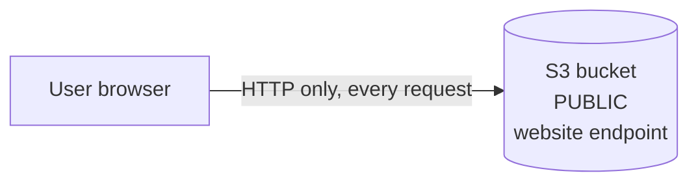
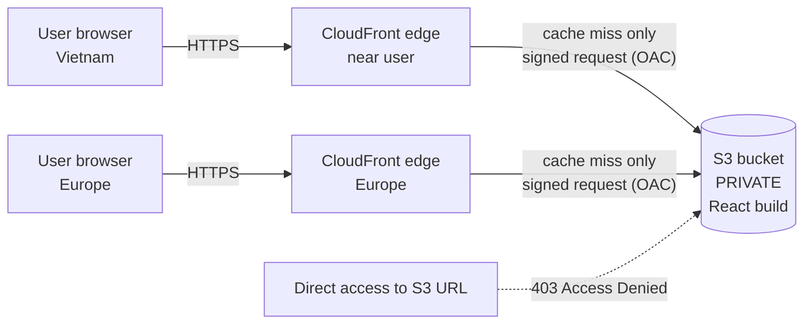
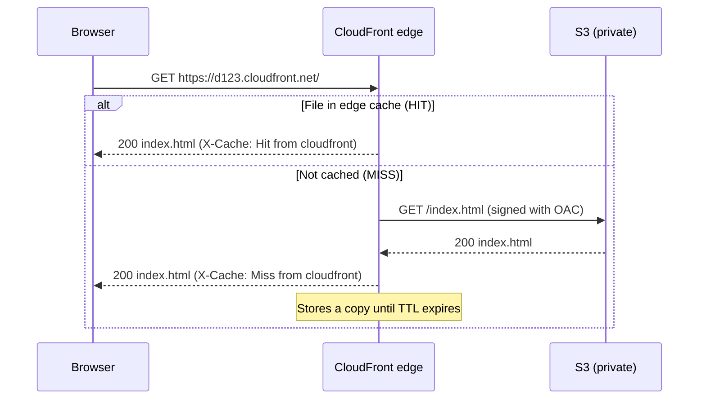

# Stage 4 · Lesson 1 — CloudFront: Put a CDN + HTTPS in Front of Your React App

**Time:** ~45–60 minutes
**Stage:** 4 – CloudFront
**Portfolio project:** Notes app — React frontend
**You will build:** A CloudFront distribution that serves your React build from a **private** S3 bucket over **HTTPS**, with working client-side routes.

---

## 0. Before you start (prerequisites check)

Your `progress.md` still shows Stage 1, so check these before touching AWS:

| Need | Why | Covered in |
|------|-----|------------|
| Root account has MFA, you log in as an IAM user | Never do labs as root | Stage 2 |
| Billing alarm exists (e.g., at $5 and $15) | Catches surprise costs | Stage 2 |
| AWS CLI installed and configured (`aws sts get-caller-identity` works) | We use it to deploy and test | Stage 2 |
| An S3 bucket containing your React build (`index.html` + `assets/`) | CloudFront needs an origin | Stage 3 |

If you don't have the bucket yet, here is the 5-minute version (region `ap-southeast-1` Singapore is closest to Vietnam):

```bash
# In your React (Vite) project folder
npm run build                       # creates dist/ (Create React App creates build/ instead)

# Create a bucket (name must be globally unique, lowercase)
aws s3 mb s3://notes-app-frontend-yourname --region ap-southeast-1

# Upload the build
aws s3 sync dist/ s3://notes-app-frontend-yourname
```

- `npm run build` — compiles your React code into plain HTML/CSS/JS files that any web server (or S3) can serve.
- `aws s3 mb` — "make bucket".
- `aws s3 sync` — copies only files that changed from your local folder to the bucket.

Vue works exactly the same way (`npm run build` → `dist/`).

---

## 1. What problem does CloudFront solve?

After Stage 3, your site works from S3, but it has four problems:

1. **It's slow far away.** The bucket lives in one region (e.g., Singapore). A user in Brazil waits for every file to cross the planet.
2. **No HTTPS.** The S3 *static website endpoint* (`http://bucket.s3-website-...amazonaws.com`) supports HTTP only. Browsers show "Not secure", and modern features (service workers, secure cookies, geolocation) need HTTPS.
3. **The bucket is public.** To use the website endpoint, you had to open the bucket to the whole internet. One mistake (uploading a `.env` file) and it's public.
4. **Cost and load.** Every request hits S3 directly, and S3 → internet data transfer is billed.

**CloudFront** is AWS's **CDN**. It fixes all four: it caches your files near users, gives you HTTPS for free, lets the bucket stay private, and has a generous always-free tier.

### New terms

| Term | Meaning |
|------|---------|
| **CDN (Content Delivery Network)** | A worldwide network of servers that keep copies of your files close to users. |
| **Edge location / PoP (Point of Presence)** | One CDN data center in a city (AWS has hundreds, including in Vietnam). |
| **Origin** | The "source of truth" where the real files live — here, your S3 bucket. Later, also your NestJS API. |
| **Distribution** | One CloudFront configuration. It gets a URL like `d1234abcd.cloudfront.net`. |
| **Cache** | A stored copy of a file so it doesn't need to be fetched again. |
| **Cache hit / cache miss** | Hit = the edge already had the file. Miss = the edge had to go fetch it from the origin. |
| **TTL (Time To Live)** | How long a cached copy is considered fresh before the edge checks the origin again. |
| **Invalidation** | Telling CloudFront "throw away your cached copies of these files now". |
| **OAC (Origin Access Control)** | CloudFront's way of signing its requests to S3, so the bucket can say "only this distribution may read me". |
| **TLS / SSL certificate** | The thing that makes HTTPS work: proves the site's identity and encrypts traffic. (SSL is the old name; people still say it.) |
| **Viewer** | CloudFront's word for the user's browser. |

> 🇻🇳 **Giải thích:** CDN là một mạng lưới server đặt ở khắp nơi trên thế giới. Mỗi server (gọi là *edge location*) giữ một bản sao (cache) các file của website. Khi người dùng ở TP.HCM truy cập, họ lấy file từ edge gần TP.HCM thay vì phải đi tới tận bucket S3 ở Singapore hay Mỹ. Kết quả: nhanh hơn, rẻ hơn, và server gốc (origin) đỡ bị quá tải.

---

## 2. Real-world analogy

Your S3 bucket is a **central warehouse** in Singapore. Without a CDN, every customer worldwide must travel to the warehouse.

CloudFront is a chain of **convenience stores** (like Circle K) in every city.

- The first customer in Hồ Chí Minh City who asks for `index.html` → the store doesn't have it (**miss**) → the store orders it from the warehouse, sells it, and **keeps a copy on the shelf**.
- The next customers → it's already on the shelf (**hit**) → instant.
- Items have an **expiry date (TTL)**; after that, the store checks with the warehouse for a fresher version.
- **Invalidation** = head office calling every store: "pull this item off the shelf now".
- **OAC** = the warehouse's back door only opens for trucks with the official store badge. Random people can't walk in.

---

## 3. Where it fits in the architecture

### Before (Stage 3)



### After this lesson



### Request flow (step by step)



Later in the course, the same distribution can also route `/api/*` to your NestJS backend — one domain, two origins. That's why CloudFront is such a central piece in real architectures.

---

## 4. 💰 Cost and safety check (read before the lab)

| Item | Free? | Notes |
|------|-------|-------|
| CloudFront data transfer + requests | ✅ Always-free tier: **1 TB out + 10 million requests + 2 million CloudFront Functions per month**, no 12-month expiry | Your learning traffic is tiny |
| S3 → CloudFront transfer | ✅ Free | |
| S3 storage of a React build (~1–5 MB) | ~$0.00 | Fractions of a cent |
| Invalidations | ✅ First 1,000 paths/month free | `/*` counts as **1** path. After that, a small fee per path |
| Default HTTPS certificate (`*.cloudfront.net`) | ✅ Free | Custom domain certs (ACM) are also free — next lesson |
| AWS WAF (if you enable it in the wizard) | ❌ Not free on pay-as-you-go | Monthly fee per web ACL + per rule + per request. **Skip it for now** (Stage 11) |

**Estimated cost if left running:** ~$0/month for learning traffic.

### ⚠️ Pricing-plan trap (new since late 2025)

When you create a distribution, the console asks you to choose a **pricing plan**:

- **Pay-as-you-go** ← ✅ **choose this for the lab.** Uses the always-free tier above; you can delete the distribution whenever you want.
- **Flat-rate plans** (Free $0, Pro $15, Business $200, Premium $1,000 per month) bundle CloudFront + WAF + DNS + more.

Why not the flat-rate "Free" plan for learning?
1. A distribution subscribed to a pricing plan **cannot be deleted** until you cancel the plan, and deletion can be blocked until the end of the billing cycle. That breaks our "create → practice → delete" habit.
2. Flat-rate plans require a WAF web ACL on the distribution, and they're not available to accounts on the AWS Free Tier program.
3. **A disabled distribution on a paid plan still charges you.** Pay-as-you-go has no such trap.

Prices and plan rules change — always verify on the official page: https://aws.amazon.com/cloudfront/pricing/

### 🧹 Cleanup preview
You will **keep** this distribution for Lesson 2 (custom domain + caching) and Stage 7 (CI/CD). It costs ~$0 on pay-as-you-go. Section 12 shows how to delete it fully when you're done.

---

## 5. Lab Part A — Make the bucket private again

In Stage 3 you made the bucket public. Now we lock it down. CloudFront will be the only way in.

> ⚠️ **Warning:** After this step, your old `http://...s3-website-...` URL will stop working (403). That's expected — CloudFront will replace it in Part B. Nothing is deleted.

**Console:**
1. S3 → your bucket → **Permissions** tab.
2. **Block public access (bucket settings)** → Edit → tick **Block all public access** → Save → type `confirm`.
3. **Bucket policy** → Edit → delete the old public policy (the one with `"Principal": "*"`) → Save.
4. **Properties** tab → **Static website hosting** → you can **Disable** it. We won't use the website endpoint anymore (OAC doesn't work with it).

> 🇻🇳 **Giải thích:** S3 có 2 loại địa chỉ: *website endpoint* (chỉ HTTP, bắt buộc bucket public) và *REST endpoint* (`bucket.s3.region.amazonaws.com`, hỗ trợ bucket private). OAC chỉ hoạt động với REST endpoint. Vì vậy ta tắt public và để CloudFront là "cửa duy nhất" vào bucket.

---

## 6. Lab Part B — Create the distribution (Console)

The CloudFront console is updated often; labels may differ slightly. Look for the meaning, not the exact words.

1. Open **CloudFront** (it's a *global* service — the region selector shows "Global").
2. **Create distribution**.
3. **Choose a plan** → select **Pay-as-you-go** (see Section 4).
4. **Distribution name:** `notes-app-frontend`. **Domain:** leave empty (custom domain is next lesson).
5. **Origin type:** **Amazon S3**.
6. **Origin / S3 bucket:** pick your bucket from the list. It must look like
   `notes-app-frontend-yourname.s3.ap-southeast-1.amazonaws.com` (REST endpoint),
   **not** `...s3-website-...` (website endpoint).
7. **Origin access / settings:** tick **Allow private S3 bucket access to CloudFront** (this creates the **OAC** and updates the bucket policy for you) and keep **Use recommended origin settings** and **recommended cache settings**.
   - In the classic form, this appears as **Origin access → Origin access control settings (recommended) → Create new OAC**, then a **Copy policy** button you paste into the bucket policy yourself (see Section 7).
8. **Security / WAF:** choose **Do not enable security protections** (WAF costs money on pay-as-you-go; we cover it in Stage 11).
9. Review → **Create distribution**.

Status shows **Deploying** for a few minutes while the config is pushed to edges worldwide. Wait until the "Last modified" column shows a date instead of "Deploying".

### 6.1 Check these settings after creation

Open the distribution → **General** → **Settings → Edit**:

| Setting | Value | Why |
|---------|-------|-----|
| **Default root object** | `index.html` | When someone visits `/`, serve `index.html`. Without it, `/` returns Access Denied. |
| **Price class** | **Use all edge locations** | The cheapest price class covers only North America + Europe, so users in Vietnam would be served from far away. Free tier covers you either way. |
| **Supported HTTP versions** | HTTP/2 (and HTTP/3) on | Faster connections. |

Then **Behaviors** tab → select the default behavior `*` → **Edit**:

| Setting | Value | Why |
|---------|-------|-----|
| **Viewer protocol policy** | **Redirect HTTP to HTTPS** | Anyone typing `http://` is moved to `https://`. |
| **Allowed HTTP methods** | `GET, HEAD` | A static site only needs to be read. |
| **Cache policy** | `CachingOptimized` | AWS-managed policy, good defaults for static files. |

---

## 7. The bucket policy — line by line

Open S3 → bucket → Permissions → Bucket policy. If the wizard did its job, you'll see something like this (if not, paste it, replacing the 3 placeholders):

```json
{
  "Version": "2012-10-17",
  "Statement": [
    {
      "Sid": "AllowCloudFrontServicePrincipalReadOnly",
      "Effect": "Allow",
      "Principal": { "Service": "cloudfront.amazonaws.com" },
      "Action": "s3:GetObject",
      "Resource": "arn:aws:s3:::notes-app-frontend-yourname/*",
      "Condition": {
        "StringEquals": {
          "AWS:SourceArn": "arn:aws:cloudfront::123456789012:distribution/E1ABCDEF2GHIJ"
        }
      }
    }
  ]
}
```

| Line | Meaning |
|------|---------|
| `"Version": "2012-10-17"` | The policy *language* version. Always this exact date — it's not "when you wrote it". |
| `"Sid"` | Statement ID — just a human-readable label. |
| `"Effect": "Allow"` | This statement grants permission (the other option is `Deny`). |
| `"Principal": { "Service": "cloudfront.amazonaws.com" }` | **Who** gets access: the CloudFront service. |
| `"Action": "s3:GetObject"` | **What** they can do: read files only. Not list, not upload, not delete. |
| `"Resource": "arn:aws:s3:::BUCKET/*"` | **Which** things: every object inside this bucket. **ARN** = Amazon Resource Name, a unique ID for any AWS resource. |
| `"Condition" ... "AWS:SourceArn"` | **Only when** the request comes from *your* distribution (account ID + distribution ID). Without this, any CloudFront distribution in any AWS account could read your bucket. |

This is your first real taste of **least privilege**: give exactly the access needed, nothing more. Stage 15 goes deep on this.

> 🇻🇳 **Giải thích:** Bucket policy này nói: "Cho phép dịch vụ CloudFront đọc (GetObject) các file trong bucket, NHƯNG chỉ khi request đến từ đúng distribution của tôi." Phần `Condition` rất quan trọng — thiếu nó thì distribution của người khác cũng có thể đọc bucket của bạn.

---

## 8. Fix React routing (SPA refresh problem)

Your React app is a **SPA (Single Page Application)**: there is only one real HTML file (`index.html`), and React Router decides what to show for `/notes`, `/login`, etc. *in the browser*.

**The problem:** If a user refreshes `https://d123.cloudfront.net/notes`, CloudFront asks S3 for a file called `notes`. It doesn't exist. S3 returns **403 Access Denied** (not 404 — S3 hides "doesn't exist" from anyone without list permission, for security).

**The fix:** tell CloudFront "if S3 says 403 or 404, serve `/index.html` with status 200 instead", so React can load and show the right page.

Distribution → **Error pages** tab → **Create custom error response**, twice:

| HTTP error code | Customize error response | Response page path | HTTP response code | Error caching min TTL |
|-----------------|--------------------------|--------------------|--------------------|-----------------------|
| 403 | Yes | `/index.html` | 200 | 10 |
| 404 | Yes | `/index.html` | 200 | 10 |

**Trade-off to know (teams discuss this):** every missing file now returns your app with status 200, so real 404s are hidden from monitoring and search engines. A more precise solution uses a **CloudFront Function** to rewrite only route-like paths — we'll see that later. For now, the error-page approach is the standard beginner setup.

> 🇻🇳 **Giải thích:** Với SPA, chỉ có một file `index.html` thật. Các đường dẫn như `/notes` là do React Router xử lý trong trình duyệt. Khi người dùng F5 ở `/notes`, CloudFront đi tìm file `notes` trong S3 — không có — nên lỗi 403. Ta cấu hình: lỗi 403/404 thì trả về `index.html` với mã 200, để React tự hiển thị đúng trang.

---

## 9. Test it

### 9.1 Browser
Open `https://<your-distribution-id>.cloudfront.net` (find it under **Distribution domain name**). You should see your React app with a 🔒 padlock.

### 9.2 Prove the bucket is private

```bash
curl -I https://notes-app-frontend-yourname.s3.ap-southeast-1.amazonaws.com/index.html
```

- `curl` — command-line tool to make HTTP requests.
- `-I` — only show the response **headers** (not the HTML body).

Expected: `HTTP/1.1 403 Forbidden`. 🎉 Direct access is blocked.

### 9.3 Watch the cache work

Run this **twice**:

```bash
curl -sI https://d123abcd.cloudfront.net/ | grep -iE "^HTTP|x-cache|x-amz-cf-pop|age"
```

- `-s` — silent (no progress bar).
- `| grep -iE "..."` — only show lines matching these patterns (`-i` = ignore case, `-E` = allow `|` for "or").

Expected output (values will differ):

```text
# 1st request
HTTP/2 200
x-cache: Miss from cloudfront
x-amz-cf-pop: SGN50-P1

# 2nd request
HTTP/2 200
x-cache: Hit from cloudfront
x-amz-cf-pop: SGN50-P1
age: 12
```

| Header | Meaning |
|--------|---------|
| `x-cache` | `Miss` = fetched from S3, `Hit` = served from edge cache. |
| `x-amz-cf-pop` | Which edge served you. Codes use airport codes: `SGN` = Hồ Chí Minh City, `HAN` = Hà Nội, `SIN` = Singapore. |
| `age` | How many seconds this copy has been in the cache. |

### 9.4 Test SPA routing

```bash
curl -sI https://d123abcd.cloudfront.net/notes | head -1
```

Expected: `HTTP/2 200` (thanks to Section 8). In the browser, refresh on a route — no XML error.

---

## 10. Deploying an update + invalidation

You changed your React code. Deploy:

```bash
npm run build

# ⚠️ --delete removes files from the bucket that no longer exist in dist/.
# Double-check the bucket name before running — a typo can wipe the wrong bucket.
aws s3 sync dist/ s3://notes-app-frontend-yourname --delete
```

Now open the site… you may still see the **old** version. Why? The edges cached the old `index.html` and will keep serving it until its TTL expires (with `CachingOptimized`, that can be up to a day if S3 doesn't send cache headers).

Tell CloudFront to drop the cached copies:

```bash
aws cloudfront create-invalidation \
  --distribution-id E1ABCDEF2GHIJ \
  --paths "/index.html"
```

- `create-invalidation` — asks every edge to delete its cached copy of these paths.
- `--distribution-id` — the ID from the console (starts with `E`).
- `--paths "/index.html"` — which files. `"/*"` means everything (and counts as just 1 path for billing).

Check progress:

```bash
aws cloudfront list-invalidations --distribution-id E1ABCDEF2GHIJ
```

Status goes from `InProgress` to `Completed`, usually within a minute or two.

### Why only `/index.html`?
Vite builds files with a **content hash** in the name: `assets/index-4f8a2c1b.js`. When the code changes, the filename changes, so the browser and CDN treat it as a brand-new file — no invalidation needed. This trick is called **cache busting**. Only `index.html` keeps the same name, and it's the file that points to the new hashed assets.

> 🇻🇳 **Giải thích:** CloudFront giữ bản cache cũ cho tới khi hết TTL. Sau khi deploy bản mới, cần *invalidation* để xóa cache. Vite đặt tên file JS/CSS kèm mã hash (vd. `index-4f8a2c1b.js`), nên mỗi lần code đổi thì tên file đổi → tự động là file mới. Chỉ có `index.html` giữ nguyên tên, nên thường chỉ cần invalidate `/index.html`.

Lesson 2 will make this cleaner with proper `Cache-Control` headers (short cache for `index.html`, very long cache for hashed assets) — that's how teams avoid invalidating at all.

---

## 11. Same things with the AWS CLI

Console first for understanding; here's the CLI equivalent for daily use:

```bash
# List your distributions (ID, domain, status)
aws cloudfront list-distributions \
  --query "DistributionList.Items[].{Id:Id,Domain:DomainName,Status:Status}" \
  --output table

# Show one distribution's full config (it's long!)
aws cloudfront get-distribution-config --id E1ABCDEF2GHIJ

# List Origin Access Controls
aws cloudfront list-origin-access-controls
```

- `--query` — filters the JSON output using **JMESPath** (a JSON query language). Here: "for each distribution, show Id, DomainName and Status".
- `--output table` — print as a readable table instead of JSON.

Creating a distribution from the CLI requires a big JSON config — that's exactly why teams use **Terraform** for it (resource `aws_cloudfront_distribution` + `aws_cloudfront_origin_access_control`). We'll get there at intermediate level.

### Troubleshooting table

| Symptom | Likely cause | Fix |
|---------|-------------|-----|
| `AccessDenied` XML on the homepage `/` | Default root object not set | Set it to `index.html` |
| `AccessDenied` on every page | Bucket policy missing/wrong distribution ARN, or origin points to website endpoint | Re-check Section 7; origin must be `bucket.s3.region.amazonaws.com` |
| `AccessDenied` only when refreshing `/notes` | SPA error responses missing | Section 8 |
| Old version after deploy | Edge cache (or browser cache) | Invalidate `/index.html`; hard refresh with Ctrl+Shift+R |
| Changes to the distribution "don't work" | Still **Deploying** | Wait until it's deployed |
| `504 Gateway Timeout` | CloudFront can't reach origin (rare with S3) | Check the origin domain name for typos |

**How to troubleshoot yourself:** always start with `curl -I` against the CloudFront URL *and* look at the status code + `x-cache` header. `Error from cloudfront` in `x-cache` means the error came from the origin or CloudFront config, not from your React code.

---

## 12. CloudFront vs Cloudflare (preview of Stage 5)

| | **CloudFront** | **Cloudflare** |
|--|----------------|----------------|
| What it is | AWS's CDN | Independent CDN + DNS + security company |
| Setup | Create a distribution; your DNS can be anywhere | Usually move your domain's **nameservers** to Cloudflare |
| Private S3 origin | Native via **OAC** ✅ | No native OAC; bucket usually public or needs workarounds (or use Cloudflare R2) |
| HTTPS | Free `*.cloudfront.net` cert; free ACM certs for custom domains | Free Universal SSL, very easy |
| Pricing | Pay-as-you-go (generous always-free tier) or flat-rate plans | Generous free plan, flat monthly plans, no bandwidth bills |
| Security | AWS WAF (paid on pay-as-you-go), Shield Standard free | Free basic WAF/DDoS on all plans |
| Best when | Everything is on AWS, need IAM/OAC/Terraform integration, AWS-centric team | Want easy setup, free DDoS/WAF, multi-cloud, DNS management in one place |

Many companies use **both** (Cloudflare for DNS/WAF in front, CloudFront behind) — but stacking two CDNs adds complexity in caching and debugging. Stage 5 compares them hands-on.

---

## 13. How teams use this

**In real companies:**
- Almost every AWS-hosted frontend sits behind CloudFront (or Cloudflare). The S3 bucket is **never** public.
- The distribution is defined in **Terraform** or CDK, not clicked in the console.
- The CI/CD pipeline (Stage 7) runs `aws s3 sync` and then `create-invalidation` automatically after every merge to `main`.
- The same distribution often has multiple **behaviors**: `/*` → S3, `/api/*` → ALB/API Gateway.

**Jargon you'll hear:**

| Phrase | Meaning |
|--------|---------|
| "Bust the cache" / "Purge the cache" | Invalidate cached files (Cloudflare says "purge"). |
| "Cache hit ratio is low" | Too many requests go to the origin — caching is misconfigured. |
| "It's cached at the edge" | Explains why a change isn't visible yet. |
| "Lock down the origin" | Make the origin reachable only through the CDN (OAC for S3). |
| "Warm the cache" | Pre-load popular files into edge caches. |
| "Origin Shield" | An extra caching layer in front of the origin to reduce origin load. |
| "Hashed assets / immutable assets" | Files with content hashes that can be cached forever. |
| "SPA fallback" | The 403/404 → `index.html` rule from Section 8. |

**Questions you could ask your DevOps team:**
1. "Is our S3 origin locked down with OAC, or is anything still served from a public bucket?"
2. "Does our pipeline invalidate `/*` on every deploy, or do we rely on hashed filenames and `Cache-Control` headers?"
3. "What's our cache hit ratio, and do we have an alarm on 5xx error rate?"
4. "Are our distributions on pay-as-you-go or a flat-rate plan, and why?"
5. "Why did we choose CloudFront over Cloudflare (or both)?"

---

## 14. Summary

- **CloudFront** is AWS's CDN: it caches your React build at edge locations close to users and serves it over HTTPS.
- The **origin** (S3) stays **private**; **OAC** + a bucket policy with an `AWS:SourceArn` condition lets only your distribution read it.
- Use the S3 **REST endpoint**, not the website endpoint, with OAC.
- Set **Default root object = `index.html`**, **Redirect HTTP to HTTPS**, and **SPA fallback** (403/404 → `/index.html`, 200).
- `x-cache: Hit/Miss` tells you whether the edge served from cache.
- After a deploy, **invalidate** `/index.html` (hashed assets don't need it).
- Choose **pay-as-you-go** for learning; flat-rate plans block quick deletion.

---

## 15. Hands-on exercises

### Exercise 1 — Measure the edge (15 min)
1. Run the `curl -sI ... | grep` command from 9.3 three times. Record `x-cache`, `x-amz-cf-pop`, and `age`.
2. Measure total request time for a cache miss vs hit:
   ```bash
   # -o /dev/null = throw away the body, -w = print the timing we ask for
   curl -s -o /dev/null -w "%{time_total}s\n" "https://d123abcd.cloudfront.net/?test=$RANDOM"
   curl -s -o /dev/null -w "%{time_total}s\n" "https://d123abcd.cloudfront.net/"
   ```
3. Write in your notes: which edge served you, and how much faster was the hit?

*(Hint: with `CachingOptimized`, query strings aren't part of the cache key, so `?test=...` may still be a hit — notice what happens and think about why. Lesson 2 explains cache keys.)*

### Exercise 2 — Ship a visible change (15 min)
1. Change the heading in `App.jsx` to `Notes App v2`.
2. Build and `aws s3 sync` (with `--delete` — check the bucket name!).
3. Reload the CloudFront URL. Old or new? Explain why.
4. Invalidate **only** `/index.html`, wait for `Completed`, reload.
5. **Bonus:** add a React Router route `/notes`, deploy, then refresh directly on `/notes` and confirm it works.

---

## 16. Quiz (reply in chat with your answers)

1. **(Easy)** Why do we use OAC with a private bucket instead of keeping the S3 static website endpoint public? Give at least two reasons.
2. **(Medium)** Your homepage works, but refreshing `https://d123abcd.cloudfront.net/notes` shows an XML `AccessDenied` error. Explain what's happening and how to fix it.
3. **(Medium–Hard)** You deployed a new build, but some users still see the old version. Explain why, and describe two different ways to solve it (one quick fix, one long-term best practice).

<details>
<summary>👀 Answers — open only after replying with yours</summary>

**1.** (a) The website endpoint is **HTTP only**, so no HTTPS. (b) A public bucket can leak anything uploaded by mistake; with OAC, the bucket stays private and only your specific distribution (enforced by `AWS:SourceArn`) can read it. (c) All traffic goes through CloudFront, so you get caching, lower latency, HTTPS, and later WAF in one place.

**2.** React is a SPA — `/notes` isn't a real file in S3; React Router handles it in the browser. On refresh, CloudFront asks S3 for an object named `notes`, which doesn't exist. Because CloudFront has no `s3:ListBucket` permission, S3 returns **403** instead of 404. Fix: add custom error responses for **403 and 404 → `/index.html` with HTTP 200**, so React loads and renders the route.

**3.** Edge locations (and browsers) cached the old `index.html` until its TTL expires. Quick fix: `aws cloudfront create-invalidation --paths "/index.html"` (or `"/*"`). Long-term best practice: rely on **hashed filenames** for assets (cache them for a long time) and send a short or no-cache `Cache-Control` header for `index.html`, so new deploys appear without invalidations — usually automated in the CI/CD pipeline.

</details>

---

## 17. 🧹 Cleanup checklist

**Recommended: KEEP the distribution and bucket** — Lesson 2 and Stage 7 build on them, and on pay-as-you-go they cost ~$0 at learning traffic.

- [ ] Confirm the distribution is on **Pay-as-you-go** (General tab → pricing plan). If you accidentally picked a flat-rate plan, cancel it now.
- [ ] Confirm **WAF is not enabled** (Security tab → no web ACL), unless you deliberately chose it.
- [ ] Confirm the bucket has **Block all public access = On**.
- [ ] Check **Billing → Bills** in the next few days: CloudFront should show $0.00.
- [ ] Add the distribution to `progress.md` (below).

**When you're done with CloudFront (full delete):**

> ⚠️ Deleting the distribution makes the site unreachable. Deleting the bucket deletes your files permanently.

1. CloudFront → select distribution → **Disable** → wait until status is no longer *Deploying* (several minutes).
2. Select it again → **Delete**.
   - If you see *"You can't delete this distribution while it's subscribed to a pricing plan"*, cancel the plan first; deletion may only be possible after the billing cycle ends.
3. CloudFront → **Security → Origin access** → delete the OAC (only possible after the distribution is gone).
4. S3 → bucket → Permissions → Bucket policy → remove the CloudFront statement (or delete the bucket: **Empty** it first, then **Delete**).
5. Double-check no other distributions exist: `aws cloudfront list-distributions --query "DistributionList.Items[].Id"`.

---

## 18. Update your `progress.md`

**Header:**
```text
Last updated: <today's date>
Current stage: 4 – CloudFront
Current lesson: Lesson 2 – Custom domain (ACM) + cache policies
```

**Completed lessons** — add a row:
```text
| <date> | S4 L1 – CloudFront + OAC + HTTPS for React | _/3 | SPA fallback, invalidation, x-cache |
```

**AWS resources currently running** — replace "(none yet)" with:
```text
| S3 bucket          | notes-app-frontend-yourname     | ap-southeast-1 | <date> | ~$0.00 | Keep (used through Stage 7) |
| CloudFront dist.   | E1ABCDEF2GHIJ (d123.cloudfront.net) | Global     | <date> | ~$0 (free tier, pay-as-you-go) | Keep until Stage 7, then review |
| CloudFront OAC     | <OAC name>                      | Global         | <date> | $0     | Delete with distribution |
```

**Roadmap:** don't tick Stage 4 yet (Lesson 2 still to come). If you skipped Stages 1–3, leave them unticked and note it under Personal notes.

**Weak topics** — add anything from the quiz you got wrong, e.g.:
```text
- Cache TTL vs invalidation
- Why S3 returns 403 instead of 404
```

**Questions to ask my DevOps team** — copy 1–2 from Section 13.

---

**Next lesson (Stage 4 · Lesson 2):** custom domain with a free ACM certificate (must be in `us-east-1`!), cache policies, cache keys, and `Cache-Control` headers so you rarely need invalidations.
