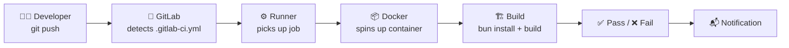
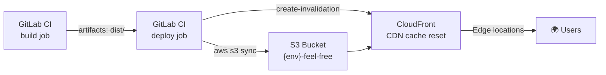
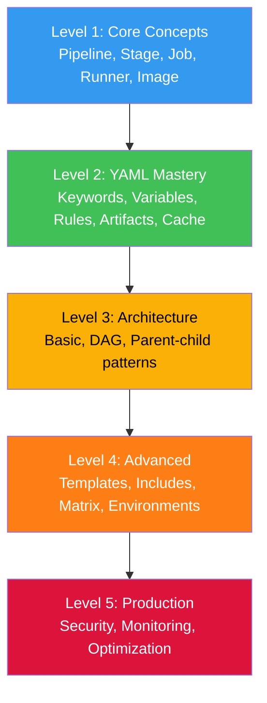

# 🚀 GitLab CI/CD — Roadmap & Deep Dive Guide

> **Author**: Special thanks to [anIcedAntFA](https://github.com/anIcedAntFA)\
> **Từ zero đến production-grade pipeline cho React SPA.**

> Target audience: Frontend developer muốn hiểu CI/CD từ gốc, áp dụng cho real-world project

---

## 📑 Table of Contents

- [Part 1: Roadmap — Từ cơ bản đến nâng cao](#part-1-roadmap--từ-cơ-bản-đến-nâng-cao)
  - [Level 1: Core Concepts](#level-1-core-concepts)
  - [Level 2: YAML Syntax Mastery](#level-2-yaml-syntax-mastery)
  - [Level 3: Pipeline Architecture](#level-3-pipeline-architecture)
  - [Level 4: Advanced Patterns](#level-4-advanced-patterns)
  - [Level 5: Production-Grade](#level-5-production-grade)
- [Part 2: Real world Pipeline — Deep Dive](#part-2-real-world-pipeline--deep-dive)
  - [Phân tích pipeline hiện tại](#phân-tích-pipeline-hiện-tại)
  - [Vấn đề và cải thiện](#vấn-đề-và-cải-thiện)
- [Part 3: Code Quality Stage — Thiết kế & Triển khai](#part-3-code-quality-stage--thiết-kế--triển-khai)
  - [Tại sao cần CI-level checks?](#tại-sao-cần-ci-level-checks)
  - [Recommended structure](#recommended-structure)
  - [Cấu hình chi tiết](#cấu-hình-chi-tiết)
  - [Pipeline hoàn chỉnh (proposed)](#pipeline-hoàn-chỉnh-proposed)
- [Part 4: AWS Integration — S3, CloudFront, ECR](#part-4-aws-integration--s3-cloudfront-ecr)
- [Part 5: Best Practices & Common Pitfalls](#part-5-best-practices--common-pitfalls)
- [Part 6: Giải thích chi tiết — Các khái niệm dễ nhầm lẫn](#part-6-giải-thích-chi-tiết--các-khái-niệm-dễ-nhầm-lẫn)
  - [16. GitLab CI Cache — Deep Dive (Real Pipeline Observations)](#16-gitlab-ci-cache--deep-dive-real-pipeline-observations)
  - [17. Deploy Scripts — Giải thích từng dòng](#17-deploy-scripts--giải-thích-từng-dòng)
  - [18. Pipeline Behavior trên MR — Quan sát thực tế](#18-pipeline-behavior-trên-mr--quan-sát-thực-tế)
  - [19. Cache Best Practices — Tối ưu cho Real World Pipeline](#19-cache-best-practices--tối-ưu-cho-real-world-pipeline)
  - [20. Deploy Image Optimization — Bake tools vào Docker image](#20-deploy-image-optimization--bake-tools-vào-docker-image)
  - [21. Rules Syntax Deep Dive — Best practices cho `rules:if`](#21-rules-syntax-deep-dive--best-practices-cho-rulesif)
  - [22. Quality Stage Scope — Nên chạy quality ở đâu?](#22-quality-stage-scope--nên-chạy-quality-ở-đâu)
  - [23. Docker Image Anatomy — Giải thích từng dòng Dockerfile](#23-docker-image-anatomy--giải-thích-từng-dòng-dockerfile)
  - [24. Tại sao GitLab gộp CI và CD vào 1 file `.gitlab-ci.yml`?](#24-tại-sao-gitlab-gộp-ci-và-cd-vào-1-file-gitlab-ciyml)
  - [25. Cache `key:files` — OR hay AND? `package.json` vs `bun.lock`](#25-cache-keyfiles--or-hay-and-packagejson-vs-bunlock)
  - [26. Tại sao tách stages thay vì gộp tất cả vào 1 stage?](#26-tại-sao-tách-stages-thay-vì-gộp-tất-cả-vào-1-stage)
  - [27. Notify Stage — `needs:optional`, `artifacts: false`, `rules:variables`, `allow_failure`](#27-notify-stage--needsoptional-artifacts-false-rulesvariables-allow_failure)

---

# Part 1: Roadmap — Từ cơ bản đến nâng cao

## Level 1: Core Concepts

> 🎯 Hiểu CI/CD là gì, tại sao cần, pipeline hoạt động ra sao.

### CI/CD là gì?

```
CI (Continuous Integration)     → Tự động build + test mỗi khi push code
CD (Continuous Delivery)        → Tự động deploy đến staging/production
CD (Continuous Deployment)      → Deploy tự động hoàn toàn, không cần manual approval
```

### Mental Model



### Bộ ba cốt lõi

| Concept      | Vai trò                               | Analogy                    |
| ------------ | ------------------------------------- | -------------------------- |
| **Pipeline** | Toàn bộ CI/CD process cho 1 commit/MR | Assembly line              |
| **Stage**    | Nhóm jobs chạy cùng lúc, theo thứ tự  | Station trên assembly line |
| **Job**      | Đơn vị nhỏ nhất, chạy 1 script cụ thể | Worker tại 1 station       |

### File `.gitlab-ci.yml`

Đặt ở root project. GitLab đọc file này mỗi khi có event (push, MR, tag, schedule).

```yaml
# Simplest possible pipeline
stages:
  - build
  - test
  - deploy

build_job:
  stage: build
  script:
    - echo "Building..."

test_job:
  stage: test
  script:
    - echo "Testing..."

deploy_job:
  stage: deploy
  script:
    - echo "Deploying..."
```

### Execution Flow

```
push code → GitLab reads .gitlab-ci.yml
                ↓
         Creates pipeline
                ↓
    ┌─── Stage: build ───┐
    │  build_job (running) │
    └─────────────────────┘
                ↓ (all pass)
    ┌─── Stage: test ────┐
    │  test_job (running)  │
    └─────────────────────┘
                ↓ (all pass)
    ┌─── Stage: deploy ──┐
    │ deploy_job (running) │
    └─────────────────────┘
                ↓
         Pipeline: ✅ passed
```

**Rules:**

- Jobs trong cùng stage → **chạy song song**
- Stage tiếp theo → chỉ bắt đầu khi stage trước **hoàn thành thành công**
- 1 job fail → pipeline fail → stages sau không chạy

### GitLab Runner

Runner là agent thực thi jobs. Có 3 loại:

| Type               | Mô tả                       | Use case             |
| ------------------ | --------------------------- | -------------------- |
| **Shared Runner**  | GitLab cung cấp, dùng chung | Đa số projects       |
| **Group Runner**   | Dành riêng cho 1 group      | Team-level           |
| **Project Runner** | Cài trên server riêng       | Special requirements |

Real World dùng: `runner-linux` — shared runner tự động scale.

### Docker Image trong CI

Mỗi job chạy trong 1 Docker container riêng:

```yaml
job:
  image: node:22.14.0-slim # Container environment
  script:
    - node --version # Chạy trong container này
```

Real World dùng image custom đã cài sẵn bun:

```
registry-gitlab.com/feel-free/node:22.14.0-slim
```

---

## Level 2: YAML Syntax Mastery

> 🎯 Nắm vững tất cả keywords quan trọng.

### Global Keywords

```yaml
# ① stages — Định nghĩa thứ tự stages
stages:
  - build
  - test
  - deploy

# ② variables — Biến dùng chung cho tất cả jobs
variables:
  APP_NAME: feel-free
  NODE_ENV: production

# ③ default — Giá trị mặc định cho tất cả jobs
default:
  image: node:22-slim
  tags:
    - runner-linux
  retry: 1

# ④ workflow — Điều kiện để pipeline được tạo
workflow:
  rules:
    - if: $CI_PIPELINE_SOURCE == "merge_request_event"
    - if: $CI_COMMIT_BRANCH == "develop"
    - if: $CI_COMMIT_BRANCH == "master"

# ⑤ include — Import config từ file/project khác
include:
  - local: '/.gitlab/ci/quality.yml'
  - template: Jobs/SAST.gitlab-ci.yml
```

### Job Keywords — Cheat Sheet

```yaml
job_name: # Tên job (unique)
  stage: build # Thuộc stage nào
  image: node:22-slim # Docker image
  tags: # Runner tags
    - linux
  variables: # Job-scoped variables
    MODE: development
  before_script: # Chạy trước script
    - echo "Starting..."
  script: # ⚠️ BẮT BUỘC — Commands chính
    - bun install
    - bun run build
  after_script: # Luôn chạy (kể cả fail)
    - echo "Done."
  artifacts: # Files truyền qua stages
    paths: ['dist/']
    expire_in: '3 mos'
    when: on_success
  cache: # Files cache giữa các runs
    key:
      files: [bun.lock]
    paths: [node_modules]
    policy: pull-push
  dependencies: # Chỉ lấy artifacts từ jobs cụ thể
    - build_job
  rules: # Điều kiện chạy job (thay only/except)
    - if: $CI_COMMIT_BRANCH == "develop"
      when: always
    - if: $CI_MERGE_REQUEST_ID
      when: always
  needs: # Chạy sớm, không đợi stage order
    - build_job
  when: on_success # Khi nào chạy: on_success|on_failure|always|manual|delayed
  allow_failure: false # Cho phép fail mà pipeline vẫn pass?
  interruptible: true # Có thể cancel khi có commit mới?
  timeout: 10 minutes # Giới hạn thời gian chạy
  retry: 2 # Số lần retry nếu fail
  environment: # Đánh dấu deploy environment
    name: production
    url: https://www.feel-free.com
```

### `only/except` vs `rules` (Modern)

```yaml
# ❌ Legacy — only/except (deprecated dần)
job:
  only:
    - develop
  except:
    - tags

# ✅ Modern — rules (linh hoạt hơn, rõ ràng hơn)
job:
  rules:
    - if: $CI_COMMIT_BRANCH == "develop"
    - if: $CI_PIPELINE_SOURCE == "merge_request_event"
    - when: never  # default: không chạy
```

### `rules` Deep Dive

```yaml
rules:
  # ① if — Điều kiện biến
  - if: $CI_COMMIT_BRANCH == "develop"
    when: always

  # ② changes — File thay đổi
  - if: $CI_PIPELINE_SOURCE == "merge_request_event"
    changes:
      - src/**/*.{ts,tsx}
      - package.json
    when: on_success

  # ③ exists — File tồn tại
  - exists:
      - Dockerfile
    when: manual

  # ④ Kết hợp if + changes
  - if: $CI_PIPELINE_SOURCE == "merge_request_event"
    changes:
      - '**/*.scss'
    variables:
      RUN_STYLE_CHECK: 'true'
```

### Artifacts vs Cache

|          | **Artifacts**               | **Cache**                            |
| -------- | --------------------------- | ------------------------------------ |
| Mục đích | Truyền data giữa **stages** | Tăng tốc jobs **giữa các pipelines** |
| Scope    | Pipeline hiện tại           | Across pipelines                     |
| Ví dụ    | `dist/` build output        | `node_modules/`                      |
| Download | Có thể download từ UI       | Không download từ UI                 |
| Expire   | Có (`expire_in`)            | Không tự expire                      |

```yaml
# Artifacts — truyền dist/ từ build → deploy
build:
  script: bun run build
  artifacts:
    paths: ["dist/"]
    expire_in: "3 mos"

# Cache — giữ node_modules giữa các runs
build:
  cache:
    key:
      files: [bun.lock]
    paths: [node_modules]
```

### Variables

```yaml
# ① Global variables (tất cả jobs)
variables:
  APP_NAME: feel-free

# ② Job variables (chỉ job đó)
job:
  variables:
    MODE: development

# ③ Predefined variables (GitLab tự tạo)
script:
  - echo $CI_COMMIT_BRANCH # develop
  - echo $CI_MERGE_REQUEST_ID # 42
  - echo $CI_PIPELINE_SOURCE # merge_request_event
  - echo $CI_PROJECT_DIR # /builds/corp/feel-free
  - echo $CI_COMMIT_SHORT_SHA # a1b2c3d4

# ④ Protected variables (Settings > CI/CD > Variables)
# AWS_ACCESS_KEY_ID, AWS_SECRET_ACCESS_KEY
# Chỉ available ở protected branches (master, develop)
```

### Hidden Jobs & Templates

```yaml
# Dấu chấm (.) = hidden job, không chạy, dùng làm template
.node_template:
  image: node:22-slim
  tags:
    - runner-linux
  cache:
    key:
      files: [bun.lock]
    paths: [node_modules]
    policy: pull

# extends — kế thừa template
lint_job:
  extends: .node_template
  stage: quality
  script:
    - bun run lint
```

### YAML Anchors

```yaml
# & = define anchor, * = reference anchor
.default_cache: &default_cache
  key:
    files: [bun.lock]
  paths: [node_modules]
  policy: pull

job1:
  cache:
    <<: *default_cache
    policy: pull-push # Override

job2:
  cache: *default_cache # Dùng nguyên
```

---

## Level 3: Pipeline Architecture

> 🎯 Thiết kế pipeline hiệu quả, chọn pattern phù hợp.

### Pattern 1: Basic Pipeline

```yaml
# Sequential stages — simple, dễ hiểu
stages:
  - quality
  - build
  - deploy
# Tất cả quality jobs chạy song song
# → Xong hết → build jobs chạy
# → Xong hết → deploy jobs chạy
```

```
┌─── quality ──────────────┐
│ lint │ format │ typecheck │  ← song song
└──────────────────────────┘
              ↓
┌─── build ────────────────┐
│        build_app          │
└──────────────────────────┘
              ↓
┌─── deploy ───────────────┐
│       deploy_app          │
└──────────────────────────┘
```

### Pattern 2: DAG Pipeline (`needs`)

```yaml
# Directed Acyclic Graph — jobs chạy ngay khi dependency xong
lint:
  stage: quality
  needs: [] # Chạy ngay, không đợi gì
  script: bun run lint

build:
  stage: build
  needs: [] # Cũng chạy ngay (song song với lint)
  script: bun run build

deploy:
  stage: deploy
  needs: [build] # Chỉ đợi build xong
  script: deploy.sh
```

```
lint ─────────────→ (không cần đợi)
build ────────────→ deploy
                      ↑
                 chỉ đợi build
```

### Pattern 3: Parent-Child Pipeline

```yaml
# Parent triggers child pipelines
# Tốt cho monorepo hoặc pipeline phức tạp

# .gitlab-ci.yml (parent)
stages:
  - triggers

frontend:
  trigger:
    include: frontend/.gitlab-ci.yml
  rules:
    - changes: ['frontend/**/*']

backend:
  trigger:
    include: backend/.gitlab-ci.yml
  rules:
    - changes: ['backend/**/*']
```

### Chọn pattern nào cho Real World?

| Pattern                   | Phù hợp?           | Lý do                              |
| ------------------------- | ------------------ | ---------------------------------- |
| **Basic**                 | ✅ Hiện tại        | Pipeline đơn giản, 2 stages        |
| **Basic + quality stage** | ✅ **Recommended** | Thêm quality checks trước build    |
| DAG (`needs`)             | ⚠️ Optional        | Tối ưu nếu quality checks chạy lâu |
| Parent-child              | ❌ Overkill        | Không phải monorepo                |

**Recommendation**: Basic Pipeline + thêm `quality` stage là đủ cho Real World.

---

## Level 4: Advanced Patterns

> 🎯 Tối ưu performance, DRY configuration, conditional logic.

### `include` — Tách file config

```yaml
# .gitlab-ci.yml
include:
  - local: '.gitlab/ci/quality.yml' # Quality jobs
  - local: '.gitlab/ci/build.yml' # Build jobs
  - local: '.gitlab/ci/deploy.yml' # Deploy jobs

stages:
  - quality
  - build_app
  - deploy_app

variables:
  APP_NAME: feel-free
```

### `extends` — DRY Templates

```yaml
# Template cho tất cả Node.js jobs
.node_base:
  image: registry-gitlab.com/feel-free/node:22.14.0-slim
  tags:
    - runner-linux
  cache:
    key:
      files: [bun.lock]
    paths: [node_modules]
    policy: pull

# Template cho deploy jobs
.deploy_base:
  image: docker.com/alpine:latest
  tags:
    - runner-linux
  before_script:
    - apk add --update bash py-pip
    - pip install awscli --upgrade --user --break-system-packages
    - export PATH=/root/.local/bin:$PATH

# Kế thừa
lint:
  extends: .node_base
  script: bun run lint

deploy_dev:
  extends: .deploy_base
  script: aws s3 cp ./dist s3://my-${APP_NAME} --recursive
```

### `parallel:matrix` — Matrix Builds

```yaml
# Chạy cùng job với nhiều biến khác nhau
quality:
  stage: quality
  parallel:
    matrix:
      - CHECK: [lint, format:check, style, type-check, circular]
  script:
    - bun run $CHECK
```

### Environment & Review Apps

```yaml
deploy_review:
  stage: deploy
  script: deploy-to-review.sh
  environment:
    name: review/$CI_COMMIT_REF_SLUG
    url: https://$CI_COMMIT_REF_SLUG.review.feel-free.com
    auto_stop_in: 1 week
  rules:
    - if: $CI_MERGE_REQUEST_ID
```

### `resource_group` — Prevent Concurrent Deploys

```yaml
deploy_production:
  stage: deploy
  resource_group: production # Chỉ 1 deploy chạy cùng lúc
  script: deploy.sh
```

---

## Level 5: Production-Grade

> 🎯 Security, monitoring, optimization.

### Protected Variables

```
Settings > CI/CD > Variables:
  AWS_ACCESS_KEY_ID      → Protected + Masked
  AWS_SECRET_ACCESS_KEY  → Protected + Masked
  SENTRY_DSN             → Protected
```

**Protected** = chỉ available ở protected branches (master, develop).
**Masked** = không hiển thị trong job logs.

### Pipeline Security Best Practices

```yaml
# ① Limit pipeline creation
workflow:
  rules:
    - if: $CI_PIPELINE_SOURCE == "merge_request_event"
    - if: $CI_COMMIT_BRANCH =~ /^(master|develop|qa)$/
    - when: never

# ② Auto-cancel redundant pipelines
workflow:
  auto_cancel:
    on_new_commit: interruptible

# ③ Timeout để tránh runner bị stuck
default:
  timeout: 15 minutes

# ④ Interruptible jobs
quality_job:
  interruptible: true  # Cancel được khi có commit mới
```

### Monitoring & Notifications

```yaml
# Slack/webhook notification on failure
notify_failure:
  stage: .post
  script:
    - curl -X POST $SLACK_WEBHOOK -d '{"text":"Pipeline failed: '$CI_PIPELINE_URL'"}'
  rules:
    - if: $CI_COMMIT_BRANCH == "master"
      when: on_failure
```

### Scheduled Pipelines

```
Settings > CI/CD > Schedules:
  - "Nightly build check" → cron: 0 3 * * * → branch: develop
  - "Weekly dependency audit" → cron: 0 9 * * 1 → branch: develop
```

---

# Part 2: Real World Pipeline — Deep Dive

## Phân tích pipeline hiện tại

### Overview

```yaml
stages:
  - build_app
  - deploy_app
```

Pipeline hiện tại có **2 stages, 7 jobs** chạy theo branch:

```mermaid
graph TB
    subgraph "Trigger: merge_request"
        MR["merge_build_app<br/>bun install + build"]
    end

    subgraph "Trigger: develop branch"
        DB["dev_build_app<br/>bun install + build --mode development"]
        DB --> DD["dev_deploy_app<br/>S3 + CloudFront invalidation"]
    end

    subgraph "Trigger: qa branch"
        TB_["test_build_app<br/>bun install + build --mode test"]
        TB_ --> TD["test_deploy_app<br/>S3 + CloudFront invalidation"]
    end

    subgraph "Trigger: master branch"
        LB["live_build_app<br/>bun install + build"]
        LB --> LD["live_deploy_app<br/>S3 + CloudFront invalidation"]
    end

    style MR fill:#aqweqw,color:#fff
    style DB fill:#sas2f0,color:#fff
    style DD fill:#339af0,color:#fff
    style TB_ fill:#sasd2as,color:#fff
    style TD fill:#sasd2as,color:#fff
    style LB fill:#22sasdz,color:#fff
    style LD fill:#22sasdz,color:#fff
```



### Job-by-Job Analysis

#### 1. `merge_build_app` — MR Validation

```yaml
merge_build_app:
  image: registry-feel-free.com/.../node:22.14.0-slim
  only:
    - merge_request
  script:
    - bun install
    # - yarn test --silent    ← ⚠️ Tests commented out!
    - bun run build
  stage: build_app
  tags:
    - runner-linux
  when: always
```

| Aspect             | Detail                                     |
| ------------------ | ------------------------------------------ |
| **Trigger**        | Mọi merge request                          |
| **Mục đích**       | Verify build thành công trước khi merge    |
| **Cache**          | ❌ Không có — mỗi lần `bun install` từ đầu |
| **Tests**          | ❌ Commented out                           |
| **Quality checks** | ❌ Không có lint, format, type-check       |

**⚠️ Issues:**

1. Không cache `node_modules` → chậm (install lại mỗi lần)
2. Tests bị comment out → không validate logic
3. Không check lint/format → code quality hoàn toàn phụ thuộc pre-commit

#### 2. `dev_build_app` — Development Build

```yaml
dev_build_app:
  cache:
    key:
      files:
        - bun.lock
        - bun.lockb
    paths:
      - node_modules
    policy: pull-push
    untracked: true # ⚠️ Cache cả untracked files
  script:
    - bun install
    - bun run build --mode development
  artifacts:
    paths: ['dist/']
    when: on_success
    expire_in: '3 mos'
  only:
    - develop
```

| Aspect         | Detail                                         |
| -------------- | ---------------------------------------------- |
| **Trigger**    | Push to `develop`                              |
| **Cache**      | ✅ `node_modules` cached by `bun.lock`         |
| **Artifacts**  | `dist/` → truyền sang deploy job               |
| **Build mode** | `--mode development` → dùng `.env.development` |

**⚠️ Issues:**

1. `untracked: true` → cache tất cả untracked files, có thể include `dist/`, temp files → bloat cache
2. `bun.lockb` trong cache key → bun >= 1.2 chỉ dùng `bun.lock` (text-based), `bun.lockb` legacy

#### 3. `dev_deploy_app` — Deploy to Dev S3

```yaml
dev_deploy_app:
  image: docker.com/alpine:latest
  before_script:
    - apk add --update bash
    - apk add --update py-pip
    - pip install awscli --upgrade --user --break-system-packages
  script:
    - export AWS_ACCESS_KEY_ID=${AWS_ACCESS_KEY_ID}
    - export AWS_SECRET_ACCESS_KEY=${AWS_SECRET_ACCESS_KEY}
    - export PATH=/root/.local/bin:$PATH
    - aws s3 rm s3://my-${APP_NAME} --recursive --only-show-errors
    - aws s3 cp ./dist s3://my-${APP_NAME} --recursive --only-show-errors --cache-control max-age=180
    - aws cloudfront create-invalidation --distribution-id ${DEV_CLOUDFRONT_ID} --paths "/*"
  dependencies:
    - dev_build_app
  only:
    - develop
```

| Step                                 | Mục đích                              |
| ------------------------------------ | ------------------------------------- |
| `apk add` + `pip install awscli`     | Cài AWS CLI trên Alpine               |
| `aws s3 rm`                          | Xóa toàn bộ files cũ trên S3          |
| `aws s3 cp`                          | Upload `dist/` mới, cache 3 phút      |
| `aws cloudfront create-invalidation` | Xóa CDN cache → user thấy version mới |

**Deploy flow:**

```
dist/ (artifact) → S3 bucket (my-feel-free)
                         ↓
                   CloudFront (XXX-XXX-XXX)
                         ↓
                   Cache invalidation "/*"
                         ↓
                   dev.feel-free.com ✅
```

**⚠️ Issues:**

1. Cài `awscli` từ đầu mỗi lần deploy → chậm (~30-60s). Nên dùng image có sẵn AWS CLI.
2. `aws s3 rm --recursive` rồi `aws s3 cp` → có downtime ngắn giữa xóa và upload. Nên dùng `aws s3 sync --delete` thay thế.
3. `export AWS_ACCESS_KEY_ID=${AWS_ACCESS_KEY_ID}` → thừa, GitLab CI/CD variables đã tự export.
4. `--cache-control max-age=180` → tất cả files cùng cache policy. Thực tế:
   - `index.html` → `no-cache` (luôn check mới nhất)
   - `assets/*` (có content hash) → `max-age=31536000` (1 năm)

#### 4-7. Test & Live — Pattern lặp lại

```
test_build_app → test_deploy_app  (qa branch → stg-feel-free S3)
live_build_app → live_deploy_app  (master branch → live-feel-free S3)
```

Cùng pattern, chỉ khác `--mode` và S3 bucket/CloudFront ID.

### Tổng hợp vấn đề

| #   | Issue                                   | Severity  | Impact                                          |
| --- | --------------------------------------- | --------- | ----------------------------------------------- |
| 1   | ❌ Không có quality checks trong CI     | 🔴 High   | Code quality phụ thuộc hoàn toàn vào pre-commit |
| 2   | ❌ Tests commented out                  | 🔴 High   | Không validate logic trước khi deploy           |
| 3   | ❌ MR job không có cache                | 🟡 Medium | Mỗi MR pipeline chạy chậm hơn cần thiết         |
| 4   | ⚠️ Cài AWS CLI mỗi lần deploy           | 🟡 Medium | Thêm 30-60s mỗi deploy                          |
| 5   | ⚠️ `s3 rm` + `s3 cp` thay vì `s3 sync`  | 🟡 Medium | Downtime ngắn giữa xóa và upload                |
| 6   | ⚠️ `untracked: true` trong cache        | 🟢 Low    | Cache có thể bloat                              |
| 7   | ⚠️ Dùng `only/except` thay vì `rules`   | 🟢 Low    | Legacy syntax, ít linh hoạt                     |
| 8   | ⚠️ Code lặp lại giữa environments       | 🟢 Low    | Maintenance burden                              |
| 9   | ⚠️ Cache-Control đồng nhất cho mọi file | 🟢 Low    | CDN chưa tối ưu                                 |

---

## Vấn đề và cải thiện

### Cải thiện ngay (Quick Wins)

#### 1. Thêm cache cho MR job

```yaml
merge_build_app:
  cache:
    key:
      files:
        - bun.lock
    paths:
      - node_modules
    policy: pull # ← Chỉ đọc cache, không ghi (MR không pollute cache)
```

#### 2. Dùng `aws s3 sync` thay vì `rm` + `cp`

```yaml
# Before (downtime)
- aws s3 rm s3://my-${APP_NAME} --recursive
- aws s3 cp ./dist s3://my-${APP_NAME} --recursive

# After (atomic, no downtime)
- aws s3 sync ./dist s3://my-${APP_NAME} --delete --only-show-errors --cache-control max-age=180
```

#### 3. Loại bỏ export thừa

```yaml
# Before
- export AWS_ACCESS_KEY_ID=${AWS_ACCESS_KEY_ID}
- export AWS_SECRET_ACCESS_KEY=${AWS_SECRET_ACCESS_KEY}
# After — không cần, GitLab CI/CD variables đã là env vars
# (xóa 2 dòng này)
```

---

# Part 3: Code Quality Stage — Thiết kế & Triển khai

## Tại sao cần CI-level checks?

### Vấn đề: `--no-verify` Bypass

```bash
# Developer commit bình thường → Husky chạy lint-staged
git commit -m "feat: add button"
# ✅ eslint --fix → prettier --write → stylelint --fix

# Developer bypass pre-commit
git commit -m "feat: add button" --no-verify
# ❌ KHÔNG check gì cả → code lỗi merge vào develop
```

**Tình huống thực tế:**

1. Developer đang fix gấp bug production
2. Pre-commit fail vì unrelated lint error
3. `--no-verify` để commit nhanh
4. Merge request được approve (reviewer không check lint)
5. Develop branch có code không đạt chuẩn

### Defense in Depth

```
Layer 1: IDE         → ESLint/Prettier extensions (real-time)     ← Optional
Layer 2: Pre-commit  → Husky + lint-staged (local)                ← Bypassable
Layer 3: CI Pipeline → Quality stage (server-side)                ← 🛡️ UNBYPASSABLE
Layer 4: MR Rules    → Pipeline must pass before merge            ← Enforced by GitLab
```

> 📌 **CI là layer duy nhất không thể bypass.** Nếu pipeline fail → MR không merge được.

### Config GitLab: Enforce Pipeline Pass

```
Settings > Merge requests > Merge checks:
  ☑️ Pipelines must succeed
  ☑️ All threads must be resolved
```

## Recommended Structure

### Các checks cần chạy

```
bun run lint          → ESLint (code quality, best practices)
bun run format:check  → Prettier (formatting consistency)
bun run style         → Stylelint (CSS/SCSS quality)
bun run type-check    → TypeScript (type safety)
bun run circular      → dpdm (circular dependency detection)
bun run test          → Vitest (unit tests)
```

### Nên check hết hay chọn lọc?

| Approach            | Pros                 | Cons                  |
| ------------------- | -------------------- | --------------------- |
| ✅ **Check tất cả** | Đảm bảo 100% quality | Pipeline chạy lâu hơn |
| ❌ Chọn lọc         | Nhanh hơn            | Miss issues           |

**Verdict: Check tất cả, nhưng chạy song song.**

Lý do:

1. **Mỗi check phát hiện loại vấn đề khác nhau** — không thể thay thế lẫn nhau
2. **Chạy song song** → tổng thời gian = check chạy lâu nhất (không phải tổng cộng)
3. **Chi phí bỏ lỡ** > chi phí chạy thêm vài phút CI

### Chiến lược: Parallel Jobs

```
┌─── quality (song song) ──────────────────────────────────┐
│ lint │ format │ stylelint │ type-check │ circular │ test │
└──────────────────────────────────────────────────────────┘
                           ↓ (all pass)
┌─── build_app ────────────────────────────────────────────┐
│                      build                                │
└──────────────────────────────────────────────────────────┘
                           ↓ (pass)
┌─── deploy_app ───────────────────────────────────────────┐
│                      deploy                               │
└──────────────────────────────────────────────────────────┘
```

Tổng thời gian quality stage ≈ **max(lint, format, stylelint, type-check, circular, test)** vì chạy song song.

## Cấu hình chi tiết

### Template chung

```yaml
# Hidden job — base template cho tất cả quality jobs
.quality_base:
  image: registry-gitlab.com/feel-free/node:22.14.0-slim
  stage: quality
  tags:
    - runner-linux
  interruptible: true # Cancel khi có commit mới
  cache:
    key:
      files:
        - bun.lock
    paths:
      - node_modules
    policy: pull # Chỉ đọc cache
  before_script:
    - bun install --frozen-lockfile
  rules:
    - if: $CI_PIPELINE_SOURCE == "merge_request_event"
    - if: $CI_COMMIT_BRANCH =~ /^(develop|qa|master)$/
```

### Từng quality job

```yaml
# ① ESLint — Code quality
quality:lint:
  extends: .quality_base
  script:
    - bun run lint

# ② Prettier — Formatting
quality:format:
  extends: .quality_base
  script:
    - bun run format:check

# ③ Stylelint — CSS/SCSS quality
quality:style:
  extends: .quality_base
  script:
    - bun run style

# ④ TypeScript — Type safety
quality:type-check:
  extends: .quality_base
  script:
    - bun run type-check

# ⑤ Circular dependencies
quality:circular:
  extends: .quality_base
  script:
    - bun run circular

# ⑥ Unit tests
quality:test:
  extends: .quality_base
  script:
    - bun run test --run --reporter=default --reporter=junit --outputFile=stg-report.xml
  artifacts:
    when: always
    reports:
      junit: stg-report.xml # GitLab hiển thị test results trong MR
  coverage: '/All files[^|]*\|[^|]*\s+([\d\.]+)/' # Parse coverage từ output
```

### Tại sao dùng `--frozen-lockfile`?

```bash
bun install --frozen-lockfile
# → Không modify bun.lock
# → Fail nếu bun.lock không match package.json
# → Đảm bảo CI install ĐÚNG versions đã commit
```

### Tại sao `interruptible: true`?

```
Developer push commit 1 → Pipeline A starts (quality checks running)
Developer push commit 2 → Pipeline B starts
                         → Pipeline A: quality jobs CANCELLED (tiết kiệm runner)
                         → Pipeline B: quality jobs running (latest code)
```

## Pipeline hoàn chỉnh (proposed)

### Stage flow mới

```yaml
stages:
  - quality # ← NEW: lint, format, style, type-check, circular, test
  - build_app
  - deploy_app
```

### Proposed `.gitlab-ci.yml`

```yaml
stages:
  - quality
  - build_app
  - deploy_app

variables:
  APP_NAME: feel-free
  DEV_CLOUDFRONT_ID: XXX-XXX-XXX
  TEST_CLOUDFRONT_ID: XXX-XXX-XXX
  LIVE_CLOUDFRONT_ID: XXX-XXX-XXX

workflow:
  auto_cancel:
    on_new_commit: interruptible

# ========================================
# Templates
# ========================================

.node_base:
  image: registry-gitlab.com/feel-free/node:22.14.0-slim
  tags:
    - runner-linux
  cache:
    key:
      files:
        - bun.lock
    paths:
      - node_modules
    policy: pull

.quality_base:
  extends: .node_base
  stage: quality
  interruptible: true
  before_script:
    - bun install --frozen-lockfile
  rules:
    - if: $CI_PIPELINE_SOURCE == "merge_request_event"
    - if: $CI_COMMIT_BRANCH =~ /^(develop|qa|master)$/

.deploy_base:
  stage: deploy_app
  image: docker.com/alpine:latest
  tags:
    - runner-linux
  before_script:
    - apk add --update bash py-pip
    - pip install awscli --upgrade --user --break-system-packages
    - export PATH=/root/.local/bin:$PATH
  when: on_success

# ========================================
# Quality Stage (parallel)
# ========================================

quality:lint:
  extends: .quality_base
  script:
    - bun run lint

quality:format:
  extends: .quality_base
  script:
    - bun run format:check

quality:style:
  extends: .quality_base
  script:
    - bun run style

quality:type-check:
  extends: .quality_base
  script:
    - bun run type-check

quality:circular:
  extends: .quality_base
  script:
    - bun run circular

quality:test:
  extends: .quality_base
  script:
    - bun run test --run --reporter=default --reporter=junit --outputFile=stg-report.xml
  artifacts:
    when: always
    reports:
      junit: stg-report.xml
  coverage: '/All files[^|]*\|[^|]*\s+([\d\.]+)/'

# ========================================
# Merge Request Build
# ========================================

merge_build_app:
  extends: .node_base
  stage: build_app
  script:
    - bun install --frozen-lockfile
    - bun run build
  rules:
    - if: $CI_PIPELINE_SOURCE == "merge_request_event"

# ========================================
# DEV (develop branch)
# ========================================

dev_build_app:
  extends: .node_base
  stage: build_app
  cache:
    key:
      files:
        - bun.lock
    paths:
      - node_modules
    policy: pull-push # Ghi cache cho dev
  script:
    - bun install
    - bun run build --mode development
  artifacts:
    paths: ['dist/']
    when: on_success
    expire_in: '3 mos'
  rules:
    - if: $CI_COMMIT_BRANCH == "develop"

dev_deploy_app:
  extends: .deploy_base
  script:
    - aws s3 sync ./dist s3://my-${APP_NAME} --delete --only-show-errors --cache-control max-age=180
    - aws cloudfront create-invalidation --distribution-id ${DEV_CLOUDFRONT_ID} --paths "/*"
  dependencies:
    - dev_build_app
  rules:
    - if: $CI_COMMIT_BRANCH == "develop"

# ========================================
# TEST (qa branch)
# ========================================

test_build_app:
  extends: .node_base
  stage: build_app
  script:
    - bun install --frozen-lockfile
    - bun run build --mode test
  artifacts:
    paths: ['dist/']
    when: on_success
    expire_in: '3 mos'
  rules:
    - if: $CI_COMMIT_BRANCH == "qa"

test_deploy_app:
  extends: .deploy_base
  script:
    - aws s3 sync ./dist s3://stg-${APP_NAME} --delete --only-show-errors --cache-control max-age=180
    - aws cloudfront create-invalidation --distribution-id ${TEST_CLOUDFRONT_ID} --paths "/*"
  dependencies:
    - test_build_app
  rules:
    - if: $CI_COMMIT_BRANCH == "qa"

# ========================================
# LIVE (master branch)
# ========================================

live_build_app:
  extends: .node_base
  stage: build_app
  script:
    - bun install --frozen-lockfile
    - bun run build
  artifacts:
    paths: ['dist/']
    when: on_success
    expire_in: '3 mos'
  rules:
    - if: $CI_COMMIT_BRANCH == "master"

live_deploy_app:
  extends: .deploy_base
  script:
    - aws s3 sync ./dist s3://live-${APP_NAME} --delete --only-show-errors --cache-control max-age=180
    - aws cloudfront create-invalidation --distribution-id ${LIVE_CLOUDFRONT_ID} --paths "/*"
  dependencies:
    - live_build_app
  rules:
    - if: $CI_COMMIT_BRANCH == "master"
```

### MR Pipeline Flow (proposed)

```
Developer tạo MR → develop

┌─── quality (song song ~2-3 min) ─────────────────────────┐
│ lint │ format │ style │ type-check │ circular │ test     │
│  ✅  │   ✅   │  ✅   │     ✅     │    ✅    │   ✅    │
└──────────────────────────────────────────────────────────┘
                            ↓
┌─── build_app (~1-2 min) ────────────────────────────────┐
│                  merge_build_app ✅                       │
└─────────────────────────────────────────────────────────┘
                            ↓
                   Pipeline: ✅ passed
                   MR: Ready to merge ✅
```

### So sánh: Current vs Proposed

| Aspect                       | Current                | Proposed                   |
| ---------------------------- | ---------------------- | -------------------------- |
| **Stages**                   | 2 (build, deploy)      | 3 (quality, build, deploy) |
| **Quality checks**           | ❌ None                | ✅ 6 parallel checks       |
| **Tests in CI**              | ❌ Commented out       | ✅ With JUnit reports      |
| **`--no-verify` protection** | ❌ No defense          | ✅ CI catches everything   |
| **DRY config**               | ❌ Copy-paste × 3 envs | ✅ Templates + extends     |
| **`only/except`**            | ⚠️ Legacy              | ✅ `rules` (modern)        |
| **Cache strategy**           | ⚠️ Inconsistent        | ✅ Consistent across jobs  |
| **Deploy method**            | `rm` + `cp`            | `sync --delete`            |
| **MR pipeline time**         | ~2 min (build only)    | ~3-4 min (quality + build) |
| **Confidence level**         | 🟡 Low                 | 🟢 High                    |

### Cost-Benefit Analysis

```
Extra CI time:    ~2 min parallel quality checks
Extra CI cost:    ~6 jobs × ~2 min each (nhưng song song → ~2 min wall time)

vs

Risk avoided:
  - Unformatted code in develop    ← caught by format:check
  - Lint errors in production      ← caught by lint
  - CSS issues                     ← caught by stylelint
  - Type errors                    ← caught by type-check
  - Circular imports               ← caught by circular
  - Broken features                ← caught by test
```

> **2 phút CI thêm >> giờ đồng debug production issues.**

---

# Part 4: AWS Integration — S3, CloudFront, ECR

## Deployment Architecture



## S3 Deployment — What Happens

```bash
# Step 1: Sync local dist/ to S3 (upload changed, delete removed)
aws s3 sync ./dist s3://my-feel-free \
  --delete \               # Xóa files trên S3 không có trong dist/
  --only-show-errors \     # Giảm noise trong CI logs
  --cache-control max-age=180  # Browser cache 3 phút
```

### S3 Bucket Structure (after deploy)

```
s3://my-feel-free/
├── index.html              ← SPA entry point
├── robots.txt
├── sitemap.xml
├── favicon/
├── fonts/
├── images/
├── videos/
└── assets/
    ├── index-a1b2c3d4.js   ← Vite content-hashed bundles
    ├── index-e5f6g7h8.css
    └── vendor-i9j0k1l2.js
```

## CloudFront Cache Invalidation

```bash
# Xóa toàn bộ cached files trên CDN
aws cloudfront create-invalidation \
  --distribution-id XXX-XXX-XXX \
  --paths "/*"

# "/*" = invalidate tất cả paths
# → Edge locations worldwide sẽ fetch files mới từ S3 origin
# → Chi phí: $0.005/path (but "/*" counts as 1 path)
```

### Tại sao cần invalidation?

```
Không invalidate:
  User request → CloudFront edge → cached old index.html ← ❌ Stale

Có invalidation:
  User request → CloudFront edge → cache MISS → fetch from S3 → new index.html ← ✅ Fresh
```

## ECR (Elastic Container Registry)

Real World CI dùng **custom Docker image** lưu trên GitLab Container Registry:

```
registry-gitlab.com/feel-free/node:22.14.0-slim
```

Được build từ project `Dockerfile`:

```dockerfile
FROM node:22.14.0-slim
RUN apt-get update && \
    apt-get upgrade -y && \
    apt-get install -y --no-install-recommends bash git openssh-client jq curl && \
    rm -rf /var/lib/apt/lists/* && \
    npm install -g bun
```

### Khi nào update image?

- Node.js version upgrade → build & push new image
- Bun version upgrade → build & push new image
- Thêm system dependencies → build & push new image

---

# Part 5: Best Practices & Common Pitfalls

## ✅ Best Practices

### 1. Pipeline Design

| Practice                          | Lý do                                               |
| --------------------------------- | --------------------------------------------------- |
| Quality stage **trước** build     | Fail fast — phát hiện lỗi sớm, tiết kiệm build time |
| Quality jobs chạy **song song**   | Tổng thời gian = max(all checks), không phải SUM    |
| `interruptible: true` cho quality | Cancel pipeline cũ khi có commit mới                |
| `rules` thay vì `only/except`     | Linh hoạt hơn, có thể kết hợp conditions            |
| `extends` cho DRY config          | 1 chỗ sửa, apply toàn bộ                            |
| `--frozen-lockfile` trong CI      | Đảm bảo exact versions, không modify lockfile       |

### 2. Cache Strategy

```yaml
# ✅ GOOD — Cache theo lockfile, only pull cho non-build jobs
cache:
  key:
    files: [bun.lock]
  paths: [node_modules]
  policy: pull          # Quality/test jobs: chỉ đọc

# ✅ GOOD — pull-push cho build job (cập nhật cache)
dev_build_app:
  cache:
    policy: pull-push   # Build job: đọc + ghi cache

# ❌ BAD — untracked: true (cache quá nhiều)
cache:
  untracked: true       # Tất cả untracked files → bloat

# ❌ BAD — Không dùng cache key files
cache:
  key: "fixed-key"      # Không invalidate khi dependencies thay đổi
```

### 3. Artifacts

```yaml
# ✅ Chỉ pass cần thiết
artifacts:
  paths: ["dist/"]
  expire_in: "3 mos"    # Tự xóa sau 3 tháng

# ✅ Test reports — hiển thị trong MR UI
artifacts:
  when: always           # Upload kể cả test fail
  reports:
    junit: stg-report.xml
```

### 4. Security

| Practice                 | Chi tiết                                           |
| ------------------------ | -------------------------------------------------- |
| **Protected variables**  | AWS keys chỉ available ở protected branches        |
| **Masked variables**     | Không hiển thị secrets trong logs                  |
| **`--frozen-lockfile`**  | Không cho CI modify lockfile (supply chain attack) |
| **Pin image tags**       | `node:22.14.0-slim` không phải `node:latest`       |
| **Minimal Docker image** | `-slim` variants, chỉ cài packages cần thiết       |

### 5. Performance

| Practice             | Before                     | After              | Savings     |
| -------------------- | -------------------------- | ------------------ | ----------- |
| Cache `node_modules` | ~45s install               | ~5s (cached)       | ~40s        |
| `interruptible`      | Chạy hết pipeline cũ       | Cancel ngay        | Runner time |
| `s3 sync`            | `rm` + `cp` (2 operations) | 1 atomic operation | ~30% faster |
| Parallel quality     | Sequential 6 checks        | Parallel 6 checks  | ~5× faster  |

---

## ❌ Common Pitfalls

### 1. Cache không invalidate

```yaml
# ❌ Fixed cache key — dependencies thay đổi nhưng cache cũ
cache:
  key: "my-cache"
  paths: [node_modules]

# ✅ Cache key theo lockfile — tự invalidate khi deps thay đổi
cache:
  key:
    files: [bun.lock]
  paths: [node_modules]
```

### 2. Artifacts quá lớn hoặc quá lâu

```yaml
# ❌ Giữ artifacts mãi mãi → tốn storage
artifacts:
  paths: ["dist/"]
  # no expire_in → default instance setting

# ✅ Expire hợp lý
artifacts:
  paths: ["dist/"]
  expire_in: "3 mos"
```

### 3. Dùng `only/except` thay vì `rules`

```yaml
# ❌ Legacy — không linh hoạt
only:
  - develop
  - merge_request

# ✅ Modern — kết hợp nhiều conditions
rules:
  - if: $CI_PIPELINE_SOURCE == "merge_request_event"
  - if: $CI_COMMIT_BRANCH == "develop"
```

### 4. Copy-paste jobs cho từng env

```yaml
# ❌ 3 build jobs giống nhau 90%
dev_build_app:
  image: node:22-slim
  script: ...
test_build_app:
  image: node:22-slim    # ← lặp lại
  script: ...
live_build_app:
  image: node:22-slim    # ← lặp lại
  script: ...

# ✅ Template + extends
.build_base:
  image: node:22-slim
  script: ...

dev_build_app:
  extends: .build_base
  variables: { MODE: development }
```

### 5. Không dùng `--frozen-lockfile`

```yaml
# ❌ CI có thể modify lockfile → inconsistent builds
script:
  - bun install

# ✅ Exact versions, fail nếu lockfile out of sync
script:
  - bun install --frozen-lockfile
```

### 6. Deploy secrets trong script (visible in logs)

```yaml
# ❌ Secret có thể leak trong logs
script:
  - echo "Deploying with key $AWS_ACCESS_KEY_ID"
# ✅ Dùng masked variables + không echo
# Settings > CI/CD > Variables > Masked ☑️
```

### 7. Không test trước deploy

```yaml
# ❌ Build → Deploy (no validation)
stages:
  - build
  - deploy

# ✅ Quality → Build → Deploy
stages:
  - quality
  - build
  - deploy
```

### 8. Wildcard CloudFront invalidation cho mọi deploy

```bash
# ⚠️ Invalidate "/*" xóa toàn bộ cache → tất cả users phải re-download
aws cloudfront create-invalidation --paths "/*"

# 💡 Tối ưu hơn: chỉ invalidate index.html
# (vì assets có content hash, URL thay đổi khi content thay đổi)
aws cloudfront create-invalidation --paths "/index.html" "/robots.txt" "/sitemap.xml"
```

---

# Part 6: Giải thích chi tiết — Các khái niệm dễ nhầm lẫn

> 🎯 Tổng hợp những khái niệm thường gây confuse khi học GitLab CI/CD, giải thích bằng ví dụ thực tế từ Real World.

## 1. Cache vs Artifacts — Tại sao cần cả hai?

### Khác biệt cốt lõi

```
Artifacts = "Bưu kiện gửi giữa các stages TRONG 1 pipeline"
Cache     = "Kho đồ giữ lại giữa các PIPELINES khác nhau"
```

**Timeline minh họa:**

```
Pipeline #100 (Monday):
  build_job:
    → bun install (tải packages 30s)
    → bun run build
    → artifacts: dist/        ← Gói dist/ gửi cho deploy_job
    → cache: node_modules/    ← Lưu node_modules/ vào kho

  deploy_job:
    → Nhận dist/ từ artifacts ← Dùng artifacts từ build_job
    → aws s3 sync ./dist

Pipeline #101 (Tuesday):
  build_job:
    → cache: node_modules/    ← Lấy từ kho (skip bun install ~30s!)
    → bun install              ← Chỉ install packages mới (nếu có)
    → bun run build
    → artifacts: dist/
```

### Tại sao không dùng artifacts cho tất cả?

| Yếu tố          | Artifacts                                | Cache                                          |
| --------------- | ---------------------------------------- | ---------------------------------------------- |
| **Đảm bảo**     | ✅ Luôn có (GitLab server lưu trữ)       | ⚠️ Best-effort (có thể bị xóa bất cứ lúc nào)  |
| **Scope**       | Trong 1 pipeline                         | Across pipelines                               |
| **Size**        | Upload lên GitLab server → tốn storage   | Lưu trên runner → nhanh hơn                    |
| **Reliability** | 100% — job sẽ fail nếu artifact không có | Không đảm bảo — job phải xử lý trường hợp miss |
| **Download**    | ✅ Có thể download từ GitLab UI          | ❌ Không                                       |

**Tại sao cache là "best-effort"?**

1. Runner khác nhau → cache không share (trừ khi dùng distributed cache như S3)
2. Cache có thể bị xóa bởi admin hoặc khi runner cleanup
3. Cache key thay đổi (ví dụ `bun.lock` thay đổi) → cache cũ bị bỏ

**Kết luận:**

- `dist/` → **Artifacts** (build → deploy PHẢI có, không thể thiếu)
- `node_modules/` → **Cache** (có thì nhanh hơn, không có thì `bun install` lại — chạy chậm hơn nhưng vẫn đúng)

---

## 2. `needs` — Chạy sớm, phá vỡ stage order?

### Vấn đề: Stage order quá cứng nhắc

```
Mặc định: Tất cả jobs trong stage 1 phải XONG HẾT → stage 2 mới bắt đầu.
```

```yaml
stages:
  - quality
  - build

lint: # stage: quality — chạy 20s
format: # stage: quality — chạy 10s
type_check: # stage: quality — chạy 60s ← chậm nhất!
build: # stage: build  — PHẢI ĐỢI type_check xong (60s)
```

```
Timeline KHÔNG có needs:
0s -------- 10s ------- 20s ------- 60s ------- 90s
|-- format --|
|------ lint ---------|
|------------ type_check ------------|
                                      |---- build ----|
                                      ↑
                                      Đợi type_check xong!
```

### `needs` giải quyết bằng DAG

```yaml
build:
  stage: build
  needs: [] # ← Chạy NGAY, không đợi bất kỳ job nào!
```

```
Timeline CÓ needs: []:
0s -------- 10s ------- 20s ------- 30s ------- 60s
|-- format --|
|------ lint ---------|
|------------ type_check ------------|
|------------ build ----------------| ← Chạy song song!
```

**Tiết kiệm: 60s → 0s wait time cho build job.**

### `needs: []` vs `needs: [job_name]` vs không có `needs`

| Config               | Hành vi                                           |
| -------------------- | ------------------------------------------------- |
| Không có `needs`     | Đợi TẤT CẢ jobs trong stage trước xong (mặc định) |
| `needs: []`          | Chạy NGAY khi pipeline start, không đợi stage nào |
| `needs: [build_job]` | Chỉ đợi `build_job` xong, bỏ qua stage order      |
| `needs: [a, b]`      | Đợi cả `a` VÀ `b` xong                            |

### Khi nào dùng `needs`?

- ✅ Quality checks → không phụ thuộc nhau, dùng `needs: []` chạy song song
- ✅ Build job → không cần đợi quality (chạy song song, merge chỉ khi cả 2 pass)
- ⚠️ Deploy → `needs: [build_job]` vì cần artifacts từ build
- ❌ không dùng `needs` cho jobs có dependency thực sự (deploy cần build output)

---

## 3. `when` — Khi nào job chạy?

### 5 giá trị của `when`

```yaml
when: on_success   # (default) Chạy khi TẤT CẢ previous jobs thành công
when: on_failure   # Chạy khi CÓ ÍT NHẤT 1 previous job FAIL
when: always       # LUÔN chạy, bất kể success hay fail
when: manual       # Tạo nút bấm ▶️ trên GitLab UI, phải click thủ công
when: delayed      # Chạy sau 1 khoảng thời gian
```

### Ví dụ thực tế

```yaml
# ① on_success — Mặc định, đa số jobs
build:
  script: bun run build
  when: on_success # Chỉ build nếu quality checks pass

# ② on_failure — Notification khi fail
notify_slack:
  script: curl $SLACK_WEBHOOK -d '{"text":"Pipeline FAILED!"}'
  when: on_failure # Chỉ gửi Slack khi có lỗi

# ③ always — Cleanup, luôn chạy
cleanup:
  script: rm -rf /tmp/build-*
  when: always # Dù pass hay fail đều dọn dẹp

# ④ manual — Deploy production cần click thủ công
deploy_production:
  script: deploy.sh
  when: manual # ▶️ Button trên UI, phải click mới chạy
  # Pipeline vẫn "passed" dù job manual chưa chạy

# ⑤ delayed — Chờ 1 lúc rồi chạy
delayed_cleanup:
  script: cleanup.sh
  when: delayed
  start_in: 30 minutes # Chạy sau 30 phút
```

### `when` trong `rules` vs `when` ngoài `rules`

```yaml
# ⚠️ when trong rules — quyết định ĐIỀU KIỆN chạy
job:
  rules:
    - if: $CI_COMMIT_BRANCH == "master"
      when: manual        # Master → phải click thủ công
    - if: $CI_COMMIT_BRANCH == "develop"
      when: on_success    # Develop → tự động chạy
    - when: never         # Còn lại → không chạy

# when ngoài rules — không kết hợp được với rules
job:
  when: always  # ← Nếu dùng rules thì when ở đây bị IGNORE
  rules:        # Rules đã bao gồm when logic
    - ...
```

---

## 4. `allow_failure: true` — Có retry không?

### `allow_failure` là gì?

```yaml
job:
  allow_failure: true
  retry: 2
  script:
    - bun run lint
```

**Hành vi:**

1. Job chạy → **fail**
2. `retry: 2` → **CÓ retry**, chạy lại tối đa 2 lần
3. Nếu retry vẫn fail → job hiện ⚠️ (warning, màu vàng)
4. Pipeline vẫn **passed** ✅ (vì `allow_failure: true`)

### So sánh

| Config                                 | Job fail lần đầu            | Sau retry vẫn fail | Pipeline status |
| -------------------------------------- | --------------------------- | ------------------ | --------------- |
| `allow_failure: false` + `retry: 0`    | ❌ Job fail                 | —                  | ❌ Failed       |
| `allow_failure: false` + `retry: 2`    | 🔄 Retry (tối đa 2 lần)     | ❌ Job fail        | ❌ Failed       |
| `allow_failure: true` + `retry: 0`     | ⚠️ Warning (no retry)       | —                  | ✅ Passed       |
| **`allow_failure: true` + `retry: 2`** | **🔄 Retry (tối đa 2 lần)** | **⚠️ Warning**     | **✅ Passed**   |

> 📌 **`retry` và `allow_failure` là 2 cơ chế độc lập.** `retry` quyết định "có thử lại không", `allow_failure` quyết định "fail thì pipeline sao".

### Use case thực tế

```yaml
# Lint check — nên pass nhưng không block deploy
lint:
  allow_failure: true # Warning nếu fail
  retry: 0 # Không retry, lint fail = code issue, retry không fix được

# Flaky test — đôi khi fail do timing
e2e_test:
  allow_failure: false # Phải pass
  retry: 2 # Retry vì có thể flaky

# External service check — có thể down
security_scan:
  allow_failure: true # Không block pipeline
  retry: 1 # Retry 1 lần phòng transient error
```

---

## 5. `environment` vs `variables` — Khác nhau hoàn toàn

### `environment` — Đánh dấu deployment target

```yaml
deploy_dev:
  environment:
    name: development # Tên environment
    url: https://dev.feel-free.com # URL truy cập
  script: deploy.sh
```

**`environment` KHÔNG phải biến.** Nó là metadata cho GitLab UI:

1. **Operations > Environments** → hiển thị danh sách environments
2. **Mỗi environment** → lịch sử deploy, link URL, nút Rollback
3. **Review Apps** → tạo environment tạm cho mỗi MR

```
GitLab UI > Operate > Environments:
┌─────────────────────────────────────────────────┐
│ Environment  │ Last deploy  │ Status  │ URL     │
│──────────────│──────────────│─────────│─────────│
│ production   │ 2h ago       │ ✅      │ 🔗      │
│ development  │ 30m ago      │ ✅      │ 🔗      │
│ review/mr-42 │ 1d ago       │ stopped │ 🔗      │
└─────────────────────────────────────────────────┘
```

### `variables` — Biến dùng trong script

```yaml
deploy_dev:
  variables:
    S3_BUCKET: my-feel-free # Dùng trong script
    CLOUDFRONT_ID: XXX-XXX-XXX # Dùng trong script
  script:
    - aws s3 sync ./dist s3://${S3_BUCKET} # ← variables dùng ở đây
    - aws cloudfront create-invalidation --distribution-id ${CLOUDFRONT_ID}
```

### Kết hợp cả hai

```yaml
deploy_dev:
  environment: # ← Cho GitLab UI tracking
    name: development
    url: https://dev.feel-free.com
  variables: # ← Cho script execution
    S3_BUCKET: my-feel-free
    CLOUDFRONT_ID: XXX-XXX-XXX
  script:
    - aws s3 sync ./dist s3://${S3_BUCKET}
```

> 📌 `environment` = UI tracking & deployment management. `variables` = giá trị inject vào script.

---

## 6. Cache tăng tốc giữa các pipelines — Ví dụ cụ thể

### Không có cache

```
Pipeline #1 (Monday 10:00):
  build_job:
    bun install  → 45s (download TẤT CẢ packages)
    bun run build → 30s
    Total: 75s

Pipeline #2 (Monday 14:00): (chỉ thay đổi 1 file .tsx)
  build_job:
    bun install  → 45s (download TẤT CẢ packages LẠI!)  ← Lãng phí
    bun run build → 30s
    Total: 75s

Pipeline #3 (Tuesday 09:00): (thêm 1 package mới)
  build_job:
    bun install  → 45s (download TẤT CẢ packages LẠI!)  ← Lãng phí
    bun run build → 30s
    Total: 75s
```

**3 pipelines × 45s = 135s wasted trên bun install.**

### Có cache

```yaml
build_job:
  cache:
    key:
      files: [bun.lock] # Cache key = hash(bun.lock)
    paths: [node_modules] # Cache node_modules/
    policy: pull-push # Download cache + Upload cache sau khi xong
```

```
Pipeline #1 (Monday 10:00):
  build_job:
    cache: MISS (lần đầu, chưa có)
    bun install  → 45s
    cache: UPLOAD node_modules/ (hash: abc123)
    Total: 45s + upload time

Pipeline #2 (Monday 14:00): (bun.lock KHÔNG đổi → same hash)
  build_job:
    cache: HIT ✅ (hash abc123 → download node_modules/)
    bun install  → 2s (nothing to install!)  ← Tiết kiệm 43s!
    Total: 2s

Pipeline #3 (Tuesday 09:00): (thêm package → bun.lock đổi → hash mới)
  build_job:
    cache: MISS (hash def456, chưa có)
    bun install  → 10s (có sẵn node_modules, chỉ install package mới)
    cache: UPLOAD node_modules/ (hash: def456)
    Total: 10s
```

**Tổng: 75s → 57s. Càng nhiều pipelines, càng tiết kiệm.**

### Cache policy

```yaml
# pull-push (default) — Download + Upload
# Dùng cho: job chính (build ở develop/master)
build:
  cache:
    policy: pull-push

# pull — Chỉ Download, KHÔNG upload
# Dùng cho: MR jobs (không muốn MR pollute cache)
merge_build:
  cache:
    policy: pull

# push — Chỉ Upload, KHÔNG download
# Dùng cho: scheduled job chuyên tạo cache (ít dùng)
warm_cache:
  cache:
    policy: push
```

---

## 7. Hidden Jobs & Templates — Có thể override?

### Hidden job = template, bắt đầu bằng dấu chấm (`.`)

```yaml
.node_template:
  image: node:22-slim
  tags:
    - runner-linux
  cache:
    key:
      files: [bun.lock]
    paths: [node_modules]
    policy: pull
  retry: 1
```

### `extends` — Kế thừa VÀ override

```yaml
lint:
  extends: .node_template # Kế thừa image, tags, cache, retry
  stage: quality
  script:
    - bun run lint # Thêm script (template không có)
  retry: 0 # ⬆️ OVERRIDE retry từ 1 → 0
```

**Kết quả merge:**

```yaml
# GitLab merge .node_template + lint → job cuối cùng:
lint:
  image: node:22-slim # ← từ template
  tags: [runner-linux] # ← từ template
  cache: # ← từ template
    key:
      files: [bun.lock]
    paths: [node_modules]
    policy: pull
  retry: 0 # ← OVERRIDE từ job (0 thay vì 1)
  stage: quality # ← từ job
  script: [bun run lint] # ← từ job
```

### Override rules cho `extends`

| Rule                         | Ví dụ                               |
| ---------------------------- | ----------------------------------- |
| Scalar value → ghi đè        | `retry: 0` ghi đè `retry: 1`        |
| Hash/Object → deep merge     | `cache:` merge từng key             |
| Array → ghi đè (KHÔNG merge) | `script:` từ job thay thế hoàn toàn |

```yaml
.template:
  variables:
    A: '1'
    B: '2'

job:
  extends: .template
  variables:
    B: 'overridden' # Override B
    C: '3' # Thêm C

# Kết quả:
# variables: { A: "1", B: "overridden", C: "3" }  ← Hash → deep merge
```

### Multi-level extends

```yaml
.base:
  tags: [linux]

.node:
  extends: .base # Kế thừa .base
  image: node:22-slim

lint:
  extends: .node # Kế thừa .node → cũng có .base
  script: bun run lint
# Kết quả lint:
# tags: [linux]           ← từ .base
# image: node:22-slim     ← từ .node
# script: [bun run lint]  ← từ lint
```

---

## 8. YAML Anchors — Cơ chế tái sử dụng của YAML

### YAML Anchors là gì?

**Anchors là tính năng của YAML (không phải GitLab).** Cho phép define 1 block rồi reference lại nhiều chỗ.

```yaml
# & = define anchor (đặt tên)
# * = reference anchor (gọi lại)
# << = merge key (merge hash/object)
```

### Ví dụ cơ bản

```yaml
# ① Define anchor
.default_cache: &default_cache
  key:
    files: [bun.lock]
  paths: [node_modules]
  policy: pull

# ② Reference — dùng nguyên
job1:
  cache: *default_cache
  # → key: { files: [bun.lock] }, paths: [node_modules], policy: pull

# ③ Reference + Override — dùng << merge key
job2:
  cache:
    <<: *default_cache # Merge tất cả từ anchor
    policy: pull-push # Override policy

# Kết quả job2.cache:
# key: { files: [bun.lock] }, paths: [node_modules], policy: pull-push
```

### Anchors vs `extends`

| Feature            | YAML Anchors (`&`/`*`)                   | `extends`                     |
| ------------------ | ---------------------------------------- | ----------------------------- |
| **Level**          | YAML spec (mọi YAML parser)              | GitLab CI/CD feature          |
| **Scope**          | Bất kỳ key/value nào                     | Chỉ top-level job inheritance |
| **Merge**          | `<<:` merge key (shallow)                | Deep merge (smarter)          |
| **Readability**    | Khó đọc khi phức tạp                     | Rõ ràng hơn                   |
| **Recommendation** | Dùng cho 1 key cụ thể (cache, variables) | Dùng cho toàn bộ job template |

### Thực tế trong Real World

```yaml
# ✅ Dùng anchor cho 1 block (cache)
.default_cache: &default_cache
  key:
    files: [bun.lock]
  paths: [node_modules]

# ✅ Dùng extends cho job template
.node_template:
  image: registry-feel-free.com/.../node:22.14.0-slim
  tags: [runner-linux]
  cache:
    <<: *default_cache # Anchor cho cache
    policy: pull

lint:
  extends: .node_template # extends cho job
  script: bun run lint
```

---

## 9. Không có `needs: []` thì sao?

### So sánh 3 tình huống

```yaml
stages:
  - quality
  - build

# Job ở stage: quality
lint:
  stage: quality
  script: bun run lint
format:
  stage: quality
  script: bun run format:check
type_check:
  stage: quality
  script: bun run type-check # ← Chạy 60s
```

**Tình huống A: `build` KHÔNG có `needs` (mặc định)**

```yaml
build:
  stage: build
  script: bun run build
```

```
quality stage: lint(20s) + format(10s) + type_check(60s) ← SONG SONG
                                                          ↓
                                            Đợi TẤT CẢ xong (60s)
build stage:                                              build(30s)
Total: 60s + 30s = 90s
```

**Tình huống B: `build` có `needs: []`**

```yaml
build:
  stage: build
  needs: [] # ← Chạy ngay!
  script: bun run build
```

```
quality stage: lint(20s) + format(10s) + type_check(60s)
build stage:   build(30s)  ← Chạy SONG SONG với quality!
Total: max(60s, 30s) = 60s    ← Tiết kiệm 30s
```

**Tình huống C: `build` có `needs: [lint]`**

```yaml
build:
  stage: build
  needs: [lint] # ← Chỉ đợi lint xong
  script: bun run build
```

```
lint(20s) → build(30s)           Total: 50s
format(10s) ──→ (done)
type_check(60s) ────────→ (done)
Total: max(60s, 50s) = 60s
```

> 📌 **Không có `needs` = đợi TOÀN BỘ stage trước.** Đây là hành vi mặc định và thường không phải vấn đề với pipeline đơn giản. Chỉ cần `needs` khi muốn tối ưu thời gian.

---

## 10. `rules:changes` vs `trigger/triggers` — Hai thứ khác nhau hoàn toàn

### `rules:changes` — "Chạy job này khi file thay đổi"

```yaml
lint:
  rules:
    - if: $CI_PIPELINE_SOURCE == "merge_request_event"
      changes:
        - src/**/*.{ts,tsx} # Chỉ lint khi source code thay đổi
        - eslint.config.js # Hoặc config ESLint thay đổi
```

**Mục đích:** Skip job nếu file không liên quan thay đổi → tiết kiệm CI time.

### `trigger` — "Job này trigger pipeline CON"

```yaml
# Parent pipeline (.gitlab-ci.yml)
trigger_frontend:
  trigger:
    include: frontend/.gitlab-ci.yml # ← Tạo CHILD pipeline
  rules:
    - changes:
        - frontend/**/* # Chỉ trigger khi frontend thay đổi
```

**Mục đích:** Tách pipeline lớn thành nhiều pipeline nhỏ (monorepo pattern).

### So sánh

| Feature      | `rules:changes`                      | `trigger`                                             |
| ------------ | ------------------------------------ | ----------------------------------------------------- |
| **Mục đích** | Skip/run 1 job dựa trên file changes | Tạo child pipeline hoàn toàn mới                      |
| **Scope**    | 1 job trong pipeline hiện tại        | 1 pipeline mới (có stages, jobs riêng)                |
| **Use case** | "Chỉ lint khi .ts thay đổi"          | "Chỉ trigger frontend pipeline khi frontend thay đổi" |
| **Phù hợp**  | Single repo (Real World)             | Monorepo (nhiều service cùng repo)                    |

### Real World có cần `trigger`?

**Không.** Real World là single repo (chỉ frontend). Dùng `rules:changes` trong job là đủ.

`trigger` hữu ích khi:

- Monorepo có `frontend/`, `backend/`, `shared/` → mỗi folder trigger pipeline riêng
- Cần decouple pipeline phức tạp thành nhiều pipeline con

---

## 11. Masked Variables — `echo $SECRET` không hiển thị?

### `Masked` là gì?

Khi tạo variable ở **Settings > CI/CD > Variables**, có option **Mask variable**:

```
Variable:  AWS_SECRET_ACCESS_KEY
Value:     XXX-XXX-XXX/XXX-XXX-XXX/XXX-XXX-XXX
☑️ Masked    → Giá trị bị ẩn trong job logs
☑️ Protected → Chỉ available ở protected branches
```

### Hành vi khi masked

```yaml
script:
  - echo "Key is: $AWS_SECRET_ACCESS_KEY"
  # Job log hiển thị: Key is: [MASKED]

  - echo $AWS_SECRET_ACCESS_KEY | base64
  # Job log: [MASKED]  ← Vẫn bị mask!

  - export MY_VAR=$AWS_SECRET_ACCESS_KEY
  - echo $MY_VAR
  # Job log: [MASKED]  ← Mask theo VALUE, không phải tên biến
```

### Cơ chế hoạt động

GitLab **tìm kiếm giá trị** (value) trong output và thay thế bằng `[MASKED]`:

```
Output trước mask: "Key is: XXX-XXX-XXX/XXX-XXX-XXX/XXX-XXX-XXX"
GitLab tìm: "XXX-XXX-XXX/XXX-XXX-XXX/XXX-XXX-XXX"
Output sau mask:  "Key is: [MASKED]"
```

### Giới hạn của Mask

```yaml
# ⚠️ Mask KHÔNG bảo vệ 100%
script:
  # ❌ Chia nhỏ giá trị → mask không nhận ra
  - echo ${AWS_SECRET_ACCESS_KEY:0:10} # Hiện 10 ký tự đầu!

  # ❌ Ghi ra file rồi cat → mask không nhận ra
  - echo $AWS_SECRET_ACCESS_KEY > /tmp/secret.txt
  - cat /tmp/secret.txt # Có thể hiện!

  # ❌ Encode → mask không nhận ra dạng encoded
  - echo $AWS_SECRET_ACCESS_KEY | rev # Hiện ngược!
```

> 📌 **Mask là "best-effort" text replacement trong logs.** Nó KHÔNG phải encryption. Secret vẫn available trong container. Masked chỉ giúp tránh vô tình leak trong logs.

### Requirements cho masked variables

Giá trị phải:

- Ít nhất **8 ký tự**
- Không chứa newline (`\n`)
- Chỉ chứa characters trong Base64 alphabet (trường hợp chuẩn)

---

## 12. `resource_group` — Cùng project hay across projects?

### Vấn đề: 2 deploy jobs chạy đồng thời

```
Scenario: Developer A push commit → Pipeline #100 → deploy_production
          Developer B push commit → Pipeline #101 → deploy_production

Kết quả: CẢ HAI deploy chạy cùng lúc!
  Pipeline #100: aws s3 sync (đang upload)
  Pipeline #101: aws s3 sync (cũng upload) ← CONFLICT!
```

### `resource_group` giải quyết

```yaml
deploy_production:
  resource_group: production # ← Lock: chỉ 1 job tại 1 thời điểm
  script: aws s3 sync ./dist s3://live-feel-free
```

```
Pipeline #100: deploy_production → 🔒 Lock "production" → chạy
Pipeline #101: deploy_production → ⏳ Đợi lock... (queued)
                                   → Pipeline #100 xong
                                   → 🔒 Lock "production" → chạy
```

### Scope: Cùng project

**`resource_group` scope là per-project.** Nghĩa là:

- ✅ 2 pipelines **cùng project** → bị lock (đợi nhau)
- ❌ 2 pipelines **khác project** → KHÔNG bị lock (independent)

### Tại sao CÓ THỂ có 2 pipelines cùng project?

```
Scenario 1: Developer A push → Pipeline #100
             Developer B push (vài giây sau) → Pipeline #101
             → 2 pipelines chạy song song trong cùng project!

Scenario 2: Merge to master → Pipeline triggered
             Schedule nightly → Pipeline triggered
             → 2 pipelines cùng lúc!

Scenario 3: Manual retry Pipeline #99
             New push → Pipeline #100
             → 2 pipelines cùng lúc!
```

### Process mode

```yaml
deploy:
  resource_group: production
  # Mặc định: process_mode = oldest_first (FIFO)
```

| Mode           | Hành vi                          |
| -------------- | -------------------------------- |
| `oldest_first` | (default) Chạy theo thứ tự FIFO  |
| `newest_first` | Chạy job mới nhất trước, skip cũ |

> 📌 Đối với deploy, `oldest_first` (default) là hợp lý. Nếu muốn chỉ deploy commit mới nhất, dùng `newest_first` kết hợp `interruptible`.

---

## 13. `untracked: true` — Cache untracked files?

### Untracked files là gì?

```bash
# Files mà git KHÔNG track (không trong .gitignore, chưa git add)
git status
  Untracked files:
    node_modules/      ← untracked (trong .gitignore)
    dist/              ← untracked (trong .gitignore)
    temp-debug.log     ← untracked (quên add)
```

Nhưng trong CI context, `untracked: true` nghĩa là **cache tất cả files mà git chưa track** trong working directory.

### Ví dụ từ Real World hiện tại

```yaml
dev_build_app:
  cache:
    key:
      files:
        - bun.lock
    paths:
      - node_modules # ← Cache node_modules (explicit)
    untracked: true # ← THÊM: Cache TẤT CẢ untracked files
```

### `untracked: true` cache những gì?

```
Sau khi bun install + bun run build:

Working directory:
  src/           ← tracked (git)
  package.json   ← tracked (git)
  node_modules/  ← untracked ✅ (cached vì untracked: true)
  dist/          ← untracked ✅ (cached vì untracked: true)  ⚠️ KHÔNG CẦN!
  .bun/install/  ← untracked ✅ (cached)
  *.tmp          ← untracked ✅ (cached)  ⚠️ KHÔNG CẦN!
```

### Vấn đề

```yaml
# ⚠️ untracked: true → cache NHIỀU HƠN cần thiết
# dist/ (build output) → không cần cache, đã có artifacts
# .tmp files → rác, tăng cache size
# → Cache bloat, upload/download chậm hơn

# ✅ Tốt hơn: chỉ cache paths cụ thể
cache:
  key:
    files: [bun.lock]
  paths:
    - node_modules # Chỉ cache node_modules
  # KHÔNG dùng untracked: true
```

> 📌 **`untracked: true` = cache mọi thứ git không track.** Thường gây bloat. Nên dùng `paths:` chỉ định cụ thể thay vì `untracked: true`.

---

## 14. Dockerfile — Custom Image vs Public Image

### Real World Dockerfile hiện tại

```dockerfile
FROM node:22.14.0-slim

RUN apt-get update && \
  apt-get upgrade -y && \
  apt-get install -y --no-install-recommends \
  bash \
  git \
  openssh-client \
  jq \
  curl && \
  rm -rf /var/lib/apt/lists/* && \
  npm install -g bun
```

### Tại sao dùng custom image thay vì public image?

```
Public image (node:22-slim):
  ❌ Không có bun → mỗi CI job phải: npm install -g bun (30s)
  ❌ Không có git → gitlab runner cần git để clone repo
  ❌ Không có jq  → script parse JSON cần jq

Custom image (đã cài sẵn):
  ✅ bun đã có → skip install (0s)
  ✅ git, openssh, jq, curl đã có → sẵn sàng chạy
  ✅ Mỗi pipeline tiết kiệm 30-60s install time
  ✅ Đảm bảo version consistency (mọi job dùng cùng bun version)
```

### Khi nào cần update image?

| Trigger                      | Ví dụ                         | Action                  |
| ---------------------------- | ----------------------------- | ----------------------- |
| Node.js major/minor release  | 22.14.0 → 22.16.0             | Update `FROM` + rebuild |
| Bun version update           | bun 1.2 → 1.3                 | Rebuild image           |
| Security vulnerability (CVE) | node:22.14.0 có CVE-2024-xxxx | Update ASAP             |
| Thêm tool mới                | Cần `aws cli` trong build job | Thêm vào Dockerfile     |
| Base image deprecated        | Debian Bookworm → Trixie      | Update base image       |

### `slim` vs `alpine` vs `full`

```
node:22.14.0 (full/default):
  Size: ~1 GB
  Base: Debian Bookworm
  Có:  build-essential, python3, gcc, make,...
  Use: Khi cần compile native modules (node-gyp, sharp)

node:22.14.0-slim:
  Size: ~200 MB  ← Real World dùng này
  Base: Debian Bookworm (stripped)
  Có:  Minimal packages
  Use: Đa số projects (không cần compile tools)

node:22.14.0-alpine:
  Size: ~130 MB
  Base: Alpine Linux (musl libc)
  Có:  Minimal (dùng apk thay apt)
  Use: Image nhỏ nhất, nhưng CÓ THỂ không tương thích với một số packages

node:22.14.0-bookworm:
  = node:22.14.0 (full) — explicit Debian version name
```

### Tại sao Real World chọn `slim` thay vì `alpine`?

```
slim (Debian):
  ✅ glibc → tương thích với hầu hết npm packages
  ✅ apt-get → quen thuộc, packages phong phú
  ✅ Ít bug liên quan đến libc
  ❌ Lớn hơn alpine ~70MB

alpine (Alpine):
  ✅ Nhỏ nhất (~130MB)
  ⚠️ musl libc → một số native packages KHÔNG tương thích
  ⚠️ DNS resolution khác (musl vs glibc) → có thể gây lỗi
  ⚠️ Date/time handling khác → timezone issues
  ❌ Debug khó hơn (ít tools)
```

### Vulnerabilities & Security

**1. So sánh Docker Hub: `node:22.14.0-slim` vs `node:22.22.2-slim`**

Real World đã upgrade base image từ `22.14.0-slim` → `22.22.2-slim`. Dữ liệu từ Docker Hub (Docker Scout):

| Metric                    | `node:22.14.0-slim`                                 | `node:22.22.2-slim`                   | Cải thiện            |
| ------------------------- | --------------------------------------------------- | ------------------------------------- | -------------------- |
| **Compressed Size**       | 74.63 MB                                            | 76.09 MB                              | +1.46 MB (chấp nhận) |
| **Last Pushed**           | 12 tháng trước (Mar 2025)                           | 6 ngày trước (Mar 2026)               | Mới hơn rất nhiều    |
| **Total Vulnerabilities** | **70** (1C / 19H / 15M / 23L / 6?)                  | **14** (0C / 1H / 3M / 10L)           | **-80% (70 → 14)**   |
| **Critical (C)**          | 🔴 **1** (CVE-2025-55130: node 22.14.0, CVSS 9.1)   | ✅ **0**                              | **Eliminated**       |
| **High (H)**              | 🔴 **19** (npm/tar, minimatch, perl, glibc, pam...) | 🟡 **1** (picomatch 4.0.3, CVSS 7.5)  | **-95% (19 → 1)**    |
| **Medium (M)**            | 🟡 **15**                                           | 🟡 **3** (picomatch, brace-expansion) | **-80%**             |
| **Low (L)**               | 🟢 **23 + 6 unspecified**                           | 🟢 **10**                             | **-66%**             |
| **Packages**              | 326                                                 | 314                                   | -12 packages         |
| **Layers**                | 9                                                   | 9                                     | Giống nhau           |
| **Debian Base**           | debian:e2192c71... (4H / 13M / 20L)                 | debian:65d7324... (0 / 1M / 10L)      | Debian mới hơn       |
| **Fixable vulns**         | Phần lớn fixable ✅                                 | Phần lớn fixable ✅                   |                      |

**Chi tiết vulnerabilities đáng chú ý trên `22.14.0-slim`:**

| CVE            | Severity    | CVSS | Package affected     | Mô tả                        |
| -------------- | ----------- | ---- | -------------------- | ---------------------------- |
| CVE-2025-55130 | 🔴 Critical | 9.1  | generic/node 22.14.0 | Node.js core vulnerability   |
| CVE-2026-23950 | 🔴 High     | 8.8  | npm/tar 7.4.3        | npm package extraction issue |
| CVE-2026-26996 | 🔴 High     | 8.7  | npm/minimatch 9.0.5  | ReDoS pattern matching       |
| CVE-2026-23745 | 🔴 High     | 8.2  | npm/tar 7.4.3        | Path traversal vulnerability |
| CVE-2023-31484 | 🔴 High     | 8.1  | deb/perl 5.36.0      | TLS certificate verification |
| CVE-2025-4802  | 🔴 High     | 7.8  | deb/glibc 2.36-9     | Buffer overflow in glibc     |

**Kết luận:** Upgrade từ `22.14.0-slim` → `22.22.2-slim` **giảm 80% vulnerabilities**, loại bỏ hoàn toàn Critical, và giảm High từ 19 → 1. Đây là lý do chính cho việc rebuild custom Docker image.

> 📸 Screenshots Docker Hub: xem `public/images/node:22.14.0-slim.png` và `public/images/node:22.22.2-slim.png`

**2. Scan vulnerabilities:**

```bash
# Dùng Docker Scout hoặc Trivy
docker scout cves registry-feel-free.com/.../node:22.14.0-slim
trivy image registry-feel-free.com/.../node:22.14.0-slim
```

**2. Best practices cho security:**

```dockerfile
# ✅ Pin exact version (không dùng :latest)
FROM node:22.14.0-slim

# ✅ apt-get upgrade -y (update security patches)
RUN apt-get update && apt-get upgrade -y

# ✅ --no-install-recommends (chỉ install cần thiết)
RUN apt-get install -y --no-install-recommends bash git

# ✅ Cleanup apt cache (giảm size + attack surface)
RUN rm -rf /var/lib/apt/lists/*

# ✅ Scheduled rebuild (monthly hoặc khi có CVE)
# CI/CD schedule: rebuild image không chờ code change
```

**3. Monitoring & Update strategy:**

```
Monthly check:
  1. docker scout cves → list vulnerabilities
  2. Nếu có HIGH/CRITICAL → update base image
  3. Rebuild + push → registry
  4. Update .gitlab-ci.yml image reference

Automated (nâng cao):
  - Renovate/Dependabot cho Dockerfile
  - Scheduled pipeline rebuild image hàng tuần
  - Snyk/Trivy scan trong CI pipeline
```

> 📌 **Custom image = tradeoff.** Nhanh hơn per-job, nhưng cần maintain (update, scan vulnerabilities). Luôn pin exact version và schedule regular rebuilds.

---

## 15. `bun ci` vs `bun install --frozen-lockfile` — Install trong CI/CD

### Vấn đề: `bun install` trong CI có gì sai?

```bash
# Developer A chạy bun install → tạo bun.lock → commit
# Developer B pull code → bun install → có thể resolve version KHÁC
# CI pipeline chạy bun install → có thể resolve version KHÁC NỮA
```

**`bun install` (không có flag):**

1. Đọc `package.json` — tìm dependencies với **semver range** (ví dụ `"react": "^19.0.0"`)
2. Nếu có `bun.lock` → dùng versions đã lock
3. **NHƯNG** nếu `package.json` đổi (thêm/sửa dependency) mà chưa update `bun.lock` → **resolve version mới + UPDATE lockfile**
4. Kết quả: lockfile có thể bị thay đổi trong CI → build không reproducible

### `--frozen-lockfile` giải quyết bằng cách "đóng băng"

```bash
bun install --frozen-lockfile
# Tương đương với:
bun ci
```

**Hành vi:**

1. Đọc `bun.lock` (đã commit trong repo)
2. Install **chính xác** versions đã lock — không resolve mới
3. **Nếu `package.json` không khớp với `bun.lock`** → **EXIT WITH ERROR** ❌
4. **KHÔNG BAO GIỜ thay đổi `bun.lock`**

### So sánh

| Command                         | Update lockfile? | Fail nếu mismatch? | Reproducible? | Dùng ở đâu?   |
| ------------------------------- | ---------------- | ------------------ | ------------- | ------------- |
| `bun install`                   | ✅ Có thể        | ❌ Không           | ⚠️ Không chắc | Local dev     |
| `bun install --frozen-lockfile` | ❌ Không         | ✅ Có              | ✅ 100%       | CI/CD         |
| `bun ci`                        | ❌ Không         | ✅ Có              | ✅ 100%       | CI/CD (alias) |

### `bun ci` = `bun install --frozen-lockfile`

Theo [Bun docs](https://bun.sh/docs/pm/cli/install#ci/cd):

> _"For CI/CD environments that want to enforce reproducible builds, use `bun ci` to fail the build if the package.json is out of sync with the lockfile. This is equivalent to `bun install --frozen-lockfile`."_

Hai lệnh **hoàn toàn giống nhau**. `bun ci` là shorthand dễ nhớ hơn cho CI context.

### Yêu cầu để dùng `--frozen-lockfile`

1. **`bun.lock` phải được commit** vào git (đã có trong Real World ✅)
2. **`package.json` phải khớp** với `bun.lock` — nếu developer thêm package mà quên chạy `bun install` để update lockfile → CI fail
3. **`bun.lockb` (binary, legacy)** — nếu project vẫn dùng thì nên migrate sang `bun.lock` (text-based, bun >= 1.2)

### Tại sao quan trọng trong CI/CD?

```
Scenario KHÔNG có frozen-lockfile:
  1. Developer commit package.json (thêm package) nhưng QUÊN update bun.lock
  2. CI chạy `bun install` → resolve version mới → install OK → build OK
  3. Production deploy version mà CHƯA TỪNG được test locally
  4. Bug chỉ xảy ra ở production! 😱

Scenario CÓ frozen-lockfile:
  1. Developer commit package.json (thêm package) nhưng QUÊN update bun.lock
  2. CI chạy `bun install --frozen-lockfile` → MISMATCH → ❌ FAIL
  3. Developer biết ngay: "Ồ, quên chạy bun install để update lockfile"
  4. Fix → commit lại → CI pass → an toàn ✅
```

> 📌 **Luôn dùng `bun install --frozen-lockfile` (hoặc `bun ci`) trong CI/CD.** Đây là best practice từ [Bun docs](https://bun.sh/docs/pm/cli/install#ci/cd) và [GitLab Pipeline Security](https://docs.gitlab.com/ci/pipeline_security/#package-dependencies).

---

## 16. GitLab CI Cache — Deep Dive (Real Pipeline Observations)

### MR Pipeline lần đầu: Tại sao cache MISS?

Từ screenshots MR !20 (Pipeline #1233456), job `quality:format` log cho thấy:

```
Restoring cache
Checking cache for 0_bun-randomUUID-non_protected...
WARNING: file does not exist
Failed to extract cache
```

**Giải thích từng dòng:**

| Log                                                        | Ý nghĩa                                                                                                            |
| ---------------------------------------------------------- | ------------------------------------------------------------------------------------------------------------------ |
| `Checking cache for 0_bun-59499af...-non_protected`        | Runner tìm cache archive với key = `0_` + hash(`bun.lock`) + suffix                                                |
| `0_`                                                       | Prefix index — tăng mỗi khi "Clear runner caches" từ UI (0 = chưa clear lần nào)                                   |
| `bun-randomUUID`             | SHA-1 hash của nội dung file `bun.lock` (cấu hình `key.files: [bun.lock]`)                                         |
| `-non_protected`                                           | Suffix bảo mật. MR branch `chore/upgrade-vite-pipeline` **không phải protected branch** → suffix = `non_protected` |
| `WARNING: file does not exist` + `Failed to extract cache` | **Cache MISS** — chưa có ai upload cache với key này lên runner/distributed storage                                |

**Tại sao MISS?** Đây là lần **đầu tiên** pipeline chạy với key này:

1. MR branch mới → chưa bao giờ có pipeline cho branch này
2. Quality jobs dùng `policy: pull` → **chỉ đọc cache, không bao giờ tạo cache**
3. `dev_build_app` (có `policy: pull-push`) chưa chạy vì MR pipeline không trigger develop branch
4. Kết quả: KHÔNG có cache → `bun install --frozen-lockfile` phải download **tất cả** 1116 packages

### "Not uploading cache due to policy" — Điều này đúng!

```
Saving cache for successful job
Not uploading cache 0_bun-123...-non_protected due to policy
```

Đây là hành vi **đúng và mong muốn**:

```yaml
# .quality_base extends .node_base, mà .node_base có:
.node_base:
  cache:
    policy: pull # ← Chỉ đọc (download) cache, KHÔNG ghi (upload)
```

**`policy: pull`** = read-only. Job sẽ:

1. ✅ Cố gắng **download** cache (nếu có) → tiết kiệm `bun install` time
2. ❌ **Không upload** cache sau khi xong → không pollute cache

**Tại sao quality jobs nên dùng `pull`?**

- 5 quality jobs chạy **song song** → nếu tất cả `pull-push`, 5 jobs upload **cùng lúc** → lãng phí bandwidth
- MR branches không nên tạo cache cho tất cả runner → giữ cache sạch cho develop/protected branches
- Quality jobs install packages **chỉ để check** (lint, format, type-check) → không cần share kết quả install

### Cache Flow: Ai tạo cache? Ai dùng cache?

```
┌─────────────────────────────────────────────────────────────────┐
│                    CACHE LIFECYCLE                              │
├─────────────────────────────────────────────────────────────────┤
│                                                                 │
│  ① develop branch push                                          │
│     └─ dev_build_app (policy: pull-push)                        │
│        ├─ TRY download cache (key = hash(bun.lock))            │
│        ├─ bun ci (install packages)                             │
│        ├─ bun run build                                         │
│        └─ UPLOAD node_modules/ as cache ← ✅ TẠO CACHE         │
│                                                                 │
│  ② MR pipeline (tiếp theo)                                      │
│     ├─ quality:lint     (policy: pull) → download cache ✅ HIT  │
│     ├─ quality:format   (policy: pull) → download cache ✅ HIT  │
│     ├─ quality:style    (policy: pull) → download cache ✅ HIT  │
│     ├─ quality:type-check (policy: pull) → download cache ✅ HIT│
│     ├─ quality:circular (policy: pull) → download cache ✅ HIT  │
│     └─ merge_build_app  (policy: pull) → download cache ✅ HIT  │
│                                                                 │
│  ③ Nếu bun.lock thay đổi → hash mới → cache MISS lại          │
│     └─ Chờ dev_build_app chạy lại để tạo cache mới             │
│                                                                 │
└─────────────────────────────────────────────────────────────────┘
```

> ⚠️ **Lưu ý quan trọng:** Cache scope chia theo **protected vs non_protected**. Nếu `develop` là protected branch, cache key sẽ có suffix `-protected`, trong khi MR branch có suffix `-non_protected`. **Hai scope này KHÔNG share cache với nhau** (mặc định). Để MR jobs hưởng cache từ develop, cần tắt "Use separate caches for protected branches" trong Settings > CI/CD > General pipelines, hoặc dùng `fallback_keys`.

### Cache Key Mechanism — Chi tiết

```yaml
cache:
  key:
    files:
      - bun.lock # ← GitLab hash nội dung file này
  paths:
    - node_modules # ← Folder sẽ được zip và lưu
```

**Quá trình tạo cache key:**

1. GitLab đọc file `bun.lock` từ repo
2. Tính SHA-1 hash: `sha1(content of bun.lock)` → `randomUUID`
3. Thêm prefix: `0_bun-` (index + tên file không extension)
4. Thêm suffix: `-protected` hoặc `-non_protected` (dựa trên branch protection)
5. Cache key cuối cùng: `0_bun-randomUUID-non_protected`

**Khi nào cache key thay đổi?**

| Sự kiện                                | Cache key đổi? | Kết quả    |
| -------------------------------------- | -------------- | ---------- |
| Push commit (không đổi bun.lock)       | ❌ Không       | Cache HIT  |
| Thêm/xóa/update package (bun.lock đổi) | ✅ Có          | Cache MISS |
| Clear runner caches từ UI              | ✅ Có (prefix) | Cache MISS |
| Push từ protected vs non-protected     | ✅ Có (suffix) | Cache MISS |

### Cache Policy — So sánh chi tiết

| Policy      | Download cache? | Upload cache? | Khi nào dùng?                                      |
| ----------- | --------------- | ------------- | -------------------------------------------------- |
| `pull-push` | ✅ Có           | ✅ Có         | Default. Job chính tạo cache (vd: `dev_build_app`) |
| `pull`      | ✅ Có           | ❌ Không      | Read-only. Quality jobs, MR jobs                   |
| `push`      | ❌ Không        | ✅ Có         | Hiếm dùng. Scheduled "cache warmer" job            |

### Cache Storage — Kubernetes Autoscale Runner

Real World dùng runner `runner-linux` (Kubernetes executor, autoscale):

```
Runner #1234 (AfFS223) gitlabce-runner-gitlab-runner-AfFS223-fmvxq
```

Với Kubernetes executor:

- Cache mặc định lưu **trong container** → mất khi container bị xóa → autoscale = container mới mỗi lần
- **Distributed cache (S3/GCS/MinIO)** cần được cấu hình bởi admin để cache persist qua các jobs
- Nếu KHÔNG có distributed cache → **mỗi job đều cache MISS** (vì mỗi job chạy trên container mới)

> 📌 **Kiểm tra với team DevOps:** Runner có cấu hình distributed cache (S3 hoặc MinIO) không? Nếu không, cache sẽ không bao giờ hit trên autoscale runner, và `bun install` phải chạy từ đầu mỗi lần.

### Bun install KHÔNG có cache — Có chậm không?

Từ screenshot: **1116 packages installed [1.73s]** — cực nhanh!

So sánh:

| Package Manager | Install from scratch | Với cache |
| --------------- | -------------------- | --------- |
| npm             | 30-60s               | 10-15s    |
| yarn v1         | 20-40s               | 5-10s     |
| pnpm            | 10-20s               | 3-5s      |
| **bun**         | **1-3s**             | **<1s**   |

**Bun cực nhanh** nhờ:

- Viết bằng Zig (compiled language) thay vì JavaScript
- Global cache binary (không extract node_modules từng file)
- Parallel network requests + parallel file I/O
- Hardlinks thay vì copy files

> 📌 **Với bun, cache là "nice to have" chứ không phải "must have".** Nếu distributed cache chưa được cấu hình, 1.73s cho fresh install là hoàn toàn chấp nhận được. Cache chủ yếu hữu ích cho npm/yarn projects (tiết kiệm 30-50s).

### 5 Quality Jobs Song Song — Có conflict cache không?

Từ screenshot 3: tất cả 5 quality jobs chạy **song song** trong 28s.

**Không có cache conflict** vì:

1. Tất cả dùng `policy: pull` → không ai upload → không ai overwrite
2. Tất cả dùng **cùng cache key** → nếu cache tồn tại, tất cả download cùng file
3. Mỗi job chạy trong **container riêng biệt** → `node_modules/` được extract riêng, không share

**Nếu dùng `pull-push` cho tất cả?** (KHÔNG nên, nhưng giả sử):

- 5 jobs đồng thời upload → "last write wins" → cache archive bị overwrite nhiều lần
- Không gây lỗi, nhưng **lãng phí bandwidth** upload 5 lần

---

## 17. Deploy Scripts — Giải thích từng dòng

### Deploy Job trong pipeline hiện tại

```yaml
.deploy_base:
  stage: deploy_app
  image: docker.com/alpine:latest
  tags:
    - runner-linux
  before_script:
    - apk add --update bash py-pip
    - pip install awscli --upgrade --user --break-system-packages
    - export PATH=/root/.local/bin:$PATH
  when: on_success
```

### `before_script` — Cài đặt AWS CLI

#### Dòng 1: `apk add --update bash py-pip`

```bash
apk add --update bash py-pip
│       │        │    │
│       │        │    └── py-pip: Python package manager (pip)
│       │        └── bash: Bash shell (Alpine mặc định dùng ash/sh)
│       └── --update: update danh sách packages trước khi install
└── apk: Alpine Package Keeper (package manager của Alpine Linux)
```

**Tại sao dùng Alpine?** Deploy job không cần Node.js — chỉ cần AWS CLI. Alpine **nhỏ gọn** (~5MB base image) → pull nhanh, ít CVEs.

#### Dòng 2: `pip install awscli --upgrade --user --break-system-packages`

```bash
pip install awscli --upgrade --user --break-system-packages
│           │       │         │      │
│           │       │         │      └── --break-system-packages: cho phép pip install
│           │       │         │          bên ngoài venv (Alpine 3.21+ yêu cầu flag này)
│           │       │         └── --user: install vào ~/.local/ thay vì system-wide
│           │       └── --upgrade: nếu đã có thì upgrade lên version mới nhất
│           └── awscli: AWS Command Line Interface
└── pip: Python package installer
```

**AWS CLI v1** được install qua pip. AWS CLI v2 yêu cầu installer riêng (không có trên Alpine nhẹ).

#### Dòng 3: `export PATH=/root/.local/bin:$PATH`

```bash
export PATH=/root/.local/bin:$PATH
│      │    │                 │
│      │    │                 └── $PATH: giữ lại PATH hiện tại
│      │    └── /root/.local/bin: nơi pip --user install binaries
│      └── PATH: biến môi trường chỉ đường cho shell tìm executables
└── export: đẩy biến ra environment (các commands sau đều thấy)
```

Sau dòng này, `aws` command khả dụng:

```bash
which aws  # → /root/.local/bin/aws
aws --version  # → aws-cli/1.x.x Python/3.x.x Linux/...
```

### `script` — Deploy commands (ví dụ: dev_deploy_app)

```yaml
dev_deploy_app:
  extends: .deploy_base
  before_script:
    - echo "[DEV] ${APP_NAME} deploy start" # ⚠️ override .deploy_base before_script!
  script:
    - aws s3 rm s3://my-${APP_NAME} --recursive --only-show-errors
    - aws s3 cp ./dist s3://my-${APP_NAME} --recursive --only-show-errors --cache-control max-age=180
    - aws cloudfront create-invalidation --distribution-id ${DEV_CLOUDFRONT_ID} --paths "/*"
```

> ⚠️ **Quan trọng:** `dev_deploy_app` có `before_script` riêng (chỉ `echo`) → **override hoàn toàn** `before_script` từ `.deploy_base`! Điều này có nghĩa AWS CLI **KHÔNG được install** trong `dev_deploy_app`. Pipeline chỉ pass nếu `aws` đã có sẵn trong environment từ trước (ví dụ: CI variables, pre-configured runner, hoặc custom deploy image).

#### Dòng 1: `aws s3 rm` — Xóa toàn bộ S3 bucket content

```bash
aws s3 rm s3://my-feel-free --recursive --only-show-errors
│   │  │  │                            │           │
│   │  │  │                            │           └── --only-show-errors: chỉ hiện lỗi
│   │  │  │                            │               (giảm noise trong CI log)
│   │  │  │                            └── --recursive: xóa TẤT CẢ files/folders trong bucket
│   │  │  └── s3://my-feel-free: S3 bucket URL
│   │  └── rm: remove (xóa)
│   └── s3: S3 high-level commands
└── aws: AWS CLI
```

**Tại sao xóa trước?** Đảm bảo **no stale files**. Nếu build mới không còn file `old-page.html` nhưng S3 vẫn có → user có thể truy cập file đã bị xóa.

#### Dòng 2: `aws s3 cp` — Upload toàn bộ dist/ lên S3

```bash
aws s3 cp ./dist s3://my-feel-free --recursive --only-show-errors --cache-control max-age=180
│   │  │  │      │                            │           │                  │
│   │  │  │      │                            │           │                  └── --cache-control max-age=180
│   │  │  │      │                            │           │                      Browser cache 180 giây (3 phút)
│   │  │  │      │                            │           └── --only-show-errors
│   │  │  │      │                            └── --recursive: upload tất cả files
│   │  │  │      └── s3://...: destination bucket
│   │  │  └── ./dist: source folder (build artifacts)
│   │  └── cp: copy
│   └── s3
└── aws
```

**`--cache-control max-age=180`:** Browser sẽ cache files 3 phút. Sau 3 phút → browser sẽ re-validate với server. Đây là balance giữa performance (ít requests) và freshness (user thấy bản mới nhanh).

#### Dòng 3: `aws cloudfront create-invalidation` — Xóa CDN cache

```bash
aws cloudfront create-invalidation --distribution-id XXX-XXX-XXX --paths "/*"
│   │           │                   │                                 │
│   │           │                   │                                 └── --paths "/*"
│   │           │                   │                                     Invalidate TẤT CẢ paths
│   │           │                   └── --distribution-id: CloudFront distribution ID
│   │           └── create-invalidation: yêu cầu CloudFront xóa cached content
│   └── cloudfront: CloudFront service
└── aws
```

**Tại sao cần invalidation?**

- CloudFront cache files ở **edge locations** worldwide (Tokyo, Seoul, Singapore...)
- Không invalidate → user nhận **file cũ** từ edge server gần nhất
- `/*` = invalidate tất cả → chi phí $0.005 (coi như 1 path, rất rẻ)
- Edge servers sẽ **fetch lại từ S3 origin** khi có request tiếp theo

### `s3 rm + s3 cp` vs `s3 sync --delete` — So sánh

Pipeline hiện tại dùng `rm + cp` (2 bước). Có thể thay bằng `sync --delete` (1 bước):

```bash
# Cách hiện tại (2 bước):
aws s3 rm s3://bucket --recursive         # Xóa TOÀN BỘ
aws s3 cp ./dist s3://bucket --recursive  # Upload TOÀN BỘ

# Cách tối ưu (1 bước):
aws s3 sync ./dist s3://bucket --delete   # Chỉ upload files THAY ĐỔI, xóa files thừa
```

| Tiêu chí              | `rm + cp`                    | `sync --delete`                      |
| --------------------- | ---------------------------- | ------------------------------------ |
| **Số API calls**      | Nhiều (xóa all + upload all) | Ít (chỉ files changed)               |
| **Thời gian deploy**  | Lâu hơn (luôn upload all)    | Nhanh hơn (skip unchanged files)     |
| **Downtime**          | ⚠️ Có (giữa rm và cp)        | ✅ Không (atomic per-file)           |
| **Stale files**       | ✅ Không (xóa hết rồi up)    | ✅ Không (`--delete` xóa files thừa) |
| **Đơn giản**          | ✅ Dễ hiểu                   | ✅ Dễ hiểu                           |
| **Cache-Control**     | ✅ Set được                  | ✅ Set được                          |
| **Network bandwidth** | Lớn (upload tất cả)          | Nhỏ (chỉ files đổi)                  |

### IAM Permissions cần cho S3 + CloudFront

Deploy job cần IAM user/role với các permissions sau:

```json
{
	"Version": "2012-10-17",
	"Statement": [
		{
			"Sid": "S3Deploy",
			"Effect": "Allow",
			"Action": [
				"s3:ListBucket",
				"s3:GetObject",
				"s3:PutObject",
				"s3:DeleteObject"
			],
			"Resource": [
				"arn:aws:s3:::my-feel-free",
				"arn:aws:s3:::my-feel-free/*",
				"arn:aws:s3:::stg-feel-free",
				"arn:aws:s3:::stg-feel-free/*",
				"arn:aws:s3:::live-feel-free",
				"arn:aws:s3:::live-feel-free/*"
			]
		},
		{
			"Sid": "CloudFrontInvalidation",
			"Effect": "Allow",
			"Action": "cloudfront:CreateInvalidation",
			"Resource": "arn:aws:cloudfront::ACCOUNT_ID:distribution/*"
		}
	]
}
```

**Giải thích permissions:**

| Permission                      | Cần cho                         | `rm+cp` | `sync --delete` |
| ------------------------------- | ------------------------------- | ------- | --------------- |
| `s3:ListBucket`                 | Liệt kê files trong bucket      | ✅      | ✅              |
| `s3:GetObject`                  | Đọc file (sync so sánh content) | ❌      | ✅              |
| `s3:PutObject`                  | Upload files                    | ✅      | ✅              |
| `s3:DeleteObject`               | Xóa files                       | ✅      | ✅              |
| `cloudfront:CreateInvalidation` | Xóa CDN cache                   | ✅      | ✅              |

> 📌 **`sync --delete` cần thêm `s3:GetObject`** để so sánh ETag/size giữa local và remote. Nếu đổi từ `rm+cp` sang `sync`, đảm bảo IAM policy có permission này.

### AWS Credentials trong GitLab CI

```yaml
# Old pipeline (backup) — credentials trong script:
script:
  - export AWS_ACCESS_KEY_ID=${AWS_ACCESS_KEY_ID}
  - export AWS_SECRET_ACCESS_KEY=${AWS_SECRET_ACCESS_KEY}
# New pipeline — credentials TỰ ĐỘNG từ CI/CD Variables
# (Settings > CI/CD > Variables > AWS_ACCESS_KEY_ID, AWS_SECRET_ACCESS_KEY)
# GitLab inject vào environment → KHÔNG CẦN export trong script
```

GitLab CI variables được inject **tự động** vào environment. Hai dòng `export` trong backup là **không cần thiết** (but harmless). Pipeline mới đã loại bỏ chúng.

---

## 18. Pipeline Behavior trên MR — Quan sát thực tế

### Pipeline #1582455 — MR !355

Từ screenshots, pipeline cho MR `chore/upgrade-vite-pipeline`:

```
┌─── Stage: quality ────────────────────────────────────────────┐
│ quality:circular  ✅  │ Tất cả 5 jobs chạy SONG SONG          │
│ quality:format    ✅  │ Duration: 28s (max of all 5 jobs)      │
│ quality:lint      ✅  │ Runner: #7190 (Kubernetes autoscale)   │
│ quality:style     ✅  │ Source: Merge Request Event             │
│ quality:type-check ✅ │ Cache: MISS (first run, pull policy)   │
└───────────────────────────────────────────────────────────────┘
                        ↓ (all passed)
┌─── Stage: build_app ─────────────────────────────────────────┐
│ merge_build_app   ✅  │ Build only (no artifacts for deploy)  │
│                       │ Chỉ chạy khi MR event                 │
└───────────────────────────────────────────────────────────────┘
                        ↓
          deploy_app: SKIPPED (MR → không deploy)
```

### Observations & Key Takeaways

**1. Kubernetes runner details:**

```
Running with gitlab-runner 15.6.1 (133d7e76)
Using Kubernetes namespace: gitlabce-runner
Image: registry-gitlab.com/feel-free/node:22.12.2-slim
```

- Runner version: 15.6.1 (khá cũ — latest stable khoảng 17.x)
- Kubernetes executor: mỗi job = 1 pod riêng
- Pod lifecycle: Pending → ContainersNotReady → Running → Completed

**2. Git shallow clone:**

```
Fetching changes with git depth set to 20...
Checking out ed886f4b as refs/merge-requests/355/head...
```

- `git depth 20`: chỉ fetch 20 commits gần nhất → nhanh hơn
- Checkout refs/merge-requests/355/head: GitLab tự tạo ref cho mỗi MR

**3. `bun ci` thực tế chạy gì:**

```
$ bun install --frozen-lockfile          ← bun ci = bun install --frozen-lockfile
bun install v1.3.11 (af24e281)
$ bun run clean:sass-dts                 ← postinstall script
$ rimraf --glob "src/**/*.module.scss.d.ts"
$ husky                                  ← postinstall script
+ @commitlint/cli@19.8.1
+ @eslint/js@9.30.1
... (1116 packages)
1116 packages installed [1.73s]
```

- `bun ci` = alias cho `bun install --frozen-lockfile`
- Postinstall scripts (`clean:sass-dts`, `husky`) chạy tự động
- 1.73s cho 1116 packages — bun cực nhanh

**4. Thời gian chi tiết job `quality:format`:**

| Phase                             | Duration |
| --------------------------------- | -------- |
| Preparing the kubernetes executor | ~10s     |
| Waiting for pod                   | ~2s      |
| Getting source from Git           | ~2s      |
| Restoring cache (MISS)            | ~1s      |
| bun install (1116 packages)       | 1.73s    |
| format:check (prettier)           | ~4s      |
| Saving cache (skip due to policy) | ~0s      |
| **Total**                         | **~28s** |

> Phần lớn thời gian là **Kubernetes pod startup** (chờ container sẵn sàng), không phải bun install hay format check.

---

## 19. Cache Best Practices — Tối ưu cho Real World Pipeline

### Vấn đề hiện tại

Pipeline hiện tại có 3 vấn đề về cache:

| #   | Vấn đề                                              | Ảnh hưởng                                                                              |
| --- | --------------------------------------------------- | -------------------------------------------------------------------------------------- |
| 1   | Chỉ `dev_build_app` tạo cache (`pull-push`)         | MR branch chạy quality jobs → luôn MISS (không ai tạo cache cho scope `non_protected`) |
| 2   | Protected vs non_protected scope                    | Cache từ develop (`-protected`) **không share** được cho MR (`-non_protected`)         |
| 3   | `test_build_app` và `live_build_app` không có cache | Mỗi lần build qa/master phải install từ đầu (tuy bun nhanh nhưng vẫn lãng phí)         |

### Tại sao pipeline cũ chỉ có cache ở develop?

Nhìn vào `.gitlab-ci.backup.yml`:

```yaml
# ✅ dev_build_app — CÓ cache
dev_build_app:
  cache:
    key:
      files: [bun.lock, bun.lockb]
    paths: [node_modules]
    policy: pull-push
    untracked: true # ← Cũ: cache cả untracked files (không nên)

# ❌ test_build_app — KHÔNG có cache
test_build_app:
  # ... không có cache block

# ❌ live_build_app — KHÔNG có cache
live_build_app:
  # ... không có cache block
```

**Lý do:**

1. **Frequency:** develop chạy nhiều nhất (mỗi PR merge) → benefit từ cache lớn nhất
2. **Protected scope isolation:** qa/master là protected → cache scope `-protected` riêng, develop cache không dùng được
3. **Bun speed:** 1-2s install → người viết pipeline thấy không đáng thêm cache config cho qa/master
4. **Risk vs reward:** Cache trên production pipeline (master) thêm complexity nhưng tiết kiệm ít thời gian

### Best Practice #1: Dùng `cache:unprotect` để share cache cross-scope

**Vấn đề cốt lõi:** `dev_build_app` (trên develop = protected branch) tạo cache với suffix `-protected`. MR jobs (non_protected) tìm cache với suffix `-non_protected`. Hai scope **không share với nhau** mặc định.

**Lỗi phổ biến:** Nghĩ rằng `fallback_keys` giải quyết được vấn đề cross-scope. **KHÔNG ĐÚNG.**

Từ GitLab docs:

> _"If the Use separate caches for protected branches setting is enabled, per-cache fallback keys are **appended with -protected or -non_protected**"_

Nghĩa là `fallback_keys` CŨNG bị scope — chúng chỉ giải quyết MISS trong **cùng scope**, không cross-scope:

```
MR job (non_protected) với fallback_keys: [bun-develop]:
  Primary:  0_bun-{hash}-non_protected  → MISS
  Fallback: bun-develop-non_protected   → cũng MISS! (không ai tạo key này)

  develop (protected) đã tạo: 0_bun-{hash}-protected  ← khác scope, không thấy được
```

**Giải pháp đúng — `cache:unprotect: true`:**

```yaml
# dev_build_app: VIẾT vào cache không có scope suffix
dev_build_app:
  extends: .node_base
  cache:
    key:
      files:
        - bun.lock
    paths:
      - node_modules
    policy: pull-push
    unprotect: true # ← key lưu là "0_bun-{hash}" (KHÔNG có -protected)

# .node_base: ĐỌC từ cùng unscoped cache
.node_base:
  cache:
    key:
      files:
        - bun.lock
    paths:
      - node_modules
    policy: pull # ← READ ONLY → an toàn, không thể ghi
    unprotect: true # ← tìm "0_bun-{hash}" (cùng key format) → HIT!
```

**Tại sao an toàn? — Deep dive vào "read and write"**

GitLab docs viết:

> _"When set to `true`, users without access to protected branches can **read and write** to cache keys used by protected branches."_

Đọc qua thì có vẻ nguy hiểm — MR branch có thể **ghi** vào cache của protected branch? Nhưng cần hiểu: `unprotect` và `policy` là **2 layer độc lập**:

| Layer                  | Keyword     | Chức năng                         | Ví dụ                                                                                                                    |
| ---------------------- | ----------- | --------------------------------- | ------------------------------------------------------------------------------------------------------------------------ |
| **1. Scope (access)**  | `unprotect` | Cache key có scope suffix không?  | `false` → key: `0_bun-{hash}-protected` / `0_bun-{hash}-non_protected` (tách biệt). `true` → key: `0_bun-{hash}` (chung) |
| **2. Operation (I/O)** | `policy`    | Runner download/upload hay không? | `pull` → chỉ download. `push` → chỉ upload. `pull-push` → cả hai                                                         |

- `unprotect: true` = **xóa rào cản scope** — protected/non_protected branches nhìn thấy cùng cache key
- `policy: pull` = **chặn upload** — runner **không bao giờ** ghi cache khi job kết thúc

Kết hợp:

- `unprotect: true` + `policy: pull` = "Tôi nhìn thấy cache chung, nhưng chỉ đọc, **không thể ghi**" ✅
- `unprotect: true` + `policy: pull-push` = "Tôi nhìn thấy cache chung, VÀ có thể ghi" ⚠️

**Security analysis cho pipeline hiện tại:**

| Job                                  | Branch              | unprotect | policy      | Read? | Write? | An toàn?               |
| ------------------------------------ | ------------------- | --------- | ----------- | ----- | ------ | ---------------------- |
| quality:\* (via `.node_base`)        | MR (non_protected)  | `true`    | `pull`      | ✅    | ❌     | ✅                     |
| `merge_build_app` (via `.node_base`) | MR (non_protected)  | `true`    | `pull`      | ✅    | ❌     | ✅                     |
| `dev_build_app`                      | develop (protected) | `true`    | `pull-push` | ✅    | ✅     | ✅ Chỉ develop trigger |
| `test_build_app` (via `.node_base`)  | qa (protected)      | `true`    | `pull`      | ✅    | ❌     | ✅                     |
| `live_build_app` (via `.node_base`)  | master (protected)  | `true`    | `pull`      | ✅    | ❌     | ✅                     |

**Kết luận:** Chỉ `dev_build_app` có thể ghi (pull-push), và job đó chỉ chạy trên `develop` (protected branch, kiểm soát bởi merge rules). Tất cả MR jobs dùng `policy: pull` → **không thể poison cache** dù `unprotect: true`.

**Lưu ý bảo mật bổ sung:**

- GitLab docs cũng cảnh báo: _"The cache separation with cache key names is a **security feature** and should only be disabled in an environment where all users with Developer role are highly trusted."_
- Dùng `unprotect: true` yêu cầu tin tưởng developer không tự ý đổi `policy: pull` → `pull-push` trên MR job. Nhưng thay đổi `.gitlab-ci.yml` qua MR luôn cần review → rủi ro rất thấp
- Cache poisoning với `node_modules` ít nguy hiểm hơn so với executable artifacts vì packages đã bị lock bởi `bun.lock` + `--frozen-lockfile`

**Flow khi `unprotect: true`:**

```
develop push → dev_build_app:
  key: 0_bun-{hash}   (no suffix!) ← UPLOAD

MR push → quality:lint:
  key: 0_bun-{hash}   (no suffix!) ← DOWNLOAD → HIT! ✅
```

**Khi nào dùng `fallback_keys`?** Chỉ hữu ích **trong cùng scope**:

```yaml
# Ví dụ: MR branch mới, cùng bun.lock với develop (cả hai đều non_protected)
.node_base:
  cache:
    key:
      files: [bun.lock]
      prefix: bun
    paths: [node_modules]
    policy: pull
    fallback_keys:
      - bun-$CI_DEFAULT_BRANCH # e.g., bun-develop-non_protected
      - bun-default # bun-default-non_protected (cần ai đó tạo)
```

Trường hợp này chỉ work nếu develop KHÔNG phải protected branch (hiếm gặp).

### Best Practice #2: Tách "cache warmer" job riêng

**Pattern:** 1 job chuyên tạo cache, các job khác chỉ đọc.

```yaml
# Job "ẩn" chỉ có nhiệm vụ tạo cache cho quality jobs
prepare:cache:
  extends: .node_base
  stage: .pre # ← Chạy trước tất cả
  cache:
    key:
      files:
        - bun.lock
    paths:
      - node_modules
    policy: pull-push # ← Tạo cache
  script:
    - bun ci
  rules:
    - if: '$CI_PIPELINE_SOURCE == "merge_request_event"'
    - if: $CI_COMMIT_BRANCH =~ /^(develop|qa|master)$/
```

**Lợi ích:**

- 1 job upload → không có race condition
- Quality jobs song song chỉ `pull` → nhanh hơn, không phí bandwidth
- Cache được tạo **trước** khi quality jobs bắt đầu

**Nhược điểm:**

- Thêm 1 job (~30s) vào pipeline
- Với bun speed (1.73s install), lợi ích không lớn
- Tăng complexity

> ⚠️ **Kết luận:** Với bun, "cache warmer" pattern **không đáng** vì install time chỉ 1-2s. Pattern này hữu ích cho npm/yarn (30-60s install). Giữ approach hiện tại (chỉ `dev_build_app` dùng `pull-push`) là **đủ tốt** cho bun.

### Best Practice #3: Upload cache chỉ 1 lần — đừng phí resource

**Rule:** Trong pipeline, chỉ **DUY NHẤT 1 job** nên dùng `policy: pull-push`.

```
❌ Sai: 5 quality jobs × pull-push = 5 upload cùng lúc → phí bandwidth, race condition
✅ Đúng: 1 build job × pull-push + 5 quality jobs × pull = 1 upload, 5 download
```

**Hiện tại pipeline đã đúng:**

- `dev_build_app`: `pull-push` ← duy nhất
- `.node_base` (quality + MR build): `pull` ← read-only

**Nếu muốn upload cache KHÔNG phí resource:**

| Khi nào upload?           | Cách làm                                                                                 |
| ------------------------- | ---------------------------------------------------------------------------------------- |
| Chỉ khi bun.lock thay đổi | Dùng `rules:changes` + `policy: push` cho job riêng                                      |
| Chỉ trên default branch   | Giới hạn `pull-push` cho develop jobs (đã làm ✅)                                        |
| Chỉ khi cache MISS        | Dùng CI/CD variable: `policy: $CACHE_POLICY` + set `pull-push` hoặc `pull` tùy điều kiện |

**Ví dụ nâng cao — dùng variable để control policy:**

```yaml
.node_base:
  cache:
    key:
      files:
        - bun.lock
    paths:
      - node_modules
    policy: $CACHE_POLICY # ← Dynamic!

# Quality jobs → pull only
.quality_base:
  extends: .node_base
  variables:
    CACHE_POLICY: pull

# Build job → pull-push
dev_build_app:
  extends: .node_base
  variables:
    CACHE_POLICY: pull-push
```

### Best Practice #4: Dùng `cache:unprotect` hoặc tắt separate cache

**Vấn đề cốt lõi:** protected vs non_protected scope ngăn MR jobs dùng cache từ develop.

**4 cách giải quyết:**

| Option                                                                                           | Cách                                                                     | An toàn?                                                                     | Recommend?                     |
| ------------------------------------------------------------------------------------------------ | ------------------------------------------------------------------------ | ---------------------------------------------------------------------------- | ------------------------------ |
| A. `unprotect: true` + `policy: pull` trên read jobs, `policy: pull-push` chỉ trên protected job | Cross-scope sharing, MR chỉ đọc (policy: pull chặn ghi)                  | ✅ An toàn — 2 layer bảo vệ (scope + operation)                              | ✅ **Khuyến nghị** (đang dùng) |
| B. `unprotect: true` trên tất cả jobs + tất cả dùng `pull-push`                                  | Mọi branch đều ghi vào chung 1 cache key                                 | ⚠️ Rủi ro — MR branch có thể poison cache                                    | ❌                             |
| C. Tắt "Use separate caches for protected branches" (project setting)                            | Xóa suffix `-protected`/`-non_protected` cho toàn project                | ⚠️ Rủi ro tương tự B nhưng ảnh hưởng toàn project                            | ❌                             |
| D. `fallback_keys`                                                                               | Chỉ hoạt động **trong cùng scope** — fallback keys cũng bị append suffix | ✅ An toàn nhưng thường MISS khi develop là protected (xem Best Practice #1) | ❌                             |

**Tại sao Option A an toàn mà B thì không?**

```
Option A (current):
  MR job: unprotect=true, policy=pull
    → Runner: "Key accessible? Yes. Upload? No (pull only)."
    → Kết quả: CHỈ ĐỌC ✅

Option B:
  MR job: unprotect=true, policy=pull-push
    → Runner: "Key accessible? Yes. Upload? Yes."
    → Kết quả: ĐỌC + GHI ⚠️ MR có thể ghi đè cache
```

Sự khác biệt: `policy: pull` là lớp bảo vệ ngăn write — `unprotect: true` chỉ mở scope (tương tự mở cửa nhưng policy quyết định ai được vào).

### Best Practice #5: Nên thêm cache cho test/live build?

**Phân tích:**

| Environment | Branch  | Frequency     | Install time | Nên cache?   |
| ----------- | ------- | ------------- | ------------ | ------------ |
| dev         | develop | 5-20 lần/ngày | 1.73s        | ✅ Đã có     |
| test        | qa      | 1-3 lần/ngày  | 1.73s        | ⚡ Optional  |
| live        | master  | 1-2 lần/tuần  | 1.73s        | ❌ Không cần |

**Khuyến nghị cho pipeline hiện tại:**

```yaml
# KHÔNG cần thay đổi gì. Lý do:
# 1. Bun install chỉ 1.73s — cache tiết kiệm ~1s → không đáng
# 2. qa/master là protected → scope riêng, cache từ develop KHÔNG dùng được
# 3. Thêm cache = thêm complexity cho tiết kiệm 1s
```

**Nếu BẮT BUỘC muốn thêm:**

```yaml
test_build_app:
  extends: .node_base
  stage: build_app
  cache:
    key:
      files:
        - bun.lock
    paths:
      - node_modules
    policy: pull-push # ← Vì qa branch hiếm push nên upload ít
  script:
    - bun ci
    - bun run build --mode test
  # ...
```

### Best Practice #6: Nên separate cache key theo branch hay dùng chung?

Theo [GitLab docs](https://docs.gitlab.com/ci/caching/#use-a-fallback-cache-key):

**Hiện tại:** `key.files: [bun.lock]` → cache key = hash(bun.lock). Tất cả branches cùng bun.lock = cùng key. **Đã tốt.**

**Khi nào cần separate?**

| Trường hợp                            | Nên separate? | Cách                                                 |
| ------------------------------------- | ------------- | ---------------------------------------------------- |
| Tất cả branches cùng bun.lock         | ❌ Không      | `key.files: [bun.lock]` — đã làm                     |
| MR branch đổi bun.lock (thêm package) | ✅ Tự tách    | Hash mới → key mới → cache riêng tự nhiên            |
| Muốn cache riêng per branch           | ❌ Tránh      | `key: $CI_COMMIT_REF_SLUG` → quá nhiều cache entries |
| Muốn fallback khi MISS                | ✅ Nên        | `fallback_keys` → thử cache từ default branch        |

**Recommended pattern cho Real World:**

```yaml
# Cross-scope sharing = unprotect + policy: pull
.node_base:
  cache:
    key:
      files:
        - bun.lock
    paths:
      - node_modules
    policy: pull
    unprotect: true # ← tìm key không có scope suffix

dev_build_app:
  cache:
    key:
      files:
        - bun.lock
    paths:
      - node_modules
    policy: pull-push
    unprotect: true # ← lưu key không có scope suffix → MR có thể đọc
```

> **Kết luận:** KHÔNG cần separate per branch. `key.files: [bun.lock]` đã là best practice — khi bun.lock đổi thì key tự đổi. Thêm `unprotect: true` để MR branches có thể đọc cache từ develop. `fallback_keys` chỉ hữu ích trong cùng scope.

### Tóm tắt: Recommended Cache Config cho Real World

```yaml
# ========================================
# Recommended (thay đổi tối thiểu)
# ========================================

.node_base:
  image: registry-feel-free.com/.../node:22.12.2-slim
  tags:
    - runner-linux
  cache:
    key:
      files:
        - bun.lock
    paths:
      - node_modules
    policy: pull
    unprotect: true # ← MỚI: tìm unscoped cache → cross-scope HIT (an toàn: policy pull)

# dev_build_app — DUY NHẤT job tạo cache
dev_build_app:
  extends: .node_base
  cache:
    key:
      files:
        - bun.lock
    paths:
      - node_modules
    policy: pull-push
    unprotect: true # ← MỚI: lưu vào unscoped cache → MR có thể đọc

# Quality + MR build — Chỉ đọc cache
# Kế thừa .node_base → policy: pull + unprotect: true (read shared cache, cannot write)
```

**Checklist trước khi apply:**

- [ ] Kiểm tra runner có distributed cache (S3/MinIO) không — nếu không, cache sẽ LUÔN MISS dù config đúng
- [ ] Confirm develop là protected branch → cần `unprotect: true` để cross-scope
- [ ] Test trên 1 MR sau khi develop push → xem cache có HIT không
- [ ] Nếu cache luôn MISS → bun install 1.73s vẫn chấp nhận được, không cần fix gấp

---

## 20. Deploy Image Optimization — Bake tools vào Docker image

### Vấn đề

Mỗi lần deploy job chạy, `before_script` phải:

```yaml
# CŨ — .deploy_base
before_script:
  - apk add --update bash py-pip # ~26 packages, ~76 MiB
  - pip install awscli --upgrade --user --break-system-packages # download + install
  - export PATH=/root/.local/bin:$PATH
```

Từ pipeline log thực tế:

| Bước                           | Thời gian ước tính | Ghi chú                                              |
| ------------------------------ | ------------------ | ---------------------------------------------------- |
| `apk add --update bash py-pip` | ~8-12s             | 26 packages, 76 MiB, fetch index + install           |
| `pip install awscli`           | ~15-25s            | Download awscli + botocore + docutils + dependencies |
| **Tổng before_script**         | **~25-40s**        | **Lặp lại mỗi deploy job**                           |

Với 3 environments (dev/test/live), tổng lãng phí = 25-40s × 3 = **75-120s mỗi pipeline** chỉ để install cùng tools.

### Giải pháp — Bake tools vào Docker image

Tạo `Dockerfile.deploy`:

```dockerfile
FROM docker.com/alpine:latest

RUN apk add --no-cache bash python3 py3-pip && \
    pip install --no-cache-dir awscli --break-system-packages && \
    rm -rf /root/.cache

# Verify installation
RUN aws --version
```

Build & push lên registry:

```bash
docker build -f Dockerfile.deploy -t registry-feel-free.com/.../deploy:latest .
docker push registry-feel-free.com/.../deploy:latest
```

Cập nhật `.gitlab-ci.yml`:

```yaml
# MỚI — .deploy_base
.deploy_base:
  stage: deploy_app
  image: registry-feel-free.com/.../deploy:latest # ← Pre-baked image
  tags:
    - runner-linux
  before_script:
    - echo "[${APP_ENV}] ${APP_NAME} deploy start" # ← Chỉ còn echo
  after_script:
    - echo "[${APP_ENV}] ${APP_NAME} deploy end"
  when: on_success
```

### So sánh trước/sau

| Metric                  | Cũ (runtime install) | Mới (pre-baked image)         |
| ----------------------- | -------------------- | ----------------------------- |
| `before_script` time    | ~25-40s              | ~0s (chỉ echo)                |
| Docker pull thêm        | 0 (image nhẹ)        | +~5-10s (image lớn hơn ~80MB) |
| **Net savings per job** | baseline             | **~20-30s**                   |
| Network reliability     | pip/apk có thể fail  | Image đã có sẵn tools         |
| Reproducibility         | Version có thể drift | Pin version trong Dockerfile  |

### Best practices cho deploy image

| Practice                                       | Lý do                                     |
| ---------------------------------------------- | ----------------------------------------- |
| Dùng `apk add --no-cache` thay `--update`      | Không lưu index vào image → image nhỏ hơn |
| Dùng `pip install --no-cache-dir`              | Không lưu pip cache → image nhỏ hơn       |
| `rm -rf /root/.cache` cuối cùng                | Xóa mọi temp file                         |
| `RUN aws --version` riêng layer                | Fail nhanh nếu install sai                |
| Pin version trong Dockerfile nếu cần stability | e.g., `pip install awscli==1.44.70`       |
| Rebuild image định kỳ (monthly)                | Cập nhật security patches                 |

> 📌 **Nguyên tắc:** Mọi thứ install bằng `apk` hay `pip` trong `before_script` mà **không thay đổi giữa các pipeline** → nên bake vào image. `before_script` chỉ nên chứa lệnh **dynamic** (echo, export variable, login).

---

## 21. Rules Syntax Deep Dive — Best practices cho `rules:if`

### Cú pháp cơ bản

```yaml
rules:
  - if: '$CI_PIPELINE_SOURCE == "merge_request_event"'
  - if: '$CI_COMMIT_BRANCH == "develop"'
```

### Quotes — Khi nào cần, khi nào không?

| Cú pháp                                  | Hợp lệ? | Ghi chú                                     |
| ---------------------------------------- | ------- | ------------------------------------------- |
| `if: $CI_COMMIT_BRANCH == "develop"`     | ✅      | YAML parser hiểu, GitLab docs dùng cách này |
| `if: '$CI_COMMIT_BRANCH == "develop"'`   | ✅      | Wrap trong single quotes — an toàn hơn      |
| `if: "$CI_COMMIT_BRANCH == \"develop\""` | ⚠️      | Double quotes cần escape — dễ sai           |

**Best practice:** Dùng **single quotes** wrap toàn bộ expression:

```yaml
# ✅ Recommended — consistent, rõ ràng, tránh edge case YAML parsing
- if: '$CI_PIPELINE_SOURCE == "merge_request_event"'
- if: '$CI_COMMIT_BRANCH == "develop"'

# ✅ Cũng OK — GitLab docs thường dùng
- if: $CI_COMMIT_BRANCH == "develop"

# ❌ Avoid — double quotes phức tạp
- if: "$CI_COMMIT_BRANCH == 'develop'"
```

**Tại sao nên single quotes?**

1. YAML spec: single quotes = literal string, không interpret escape sequences
2. Tránh YAML parser hiểu nhầm `==`, `=~`, `!~` trong unquoted string
3. Nhất quán — team dùng 1 style duy nhất

### `==` vs `=~` — So sánh chính xác vs Regex

| Operator | Ý nghĩa                         | Ví dụ                            | Match khi                                 |
| -------- | ------------------------------- | -------------------------------- | ----------------------------------------- |
| `==`     | So sánh chính xác (exact match) | `$CI_COMMIT_BRANCH == "develop"` | Branch name **chính xác** là `develop`    |
| `!=`     | Không bằng                      | `$CI_COMMIT_BRANCH != "master"`  | Branch name **không phải** `master`       |
| `=~`     | Regex match                     | `$CI_COMMIT_BRANCH =~ /^feat/`   | Branch name **bắt đầu** bằng `feat`       |
| `!~`     | Regex không match               | `$CI_COMMIT_BRANCH !~ /^temp/`   | Branch name **không bắt đầu** bằng `temp` |

```yaml
# So sánh chính xác — dùng ==
- if: '$CI_COMMIT_BRANCH == "develop"'

# Regex — dùng =~ với /pattern/
- if: '$CI_COMMIT_BRANCH =~ /^(develop|qa|master)$/'

# Regex flags: /i cho case-insensitive
- if: '$CI_COMMIT_TAG =~ /^v\d+\.\d+/i'
```

**Khi nào dùng gì?**

| Trường hợp               | Dùng | Ví dụ                                          |
| ------------------------ | ---- | ---------------------------------------------- | --- | ---------- |
| Kiểm tra 1 branch cụ thể | `==` | `$CI_COMMIT_BRANCH == "develop"`               |
| Kiểm tra nhiều branches  | `=~` | `$CI_COMMIT_BRANCH =~ /^(develop               | qa  | master)$/` |
| Kiểm tra prefix/pattern  | `=~` | `$CI_COMMIT_BRANCH =~ /^feat/`                 |
| Kiểm tra pipeline source | `==` | `$CI_PIPELINE_SOURCE == "merge_request_event"` |

### Multiple rules — Logic OR, không phải AND

```yaml
rules:
  - if: '$CI_PIPELINE_SOURCE == "merge_request_event"' # Rule 1
  - if: '$CI_COMMIT_BRANCH == "develop"' # Rule 2
```

GitLab evaluate các rules **tuần tự từ trên xuống**:

1. Kiểm tra Rule 1 → nếu match → **dừng, chạy job** (default `when: on_success`)
2. Nếu Rule 1 không match → kiểm tra Rule 2 → nếu match → **dừng, chạy job**
3. Nếu không rule nào match → **KHÔNG chạy job** (implicit `when: never`)

**Quan trọng:** Đây là **OR logic** — chỉ cần 1 rule match là đủ. **KHÔNG phải AND.**

Để tạo AND logic, kết hợp nhiều conditions trong 1 `if`:

```yaml
# OR: chạy nếu MR HOẶC develop
rules:
  - if: '$CI_PIPELINE_SOURCE == "merge_request_event"'
  - if: '$CI_COMMIT_BRANCH == "develop"'

# AND: chạy nếu MR VÀ target là develop
rules:
  - if: '$CI_PIPELINE_SOURCE == "merge_request_event" && $CI_MERGE_REQUEST_TARGET_BRANCH_NAME == "develop"'

# NOT: không chạy trên master, còn lại chạy hết
rules:
  - if: '$CI_COMMIT_BRANCH == "master"'
    when: never
  - when: on_success
```

### `when: never` — cách tạo exclusion

```yaml
# Pattern: exclude trước, include sau
rules:
  - if: '$CI_COMMIT_BRANCH == "master"'
    when: never # ← Exclude master
  - if: '$CI_PIPELINE_SOURCE == "merge_request_event"' # ← Include MR
  - if: '$CI_COMMIT_BRANCH == "develop"' # ← Include develop
```

Rules evaluate **top-down**, gặp match đầu tiên thì **dừng**. Vì vậy `when: never` phải đặt **trước** các include rules.

### Ứng dụng vào pipeline Real World

```yaml
# CŨ:
.quality_base:
  rules:
    - if: '$CI_PIPELINE_SOURCE == "merge_request_event"'
    - if: $CI_COMMIT_BRANCH =~ /^(develop|qa|master)$/    # ← Chạy cả qa/master

# MỚI (recommended):
.quality_base:
  rules:
    - if: '$CI_PIPELINE_SOURCE == "merge_request_event"'   # MR → chạy
    - if: '$CI_COMMIT_BRANCH == "develop"'                 # develop push → chạy
    # qa/master: KHÔNG chạy quality (xem Section 22)
```

**Tại sao đổi `=~` sang `==`?**

1. Chỉ match 1 branch cụ thể → `==` rõ ràng hơn, performant hơn
2. Regex `/^(develop|qa|master)$/` dễ sai khi thêm branch mới (quên update regex)
3. `==` không thể match "gần đúng" → tránh bug khi branch name tương tự (e.g., `develop-v2`)

> 📌 **Rule of thumb:** Dùng `==` khi so sánh 1 giá trị cụ thể. Dùng `=~` chỉ khi cần pattern matching (prefix, suffix, nhiều options).

### Tham khảo

- [GitLab rules:if](https://docs.gitlab.com/ci/yaml/#rulesif)
- [CI/CD Variable Expressions](https://docs.gitlab.com/ci/jobs/job_rules/#cicd-variable-expressions)
- [Common if clauses for workflow:rules](https://docs.gitlab.com/ci/yaml/workflow/#common-if-clauses-for-workflowrules)
- [Avoid duplicate pipelines](https://docs.gitlab.com/ci/jobs/job_rules/#avoid-duplicate-pipelines)

---

## 22. Quality Stage Scope — Nên chạy quality ở đâu?

### Context

Pipeline cũ chạy quality trên **cả 3 branches** (develop, qa, master):

```yaml
# CŨ
.quality_base:
  rules:
    - if: '$CI_PIPELINE_SOURCE == "merge_request_event"'
    - if: $CI_COMMIT_BRANCH =~ /^(develop|qa|master)$/
```

Câu hỏi: Nếu đã chặn push trực tiếp lên protected branches (develop, qa, master) → code luôn qua MR → quality đã chạy trên MR rồi → **có cần chạy lại trên develop/qa/master không?**

### Phân tích

#### Khi nào code đến các branches?

```
developer → feature/xxx → MR → develop → MR → qa → MR → master
                           ↑         ↑        ↑         ↑
                        Quality   Quality?  Quality?  Quality?
                        (on MR)
```

Nếu protected branch rules enforced (no direct push):

- **develop**: Code chỉ đến qua MR merge → quality đã chạy trên MR pipeline
- **qa**: Code chỉ đến qua MR từ develop → quality đã chạy 2 lần (MR → develop, MR → qa)
- **master**: Code chỉ đến qua MR từ qa → quality đã chạy 3 lần

#### Pros & Cons chạy quality trên develop/qa/master

**Pros (chạy):**

| #   | Lý do                                                                    | Khi nào quan trọng        |
| --- | ------------------------------------------------------------------------ | ------------------------- |
| 1   | **Safety net** — phát hiện lỗi merge conflict tạo ra sau khi MR merge    | Hiếm nhưng có thể xảy ra  |
| 2   | **Confidence** — confirm rằng post-merge code vẫn clean                  | Quan trọng cho production |
| 3   | **Audit trail** — có bằng chứng quality trên branch thật                 | Compliance requirements   |
| 4   | **Config drift** — nếu lint config thay đổi giữa MR merge và branch push | Rất hiếm                  |

**Cons (chạy):**

| #   | Lý do                                                                       | Impact                            |
| --- | --------------------------------------------------------------------------- | --------------------------------- |
| 1   | **Lãng phí resource** — code đã pass quality trên MR                        | 5 jobs × ~30s = ~2.5 min/pipeline |
| 2   | **Chậm deploy** — quality stage chạy trước build → thêm ~30s vào pipeline   | Ảnh hưởng deploy speed            |
| 3   | **Runner quota** — shared runner bị chiếm bởi redundant jobs                | Ảnh hưởng team khác               |
| 4   | **False sense of security** — hiếm khi catch thêm lỗi mà MR quality đã miss | Effort không xứng với value       |

### Recommendation

| Branch           | Quality?     | Lý do                                                                               |
| ---------------- | ------------ | ----------------------------------------------------------------------------------- |
| **MR pipelines** | ✅ Luôn chạy | Đây là gate chính — code phải pass quality **trước khi** merge                      |
| **develop**      | ✅ Nên chạy  | Safety net rẻ tiền — develop push thường xuyên, phát hiện merge conflicts sớm       |
| **qa**           | ❌ Không cần | Code đã qua MR quality + develop quality. Qa deploy 1-3 lần/ngày → tiết kiệm runner |
| **master**       | ❌ Không cần | Code đã qua ≥3 quality checks. Master deploy 1-2 lần/tuần → lãng phí không đáng     |

### Cấu hình recommended

```yaml
.quality_base:
  extends: .node_base
  stage: quality
  interruptible: true
  before_script:
    - bun ci
  rules:
    - if: '$CI_PIPELINE_SOURCE == "merge_request_event"' # ← MR: luôn chạy
    - if: '$CI_COMMIT_BRANCH == "develop"' # ← develop push: safety net
    # qa/master: KHÔNG chạy — code đã pass quality nhiều lần
```

### Khi nào nên thêm lại quality cho qa/master?

| Trường hợp                                          | Hành động                            |
| --------------------------------------------------- | ------------------------------------ |
| Cho phép direct push lên qa/master                  | Thêm quality rules cho qa/master     |
| Compliance yêu cầu quality evidence trên mọi branch | Thêm lại quality cho tất cả          |
| Merge conflict gây lỗi thường xuyên trên qa/master  | Thêm quality cho branch bị ảnh hưởng |
| Team dùng squash merge + nhiều PR cùng lúc          | Thêm quality cho develop (đã có)     |

> 📌 **Nguyên tắc:** Quality gate nên đặt ở **đầu pipeline** (MR), không phải cuối (production branch). Chạy lại quality trên protected branches chỉ hữu ích nếu có nghi ngờ code thay đổi sau merge.

---

### 23. Docker Image Anatomy — Giải thích từng dòng Dockerfile

#### Câu hỏi

> Tại sao Dockerfile cài `jq`, `curl`, `openssh-client` nhưng pipeline chỉ dùng `git` và `bun`? Mỗi dòng trong Dockerfile có ý nghĩa gì?

#### 23.1 Dockerfile (Node build image) — Trước khi tối ưu

```dockerfile
FROM node:22.22.2-slim                          # ①

RUN apt-get update && \                          # ②
  apt-get upgrade -y && \                        # ③
  apt-get install -y --no-install-recommends \   # ④
  bash \                                         # ⑤
  git \                                          # ⑥
  openssh-client \                               # ⑦
  jq \                                           # ⑧
  curl && \                                      # ⑨
  rm -rf /var/lib/apt/lists/* && \               # ⑩
  npm install -g bun                             # ⑪
```

#### Giải thích từng dòng

| #   | Dòng                          | Mục đích                                                                                                  | Thực tế dùng?                                                            |
| --- | ----------------------------- | --------------------------------------------------------------------------------------------------------- | ------------------------------------------------------------------------ |
| ①   | `FROM node:22.22.2-slim`      | Base image: Node.js 22 Debian slim (không có build tools nặng). Cung cấp `node`, `npm` runtime            | ✅ Cần — bun cài qua npm, node là runtime                                |
| ②   | `apt-get update`              | Cập nhật package index từ Debian repo                                                                     | ✅ Bắt buộc — phải chạy trước `install`                                  |
| ③   | `apt-get upgrade -y`          | Upgrade tất cả packages đã cài lên version mới nhất → vá security vulnerabilities                         | ✅ Best practice cho security                                            |
| ④   | `--no-install-recommends`     | Chỉ cài exact packages được chỉ định, không cài "recommended" dependencies → giảm image size              | ✅ Best practice                                                         |
| ⑤   | `bash`                        | Bourne Again Shell — needed vì `node:22-slim` chỉ có `dash` (POSIX sh). CI scripts dùng bash syntax       | ✅ Cần — GitLab runner mặc định chạy scripts trong `/bin/bash`           |
| ⑥   | `git`                         | Git CLI — GitLab runner dùng `git clone`/`git fetch` trong bước `get_sources` để clone repo vào container | ✅ Cần — runner cần git cho bước đầu tiên của mọi job                    |
| ⑦   | `openssh-client`              | SSH client — dùng để authenticate qua SSH protocol (ví dụ: `git clone git@gitlab.com:...`)                | ❌ **Không dùng** — pipeline clone qua HTTPS, không qua SSH              |
| ⑧   | `jq`                          | JSON processor CLI — dùng để parse/transform JSON trong shell scripts                                     | ❌ **Không dùng** — không có script nào trong `.gitlab-ci.yml` dùng `jq` |
| ⑨   | `curl`                        | HTTP client CLI — dùng để gọi API, download files                                                         | ❌ **Không dùng** — pipeline không gọi API hay download gì từ script     |
| ⑩   | `rm -rf /var/lib/apt/lists/*` | Xoá apt cache → giảm image size. Best practice cho Dockerfile                                             | ✅ Best practice                                                         |
| ⑪   | `npm install -g bun`          | Cài Bun package manager globally — tool chính cho install + build + quality checks                        | ✅ Cần — mọi job dùng `bun ci`, `bun run build`, `bun run lint`          |

#### Tại sao lại cài thừa?

Nguyên nhân phổ biến nhất: **Copy-paste từ generic Node.js Dockerfile template**.

Nhiều template CI Docker image cài sẵn "bộ toolkit" phổ biến (`curl`, `jq`, `openssh-client`, `wget`) để cover mọi use case có thể xảy ra. Khi team tạo custom image, thường copy template rồi quên review xem thực tế dùng gì.

```
Template chuẩn (cover mọi case)     vs     Thực tế pipeline (chỉ dùng 3)
├── bash            ✅ dùng                ├── bash           ✅
├── git             ✅ dùng                ├── git            ✅
├── openssh-client  ❌ không dùng          ├── bun            ✅
├── jq              ❌ không dùng          └── (hết)
├── curl            ❌ không dùng
└── wget            ❌ không dùng
```

#### Dockerfile (Node build image) — Sau khi tối ưu

```dockerfile
FROM node:22.22.2-slim

RUN apt-get update && \
  apt-get upgrade -y && \
  apt-get install -y --no-install-recommends \
  bash \
  git && \
  rm -rf /var/lib/apt/lists/* && \
  npm install -g bun
```

**Đã xoá:** `openssh-client`, `jq`, `curl` — không có chỗ nào trong `.gitlab-ci.yml` dùng.

**Kết quả:** Image nhỏ hơn ~15-20MB, attack surface giảm (ít binary = ít CVE tiềm ẩn).

#### 23.2 Dockerfile.deploy (Alpine deploy image)

```dockerfile
FROM docker.com/alpine:latest              # ①

RUN apk add --no-cache bash python3 py3-pip && \ # ②
    pip install --no-cache-dir awscli \           # ③
      --break-system-packages && \                # ④
    rm -rf /root/.cache                           # ⑤

# Verify installation
RUN aws --version                                 # ⑥
```

| #   | Dòng                           | Mục đích                                                                                    |
| --- | ------------------------------ | ------------------------------------------------------------------------------------------- |
| ①   | `FROM docker.com/alpine` | Alpine Linux — image siêu nhẹ (~5MB). Chỉ cần cho deploy, không cần Node.js                 |
| ②   | `apk add bash python3 py3-pip` | `bash`: shell cho scripts. `python3 + pip`: runtime để cài AWS CLI                          |
| ③   | `pip install awscli`           | Cài AWS CLI — tool duy nhất cần cho deploy (`aws s3 cp`, `aws cloudfront`)                  |
| ④   | `--break-system-packages`      | Python 3.11+ cần flag này để pip cài vào system (thay vì bắt dùng venv). OK trong container |
| ⑤   | `rm -rf /root/.cache`          | Xoá pip cache → giảm image size                                                             |
| ⑥   | `aws --version`                | Verify — nếu awscli cài lỗi, docker build sẽ fail ngay (fail fast)                          |

#### Tại sao 2 Dockerfile riêng biệt?

```
Build image (~300MB)              Deploy image (~80MB)
├── Node.js 22 runtime            ├── Alpine Linux
├── npm / bun                     ├── Python 3
├── git / bash                    ├── AWS CLI
└── Dùng cho: quality + build     └── Dùng cho: deploy only
```

**Separation of concerns:** Build image cần Node.js + Bun (nặng) nhưng không cần AWS CLI. Deploy image cần AWS CLI nhưng không cần Node.js. Tách ra → mỗi image nhỏ nhất có thể → pull nhanh hơn → job start nhanh hơn.

#### Khi nào nên thêm lại package đã xoá?

| Tình huống                                                | Package cần thêm   |
| --------------------------------------------------------- | ------------------ |
| Pipeline cần gọi API (Slack notification, status webhook) | `curl`             |
| Pipeline cần parse JSON response từ API                   | `jq`               |
| Clone repo qua SSH thay vì HTTPS (private submodules)     | `openssh-client`   |
| Pipeline cần download file từ external URL                | `curl` hoặc `wget` |

> 📌 **Nguyên tắc:** Docker image chỉ nên chứa **đúng những gì pipeline thực sự dùng**. Cài thừa = image lớn hơn + pull chậm hơn + attack surface rộng hơn. Review Dockerfile mỗi khi thay đổi pipeline scripts.

---

### 24. Tại sao GitLab gộp CI và CD vào 1 file `.gitlab-ci.yml`?

#### Câu hỏi

> File `.gitlab-ci.yml` chứa cả CI (quality, build) và CD (deploy), nhưng tên file chỉ có "CI". Tại sao?

#### Lịch sử tên gọi

```
GitLab 7.x (2014)  → Chỉ có CI (build + test). Chưa có deploy.
                       File: .gitlab-ci.yml ← tên ra đời ở đây

GitLab 8.x (2015)  → Thêm CD (deploy, environments).
                       File vẫn giữ tên cũ: .gitlab-ci.yml

GitLab 10+ (2017+) → CI/CD trở thành one unified platform.
                       Tên file KHÔNG đổi vì backward compatibility.
```

**Trả lời ngắn:** Tên `.gitlab-ci.yml` là di sản lịch sử (legacy naming). GitLab giữ tên cũ để không breaking change cho hàng triệu project.

#### Tại sao 1 file thay vì tách CI riêng + CD riêng?

| Lý do                      | Giải thích                                                                                    |
| -------------------------- | --------------------------------------------------------------------------------------------- |
| **Single source of truth** | Toàn bộ pipeline (CI + CD) ở 1 chỗ → dễ đọc, dễ review, dễ debug                              |
| **Shared context**         | CI jobs và CD jobs chia sẻ variables, stages, templates (`extends`). Tách file sẽ mất context |
| **Atomic changes**         | Thay đổi build config + deploy config trong cùng 1 MR → review + rollback cùng lúc            |
| **GitLab design**          | GitLab quan niệm CI/CD là **1 pipeline liên tục**, không phải 2 hệ thống tách biệt            |

#### Có thể tách file không?

**Có** — GitLab hỗ trợ `include` để tách thành nhiều file:

```yaml
# .gitlab-ci.yml (main entry point)
include:
  - local: '.gitlab/ci/quality.yml' # CI: quality jobs
  - local: '.gitlab/ci/build.yml' # CI: build jobs
  - local: '.gitlab/ci/deploy.yml' # CD: deploy jobs

stages:
  - quality
  - build_app
  - deploy_app

variables:
  APP_NAME: feel-free
```

```yaml
# .gitlab/ci/quality.yml
quality:lint:
  extends: .quality_base
  script:
    - bun run lint
```

#### Khi nào nên tách?

| File size    | Recommendation                                  |
| ------------ | ----------------------------------------------- |
| < 200 dòng   | **Giữ 1 file** — đủ đọc, không cần phức tạp hoá |
| 200-500 dòng | **Cân nhắc tách** — nếu team > 3 người edit CI  |
| > 500 dòng   | **Nên tách** — theo stage hoặc theo environment |

> Pipeline Real World hiện tại ~208 dòng → **giữ 1 file là hợp lý**. Chỉ cân nhắc tách nếu thêm nhiều environments hoặc job types.

#### Thay đổi tên file mặc định

Nếu muốn dùng tên khác (ví dụ: `pipeline.yml`), cấu hình trong **Settings → CI/CD → General pipelines → CI/CD configuration file**:

```
# Default
.gitlab-ci.yml

# Custom (ví dụ)
ci/pipeline.yml
.gitlab/ci.yml
```

> 📌 **Kết luận:** `.gitlab-ci.yml` = CI **+** CD. Tên "CI" chỉ là legacy. GitLab thiết kế pipeline là 1 luồng liên tục từ code push → quality → build → deploy, tất cả trong 1 file.

---

### 25. Cache `key:files` — OR hay AND? `package.json` vs `bun.lock`

#### Câu hỏi

> `cache:key:files` với 2 file `[package.json, bun.lock]` vs chỉ `[bun.lock]` — khác nhau thế nào? Hash được tính theo OR hay AND?

#### Cơ chế hoạt động

```yaml
cache:
  key:
    files:
      - package.json
      - bun.lock
```

GitLab runner tính cache key theo quy trình:

```
Step 1: Đọc nội dung file [0] → package.json content
Step 2: Đọc nội dung file [1] → bun.lock content
Step 3: SHA256( content_file_0 + content_file_1 ) → cache key
```

**Quan trọng:** Hash được tính từ **nội dung cả 2 file cộng lại** (combined hash). Nếu **bất kỳ file nào** thay đổi nội dung → hash thay đổi → cache mới.

#### Không phải OR, không phải AND — là COMBINED HASH

```
Nếu cả 2 file giống nhau     → hash A (giữ cache cũ)
Nếu package.json thay đổi    → hash B (tạo cache mới)  ← !
Nếu bun.lock thay đổi        → hash C (tạo cache mới)
Nếu cả 2 đều thay đổi        → hash D (tạo cache mới)
```

**Nó KHÔNG phải OR** (không phải "cache valid nếu 1 trong 2 match").
**Nó KHÔNG phải AND** theo nghĩa "cả 2 phải thay đổi mới invalidate".

→ Đúng hơn: nó là **hash(concat(all files))** — **bất kỳ thay đổi nào** trong bất kỳ file nào đều tạo cache key mới.

#### So sánh: `[package.json, bun.lock]` vs `[bun.lock]`

| Scenario                                    | `[package.json, bun.lock]`                      | `[bun.lock]`                      |
| ------------------------------------------- | ----------------------------------------------- | --------------------------------- |
| Thêm dependency mới (`bun add react-query`) | ✅ Cả 2 file đổi → cache mới                    | ✅ bun.lock đổi → cache mới       |
| Xoá dependency                              | ✅ Cả 2 file đổi → cache mới                    | ✅ bun.lock đổi → cache mới       |
| Update dependency version                   | ✅ bun.lock đổi → cache mới                     | ✅ bun.lock đổi → cache mới       |
| **Đổi scripts** (`"build": "vite build"`)   | ⚠️ **package.json đổi → cache mới (lãng phí!)** | ✅ bun.lock không đổi → giữ cache |
| **Đổi name/version/description**            | ⚠️ **package.json đổi → cache mới (lãng phí!)** | ✅ bun.lock không đổi → giữ cache |
| **Đổi config** (eslint, prettier)           | ⚠️ Nếu ở package.json → cache mới (lãng phí!)   | ✅ bun.lock không đổi → giữ cache |

#### Vấn đề với `[package.json, bun.lock]`

`package.json` thay đổi vì **rất nhiều lý do không liên quan đến dependencies**:

```json
{
	"name": "real-world-fe", // ← thay đổi name → cache invalidate!
	"version": "1.2.0", // ← bump version → cache invalidate!
	"scripts": {
		"build": "vite build", // ← thay đổi build command → cache invalidate!
		"lint": "eslint ." // ← thay đổi lint command → cache invalidate!
	},
	"dependencies": {
		// ← thay đổi deps → OK, nên invalidate
		"react": "^19.0.0"
	}
}
```

`bun.lock` **chỉ thay đổi khi dependencies thực sự thay đổi** — đây là nguồn truth duy nhất cho installed packages.

#### Recommendation cho Real World

```yaml
# ✅ GOOD — chỉ dùng lock file
cache:
  key:
    files:
      - bun.lock      # Chỉ đổi khi deps thay đổi
  paths:
    - node_modules

# ❌ AVOID — thêm package.json gây false invalidation
cache:
  key:
    files:
      - package.json   # Thay đổi scripts/name/version → invalidate cache vô ích
      - bun.lock
  paths:
    - node_modules
```

#### Edge case: file không tồn tại

Từ GitLab docs:

> _"If a file doesn't exist, it's ignored in the key calculation. If none of the specified files exist, the fallback key is `default`."_

```
key:files: [bun.lock]
  → bun.lock tồn tại     → SHA(bun.lock content)
  → bun.lock không tồn tại → fallback key: "default"
```

#### Giới hạn

- **Tối đa 2 file** trong `key:files` (GitLab limitation).
- **Không hỗ trợ CI/CD variables** trong `key:files` value.
- Nếu cần > 2 files, dùng `key: $CI_COMMIT_REF_SLUG` + prefix thay thế.

> 📌 **Kết luận:** Dùng `key:files: [bun.lock]` cho dependency cache. Lock file là nguồn truth duy nhất cho installed packages. Thêm `package.json` chỉ gây false cache invalidation khi thay đổi scripts/metadata.

---

### 26. Tại sao tách stages thay vì gộp tất cả vào 1 stage?

#### Câu hỏi

> Tại sao không gộp quality + build + deploy vào 1 stage duy nhất? Có lợi gì khi tách ra 3 stages?

#### Pipeline hiện tại: 3 stages

```yaml
stages:
  - quality # 5 jobs chạy song song
  - build_app # 1 build job
  - deploy_app # 1 deploy job
```

```
quality (parallel)                build_app              deploy_app
┌─────────────────────────┐      ┌──────────────┐      ┌──────────────┐
│ lint  format  style     │  →   │  build       │  →   │  deploy      │
│ type-check  circular    │      │              │      │              │
└─────────────────────────┘      └──────────────┘      └──────────────┘
      Nếu bất kỳ job              Chỉ chạy nếu          Chỉ chạy nếu
      nào fail → STOP             quality pass           build pass
```

#### Nếu gộp vào 1 stage thì sao?

```yaml
stages:
  - everything # lint + build + deploy chạy CÙng lúc!
```

```
everything (TẤT CẢ parallel!)
┌──────────────────────────────────────────────────┐
│ lint  format  style  type-check  circular        │
│ build  deploy                                    │
└──────────────────────────────────────────────────┘
      ↑ TẤT CẢ chạy cùng lúc!
      Deploy chạy song song với lint — không chờ kết quả!
```

**Vấn đề nghiêm trọng:**

| Vấn đề                  | Mô tả                                                                                                |
| ----------------------- | ---------------------------------------------------------------------------------------------------- |
| **Deploy code lỗi**     | Deploy chạy song song với lint → code có thể deploy lên production **trước khi** phát hiện lint fail |
| **Lãng phí resources**  | Build chạy dù code có lỗi quality → tốn runner time + compute                                        |
| **Không rollback được** | Code đã deploy, sau đó lint fail → phải manual rollback                                              |
| **Artifacts chưa có**   | Deploy cần artifacts từ build (thư mục `dist/`), nhưng build chưa xong → deploy fail                 |

#### 6 lý do tách stages

##### 1. Fail-Fast Pipeline

```
quality fail → pipeline STOPPED
                ↳ build KHÔNG chạy → tiết kiệm ~2 phút
                ↳ deploy KHÔNG chạy → code lỗi KHÔNG deploy
```

Jobs trong stage sau chỉ chạy khi **tất cả jobs** trong stage trước pass (mặc định `when: on_success`).

##### 2. Jobs trong cùng stage chạy parallel

```
quality stage: 5 jobs × parallel = ~30 giây tổng
                  thay vì 5 jobs × sequential = ~2.5 phút
```

GitLab tự động chạy parallel tất cả jobs trong cùng 1 stage (nếu có đủ runners).

##### 3. Dependency chain tự nhiên

```
quality → cần code clean
build   → cần code đã pass quality → tạo dist/ artifact
deploy  → cần dist/ artifact từ build → upload lên S3
```

Stages tạo dependency chain tự nhiên, không cần cấu hình `needs` phức tạp.

##### 4. Artifacts passing giữa stages

```yaml
build_app:
  artifacts:
    paths: ['dist/'] # ← build tạo dist/

deploy_app:
  dependencies:
    - dev_build_app # ← deploy nhận dist/ từ build
```

GitLab tự động truyền artifacts từ stage trước sang stage sau. Nếu cùng stage → artifacts chưa có.

##### 5. Pipeline visualization rõ ràng

```
GitLab UI hiển thị:

 quality          build_app        deploy_app
 ┌──────┐        ┌──────────┐     ┌───────────┐
 │ ● ●  │   →    │    ●     │  →  │     ●     │
 │ ● ● ●│        │          │     │           │
 └──────┘        └──────────┘     └───────────┘
  5 dots           1 dot            1 dot

vs 1 stage:

 everything
 ┌──────────────────────────────┐
 │ ● ● ● ● ● ● ●              │   ← 7 dots, không biết cái nào chạy trước
 └──────────────────────────────┘
```

Tách stages → nhìn pipeline biết ngay lỗi ở phase nào (quality? build? deploy?).

##### 6. Different images per stage

```yaml
quality + build → node:22-slim + bun    (~300MB image)
deploy          → alpine + awscli       (~80MB image)
```

Mỗi stage có thể dùng image riêng. Nếu gộp 1 stage → phải tạo 1 image chứa TẤT CẢ tools (node + bun + python + awscli = ~500MB) hoặc override image per job (mất ý nghĩa của template `extends`).

#### Khi nào KHÔNG cần tách stages?

| Trường hợp                         | Giải pháp                                     |
| ---------------------------------- | --------------------------------------------- |
| Cần build chạy sớm, không chờ lint | Dùng `needs: []` để skip stage ordering (DAG) |
| Chỉ có 1-2 jobs tổng cộng          | 1 stage đủ rồi                                |
| Muốn lint chạy song song với build | Dùng `needs: []` trên build job → chạy ngay   |

#### `needs` vs stages — khi nào dùng gì?

```yaml
# Approach 1: Stages (hiện tại — dùng cho Real World)
stages: [quality, build_app, deploy_app]
# → Simple, tuyến tính, dễ hiểu

# Approach 2: DAG với needs (dùng khi pipeline phức tạp)
build:
  needs: [] # Chạy ngay, không chờ quality
  script: bun build

deploy:
  needs: [build] # Chỉ chờ build, không cần chờ quality
  script: aws deploy
```

**Khi nào dùng DAG?** Khi pipeline có > 10 jobs, nhiều nhánh độc lập, hoặc cần tối ưu thời gian bằng cách chạy non-dependent jobs song song.

**Khi nào dùng stages?** Khi pipeline đơn giản, tuyến tính (quality → build → deploy). Real World pipeline phù hợp với stages approach.

> 📌 **Kết luận:** Tách stages tạo ra **fail-fast pipeline** — code lỗi bị chặn sớm nhất có thể, không bao giờ deploy code chưa pass quality. Đây là foundation của CI/CD safety.

---

### 27. Notify Stage — `needs:optional`, `artifacts: false`, `rules:variables`, `allow_failure`

> 🎯 Giải thích các keywords mới dùng trong notify stage — tại sao cần, hoạt động ra sao.

#### `needs:optional` — Depend vào job có thể không tồn tại

```yaml
notify_success:
  needs:
    - job: dev_deploy_app
      optional: true # ← Key!
      artifacts: false
    - job: test_deploy_app
      optional: true
      artifacts: false
    - job: live_deploy_app
      optional: true
      artifacts: false
```

**Vấn đề:** Notify job cần chờ deploy job xong. Nhưng mỗi pipeline chỉ có 1 deploy job
(develop → `dev_deploy_app`, qa → `test_deploy_app`, master → `live_deploy_app`). Nếu dùng
`needs` thông thường → GitLab báo lỗi vì 2 jobs còn lại không tồn tại trong pipeline.

**`optional: true` giải quyết:**

```
Pipeline: develop branch
─────────────────────────
Jobs tồn tại:       dev_deploy_app ✅
Jobs không tồn tại: test_deploy_app ❌, live_deploy_app ❌

needs evaluation:
  dev_deploy_app  → exists → WAIT for it
  test_deploy_app → NOT exists + optional: true → SKIP ✅
  live_deploy_app → NOT exists + optional: true → SKIP ✅

Kết quả: notify chờ dev_deploy_app xong rồi chạy ✅
```

**Không có `optional: true`:**

```
needs evaluation:
  dev_deploy_app  → exists → OK
  test_deploy_app → NOT exists → ❌ Pipeline ERROR: "needs job not found"
```

> 📖 Docs: https://docs.gitlab.com/ci/yaml/#needsoptional

#### `artifacts: false` — Không download artifacts từ needed job

```yaml
needs:
  - job: dev_deploy_app
    artifacts: false # ← không download gì
```

Mặc định `needs` sẽ download artifacts từ job mà nó depend on. Deploy job có thể tạo artifacts
(dist/, logs, etc). Notify job **không cần** artifacts — chỉ cần biết deploy thành công hay thất bại.

```
Với artifacts: true (default):
  Runner download dist/ (50MB) → waste bandwidth + time

Với artifacts: false:
  Runner skip download → notify job start nhanh hơn ~5s
```

> 📖 Docs: https://docs.gitlab.com/ci/yaml/#needsartifacts

#### `needs` vs `dependencies` — Khi nào dùng cái nào?

```
needs:                              dependencies:
├── DAG ordering (skip stages)      ├── Artifact filtering only
├── Job CHẠY ngay khi needed        ├── Job chạy theo STAGE order
│   jobs xong (không chờ stage)     │   (chờ cả stage xong)
├── Có optional: true               ├── Không có optional
└── Có artifacts: true/false        └── Chỉ filter artifacts

Real World dùng CẢ HAI:
  dependencies: [dev_build_app]     → deploy nhận dist/ từ build
  needs: [dev_deploy_app]           → notify chờ deploy xong (DAG)
```

#### `rules:variables` — Set biến khác nhau cho mỗi rule

```yaml
rules:
  - if: '$CI_COMMIT_BRANCH == "develop"'
    variables:
      APP_ENV: DEV # ← set APP_ENV = DEV cho develop branch
    when: on_success
  - if: '$CI_COMMIT_BRANCH == "qa"'
    variables:
      APP_ENV: TEST # ← set APP_ENV = TEST cho qa branch
    when: on_success
```

**Tại sao cần?** Notify job dùng chung 1 job definition cho cả 3 environments. Cần biết
environment nào để hiển thị đúng trong Slack message.

**Không có `rules:variables`** → phải tạo 3 jobs riêng (dev_notify, test_notify, live_notify).

```
Với rules:variables: 2 job definitions (notify_success + notify_failed)
Không có:            6 job definitions (3 envs × 2 statuses) ← verbose
```

> **Lưu ý:** `rules:variables` chỉ set biến khi rule đó match. Nếu rule match nhưng không có
> `variables`, job dùng global/job-level variables.

> 📖 Docs: https://docs.gitlab.com/ci/yaml/#rulesvariables

#### `allow_failure: true` — Notify fail không fail pipeline

```yaml
.notify_base:
  allow_failure: true
```

**Tại sao?** Deploy đã xong (success hoặc failed) → pipeline status phải reflect deploy result,
**không phải** notification result. Nếu Slack API down/timeout → notification fail → pipeline
vẫn giữ đúng status.

```
Scenario: Deploy ✅ + Notify ❌ (Slack API timeout)
─────────────────────────────────────────────────────
Không có allow_failure → pipeline ❌ (SAI — deploy ĐÃ thành công!)
Có allow_failure: true → pipeline ✅ + notify ⚠️ (ĐÚNG)

Pipeline graph:
  quality ✅ → build_app ✅ → deploy_app ✅ → notify ⚠️
                                                 │
                                          allow_failure: true
                                          → orange warning icon
                                          → pipeline vẫn passed ✅
```

**Lưu ý:** `allow_failure: true` khác với ignore. Job vẫn chạy, log vẫn có, icon ⚠️ vẫn hiển thị.
Chỉ là nó không ảnh hưởng pipeline final status.

> 📖 Docs: https://docs.gitlab.com/ci/yaml/#allow_failure

#### `when: on_success` vs `when: on_failure` — Trong `rules`

```yaml
# notify_success
rules:
  - if: '$CI_COMMIT_BRANCH == "develop"'
    when: on_success   # ← chạy khi NEEDED JOBS thành công

# notify_failed
rules:
  - if: '$CI_COMMIT_BRANCH == "develop"'
    when: on_failure   # ← chạy khi NEEDED JOBS thất bại
```

Khi dùng trong `rules` + `needs`, `when: on_success/on_failure` evaluate dựa trên status
của **needed jobs** (không phải toàn bộ previous stage):

```
                                  notify_success         notify_failed
                                  (when: on_success)     (when: on_failure)
deploy ✅ (exit 0) ─────────────→ CHẠY ✅                SKIP
deploy ❌ (exit 1) ─────────────→ SKIP                   CHẠY ✅
```

> Đây chính xác là pattern mà GitHub Actions dùng với `if: success()` và `if: failure()`.

#### Full pattern — áp dụng cho Real World

```yaml
.notify_base: # Template
  stage: notify
  image: .../deploy:latest # Reuse deploy image (có curl+jq)
  tags: [runner-linux]
  needs: # Shared needs → DRY
    - job: dev_deploy_app
      optional: true # Pipeline chỉ có 1 deploy job
      artifacts: false # Không cần dist/
    - job: test_deploy_app
      optional: true
      artifacts: false
    - job: live_deploy_app
      optional: true
      artifacts: false
  allow_failure: true # Notify fail ≠ pipeline fail

notify_success:
  extends: .notify_base
  script:
    - CI_JOB_STATUS=success bash scripts/notify_slack.sh
  rules:
    - if: '$CI_COMMIT_BRANCH == "develop"'
      variables: { APP_ENV: DEV }
      when: on_success # Deploy thành công → notify
    # ... (qa, master)

notify_failed:
  extends: .notify_base
  script:
    - CI_JOB_STATUS=failed bash scripts/notify_slack.sh
  rules:
    - if: '$CI_COMMIT_BRANCH == "develop"'
      variables: { APP_ENV: DEV }
      when: on_failure # Deploy thất bại → notify
    # ... (qa, master)
```

---

## 📚 Reference

| Topic                       | Link                                                                                    |
| --------------------------- | --------------------------------------------------------------------------------------- |
| GitLab CI/CD YAML Reference | https://docs.gitlab.com/ci/yaml/                                                        |
| Pipeline Architecture       | https://docs.gitlab.com/ci/pipelines/pipeline_architectures/                            |
| Predefined Variables        | https://docs.gitlab.com/ci/variables/predefined_variables/                              |
| Cache & Artifacts           | https://docs.gitlab.com/ci/caching/                                                     |
| CI/CD Caching Examples      | https://docs.gitlab.com/ci/caching/examples/                                            |
| Cache Key Names (scope)     | https://docs.gitlab.com/ci/caching/#cache-key-names                                     |
| cache:key:files             | https://docs.gitlab.com/ci/yaml/#cachekeyfiles                                          |
| cache:unprotect             | https://docs.gitlab.com/ci/yaml/#cacheunprotect                                         |
| cache:policy                | https://docs.gitlab.com/ci/yaml/#cachepolicy                                            |
| cache:fallback_keys         | https://docs.gitlab.com/ci/yaml/#cachefallback_keys                                     |
| Cache Fallback Keys Guide   | https://docs.gitlab.com/ci/caching/#use-a-fallback-cache-key                            |
| Cache Good Practices        | https://docs.gitlab.com/ci/caching/#good-caching-practices                              |
| Use Same Cache All Branches | https://docs.gitlab.com/ci/caching/#use-the-same-cache-for-all-branches                 |
| Rules Examples              | https://docs.gitlab.com/ci/jobs/job_rules/                                              |
| Pipeline Security           | https://docs.gitlab.com/ci/pipeline_security/                                           |
| Protected Branches          | https://docs.gitlab.com/user/project/repository/branches/protected/                     |
| Distributed Runner Caching  | https://docs.gitlab.com/runner/configuration/autoscale/#distributed-runners-caching     |
| AWS S3 CLI                  | https://docs.aws.amazon.com/cli/latest/reference/s3/                                    |
| AWS CloudFront Invalidation | https://docs.aws.amazon.com/AmazonCloudFront/latest/DeveloperGuide/Invalidation.html    |
| AWS S3 sync                 | https://docs.aws.amazon.com/cli/latest/reference/s3/sync.html                           |
| AWS IAM S3 Actions          | https://docs.aws.amazon.com/AmazonS3/latest/userguide/using-with-s3-policy-actions.html |
| Bun Install (CI/CD section) | https://bun.sh/docs/pm/cli/install#ci/cd                                                |
| Bun Lockfile                | https://bun.sh/docs/pm/lockfile                                                         |
| Docker Hub — node tags      | https://hub.docker.com/_/node/tags                                                      |
| Alpine apk                  | https://wiki.alpinelinux.org/wiki/Alpine_Package_Keeper                                 |
| rules:if                    | https://docs.gitlab.com/ci/yaml/#rulesif                                                |
| CI/CD Variable Expressions  | https://docs.gitlab.com/ci/jobs/job_rules/#cicd-variable-expressions                    |
| Avoid Duplicate Pipelines   | https://docs.gitlab.com/ci/jobs/job_rules/#avoid-duplicate-pipelines                    |
| workflow:rules              | https://docs.gitlab.com/ci/yaml/workflow/#common-if-clauses-for-workflowrules           |
| Docker Best Practices       | https://docs.docker.com/build/building/best-practices/                                  |
| Dockerfile ENTRYPOINT       | https://docs.docker.com/reference/dockerfile/#entrypoint                                |
| node:slim Docker tags       | https://hub.docker.com/_/node/tags?name=slim                                            |
| GitLab CI/CD file config    | https://docs.gitlab.com/ci/pipelines/settings/#specify-a-custom-cicd-configuration-file |
| include keyword             | https://docs.gitlab.com/ci/yaml/#include                                                |
| cache:key:files             | https://docs.gitlab.com/ci/yaml/#cachekeyfiles                                          |
| DAG / needs keyword         | https://docs.gitlab.com/ci/yaml/needs/                                                  |
| stages keyword              | https://docs.gitlab.com/ci/yaml/#stages                                                 |

---

## 🗺️ Learning Path Summary

