# 🔐 Deep Dive: CORS & PROXY — Toàn bộ kiến thức từ cơ bản đến nâng cao

> **Author**: Special thanks to [anIcedAntFA](https://github.com/anIcedAntFA)\
> **TL;DR**: CORS là cơ chế bảo mật của **Browser** ngăn chặn request cross-origin trái phép. PROXY là server trung gian giúp forward request, bypass CORS trong dev. Trong production, CORS được giải quyết bằng **server-side config** (CORS headers), **reverse proxy** (Nginx, CloudFront), hoặc **same-origin deployment**.

---

## 📚 Mục lục

1. [CORS là gì?](#1--cors-là-gì)
   - [1.7 CORS Resource Waste](#17--cors-resource-waste--server-xử-lý-xong-browser-mới-chặn)
   - [1.8 Real-world Case Studies](#18--real-world-case-studies)
   - [1.9 Tại sao POST là Simple Request còn PUT/DELETE thì không?](#19--tại-sao-post-là-simple-request-còn-putdelete-thì-không)
   - [1.10 SOP, CSP và CORS — Bộ ba bảo mật Web](#110--sop-csp-và-cors--bộ-ba-bảo-mật-web)
   - [1.11 Subdomain và CORS](#111--subdomain-và-cors)
   - [1.12 Bypass CORS bằng /etc/hosts?](#112--bypass-cors-bằng-etchosts)
   - [1.13 Server-to-Server — Bảo mật khi không có CORS](#113--server-to-server--bảo-mật-khi-không-có-cors)
   - [1.14 Common CORS Errors & Debugging Guide](#114--common-cors-errors--debugging-guide)
   - [1.15 Code Examples — CORS Config trên Server](#115--code-examples--cors-config-trên-server)
2. [PROXY là gì?](#2--proxy-là-gì)
3. [CORS và PROXY liên quan gì đến nhau?](#3--cors-và-proxy-liên-quan-gì-đến-nhau)
4. [Vite Proxy Config — Chi tiết](#4--vite-proxy-config--chi-tiết)
5. [CloudFront, Nginx, Server Proxy](#5--cloudfront-nginx-server-proxy)
6. [PROXY trong Production — Có cần không?](#6--proxy-trong-production--có-cần-không)
7. [Tự build Proxy Server bằng Go](#7--tự-build-proxy-server-bằng-go)
8. [Tài liệu tham khảo](#8--tài-liệu-tham-khảo)

---

## 1. 🌐 CORS là gì?

### 1.1 Định nghĩa

**CORS** (Cross-Origin Resource Sharing) là một cơ chế bảo mật dựa trên **HTTP headers** cho phép server chỉ định những **origin** nào (domain, protocol, port) khác với origin của server được phép truy cập tài nguyên.

> 📖 **Ref**: [MDN — Cross-Origin Resource Sharing (CORS)](https://developer.mozilla.org/en-US/docs/Web/HTTP/CORS)

### 1.2 "Origin" là gì?

Một **Origin** được xác định bởi 3 thành phần:

```
https://www.feel-free.com:443
  │          │                  │
  protocol   hostname           port
```

Hai URL có **cùng origin** khi và chỉ khi cả 3 thành phần đều giống nhau:

| URL A                      | URL B                          | Same Origin?     |
| -------------------------- | ------------------------------ | ---------------- |
| `https://feel-free.com` | `https://feel-free.com/api` | ✅ Yes           |
| `https://feel-free.com` | `http://feel-free.com`      | ❌ No (protocol) |
| `https://feel-free.com` | `https://api.feel-free.com` | ❌ No (hostname) |
| `http://localhost:3000`    | `http://localhost:4000`        | ❌ No (port)     |

### 1.3 Do Browser làm à? — YES!

> ⚡ **Key insight**: CORS là cơ chế bảo mật **hoàn toàn do Browser thực thi**. Server chỉ gửi headers, Browser mới là nơi quyết định cho phép hay chặn response.

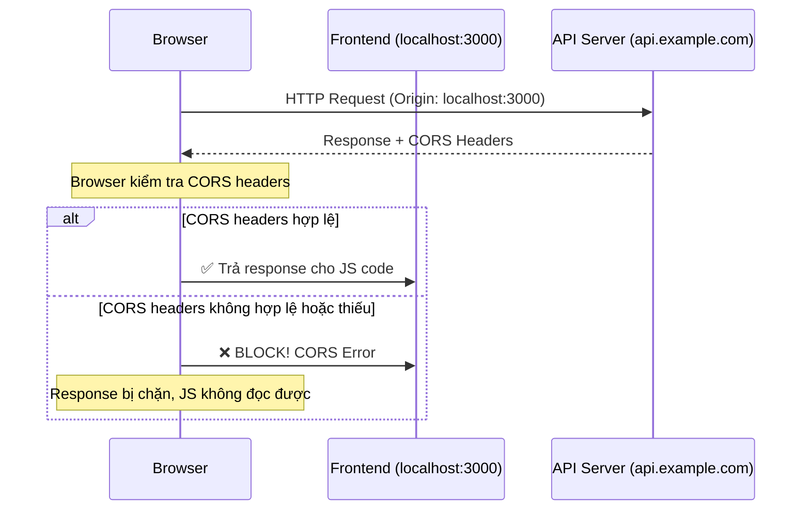

**Quy trình chi tiết:**

1. Browser gửi request kèm header `Origin: http://localhost:3000`
2. Server nhận request, xử lý bình thường, **trả response kèm CORS headers** (hoặc không)
3. **Browser kiểm tra** response headers:
   - `Access-Control-Allow-Origin` có match với origin hiện tại không?
   - `Access-Control-Allow-Methods` có cho phép method này không?
   - `Access-Control-Allow-Headers` có cho phép các custom headers không?
4. Nếu hợp lệ → JS code nhận được response
5. Nếu không hợp lệ → **Browser chặn**, throw CORS error

### 1.4 Simple Request vs. Preflight Request

#### Simple Request (không cần preflight)

Request được coi là "simple" khi thỏa mãn **tất cả** điều kiện:

- Method: `GET`, `HEAD`, hoặc `POST`
- Headers chỉ bao gồm: `Accept`, `Accept-Language`, `Content-Language`, `Content-Type`
- Content-Type chỉ là: `application/x-www-form-urlencoded`, `multipart/form-data`, hoặc `text/plain`

#### Preflight Request

Khi request **không phải simple request** (ví dụ: dùng `PUT`, `DELETE`, custom headers như `x-inface-api-key`, hoặc `Content-Type: application/json`), browser sẽ gửi **preflight request** (`OPTIONS`) trước:

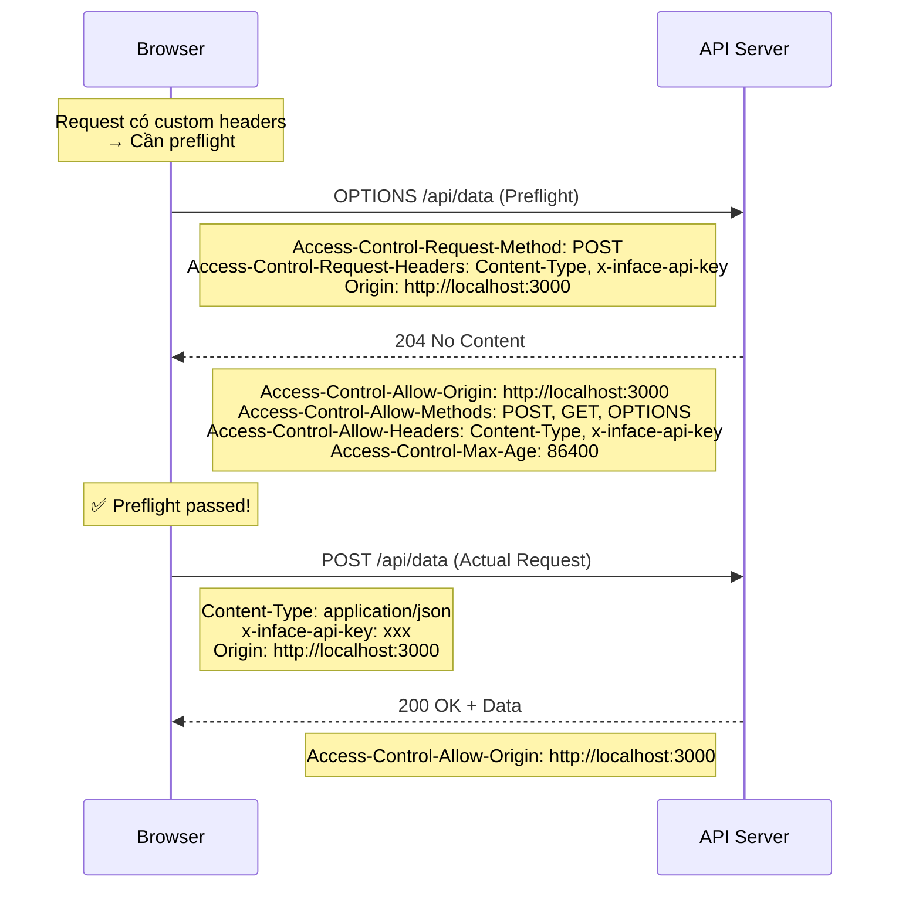

> 📖 **Ref**: [MDN — Preflight Request](https://developer.mozilla.org/en-US/docs/Glossary/Preflight_request)

### 1.5 Tại sao Postman KHÔNG bị CORS?

> 🎯 **Câu trả lời ngắn**: Vì Postman **không phải browser**. CORS chỉ là cơ chế của browser.

| Tool                    | Có CORS không? | Lý do                                                      |
| ----------------------- | -------------- | ---------------------------------------------------------- |
| **Browser**             | ✅ Có          | Browser thực thi Same-Origin Policy, kiểm tra CORS headers |
| **Postman**             | ❌ Không       | Postman là HTTP client thuần, không có Same-Origin Policy  |
| **curl**                | ❌ Không       | CLI tool, không có khái niệm "origin"                      |
| **Server-to-Server**    | ❌ Không       | Server gọi server, không có browser context                |
| **Mobile App (native)** | ❌ Không       | Native HTTP client, không áp dụng web security model       |

**Giải thích sâu:**

- **Same-Origin Policy (SOP)** là security model **chỉ tồn tại trong browser** để bảo vệ user khỏi các trang web độc hại đánh cắp dữ liệu từ các trang khác
- Khi bạn đăng nhập `bank.com`, cookie được lưu. Nếu không có SOP, `evil-site.com` có thể gửi AJAX request đến `bank.com` và đọc response (vì browser tự đính kèm cookie)
- CORS là cơ chế **nới lỏng** SOP một cách có kiểm soát
- Postman, curl, server code không có context của "user đang duyệt web" → không cần SOP → không cần CORS

> 📖 **Ref**: [MDN — Same-Origin Policy](https://developer.mozilla.org/en-US/docs/Web/Security/Same-origin_policy)

### 1.6 Các CORS Headers quan trọng

| Header                             | Mô tả                          | Ví dụ                                           |
| ---------------------------------- | ------------------------------ | ----------------------------------------------- |
| `Access-Control-Allow-Origin`      | Origin nào được phép           | `https://feel-free.com` hoặc `*`             |
| `Access-Control-Allow-Methods`     | Methods nào được phép          | `GET, POST, PUT, DELETE, OPTIONS`               |
| `Access-Control-Allow-Headers`     | Custom headers nào được phép   | `Content-Type, Authorization, x-inface-api-key` |
| `Access-Control-Allow-Credentials` | Cho phép gửi cookies không     | `true`                                          |
| `Access-Control-Max-Age`           | Cache preflight bao lâu (giây) | `86400` (24 giờ)                                |
| `Access-Control-Expose-Headers`    | Headers nào JS được đọc        | `X-Custom-Header, Content-Length`               |

> ⚠️ **Anti-pattern**: `Access-Control-Allow-Origin: *` + `Access-Control-Allow-Credentials: true` **KHÔNG hoạt động**. Browser sẽ reject. Nếu cần credentials, phải specify exact origin.

### 1.7 🚨 CORS Resource Waste — Server xử lý xong, Browser mới chặn!

> **Vấn đề cốt lõi**: CORS là cơ chế **browser-side**. Nghĩa là server **vẫn nhận request, xử lý logic, query database, trả response** — nhưng browser chặn response và throw CORS error. → **Lãng phí tài nguyên server!**

#### Flow của sự lãng phí:

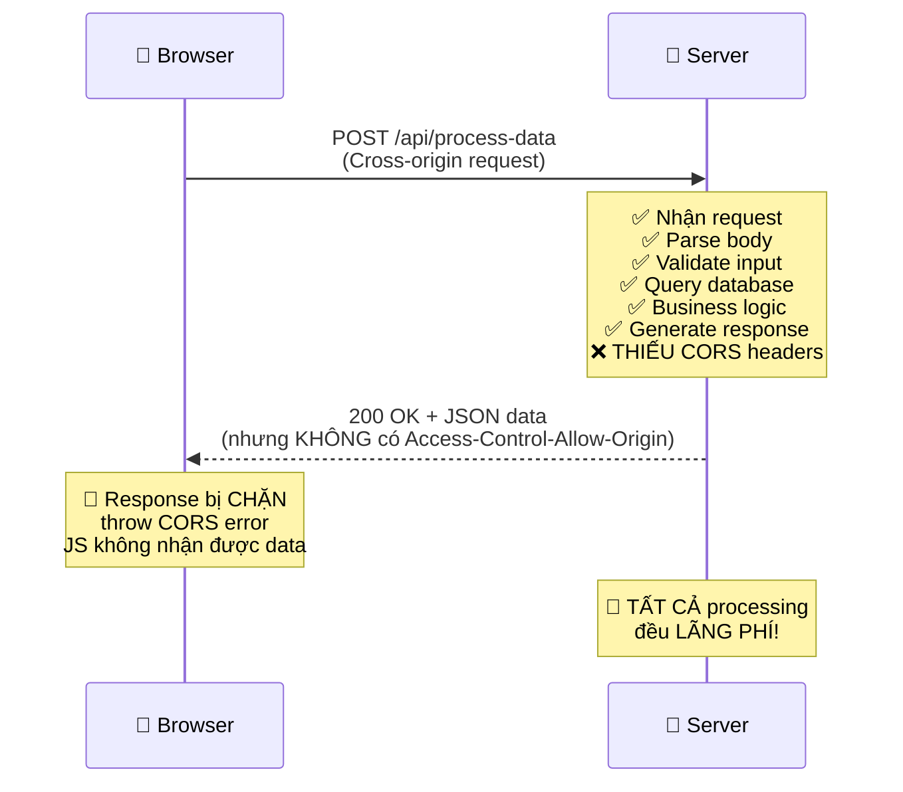

#### Tại sao lãng phí?

| Bước                 | Server làm gì?           | Tốn resource?         | Browser nhận?        |
| -------------------- | ------------------------ | --------------------- | -------------------- |
| 1. Nhận request      | Parse HTTP headers, body | ✅ CPU, Memory        | —                    |
| 2. Authentication    | Verify token, session    | ✅ CPU, DB query      | —                    |
| 3. Business logic    | Xử lý data, calculations | ✅ CPU, Memory        | —                    |
| 4. Database query    | SELECT/INSERT/UPDATE     | ✅ DB connection, I/O | —                    |
| 5. Generate response | Serialize JSON, compress | ✅ CPU, Memory        | —                    |
| 6. Send response     | HTTP response + headers  | ✅ Bandwidth          | ❌ **Browser chặn!** |

> 💡 Server trả về **200 OK** — request thành công! Nhưng browser đọc response headers, thấy thiếu `Access-Control-Allow-Origin` → **vứt bỏ response**, throw TypeError.

#### Cách giảm tải resource waste:

**1. Preflight Caching (`Access-Control-Max-Age`)**

Browser gửi **OPTIONS preflight** trước mỗi cross-origin non-simple request. Nếu không cache, mỗi API call = 2 HTTP requests (OPTIONS + actual).

```
Access-Control-Max-Age: 86400  // Cache preflight 24 giờ
```

| Max-Age          | Hiệu quả                   | Use case                      |
| ---------------- | -------------------------- | ----------------------------- |
| `0`              | Mỗi request đều preflight  | Debug CORS                    |
| `600` (10 phút)  | Giảm ~80% preflight        | API thay đổi thường xuyên     |
| `86400` (24 giờ) | Giảm ~99% preflight        | API ổn định                   |
| `7200`           | Chrome max (2 giờ thực tế) | Chrome cap ở 2h bất kể config |

> ⚠️ **Lưu ý**: Chrome giới hạn max-age thực tế là **7200 giây (2 giờ)** bất kể server set bao nhiêu. Firefox cho phép tối đa **86400 giây (24 giờ)**.

**2. Server-side CORS Rejection (Early Return)**

Thay vì để server xử lý hết rồi mới trả response thiếu CORS headers, hãy **check origin ở đầu middleware** và reject sớm:

```go
// ✅ GOOD: Check origin TRƯỚC khi xử lý business logic
func corsMiddleware(next http.Handler) http.Handler {
    return http.HandlerFunc(func(w http.ResponseWriter, r *http.Request) {
        origin := r.Header.Get("Origin")

        if origin != "" && !isAllowedOrigin(origin) {
            // ❌ Reject NGAY, không chạy business logic
            w.WriteHeader(http.StatusForbidden)
            return
        }

        // ✅ Set CORS headers
        w.Header().Set("Access-Control-Allow-Origin", origin)
        // ... other headers

        // Handle preflight
        if r.Method == "OPTIONS" {
            w.WriteHeader(http.StatusNoContent)
            return
        }

        next.ServeHTTP(w, r) // Chỉ chạy business logic nếu origin hợp lệ
    })
}
```

```javascript
// Express.js equivalent
app.use((req, res, next) => {
	const origin = req.headers.origin;

	if (origin && !allowedOrigins.includes(origin)) {
		return res.status(403).end(); // ❌ Reject sớm
	}

	res.header('Access-Control-Allow-Origin', origin);
	// ...
	if (req.method === 'OPTIONS') {
		return res.status(204).end(); // Handle preflight
	}
	next(); // ✅ Chỉ tiếp tục nếu origin OK
});
```

**3. Same-origin Deployment (Triệt tiêu CORS)**

Cách **tốt nhất** để không lãng phí: **loại bỏ CORS hoàn toàn** bằng cách deploy frontend + API cùng origin:

```
https://www.feel-free.com/          → S3 (frontend)
https://www.feel-free.com/api/v1/*  → ALB → EKS (backend)
↑ Cùng origin → KHÔNG CẦN CORS → KHÔNG LÃNG PHÍ
```

> ✅ Đây chính là cách **Feel freeFrontend** đang làm cho Internal API! CloudFront route `/api/*` về ALB, nên browser thấy same-origin → không trigger CORS.

**4. Bảng so sánh các giải pháp:**

| Giải pháp                    | Hiệu quả giảm waste             | Complexity         | Áp dụng cho Feel free     |
| ---------------------------- | ------------------------------- | ------------------ | --------------------------- |
| **Preflight caching**        | Giảm ~80-99% preflight requests | Thấp (1 header)    | ✅ Content/Portfolio API |
| **Server-side origin check** | 100% reject invalid origin sớm  | Trung bình         | ✅ Inface Gateway           |
| **Same-origin deploy**       | 100% loại bỏ CORS               | Cao (infra change) | ✅ Đã dùng cho Internal API |
| **CDN caching response**     | Giảm origin hits                | Thấp               | ✅ CloudFront đã cache      |

### 1.8 📋 Real-world Case Studies

#### Case Study 1: Feel freeFrontend — CORS với Content API

**Vấn đề**: React app tại `https://www.feel-free.com` cần gọi Content API tại `https://example.api` → **Cross-origin!**

**Giải pháp theo environment:**

| Environment     | Cách giải quyết                                       | Flow                                          |
| --------------- | ----------------------------------------------------- | --------------------------------------------- |
| **Development** | Vite Proxy (`/quick-board` → `example.api`) | Browser → localhost:3000 → Vite → sandbox API |
| **Production**  | Inface Gateway cấu hình CORS headers                  | Browser → example.api (CORS allowed) |

**Bài học**: Development proxy là workaround tốt, nhưng cần test CORS trên staging/production trước khi deploy.

#### Case Study 2: Preflight Storm khi không cache

**Scenario**: Một SPA có 50 API calls khi load page, mỗi call có custom header `Authorization` → tất cả cần preflight.

```
Không cache: 50 × 2 = 100 HTTP requests (50 OPTIONS + 50 actual)
Cache Max-Age: 86400: 50 + 1 = 51 requests (1 OPTIONS đầu tiên + 50 actual)
→ Giảm 49% số requests!
```

#### Case Study 3: Microservices CORS Nightmare

**Scenario**: Company X có 10 microservices, mỗi service tự handle CORS → config không nhất quán.

**Vấn đề**:

- Service A cho phép `*`, Service B chỉ cho phép specific origins
- Service C quên handle OPTIONS → preflight fail
- Service D set `Access-Control-Allow-Credentials: true` + `*` → browser reject

**Giải pháp**: Centralized API Gateway (giống Inface Gateway) xử lý CORS cho tất cả services:

```
Browser → API Gateway (CORS headers) → Service A/B/C/D (no CORS config needed)
```

#### Case Study 4: Mobile App vs Web App — Tại sao mobile không bị CORS?

**Scenario**: Cùng API endpoint, mobile app OK nhưng web app bị CORS error.

**Giải thích**:

- Mobile app dùng native HTTP client (OkHttp, URLSession) → **không có Same-Origin Policy**
- Web app chạy trong browser → **browser enforce SOP + CORS**
- Cùng API, cùng response, nhưng browser chặn response trong khi mobile nhận bình thường

> 💡 **Takeaway**: CORS **không phải lỗi server** — server trả response đúng. Vấn đề nằm ở **browser policy**. Khi debug, hãy kiểm tra response headers, không phải business logic.

### 1.9 🤔 Tại sao POST là Simple Request còn PUT/DELETE thì không?

> **Câu hỏi hay**: POST cũng có thể thay đổi data trên server, vậy tại sao nó được coi là "simple" còn PUT/DELETE thì phải preflight?

#### Lý do lịch sử — HTML `<form>` element

Câu trả lời nằm ở **lịch sử của web**. Trước khi có CORS (trước khi có `fetch()` và `XMLHttpRequest`), HTML `<form>` đã có thể submit cross-origin requests từ thời HTML 2.0 (1995):

```html
<!-- Form này có thể submit đến bất kỳ domain nào — từ trước khi CORS tồn tại -->
<form action="https://other-site.com/api/data" method="POST">
  <input name="username" value="admin" />
  <button type="submit">Submit</button>
</form>
```

**HTML forms chỉ hỗ trợ 3 methods**: `GET`, `POST` (và `DIALOG` cho `<form method="dialog">`). **Không bao giờ có `<form method="PUT">` hay `<form method="DELETE">`**.

#### Logic của CORS spec:

| Method     | Form có thể gửi? | Server đã phải handle từ trước? | Cần preflight? |
| ---------- | ----------------- | -------------------------------- | -------------- |
| `GET`      | ✅ Có             | ✅ Có (từ 1995)                  | ❌ Không       |
| `HEAD`     | ❌ Không          | ✅ Có (tương tự GET)             | ❌ Không       |
| `POST`     | ✅ Có             | ✅ Có (từ 1995)                  | ❌ Không*      |
| `PUT`      | ❌ Không          | ❌ Không (JS-only method)        | ✅ Có          |
| `DELETE`   | ❌ Không          | ❌ Không (JS-only method)        | ✅ Có          |
| `PATCH`    | ❌ Không          | ❌ Không (JS-only method)        | ✅ Có          |

> *POST chỉ "simple" khi Content-Type là `application/x-www-form-urlencoded`, `multipart/form-data`, hoặc `text/plain` — đúng những gì HTML form có thể gửi. `POST` với `Content-Type: application/json` **vẫn trigger preflight!**

#### Tại sao lại quan trọng?

Khi CORS spec được thiết kế, nguyên tắc cốt lõi là: **"Không làm web kém an toàn hơn trước khi có CORS"**.

- Trước CORS, bất kỳ trang web nào cũng có thể submit form `POST` đến server khác → server **đã phải** bảo vệ chống [CSRF](https://developer.mozilla.org/en-US/docs/Glossary/CSRF)
- `PUT`/`DELETE` **chưa bao giờ** có thể gửi cross-origin trước CORS (chỉ JS mới dùng được) → server **có thể chưa** bảo vệ chống cross-origin `PUT`/`DELETE`
- Nếu cho phép `PUT`/`DELETE` mà không preflight → server cũ sẽ bị tấn công bởi các request mà trước đó không thể xảy ra

> 📖 **Ref**: [MDN — Simple Requests](https://developer.mozilla.org/en-US/docs/Web/HTTP/Guides/CORS#simple_requests) — *"The motivation is that the `<form>` element from HTML 4.0 can submit simple requests to any origin, so anyone writing a server must already be protecting against CSRF."*

#### Ví dụ minh họa:

```javascript
// ✅ Simple request — không preflight
fetch('https://api.example.com/data', {
  method: 'POST',
  headers: { 'Content-Type': 'application/x-www-form-urlencoded' },
  body: 'name=John&age=30'
});

// ❌ KHÔNG simple — trigger preflight vì Content-Type: application/json
fetch('https://api.example.com/data', {
  method: 'POST',
  headers: { 'Content-Type': 'application/json' },
  body: JSON.stringify({ name: 'John', age: 30 })
});

// ❌ KHÔNG simple — trigger preflight vì method là PUT
fetch('https://api.example.com/data/1', {
  method: 'PUT',
  headers: { 'Content-Type': 'application/json' },
  body: JSON.stringify({ name: 'Jane' })
});
```

### 1.10 🛡️ SOP, CSP và CORS — Bộ ba bảo mật Web

Ba cơ chế bảo mật này thường bị nhầm lẫn hoặc trộn lẫn khái niệm. Dưới đây là cách chúng **khác nhau** và **liên quan** đến nhau:

#### 1.10.1 So sánh tổng quan

| Tiêu chí          | SOP (Same-Origin Policy)                         | CORS (Cross-Origin Resource Sharing)               | CSP (Content Security Policy)                         |
| ----------------- | ------------------------------------------------ | --------------------------------------------------- | ---------------------------------------------------- |
| **Là gì?**        | Browser security model mặc định                 | Cơ chế **nới lỏng** SOP có kiểm soát               | HTTP header chỉ định resources nào được phép load     |
| **Ai enforce?**   | Browser                                          | Browser (dựa trên server headers)                   | Browser (dựa trên server headers)                    |
| **Mục đích**      | Ngăn JS đọc data cross-origin                    | Cho phép server chỉ định origins được truy cập      | Ngăn XSS, clickjacking, data injection               |
| **Config ở đâu?** | Browser tự enforce (không config)                | Server trả CORS response headers                    | Server trả `Content-Security-Policy` header          |
| **Bảo vệ khỏi**  | Data theft qua cross-origin requests             | N/A (nó _cho phép_, không _bảo vệ_)                 | XSS, clickjacking, mixed content, code injection     |

#### 1.10.2 SOP — Same-Origin Policy (Nền tảng)

SOP là **chính sách bảo mật mặc định** của browser, tồn tại từ Netscape Navigator 2.0 (1995):

- JS trên `origin A` **không thể đọc** response từ `origin B`
- JS trên `origin A` **không thể truy cập** DOM, cookies, localStorage của `origin B`
- SOP **không chặn request** — nó chặn **đọc response**

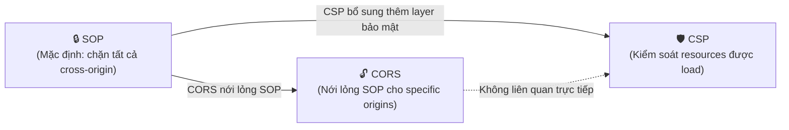

> 📖 **Ref**: [MDN — Same-Origin Policy](https://developer.mozilla.org/en-US/docs/Web/Security/Same-origin_policy)

#### 1.10.3 CSP — Content Security Policy

CSP là một **lớp bảo mật bổ sung** giúp phát hiện và giảm thiểu các loại tấn công bao gồm XSS và data injection:

```http
Content-Security-Policy: default-src 'self'; img-src 'self' example.com; script-src 'self' 'nonce-abc123'
```

**CSP kiểm soát:**

| Directive       | Kiểm soát                        | Ví dụ                                        |
| --------------- | -------------------------------- | -------------------------------------------- |
| `default-src`   | Fallback cho tất cả resources    | `'self'` — chỉ load từ same origin           |
| `script-src`    | JavaScript sources               | `'self' 'nonce-xxx'` — self + nonce scripts  |
| `style-src`     | CSS sources                      | `'self' 'unsafe-inline'`                     |
| `img-src`       | Image sources                    | `'self' data: https://cdn.example.com`       |
| `connect-src`   | API endpoints (fetch, XHR, WS)   | `'self' https://api.example.com`             |
| `frame-ancestors`| Ai có thể embed trang này (iframe)| `'none'` — chống clickjacking                |
| `font-src`      | Font sources                     | `'self' https://fonts.gstatic.com`           |

**Lưu ý quan trọng**: `connect-src` trong CSP **cũng ảnh hưởng đến fetch/XHR requests**, tương tự CORS nhưng **ở layer khác**:

```
Request flow:
1. CSP check → connect-src cho phép domain này không?      → Nếu KHÔNG → Block request luôn
2. Browser gửi request
3. CORS check → Response có Access-Control-Allow-Origin?    → Nếu KHÔNG → Block response
```

> ⚠️ Nếu CSP `connect-src` không bao gồm API domain, request sẽ bị **block trước cả khi CORS check xảy ra!**

```javascript
// Ví dụ: Server trả CSP header
// Content-Security-Policy: connect-src 'self' https://api.allowed.com

fetch('https://api.allowed.com/data');     // ✅ CSP OK → rồi mới check CORS
fetch('https://api.blocked.com/data');     // ❌ CSP block ngay! Không gửi request
```

> 📖 **Ref**: [MDN — Content Security Policy (CSP)](https://developer.mozilla.org/en-US/docs/Web/HTTP/Guides/CSP)

#### 1.10.4 Mối quan hệ giữa SOP, CORS, CSP

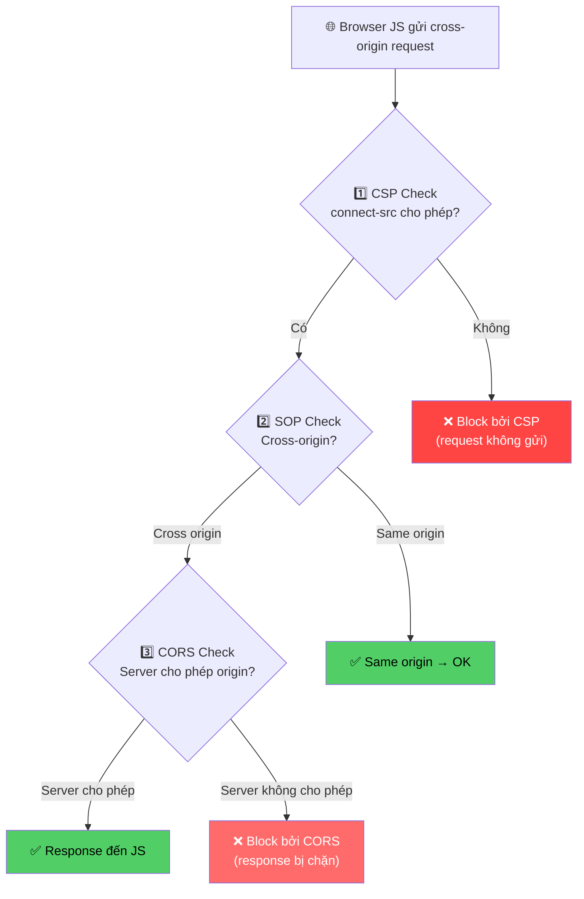

**Real-world example — Feel freeFrontend:**

```http
# Response headers từ feel-free.com
Content-Security-Policy: default-src 'self'; connect-src 'self' https://example.api; script-src 'self' 'nonce-xxx'; img-src 'self' data: httpsexample/cdn; frame-ancestors 'none'
```

- `connect-src 'self' https://example.api` → Cho phép gọi Internal API (self) và Content API
- `frame-ancestors 'none'` → Không cho phép iframe embed → chống clickjacking
- `script-src 'self' 'nonce-xxx'` → Chỉ chạy scripts từ same origin + scripts có nonce → chống XSS

### 1.11 🌐 Subdomain và CORS

> **Câu hỏi thường gặp**: `api.feel-free.com` và `www.feel-free.com` có cùng origin không? Có bị CORS không?

#### Câu trả lời ngắn: **CÓ bị CORS** — Subdomain khác = Origin khác!

```
https://www.feel-free.com     (subdomain: www)
https://api.feel-free.com     (subdomain: api)
      ↑ KHÁC subdomain → KHÁC hostname → KHÁC origin → CORS!
```

| URL A                            | URL B                            | Same Origin? | Lý do                      |
| -------------------------------- | -------------------------------- | ------------ | --------------------------- |
| `https://feel-free.com`       | `https://www.feel-free.com`   | ❌ Không     | hostname khác (www prefix)  |
| `https://www.feel-free.com`   | `https://api.feel-free.com`   | ❌ Không     | subdomain khác              |
| `https://dev.feel-free.com`   | `https://test.feel-free.com`  | ❌ Không     | subdomain khác              |
| `https://feel-free.com`       | `https://feel-free.com/api`   | ✅ Có        | chỉ khác path              |

#### Cách cho phép subdomain trên server:

```typescript
// Express.js — Dynamic origin checking cho subdomains
import cors from 'cors';

const corsOptions: cors.CorsOptions = {
  origin: (origin, callback) => {
    // Cho phép tất cả subdomains của feel-free.com
    const allowedPattern = /^https:\/\/([a-z0-9-]+\.)?feelfree\.global$/;

    if (!origin || allowedPattern.test(origin)) {
      callback(null, true);
    } else {
      callback(new Error('Not allowed by CORS'));
    }
  },
  credentials: true,
};

app.use(cors(corsOptions));
```

```go
// Go — Subdomain checking
func isAllowedSubdomain(origin string) bool {
    // Regex: https://<anything>.feel-free.com hoặc https://feel-free.com
    pattern := regexp.MustCompile(`^https://([a-z0-9-]+\.)?feelfree\.global$`)
    return pattern.MatchString(origin)
}
```

#### Lưu ý về cookies giữa subdomains:

Cookies có thể được share giữa subdomains bằng `Domain` attribute nhưng **vẫn cần CORS headers hợp lệ** để browser cho phép cross-origin request:

```http
Set-Cookie: session=abc123; Domain=.feel-free.com; Path=/; Secure; SameSite=None
```

- `Domain=.feel-free.com` → Cookie được share cho tất cả `*.feel-free.com`
- **Nhưng** request từ `www.feel-free.com` đến `api.feel-free.com` vẫn là cross-origin
- Server `api.feel-free.com` **vẫn phải** trả `Access-Control-Allow-Origin: https://www.feel-free.com` + `Access-Control-Allow-Credentials: true`

### 1.12 🔧 Bypass CORS bằng /etc/hosts?

> **Câu hỏi**: Có thể bypass CORS bằng cách edit file `/etc/hosts` (hoặc `C:\Windows\System32\drivers\etc\hosts` trên Windows) để trỏ domain về localhost?

#### Ngữ cảnh: Authentication + Cookies trên dev

Kỹ thuật này **thường dùng để bypass authentication/cookies**, không phải CORS trực tiếp:

```bash
# /etc/hosts
127.0.0.1   dev.abc.com
```

Khi truy cập `dev.abc.com` trong browser:
- DNS resolve `dev.abc.com` → `127.0.0.1` (localhost)
- Browser vẫn xem origin là `https://dev.abc.com`
- Cookies set cho `.abc.com` domain sẽ được gửi (vì hostname match)
- Nếu server production chấp nhận `dev.abc.com` trong CORS → hoạt động

#### Có bypass CORS không?

| Scenario | /etc/hosts giúp không? | Giải thích |
| -------- | ---------------------- | ---------- |
| Frontend `dev.abc.com` gọi API `api.abc.com` | ⚠️ Một phần | Browser vẫn thấy cross-origin (`dev` ≠ `api`). Nhưng nếu server cho phép `*.abc.com` → OK |
| Frontend `dev.abc.com` gọi API `dev.abc.com/api` | ✅ Có! | Same origin — không CORS. Nếu dev server proxy `/api` route |
| Cần cookies từ production domain | ✅ Giúp | Cookie domain `.abc.com` match hostname `dev.abc.com` |
| Frontend `localhost:3000` gọi API `api.abc.com` | ❌ Không | Dù trỏ hostname, `localhost:3000` vẫn là origin khác |

#### Flow thực tế khi bypass auth với /etc/hosts:

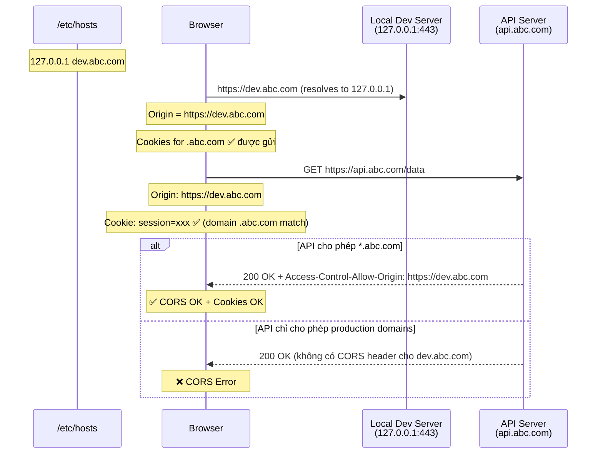

#### Khi nào nên dùng kỹ thuật này?

| Use case | Nên dùng? | Lý do |
| -------- | --------- | ----- |
| Dev cần cookies từ production domain | ✅ Nên | Cách đơn giản nhất để test auth flow |
| Bypass CORS hoàn toàn | ❌ Không đủ | Vẫn cần server cho phép origin |
| Test Same-origin behavior | ✅ Nên | Trỏ frontend + API cùng hostname |
| CI/CD environments | ❌ Không | Không modify /etc/hosts trong CI |

#### Cách setup SSL cho dev hostname:

```bash
# Dùng mkcert để tạo local SSL cert cho custom hostname
brew install mkcert
mkcert -install
mkcert dev.abc.com localhost 127.0.0.1

# Sử dụng cert trong Vite
# vite.config.ts
import fs from 'fs';

export default defineConfig({
  server: {
    https: {
      key: fs.readFileSync('./dev.abc.com+2-key.pem'),
      cert: fs.readFileSync('./dev.abc.com+2.pem'),
    },
    host: 'dev.abc.com',
    port: 443,
  },
});
```

> ⚠️ **Bảo mật**: Kỹ thuật /etc/hosts **chỉ dùng cho development**. Trong production, CORS phải được config riêng đúng cách ở server.

### 1.13 🔐 Server-to-Server — Bảo mật khi không có CORS

> **Câu hỏi**: CORS chỉ áp dụng cho browser. Vậy server-to-server communication chặn/bảo mật bằng cách nào?

#### Tại sao server-to-server không có CORS?

CORS là cơ chế **browser-only** — nó bảo vệ **user** khỏi trang web độc hại. Khi server gọi server, không có **user context** (không có cookies, không có session browser) → CORS vô nghĩa.

**Nhưng** server-to-server vẫn cần bảo mật! Dưới đây là các phương pháp:

#### 1.13.1 API Key / Secret Key

```go
// Server A gọi Server B
req, _ := http.NewRequest("GET", "https://api.internal.com/data", nil)
req.Header.Set("X-API-Key", os.Getenv("INTERNAL_API_KEY"))
req.Header.Set("X-Client-ID", "service-frontend-backend")
```

```typescript
// Express.js — Middleware kiểm tra API key
const validateApiKey = (req: Request, res: Response, next: NextFunction) => {
  const apiKey = req.headers['x-api-key'];
  if (apiKey !== process.env.INTERNAL_API_KEY) {
    return res.status(401).json({ error: 'Invalid API key' });
  }
  next();
};
```

#### 1.13.2 IP Allowlisting (Whitelist)

Chỉ cho phép request từ IP đã biết:

```nginx
# Nginx — chặn theo IP
location /internal-api/ {
    allow 10.0.1.0/24;     # VPC subnet
    allow 52.78.xxx.xxx;   # Specific server IP
    deny all;               # Block tất cả IP khác
}
```

```go
// Go middleware — IP whitelist
func ipWhitelistMiddleware(allowedIPs []string) func(http.Handler) http.Handler {
    return func(next http.Handler) http.Handler {
        return http.HandlerFunc(func(w http.ResponseWriter, r *http.Request) {
            clientIP := strings.Split(r.RemoteAddr, ":")[0]
            // Hoặc lấy từ X-Forwarded-For nếu qua proxy

            allowed := false
            for _, ip := range allowedIPs {
                if clientIP == ip {
                    allowed = true
                    break
                }
            }

            if !allowed {
                http.Error(w, "Forbidden", http.StatusForbidden)
                return
            }
            next.ServeHTTP(w, r)
        })
    }
}
```

#### 1.13.3 AWS VPC / Network Level (Kiến trúc Select All)

Trong project Select All, Backend EKS chạy trong **VPC riêng** được bảo vệ bởi:

```
Internet → CloudFront → WAF (IP check) → ALB → VPC → EKS
                                                  ↓
                                          EKS → Inface Gateway (Server-to-Server)
```

- **WAF**: Chặn IP không hợp lệ ở edge
- **Security Groups**: Chỉ cho phép ALB gọi đến EKS
- **VPC Network ACL**: Kiểm soát traffic ở subnet level
- **Inface Gateway**: API key authentication cho server-to-server calls

#### 1.13.4 mTLS (Mutual TLS)

Cả client và server đều verify certificate của nhau:

```go
// Go — mTLS client
cert, _ := tls.LoadX509KeyPair("client.crt", "client.key")
caCert, _ := os.ReadFile("ca.crt")
caCertPool := x509.NewCertPool()
caCertPool.AppendCertsFromPEM(caCert)

client := &http.Client{
    Transport: &http.Transport{
        TLSClientConfig: &tls.Config{
            Certificates: []tls.Certificate{cert},
            RootCAs:      caCertPool,
        },
    },
}
```

#### 1.13.5 So sánh các phương pháp

| Phương pháp        | Bảo mật  | Complexity | Use case                              |
| ------------------- | -------- | ---------- | ------------------------------------- |
| **API Key**         | Trung bình | Thấp      | Internal services, dev environments   |
| **IP Allowlist**    | Cao       | Thấp      | Known servers, VPC-to-VPC             |
| **VPC/Network**     | Rất cao   | Cao       | AWS/Cloud infrastructure              |
| **mTLS**            | Rất cao   | Rất cao   | Zero-trust architecture, banking      |
| **JWT/OAuth2**      | Cao       | Trung bình | Service-to-service auth, microservices|
| **VPN/Private Network** | Rất cao | Cao      | On-premise, hybrid cloud              |

### 1.14 🐛 Common CORS Errors & Debugging Guide

#### Error 1: "No 'Access-Control-Allow-Origin' header is present"

```
❌ Access to fetch at 'https://api.example.com/data' from origin 'http://localhost:3000'
   has been blocked by CORS policy: No 'Access-Control-Allow-Origin' header is present
   on the requested resource.
```

**Nguyên nhân**: Server không trả `Access-Control-Allow-Origin` header.

**Fix**:
```typescript
// Express.js
app.use((req, res, next) => {
  res.header('Access-Control-Allow-Origin', 'http://localhost:3000');
  next();
});
// Hoặc dùng cors package
import cors from 'cors';
app.use(cors({ origin: 'http://localhost:3000' }));
```

> ⚠️ **Cẩn thận**: Đôi khi lỗi này xuất hiện vì **server down** hoặc **network error** — không nhận được response nào → không có headers. Kiểm tra Network tab xem request có status code không.

#### Error 2: "Wildcard '*' cannot be used with credentials"

```
❌ The value of the 'Access-Control-Allow-Origin' header must not be the wildcard '*'
   when the request's credentials mode is 'include'.
```

**Nguyên nhân**: `Access-Control-Allow-Origin: *` + `credentials: 'include'` → Spec cấm.

**Fix**:
```typescript
app.use(cors({
  origin: 'https://www.feel-free.com', // Explicit origin, KHÔNG dùng *
  credentials: true,
}));
```

#### Error 3: "Method PUT is not allowed"

```
❌ Method PUT is not allowed by Access-Control-Allow-Methods in preflight response.
```

**Nguyên nhân**: Server trả preflight response thiếu method `PUT` trong `Access-Control-Allow-Methods`.

**Fix**:
```typescript
app.use(cors({
  origin: 'https://www.feel-free.com',
  methods: ['GET', 'POST', 'PUT', 'DELETE', 'PATCH', 'OPTIONS'],
}));
```

#### Error 4: "Request header field X is not allowed"

```
❌ Request header field authorization is not allowed by Access-Control-Allow-Headers
   in preflight response.
```

**Nguyên nhân**: Custom header (Authorization, x-api-key, ...) chưa được liệt kê trong `Access-Control-Allow-Headers`.

**Fix**:
```typescript
app.use(cors({
  origin: 'https://www.feel-free.com',
  allowedHeaders: ['Content-Type', 'Authorization', 'x-inface-api-key'],
}));
```

#### Error 5: Preflight 404 / 405

```
❌ Response to preflight request doesn't pass access control check: It does not have
   HTTP ok status.
```

**Nguyên nhân**: Server/framework không handle `OPTIONS` method → trả 404 (Not Found) hoặc 405 (Method Not Allowed).

**Fix**:
```typescript
// Express.js — Handle OPTIONS explicitly
app.options('*', cors()); // Preflight cho tất cả routes

// Hoặc Serverless (AWS Lambda, Cloudflare Worker)
export async function handler(event) {
  if (event.httpMethod === 'OPTIONS') {
    return {
      statusCode: 204,
      headers: {
        'Access-Control-Allow-Origin': 'https://www.feel-free.com',
        'Access-Control-Allow-Methods': 'GET, POST, PUT, DELETE, OPTIONS',
        'Access-Control-Allow-Headers': 'Content-Type, Authorization',
        'Access-Control-Max-Age': '86400',
      },
      body: '',
    };
  }
  // ... handle actual request
}
```

#### Error 6: CORS error nhưng thực ra là Network error

**Triệu chứng**: Console hiện CORS error nhưng Network tab hiện `(failed)` hoặc `ERR_CONNECTION_REFUSED`.

**Nguyên nhân**: Server down, DNS failure, firewall block → không có response → không có CORS headers → browser report là CORS error.

**Debug**: Kiểm tra Network tab. Nếu request **không có status code**, đó là network error, không phải CORS.

#### 🔍 CORS Debug Checklist

```
1. ☐ Mở DevTools → Network tab → Kiểm tra request có status code không?
   → Không có status → Network error, KHÔNG phải CORS
2. ☐ Kiểm tra response headers có "Access-Control-Allow-Origin" không?
   → Không có → Server chưa config CORS
3. ☐ Value của Access-Control-Allow-Origin có match với origin hiện tại?
   → https://www.feel-free.com ≠ http://www.feel-free.com (protocol!)
4. ☐ Nếu gửi credentials → Access-Control-Allow-Origin có phải * không?
   → * + credentials = Error. Phải dùng explicit origin
5. ☐ Có preflight (OPTIONS request) không?
   → Kiểm tra OPTIONS response có 2xx status không
6. ☐ OPTIONS response có đủ Allow-Methods và Allow-Headers không?
   → Thiếu method/header = preflight fail
7. ☐ Server có handle OPTIONS method không?
   → 404/405 cho OPTIONS = server chưa handle preflight
8. ☐ Kiểm tra có proxy/CDN/Load Balancer strip CORS headers không?
   → Nginx, CloudFront có thể override/strip headers
9. ☐ Kiểm tra HTTP vs HTTPS mismatch
   → http://localhost:3000 → https://api.example.com (protocol khác = CORS)
10. ☐ Thử dùng curl/Postman để verify server trả CORS headers?
    → curl -I -H "Origin: http://localhost:3000" https://api.example.com
```

### 1.15 💻 Code Examples — CORS Config trên Server

#### 1.15.1 TypeScript + Express.js

**Cách 1: Dùng `cors` package (recommended)**

```typescript
import express from 'express';
import cors from 'cors';

const app = express();

// Danh sách origins được phép
const allowedOrigins = [
  'https://www.feel-free.com',
  'https://dev.feel-free.com',
  'https://test.feel-free.com',
];

// Development: thêm localhost
if (process.env.NODE_ENV === 'development') {
  allowedOrigins.push('http://localhost:3000', 'http://localhost:5173');
}

const corsOptions: cors.CorsOptions = {
  origin: (origin, callback) => {
    // Allow requests with no origin (server-to-server, mobile, Postman)
    if (!origin) return callback(null, true);

    if (allowedOrigins.includes(origin)) {
      callback(null, true);
    } else {
      callback(new Error(`Origin ${origin} not allowed by CORS`));
    }
  },
  methods: ['GET', 'POST', 'PUT', 'DELETE', 'PATCH', 'OPTIONS'],
  allowedHeaders: ['Content-Type', 'Authorization', 'x-inface-api-key', 'x-request-id'],
  exposedHeaders: ['X-Total-Count', 'X-Page-Size'],
  credentials: true,
  maxAge: 7200, // 2 hours (Chrome max)
  optionsSuccessStatus: 204,
};

// Apply CORS middleware
app.use(cors(corsOptions));

// Routes
app.get('/api/health', (req, res) => {
  res.json({ status: 'ok' });
});

app.listen(4000, () => console.log('Server running on :4000'));
```

**Cách 2: Manual middleware (không cần package)**

```typescript
import express, { Request, Response, NextFunction } from 'express';

const app = express();

const ALLOWED_ORIGINS = new Set([
  'https://www.feel-free.com',
  'https://dev.feel-free.com',
]);

function corsMiddleware(req: Request, res: Response, next: NextFunction): void {
  const origin = req.headers.origin;

  if (origin && ALLOWED_ORIGINS.has(origin)) {
    res.setHeader('Access-Control-Allow-Origin', origin);
    res.setHeader('Access-Control-Allow-Credentials', 'true');
    res.setHeader('Vary', 'Origin'); // Quan trọng cho CDN caching!
  }

  // Handle preflight
  if (req.method === 'OPTIONS') {
    res.setHeader('Access-Control-Allow-Methods', 'GET, POST, PUT, DELETE, PATCH, OPTIONS');
    res.setHeader('Access-Control-Allow-Headers', 'Content-Type, Authorization, x-inface-api-key');
    res.setHeader('Access-Control-Max-Age', '7200');
    res.status(204).end();
    return;
  }

  next();
}

app.use(corsMiddleware);
```

#### 1.15.2 Golang

**Cách 1: Dùng `rs/cors` package (recommended)**

```go
package main

import (
    "net/http"
    "github.com/rs/cors"
)

func main() {
    mux := http.NewServeMux()
    mux.HandleFunc("/api/health", func(w http.ResponseWriter, r *http.Request) {
        w.Header().Set("Content-Type", "application/json")
        w.Write([]byte(`{"status":"ok"}`))
    })

    // CORS configuration
    c := cors.New(cors.Options{
        AllowedOrigins:   []string{
            "https://www.feel-free.com",
            "https://dev.feel-free.com",
            "http://localhost:3000",
        },
        AllowedMethods:   []string{"GET", "POST", "PUT", "DELETE", "PATCH", "OPTIONS"},
        AllowedHeaders:   []string{"Content-Type", "Authorization", "X-Inface-API-Key", "X-Request-ID"},
        ExposedHeaders:   []string{"X-Total-Count", "X-Page-Size"},
        AllowCredentials: true,
        MaxAge:           7200, // 2 hours
    })

    handler := c.Handler(mux)
    http.ListenAndServe(":4000", handler)
}
```

**Cách 2: Manual middleware**

```go
package main

import (
    "net/http"
    "slices"
)

var allowedOrigins = []string{
    "https://www.feel-free.com",
    "https://dev.feel-free.com",
    "http://localhost:3000",
}

func corsMiddleware(next http.Handler) http.Handler {
    return http.HandlerFunc(func(w http.ResponseWriter, r *http.Request) {
        origin := r.Header.Get("Origin")

        if origin != "" && slices.Contains(allowedOrigins, origin) {
            w.Header().Set("Access-Control-Allow-Origin", origin)
            w.Header().Set("Access-Control-Allow-Credentials", "true")
            w.Header().Set("Vary", "Origin")
        } else if origin != "" {
            // Origin không được phép → reject sớm (giảm resource waste)
            w.WriteHeader(http.StatusForbidden)
            return
        }

        // Handle preflight
        if r.Method == http.MethodOptions {
            w.Header().Set("Access-Control-Allow-Methods", "GET, POST, PUT, DELETE, PATCH, OPTIONS")
            w.Header().Set("Access-Control-Allow-Headers", "Content-Type, Authorization, X-Inface-API-Key")
            w.Header().Set("Access-Control-Max-Age", "7200")
            w.WriteHeader(http.StatusNoContent)
            return
        }

        next.ServeHTTP(w, r)
    })
}

func main() {
    mux := http.NewServeMux()
    mux.HandleFunc("/api/health", func(w http.ResponseWriter, r *http.Request) {
        w.Header().Set("Content-Type", "application/json")
        w.Write([]byte(`{"status":"ok"}`))
    })

    http.ListenAndServe(":4000", corsMiddleware(mux))
}
```

#### 1.15.3 Bonus: Kiểm tra CORS Headers bằng curl

```bash
# Test simple request
curl -I -H "Origin: https://www.feel-free.com" https://api.example.com/data

# Test preflight request
curl -X OPTIONS \
  -H "Origin: https://www.feel-free.com" \
  -H "Access-Control-Request-Method: POST" \
  -H "Access-Control-Request-Headers: Content-Type, Authorization" \
  -v https://api.example.com/data

# Kỳ vọng response có:
# Access-Control-Allow-Origin: https://www.feel-free.com
# Access-Control-Allow-Methods: POST, GET, OPTIONS
# Access-Control-Allow-Headers: Content-Type, Authorization
# Access-Control-Max-Age: 7200
```

---

## 2. 🔀 PROXY là gì?

### 2.1 Định nghĩa

**Proxy** (Proxy Server) là server trung gian đứng giữa client và server đích, nhận request từ client, forward đến server đích, rồi trả response về cho client.

### 2.2 Các loại Proxy

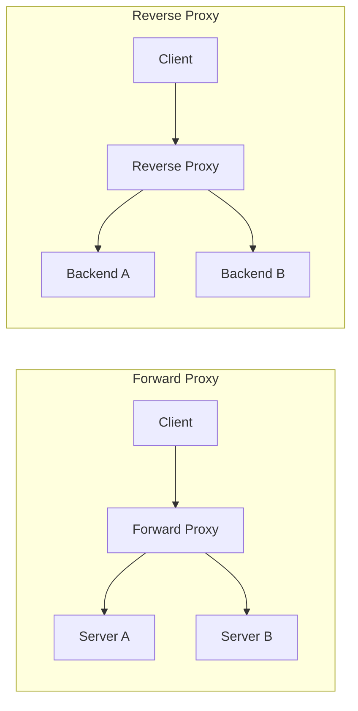

#### Forward Proxy

- Đứng phía **client**, ẩn identity của client
- Client biết mình đang dùng proxy
- Ví dụ: VPN, corporate proxy, web scraping proxy

#### Reverse Proxy

- Đứng phía **server**, client không biết có proxy
- Ví dụ: Nginx, CloudFront, HAProxy, Traefik
- Chức năng: load balancing, SSL termination, caching, CORS handling

### 2.3 Tại sao Developer cần PROXY?

Khi develop frontend ở `localhost:3000` và API ở `api.example.com`:

```
Browser (localhost:3000) → api.example.com
                          ❌ CORS ERROR!
```

Với proxy:

```
Browser (localhost:3000) → Proxy (localhost:3000/api) → api.example.com
                          ✅ Same origin!              Server-to-server, no CORS
```

**Lý do chính:**

1. **Bypass CORS trong development**: Proxy forward request từ same origin → không bị CORS
2. **Giấu API key**: Proxy có thể inject headers/secrets mà không expose lên browser
3. **URL rewriting**: Map `/api` → `https://production-api.com`
4. **Debug/Logging**: Dễ log request/response giữa frontend và backend
5. **Mock responses**: Có thể hiện proxy trả mock data khi backend chưa ready

---

## 3. 🔗 CORS và PROXY liên quan gì đến nhau?

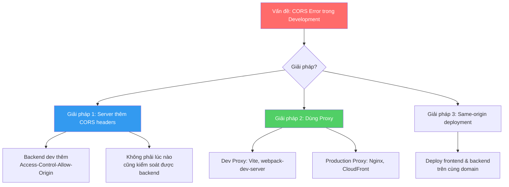

**Mối quan hệ:**

| Aspect         | CORS                              | PROXY                       |
| -------------- | --------------------------------- | --------------------------- |
| Là gì?         | Cơ chế bảo mật (browser security) | Server trung gian (pattern) |
| Ai thực thi?   | Browser                           | Server/Dev tool             |
| Giải quyết gì? | Kiểm soát cross-origin access     | Forward request, ẩn origin  |
| Khi nào dùng?  | Luôn có trong browser             | Development & Production    |

**PROXY "giải quyết" CORS bằng cách biến cross-origin thành same-origin hoặc server-to-server** (không có browser → không có CORS check).

---

## 4. ⚡ Vite Proxy Config — Chi tiết

### 4.1 Vite Proxy là gì?

Vite dev server (dùng [http-proxy](https://github.com/http-party/node-http-proxy) bên dưới) tạo một **reverse proxy** trên cùng port với dev server. Khi browser gửi request đến `/api`, Vite dev server sẽ forward request đến target server thay vì trả 404.

> 📖 **Ref**: [Vite — Server Options: server.proxy](https://vite.dev/config/server-options.html#server-proxy)

### 4.2 Vite Proxy khác gì PROXY bình thường?

| Feature         | Vite Proxy                  | PROXY bình thường (Nginx, HAProxy)          |
| --------------- | --------------------------- | ------------------------------------------- |
| **Scope**       | Chỉ trong development       | Development + Production                    |
| **Lifetime**    | Chạy cùng dev server        | Chạy độc lập, 24/7                          |
| **Config**      | JS/TS trong vite.config.ts  | Config file riêng (nginx.conf, etc.)        |
| **Performance** | Không tối ưu cho production | Tối ưu cao (C/Go compiled)                  |
| **Tính năng**   | Basic proxy + rewrite       | Load balancing, SSL, caching, rate limiting |
| **Purpose**     | Bypass CORS khi dev         | Full reverse proxy capabilities             |

> ✅ **Kết luận**: Vite proxy **đúng là một dạng proxy đặc biệt** — nó chỉ là reverse proxy đơn giản chạy trong dev server, dùng `http-proxy` library để forward request. Không dùng cho production.

### 4.3 Config Vite Proxy — Chi tiết từng option

#### Config hiện tại trong project (vite.config.ts)

```typescript
// vite.config.ts
export default defineConfig(({ mode }) => {
	return {
		server: {
			host: true,
			hmr: true,
			port: 3000,
			proxy: {
				// Key: path prefix để match
				'/quick-board': {
					// Target: URL đích để forward request
					target: 'https://example.api/quick-board/api/v1',

					// changeOrigin: thay đổi header "Origin" thành target URL
					// Quan trọng khi target server kiểm tra Origin header
					changeOrigin: true,

					// secure: false → cho phép proxy đến HTTPS server với self-signed cert
					secure: false,

					// rewrite: transform request path trước khi forward
					rewrite: (path) => {
						console.info('Original request path:', path);
						// /quick-board/articles → /articles
						return path.replace(/^\/quick-board/, '');
					},

					// configure: access raw http-proxy instance để custom events
					configure: (proxy) => {
						proxy.on('proxyReq', (proxyReq) => {
							console.info('Proxying request:', proxyReq.method, proxyReq.path);
						});
						proxy.on('error', (err) => {
							console.error('Proxy error:', err.message);
						});
					},
				},
			},
		},
	};
});
```

#### Flow khi Vite Proxy hoạt động

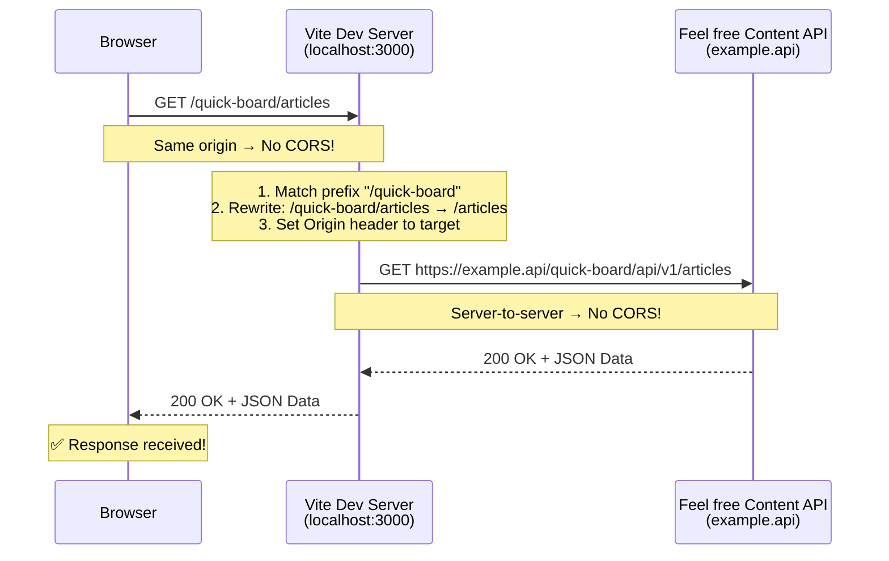

### 4.4 Tất cả Proxy Options trong Vite

```typescript
// vite.config.ts — Tham khảo đầy đủ
export default defineConfig({
	server: {
		proxy: {
			// --- BASIC: String shorthand ---
			'/foo': 'http://localhost:4567',
			// Mọi request /foo/* → http://localhost:4567/foo/*

			// --- FULL OPTIONS ---
			'/api': {
				target: 'http://jsonplaceholder.typicode.com',

				// Thay đổi Origin header trong request gửi đến target
				changeOrigin: true,

				// Cho phép proxy đến HTTPS server không có valid SSL cert
				secure: false,

				// Rewrite path trước khi forward
				rewrite: (path) => path.replace(/^\/api/, ''),

				// Custom config cho http-proxy instance
				configure: (proxy, options) => {
					// Event: trước khi gửi request đến target
					proxy.on('proxyReq', (proxyReq, req, res) => {
						// Inject custom headers
						proxyReq.setHeader('X-Custom-Header', 'foobar');
					});

					// Event: khi nhận response từ target
					proxy.on('proxyRes', (proxyRes, req, res) => {
						console.log('Response status:', proxyRes.statusCode);
					});

					// Event: khi có lỗi
					proxy.on('error', (err, req, res) => {
						console.error('Proxy error:', err);
					});
				},

				// Headers custom gửi đến target
				headers: {
					'x-inface-api-key': 'your-api-key',
				},

				// WebSocket proxy
				ws: true,

				// Timeout (ms)
				timeout: 30000,
			},

			// --- RegExp pattern ---
			// Dùng khi cần match phức tạp hơn string prefix
			'^/fallback/.*': {
				target: 'http://jsonplaceholder.typicode.com',
				changeOrigin: true,
				rewrite: (path) => path.replace(/^\/fallback/, ''),
			},

			// --- Proxy WebSocket ---
			'/socket.io': {
				target: 'ws://localhost:5174',
				ws: true,
			},
		},
	},
});
```

### 4.5 Khi nào cần Proxy trong Vite?

| Tình huống                           | Cần Proxy? | Lý do                                       |
| ------------------------------------ | ---------- | ------------------------------------------- |
| Frontend gọi API cùng domain         | ❌ Không   | Same origin, CORS không phải vấn đề         |
| Frontend gọi API khác domain         | ✅ Có thể  | Nếu API không có CORS headers               |
| API đã có CORS headers cho localhost | ❌ Không   | CORS đã được cho phép                       |
| API cần custom headers (api-key)     | ✅ Có thể  | Che giấu API key, hoặc proxy inject headers |
| WebSocket cross-origin               | ✅ Có      | WS cũng bị Same-Origin Policy               |

> ⚠️ **Lưu ý**: Proxy config trong Vite **chỉ có effect khi chạy `vite dev`**. Khi build (`vite build`), proxy config bị ignore hoàn toàn. Production cần giải pháp khác.

---

## 5. ☁️ CloudFront, Nginx, Server Proxy

### 5.1 CloudFront Proxy

**AWS CloudFront** là CDN + Reverse Proxy service.

> 📖 **Ref**: [AWS — Using CloudFront to serve your S3 website](https://docs.aws.amazon.com/AmazonCloudFront/latest/DeveloperGuide/DownloadDistS3AndCustomOrigins.html)

#### CloudFront có thể config PROXY/CORS được không?

**✅ Có! Và project Feel freeFrontend đang dùng CloudFront.**

Dựa trên `.gitlab-ci.yml`:

```yaml
variables:
  DEV_CLOUDFRONT_ID: XXXXXXXXXXXXXX
  TEST_CLOUDFRONT_ID: XXXXXXXXXXXXXX
  LIVE_CLOUDFRONT_ID: XXXXXXXXXXXXXX
```

#### CloudFront làm gì trong project này?

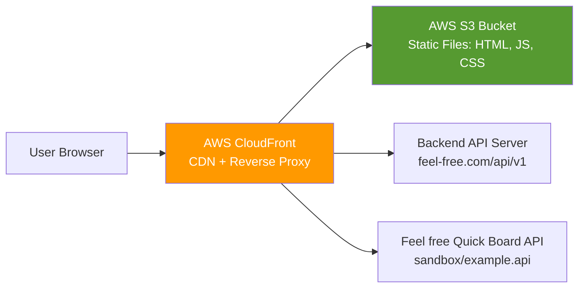

#### Cách config CORS trên CloudFront

```
CloudFront Distribution → Behaviors → Edit
  ├── Cache Policy: Include "Origin" header in cache key
  ├── Origin Request Policy: Forward "Origin", "Access-Control-*" headers
  └── Response Headers Policy:
        ├── Access-Control-Allow-Origin: https://www.feel-free.com
        ├── Access-Control-Allow-Methods: GET, POST, OPTIONS
        ├── Access-Control-Allow-Headers: Content-Type, x-inface-api-key
        └── Access-Control-Max-Age: 86400
```

> 📖 **Ref**: [AWS — Adding CORS headers with CloudFront response headers policies](https://docs.aws.amazon.com/AmazonCloudFront/latest/DeveloperGuide/adding-response-headers.html#Cors)

### 5.2 Nginx Reverse Proxy

Nginx là web server phổ biến nhất cho reverse proxy:

```nginx
# nginx.conf
server {
    listen 80;
    server_name feel-free.com;

    # Serve static frontend files
    location / {
        root /usr/share/nginx/html;
        try_files $uri $uri/ /index.html;
    }

    # Proxy API requests
    location /api/ {
        proxy_pass http://backend-server:4000/;
        proxy_set_header Host $host;
        proxy_set_header X-Real-IP $remote_addr;
        proxy_set_header X-Forwarded-For $proxy_add_x_forwarded_for;
        proxy_set_header X-Forwarded-Proto $scheme;

        # CORS headers
        add_header Access-Control-Allow-Origin "https://feel-free.com" always;
        add_header Access-Control-Allow-Methods "GET, POST, PUT, DELETE, OPTIONS" always;
        add_header Access-Control-Allow-Headers "Content-Type, Authorization, x-inface-api-key" always;

        # Handle preflight
        if ($request_method = 'OPTIONS') {
            add_header Access-Control-Max-Age 86400;
            add_header Content-Length 0;
            return 204;
        }
    }
}
```

### 5.3 So sánh các Proxy Solution

| Feature            | Vite Dev Proxy    | Nginx                            | CloudFront                 | HAProxy            | Traefik            |
| ------------------ | ----------------- | -------------------------------- | -------------------------- | ------------------ | ------------------ |
| **Use case**       | Dev only          | Production reverse proxy         | CDN + Proxy                | Load balancing     | Cloud-native proxy |
| **Performance**    | Low               | Very High (C)                    | Global edge network        | Very High          | High (Go)          |
| **SSL**            | Basic             | Full SSL/TLS termination         | AWS Certificate Manager    | Full SSL           | Auto Let's Encrypt |
| **Load Balancing** | ❌                | ✅ Round-robin, least-conn, etc. | ✅ Multi-origin            | ✅ Advanced        | ✅ Dynamic         |
| **Caching**        | ❌                | ✅ FastCGI cache                 | ✅ Edge caching (global)   | ❌                 | ❌                 |
| **Rate Limiting**  | ❌                | ✅ ngx_http_limit_req            | ✅ AWS WAF integration     | ✅ Built-in        | ✅ Middleware      |
| **CORS Config**    | Bypass (implicit) | ✅ add_header                    | ✅ Response Headers Policy | ✅ via headers     | ✅ Middleware      |
| **Cost**           | Free              | Free (open-source)               | Usage-based                | Free (open-source) | Free (open-source) |

---

## 6. 🚀 PROXY trong Production — Có cần không?

### 6.1 PROXY chỉ là giải pháp tạm thời?

> **Không hoàn toàn đúng.** PROXY (reverse proxy) là **standard architecture pattern** trong production, không chỉ là workaround cho CORS.

**Dev Proxy** (Vite, webpack) → Đúng, đây là giải pháp tạm thời cho development.

**Production Proxy** (Nginx, CloudFront, etc.) → Đây là **kiến trúc production chuẩn**, có nhiều vai trò ngoài CORS:

- **SSL/TLS Termination**: Giải mã HTTPS tại reverse proxy
- **Load Balancing**: Phân tải giữa nhiều backend instances
- **Caching**: Cache static assets & API responses ở edge
- **Security**: WAF, rate limiting, DDoS protection
- **Routing**: URL routing giữa multiple microservices
- **Compression**: gzip/brotli compression

### 6.2 Giải quyết CORS trong Production

Có 3 chiến lược chính:

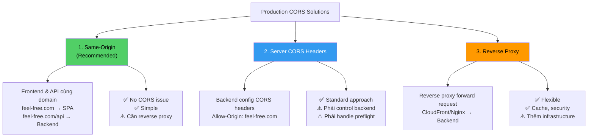

#### Chiến lược 1: Same-Origin Deployment (Recommended)

```
feel-free.com/           → S3 (SPA static files)
feel-free.com/api/v1/    → Backend API Server
```

CloudFront hoặc Nginx route based on path → **No cross-origin = No CORS problem.**

Đây là cách project **Feel freeFrontend** hoạt động:

```
https://www.feel-free.com/           → CloudFront → S3 (Frontend)
https://www.feel-free.com/api/v1/    → CloudFront → Backend API
```

#### Chiến lược 2: Server CORS Headers

Backend config cho phép specific origins:

```python
# Python Flask example
@app.after_request
def add_cors_headers(response):
    response.headers['Access-Control-Allow-Origin'] = 'https://www.feel-free.com'
    response.headers['Access-Control-Allow-Methods'] = 'GET, POST, PUT, DELETE, OPTIONS'
    response.headers['Access-Control-Allow-Headers'] = 'Content-Type, Authorization'
    return response
```

```go
// Go example
func corsMiddleware(next http.Handler) http.Handler {
    return http.HandlerFunc(func(w http.ResponseWriter, r *http.Request) {
        w.Header().Set("Access-Control-Allow-Origin", "https://www.feel-free.com")
        w.Header().Set("Access-Control-Allow-Methods", "GET, POST, PUT, DELETE, OPTIONS")
        w.Header().Set("Access-Control-Allow-Headers", "Content-Type, Authorization")

        if r.Method == "OPTIONS" {
            w.WriteHeader(http.StatusNoContent)
            return
        }

        next.ServeHTTP(w, r)
    })
}
```

#### Chiến lược 3: Reverse Proxy

CloudFront, Nginx, hoặc custom proxy server thêm CORS headers hoặc route request cùng domain.

### 6.3 Áp dụng cho Feel freeFrontend

Dựa trên codebase hiện tại, project đang dùng **chiến lược kết hợp**:

```mermaid
graph LR
    subgraph Production
        Browser[User Browser] --> CF[CloudFront<br/>CDN]
        CF --> S3[S3 Bucket<br/>SPA Static Files]
        CF --> Backend[Backend API<br/>feel-free.com/api/v1]
    end

    subgraph External APIs
        Browser -.->|Direct call<br/>with CORS headers<br/>
    end

    subgraph Development
        DevBrowser[Dev Browser] --> ViteDev[Vite Dev Server<br/>localhost:3000]
        ViteDev -->|Proxy /quick-board| SandboxAPI
        ViteDev -.->|Direct call| DevBackend[Dev Backend<br/>dev.feel-free.com/api/v1]
    end

    style CF fill:#FF9900,color:#fff
    style S3 fill:#569A31,color:#fff
```

**Phân tích:**

1. **Internal API** (`feel-free.com/api/v1`): Same-origin qua CloudFront routing → Không cần CORS
2. **Quick Board API** (`example.api`):
   - Dev: Vite proxy forward (`/quick-board` → `example.api`)
   - Prod: Direct call (Feel free API đã config CORS headers cho production domain)
3. **Portfolio API**: Tương tự Quick Board

---

## 7. 🛠️ Tự build Proxy Server bằng Go

### 7.1 Tại sao chọn Go?

| Lý do                | Chi tiết                                                     |
| -------------------- | ------------------------------------------------------------ |
| **Performance**      | Compiled language, lightweight goroutines                    |
| **Standard Library** | `net/http`, `net/http/httputil` có sẵn reverse proxy         |
| **Concurrency**      | Goroutines + channels xử lý thousands concurrent connections |
| **Single binary**    | Build thành 1 file, dễ deploy (Docker, K8s)                  |
| **Ecosystem**        | Nhiều library proxy/middleware chất lượng                    |

### 7.2 Kiến thức cần có

#### Kiến thức cơ bản

- **Go fundamentals**: goroutines, channels, interfaces, error handling
- **HTTP protocol**: methods, headers, status codes, request/response lifecycle
- **Networking**: TCP/IP, DNS, TLS/SSL
- **CORS mechanism**: đã đề cập ở trên

#### Kiến thức nâng cao

- **Reverse proxy pattern**: request forwarding, header manipulation
- **Load balancing algorithms**: round-robin, weighted, least connections
- **Middleware pattern**: chain of handlers
- **WebSocket proxying**: HTTP upgrade, persistent connections
- **Connection pooling**: reuse TCP connections
- **Circuit breaker pattern**: prevent cascading failures

### 7.3 Step-by-Step Guide

#### Step 1: Basic Reverse Proxy (Minimal Viable Proxy)

```go
// main.go
package main

import (
    "log"
    "net/http"
    "net/http/httputil"
    "net/url"
)

func main() {
    // Target server
    target, _ := url.Parse("https://api.example.com")

    // Create reverse proxy
    proxy := httputil.NewSingleHostReverseProxy(target)

    // Custom Director to modify request before forwarding
    originalDirector := proxy.Director
    proxy.Director = func(req *http.Request) {
        originalDirector(req)
        req.Header.Set("X-Forwarded-Host", req.Host)
        req.Host = target.Host
    }

    // Start server
    log.Println("Proxy server starting on :8080")
    log.Fatal(http.ListenAndServe(":8080", proxy))
}
```

#### Step 2: Multi-target Proxy + CORS + Path Routing

```go
// proxy/proxy.go
package proxy

import (
    "log"
    "net/http"
    "net/http/httputil"
    "net/url"
    "strings"
)

// ProxyRoute defines a route configuration
type ProxyRoute struct {
    PathPrefix  string
    Target      string
    StripPrefix bool
    Headers     map[string]string // inject custom headers
}

// ProxyServer is the main proxy struct
type ProxyServer struct {
    routes      []ProxyRoute
    corsOrigins []string
}

// NewProxyServer creates a new proxy server
func NewProxyServer(routes []ProxyRoute, corsOrigins []string) *ProxyServer {
    return &ProxyServer{
        routes:      routes,
        corsOrigins: corsOrigins,
    }
}

// ServeHTTP implements http.Handler
func (ps *ProxyServer) ServeHTTP(w http.ResponseWriter, r *http.Request) {
    // Handle CORS
    origin := r.Header.Get("Origin")
    if ps.isAllowedOrigin(origin) {
        w.Header().Set("Access-Control-Allow-Origin", origin)
        w.Header().Set("Access-Control-Allow-Methods", "GET, POST, PUT, DELETE, OPTIONS, PATCH")
        w.Header().Set("Access-Control-Allow-Headers", "Content-Type, Authorization, X-Requested-With")
        w.Header().Set("Access-Control-Allow-Credentials", "true")
        w.Header().Set("Access-Control-Max-Age", "86400")
    }

    // Handle preflight
    if r.Method == http.MethodOptions {
        w.WriteHeader(http.StatusNoContent)
        return
    }

    // Find matching route
    for _, route := range ps.routes {
        if strings.HasPrefix(r.URL.Path, route.PathPrefix) {
            ps.proxyRequest(w, r, route)
            return
        }
    }

    http.Error(w, "No matching route", http.StatusNotFound)
}

func (ps *ProxyServer) proxyRequest(w http.ResponseWriter, r *http.Request, route ProxyRoute) {
    target, err := url.Parse(route.Target)
    if err != nil {
        http.Error(w, "Invalid target URL", http.StatusInternalServerError)
        return
    }

    proxy := httputil.NewSingleHostReverseProxy(target)

    originalDirector := proxy.Director
    proxy.Director = func(req *http.Request) {
        originalDirector(req)
        req.Host = target.Host

        // Strip prefix if configured
        if route.StripPrefix {
            req.URL.Path = strings.TrimPrefix(req.URL.Path, route.PathPrefix)
            if req.URL.Path == "" {
                req.URL.Path = "/"
            }
        }

        // Inject custom headers
        for key, value := range route.Headers {
            req.Header.Set(key, value)
        }

        log.Printf("[PROXY] %s %s → %s%s", req.Method, r.URL.Path, route.Target, req.URL.Path)
    }

    // Error handling
    proxy.ErrorHandler = func(w http.ResponseWriter, r *http.Request, err error) {
        log.Printf("[PROXY ERROR] %s %s: %v", r.Method, r.URL.Path, err)
        http.Error(w, "Proxy error", http.StatusBadGateway)
    }

    proxy.ServeHTTP(w, r)
}

func (ps *ProxyServer) isAllowedOrigin(origin string) bool {
    for _, allowed := range ps.corsOrigins {
        if allowed == "*" || allowed == origin {
            return true
        }
    }
    return false
}
```

#### Step 3: Config file (YAML)

```yaml
# config.yaml
server:
  port: 8080
  read_timeout: 30s
  write_timeout: 30s

cors:
  allowed_origins:
    - 'http://localhost:3000'
    - 'http://localhost:5173'
    - 'https://www.feel-free.com'

routes:
  - path_prefix: '/api'
    target: 'https://dev.feel-free.com/api/v1'
    strip_prefix: true
    headers:
      X-Forwarded-By: 'go-proxy'

  - path_prefix: '/quick-board'
    target: 'https://example.api/quick-board/api/v1'
    strip_prefix: true
    headers:
      x-inface-api-key: 'your-api-key'
      client-id: 'your-client-id'

  - path_prefix: '/portfolio'
    target: 'https://example.api/quick-board/api/v1'
    strip_prefix: true
    headers:
      x-inface-api-key: 'your-api-key'
      client-id: 'your-client-id'

mock:
  enabled: false
  directory: './mocks'

logging:
  level: 'info'
  format: 'json'
```

#### Step 4: Config loader

```go
// config/config.go
package config

import (
    "os"
    "time"

    "gopkg.in/yaml.v3"
)

type Config struct {
    Server  ServerConfig  `yaml:"server"`
    CORS    CORSConfig    `yaml:"cors"`
    Routes  []RouteConfig `yaml:"routes"`
    Mock    MockConfig    `yaml:"mock"`
    Logging LogConfig     `yaml:"logging"`
}

type ServerConfig struct {
    Port         int           `yaml:"port"`
    ReadTimeout  time.Duration `yaml:"read_timeout"`
    WriteTimeout time.Duration `yaml:"write_timeout"`
}

type CORSConfig struct {
    AllowedOrigins []string `yaml:"allowed_origins"`
}

type RouteConfig struct {
    PathPrefix  string            `yaml:"path_prefix"`
    Target      string            `yaml:"target"`
    StripPrefix bool              `yaml:"strip_prefix"`
    Headers     map[string]string `yaml:"headers"`
}

type MockConfig struct {
    Enabled   bool   `yaml:"enabled"`
    Directory string `yaml:"directory"`
}

type LogConfig struct {
    Level  string `yaml:"level"`
    Format string `yaml:"format"`
}

func Load(path string) (*Config, error) {
    data, err := os.ReadFile(path)
    if err != nil {
        return nil, err
    }

    var cfg Config
    if err := yaml.Unmarshal(data, &cfg); err != nil {
        return nil, err
    }

    return &cfg, nil
}
```

#### Step 5: Main entry point

```go
// main.go
package main

import (
    "fmt"
    "log"
    "net/http"

    "your-module/config"
    "your-module/proxy"
)

func main() {
    // Load config
    cfg, err := config.Load("config.yaml")
    if err != nil {
        log.Fatalf("Failed to load config: %v", err)
    }

    // Convert config routes to proxy routes
    routes := make([]proxy.ProxyRoute, len(cfg.Routes))
    for i, r := range cfg.Routes {
        routes[i] = proxy.ProxyRoute{
            PathPrefix:  r.PathPrefix,
            Target:      r.Target,
            StripPrefix: r.StripPrefix,
            Headers:     r.Headers,
        }
    }

    // Create proxy server
    ps := proxy.NewProxyServer(routes, cfg.CORS.AllowedOrigins)

    // Create HTTP server
    server := &http.Server{
        Addr:         fmt.Sprintf(":%d", cfg.Server.Port),
        Handler:      ps,
        ReadTimeout:  cfg.Server.ReadTimeout,
        WriteTimeout: cfg.Server.WriteTimeout,
    }

    log.Printf("Proxy server starting on :%d", cfg.Server.Port)
    log.Fatal(server.ListenAndServe())
}
```

### 7.4 Tính năng nâng cao — Ideas & Solutions

#### 🎭 Feature 1: Mock Data Server

Khi backend chưa ready, proxy có thể trả mock response:

```go
// mock/mock.go
package mock

import (
    "encoding/json"
    "net/http"
    "os"
    "path/filepath"
    "strings"
)

type MockServer struct {
    directory string
    enabled   bool
}

func NewMockServer(directory string, enabled bool) *MockServer {
    return &MockServer{directory: directory, enabled: enabled}
}

// TryMock tries to serve a mock response, returns true if mock was served
func (ms *MockServer) TryMock(w http.ResponseWriter, r *http.Request) bool {
    if !ms.enabled {
        return false
    }

    // Convert URL path to file path
    // GET /api/users → mocks/GET_api_users.json
    cleanPath := strings.ReplaceAll(strings.Trim(r.URL.Path, "/"), "/", "_")
    filename := fmt.Sprintf("%s_%s.json", r.Method, cleanPath)
    mockFile := filepath.Join(ms.directory, filename)

    data, err := os.ReadFile(mockFile)
    if err != nil {
        return false // No mock file, continue to proxy
    }

    w.Header().Set("Content-Type", "application/json")
    w.Header().Set("X-Mock-Response", "true")
    w.Write(data)
    return true
}
```

Mock file ví dụ:

```json
// mocks/GET_api_platform-genres.json
{
	"PC": [
		{ "key": "fps", "label": "FPS" },
		{ "key": "mmorpg", "label": "MMORPG" }
	],
	"Mobile": [
		{ "key": "casual", "label": "Casual" },
		{ "key": "puzzle", "label": "Puzzle" }
	]
}
```

#### 📊 Feature 2: Request/Response Logging

```go
// middleware/logging.go
package middleware

import (
    "log/slog"
    "net/http"
    "time"
)

type responseWriter struct {
    http.ResponseWriter
    statusCode int
    size       int
}

func (rw *responseWriter) WriteHeader(code int) {
    rw.statusCode = code
    rw.ResponseWriter.WriteHeader(code)
}

func (rw *responseWriter) Write(b []byte) (int, error) {
    n, err := rw.ResponseWriter.Write(b)
    rw.size += n
    return n, err
}

func LoggingMiddleware(next http.Handler) http.Handler {
    return http.HandlerFunc(func(w http.ResponseWriter, r *http.Request) {
        start := time.Now()

        rw := &responseWriter{
            ResponseWriter: w,
            statusCode:     http.StatusOK,
        }

        next.ServeHTTP(rw, r)

        duration := time.Since(start)

        slog.Info("request",
            "method", r.Method,
            "path", r.URL.Path,
            "status", rw.statusCode,
            "size", rw.size,
            "duration", duration.String(),
            "remote_addr", r.RemoteAddr,
            "user_agent", r.UserAgent(),
        )
    })
}
```

#### ⚡ Feature 3: Rate Limiting

```go
// middleware/ratelimit.go
package middleware

import (
    "net/http"
    "sync"
    "time"
)

type RateLimiter struct {
    visitors map[string]*visitor
    mu       sync.Mutex
    rate     int           // requests per window
    window   time.Duration // time window
}

type visitor struct {
    count    int
    lastSeen time.Time
}

func NewRateLimiter(rate int, window time.Duration) *RateLimiter {
    rl := &RateLimiter{
        visitors: make(map[string]*visitor),
        rate:     rate,
        window:   window,
    }

    // Cleanup goroutine
    go rl.cleanup()

    return rl
}

func (rl *RateLimiter) Middleware(next http.Handler) http.Handler {
    return http.HandlerFunc(func(w http.ResponseWriter, r *http.Request) {
        ip := r.RemoteAddr

        rl.mu.Lock()
        v, exists := rl.visitors[ip]
        if !exists || time.Since(v.lastSeen) > rl.window {
            rl.visitors[ip] = &visitor{count: 1, lastSeen: time.Now()}
            rl.mu.Unlock()
            next.ServeHTTP(w, r)
            return
        }

        if v.count >= rl.rate {
            rl.mu.Unlock()
            http.Error(w, "Rate limit exceeded", http.StatusTooManyRequests)
            return
        }

        v.count++
        v.lastSeen = time.Now()
        rl.mu.Unlock()

        next.ServeHTTP(w, r)
    })
}

func (rl *RateLimiter) cleanup() {
    for {
        time.Sleep(rl.window)
        rl.mu.Lock()
        for ip, v := range rl.visitors {
            if time.Since(v.lastSeen) > rl.window {
                delete(rl.visitors, ip)
            }
        }
        rl.mu.Unlock()
    }
}
```

#### 🔍 Feature 4: Health Check Endpoint

```go
// health/health.go
package health

import (
    "encoding/json"
    "net/http"
    "net/url"
    "time"
)

type HealthStatus struct {
    Status    string            `json:"status"`
    Uptime    string            `json:"uptime"`
    Timestamp string            `json:"timestamp"`
    Targets   map[string]string `json:"targets"`
}

func HealthCheckHandler(targets []string, startTime time.Time) http.HandlerFunc {
    return func(w http.ResponseWriter, r *http.Request) {
        status := HealthStatus{
            Status:    "ok",
            Uptime:    time.Since(startTime).String(),
            Timestamp: time.Now().UTC().Format(time.RFC3339),
            Targets:   make(map[string]string),
        }

        // Check each target
        client := &http.Client{Timeout: 5 * time.Second}
        for _, target := range targets {
            u, _ := url.Parse(target)
            resp, err := client.Head(u.String())
            if err != nil {
                status.Targets[target] = "unreachable"
                status.Status = "degraded"
            } else {
                resp.Body.Close()
                status.Targets[target] = "ok"
            }
        }

        w.Header().Set("Content-Type", "application/json")
        json.NewEncoder(w).Encode(status)
    }
}
```

#### 🧪 Feature 5: Request Recording (cho Testing)

```go
// recorder/recorder.go
package recorder

import (
    "encoding/json"
    "io"
    "net/http"
    "os"
    "sync"
    "time"
)

type RecordedRequest struct {
    Timestamp string              `json:"timestamp"`
    Method    string              `json:"method"`
    Path      string              `json:"path"`
    Headers   map[string][]string `json:"headers"`
    Body      string              `json:"body,omitempty"`
}

type Recorder struct {
    mu       sync.Mutex
    requests []RecordedRequest
    enabled  bool
}

func NewRecorder(enabled bool) *Recorder {
    return &Recorder{enabled: enabled}
}

func (rec *Recorder) Middleware(next http.Handler) http.Handler {
    return http.HandlerFunc(func(w http.ResponseWriter, r *http.Request) {
        if rec.enabled {
            body, _ := io.ReadAll(r.Body)
            r.Body = io.NopCloser(strings.NewReader(string(body)))

            rec.mu.Lock()
            rec.requests = append(rec.requests, RecordedRequest{
                Timestamp: time.Now().UTC().Format(time.RFC3339),
                Method:    r.Method,
                Path:      r.URL.Path,
                Headers:   r.Header.Clone(),
                Body:      string(body),
            })
            rec.mu.Unlock()
        }

        next.ServeHTTP(w, r)
    })
}

// Export exports recorded requests to a JSON file for replay/testing
func (rec *Recorder) Export(filename string) error {
    rec.mu.Lock()
    defer rec.mu.Unlock()

    data, err := json.MarshalIndent(rec.requests, "", "  ")
    if err != nil {
        return err
    }
    return os.WriteFile(filename, data, 0644)
}

// ListHandler returns all recorded requests as JSON
func (rec *Recorder) ListHandler() http.HandlerFunc {
    return func(w http.ResponseWriter, r *http.Request) {
        rec.mu.Lock()
        defer rec.mu.Unlock()

        w.Header().Set("Content-Type", "application/json")
        json.NewEncoder(w).Encode(rec.requests)
    }
}
```

### 7.5 Project Structure (Go Proxy Server)

```
go-proxy/
├── main.go                    # Entry point
├── config.yaml                # Configuration
├── go.mod
├── go.sum
├── config/
│   └── config.go              # Config loader
├── proxy/
│   └── proxy.go               # Core proxy logic
├── middleware/
│   ├── logging.go             # Request logging
│   ├── ratelimit.go           # Rate limiting
│   └── cors.go                # CORS middleware
├── mock/
│   └── mock.go                # Mock data server
├── health/
│   └── health.go              # Health check
├── recorder/
│   └── recorder.go            # Request recording
├── mocks/                     # Mock JSON files
│   ├── GET_api_users.json
│   └── POST_api_requests.json
├── Dockerfile
├── Makefile
└── README.md
```

### 7.6 Thư viện Go tham khảo

| Thư viện                     | Mô tả                                      | Link                                                         |
| ---------------------------- | ------------------------------------------ | ------------------------------------------------------------ |
| `net/http`                   | Standard library HTTP server               | [Go docs](https://pkg.go.dev/net/http)                       |
| `net/http/httputil`          | Built-in reverse proxy                     | [Go docs](https://pkg.go.dev/net/http/httputil#ReverseProxy) |
| `github.com/rs/cors`         | CORS middleware chuyên dụng                | [GitHub](https://github.com/rs/cors)                         |
| `github.com/gorilla/mux`     | HTTP router nổi tiếng                      | [GitHub](https://github.com/gorilla/mux)                     |
| `github.com/go-chi/chi`      | Lightweight router (recommended)           | [GitHub](https://github.com/go-chi/chi)                      |
| `github.com/go-chi/httprate` | Rate limiting middleware                   | [GitHub](https://github.com/go-chi/httprate)                 |
| `go.uber.org/zap`            | High-performance logging                   | [GitHub](https://github.com/uber-go/zap)                     |
| `log/slog`                   | Go 1.21+ structured logging (standard lib) | [Go docs](https://pkg.go.dev/log/slog)                       |
| `gopkg.in/yaml.v3`           | YAML parser                                | [GitHub](https://github.com/go-yaml/yaml)                    |
| `github.com/spf13/viper`     | Full-featured config library               | [GitHub](https://github.com/spf13/viper)                     |

### 7.7 Phản biện & Ý tưởng mở rộng

#### ⚠️ Phản biện

1. **Bạn có thực sự cần build proxy riêng không?**
   - Nếu chỉ cần dev proxy: Vite đã đủ
   - Nếu cần production proxy: Nginx/Caddy/Traefik đã mature và battle-tested
   - **Khi nào nên tự build**: Khi cần custom logic (mock data, request recording, custom routing logic đặc thù)

2. **Security concerns**:
   - Self-built proxy cần handle **header injection**, **path traversal**, **SSRF**
   - Không nên expose proxy server trực tiếp ra internet (đặt sau Nginx/CloudFront)
   - API keys trong config file cần **encrypt** hoặc dùng **environment variables**

3. **Maintenance cost**:
   - Tự build = tự maintain, tự fix bugs
   - Nginx/Caddy có community hỗ trợ lớn
   - **Khuyến nghị**: Build cho dev/testing tool, dùng solution có sẵn cho production

#### 💡 Ý tưởng mở rộng

| Ý tưởng                  | Mô tả                                                  | Độ khó   |
| ------------------------ | ------------------------------------------------------ | -------- |
| **Hot reload config**    | Watch config file, reload proxy routes without restart | ⭐⭐     |
| **Dashboard UI**         | Web UI hiển thị request logs, stats, health status     | ⭐⭐⭐   |
| **Request replay**       | Record requests, replay chúng cho testing              | ⭐⭐     |
| **Response caching**     | Cache response theo TTL, giảm load lên target          | ⭐⭐⭐   |
| **Circuit breaker**      | Nếu target lỗi liên tục, ngắt proxy tạm thời           | ⭐⭐⭐   |
| **WebSocket proxy**      | Proxy WebSocket connections                            | ⭐⭐⭐   |
| **GraphQL proxy**        | Parse GraphQL queries, route đến đúng service          | ⭐⭐⭐⭐ |
| **gRPC proxy**           | Proxy gRPC traffic (cần HTTP/2)                        | ⭐⭐⭐⭐ |
| **Plugin system**        | Load custom middleware/handlers dạng plugins           | ⭐⭐⭐⭐ |
| **Docker image**         | Đóng gói thành Docker image, dùng ngay                 | ⭐       |
| **Request transformer**  | Modify request/response body (thêm/bỏ fields)          | ⭐⭐⭐   |
| **Auth middleware**      | JWT verification, API key validation                   | ⭐⭐     |
| **Metrics (Prometheus)** | Export metrics cho monitoring                          | ⭐⭐     |
| **OpenAPI spec proxy**   | Validate request/response against OpenAPI spec         | ⭐⭐⭐⭐ |
| **Multi-env switcher**   | UI toggle giữa dev/test/prod targets                   | ⭐⭐     |

#### 🏗️ Alternative tốt hơn tự build

Nếu mục đích chính là **dev tool** thay vì production proxy:

1. **[mitmproxy](https://mitmproxy.org/)** — Proxy nổi tiếng cho debugging HTTP/HTTPS
2. **[Caddy](https://caddyserver.com/)** — Modern reverse proxy viết bằng Go, config đơn giản
3. **[Traefik](https://traefik.io/)** — Cloud-native reverse proxy, auto-discovery
4. **[Kong](https://konghq.com/)** — API Gateway full-featured

---

## 8. 📖 Tài liệu tham khảo

### CORS

| Resource                                   | Link                                                                                  |
| ------------------------------------------ | ------------------------------------------------------------------------------------- |
| MDN — Cross-Origin Resource Sharing (CORS) | https://developer.mozilla.org/en-US/docs/Web/HTTP/Guides/CORS                         |
| MDN — Same-Origin Policy                   | https://developer.mozilla.org/en-US/docs/Web/Security/Same-origin_policy              |
| MDN — Preflight Request                    | https://developer.mozilla.org/en-US/docs/Glossary/Preflight_request                   |
| MDN — Access-Control-Allow-Origin          | https://developer.mozilla.org/en-US/docs/Web/HTTP/Headers/Access-Control-Allow-Origin |
| web.dev — Cross-Origin Resource Sharing    | https://web.dev/articles/cross-origin-resource-sharing                                |
| Fetch Standard (WHATWG) — CORS Protocol    | https://fetch.spec.whatwg.org/#http-cors-protocol                                     |
| Postman Blog — What is CORS?              | https://blog.postman.com/what-is-cors/                                                |
| GitHub Gist — CORS Explained              | https://gist.github.com/theluckystrike/2a63e01c69a41f0011318f6bffb6b483/              |

### CSP & SOP

| Resource                                   | Link                                                                                  |
| ------------------------------------------ | ------------------------------------------------------------------------------------- |
| MDN — Content Security Policy (CSP)        | https://developer.mozilla.org/en-US/docs/Web/HTTP/Guides/CSP                          |
| MDN — Same-Origin Policy                   | https://developer.mozilla.org/en-US/docs/Web/Security/Same-origin_policy              |
| OWASP — CSP Cheat Sheet                   | https://cheatsheetseries.owasp.org/cheatsheets/Content_Security_Policy_Cheat_Sheet.html |

### Vite Proxy

| Resource                                        | Link                                                     |
| ----------------------------------------------- | -------------------------------------------------------- |
| Vite — Server Options (server.proxy)            | https://vite.dev/config/server-options#server-proxy  |
| http-party/node-http-proxy (underlying library) | https://github.com/http-party/node-http-proxy            |

### AWS CloudFront

| Resource                                   | Link                                                                                                            |
| ------------------------------------------ | --------------------------------------------------------------------------------------------------------------- |
| AWS — Adding CORS Response Headers         | https://docs.aws.amazon.com/AmazonCloudFront/latest/DeveloperGuide/adding-response-headers.html                 |
| AWS — CloudFront Origins (S3, Custom)      | https://docs.aws.amazon.com/AmazonCloudFront/latest/DeveloperGuide/DownloadDistS3AndCustomOrigins.html          |
| AWS — CloudFront Response Headers Policies | https://docs.aws.amazon.com/AmazonCloudFront/latest/DeveloperGuide/understanding-response-headers-policies.html |

### Go Proxy Development

| Resource                              | Link                                              |
| ------------------------------------- | ------------------------------------------------- |
| Go net/http Package                   | https://pkg.go.dev/net/http                       |
| Go httputil.ReverseProxy              | https://pkg.go.dev/net/http/httputil#ReverseProxy |
| rs/cors — Go CORS middleware          | https://github.com/rs/cors                        |
| go-chi/chi — Lightweight router       | https://github.com/go-chi/chi                     |
| Caddy Server (Go-based reverse proxy) | https://caddyserver.com/docs/                     |

### Nginx

| Resource                   | Link                                                               |
| -------------------------- | ------------------------------------------------------------------ |
| Nginx — Reverse Proxy      | https://docs.nginx.com/nginx/admin-guide/web-server/reverse-proxy/ |
| Nginx — CORS Configuration | https://enable-cors.org/server_nginx.html                          |

---

> 📝 **Note**: Document này được tạo dựa trên deep research về CORS, Proxy, và codebase của project Feel freeFrontend. 
> Cập nhật lần cuối: 2026-03-21.